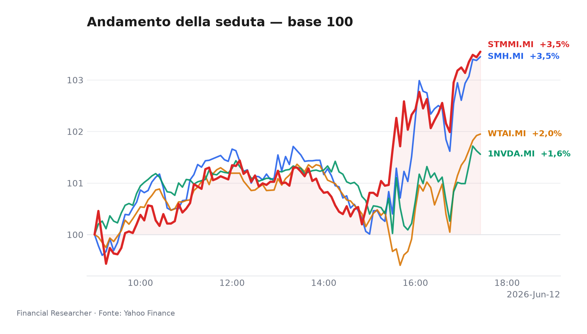
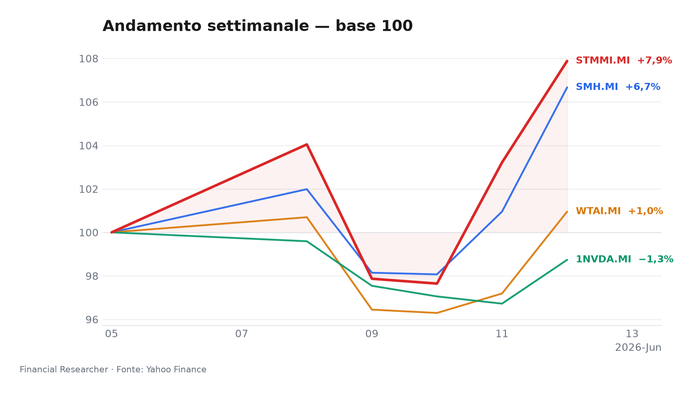
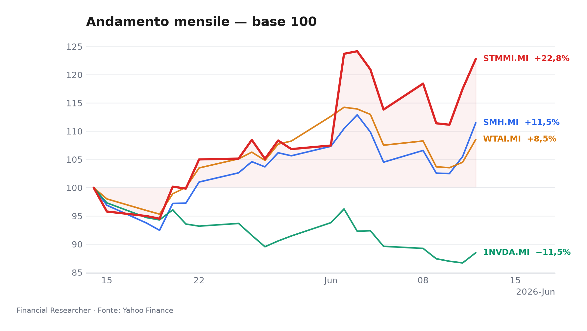
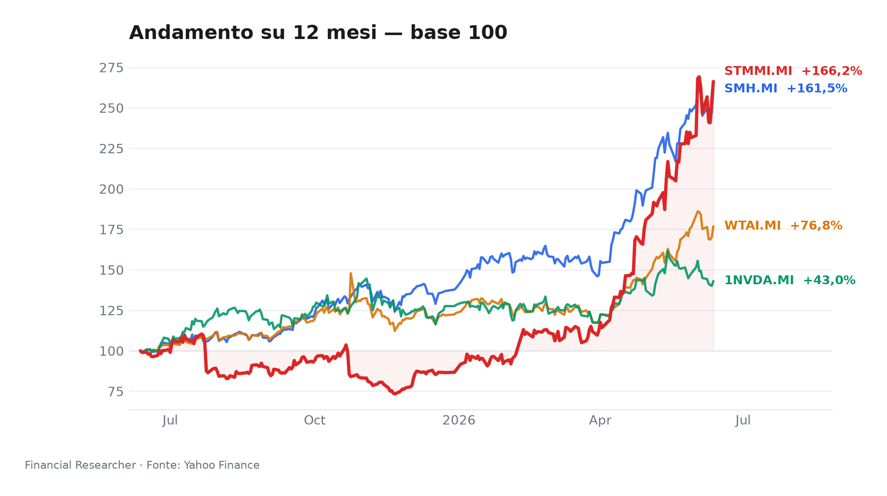

# Watchlist executive — tecnologia, semiconduttori e AI in modalità risk-on

## Sommario Esecutivo

- **VanEck Semiconductor UCITS ETF (SMH.MI)** ▲ ha chiuso la seduta come leader della watchlist con **+5,66% 1D**, **+6,67% 1W** e **+83,73% YTD**; il movimento si inserisce in una rotazione che continua a premiare il complesso chip, mentre Barron’s segnala che il rally dei semiconduttori “wanes” ma resta ancora oggetto di forte allocazione tattica.[1][5]
- **WisdomTree Artificial Intelligence UCITS ETF - USD Acc (WTAI.MI)** ▲ ha messo a segno **+3,87% 1D**, **+0,95% 1W** e **+42,37% YTD**; il tema AI resta sostenuto da flussi di interesse selettivi, ma con una traiettoria meno lineare del basket semiconduttori, più sensibile al sentiment di rischio e al posizionamento di breve.[2]
- **NVIDIA Corporation (1NVDA.MI)** ▲ ha recuperato **+2,08% 1D** dopo una settimana ancora negativa a **-1,26% 1W**, con **+10,48% YTD**; il titolo continua a essere letto come barometro del ciclo AI e del sentiment sui chip, senza una notizia materiale specifica nel prefetch che ne cambi il quadro di fondo.[3]
- **STMicroelectronics N.V. (STMMI.MI)** ▲ è stata la sorpresa più forte in termini di intensità, con **+4,52% 1D**, **+7,88% 1W** e **+190,18% YTD**; il catalizzatore più rilevante è il upgrade / research flow citato da 24/7 Wall St., mentre il flusso news recente evidenzia anche la narrativa su AI factories, sensori industriali e domanda cloud come supporti strutturali.[4][5]

## Snapshot della Performance Watchlist

**Leader 1D:** VanEck Semiconductor UCITS ETF (SMH.MI) (5.66%) · **Laggard 1D:** NVIDIA Corporation (1NVDA.MI) (2.08%)

| Ref | Strumento | Ticker | Prezzo (valuta) | Giornaliera | Settimanale | Mensile | YTD | 1A | Vol. 30g | Fonte |
|-----|-----------|--------|-----------------|-------------|-------------|---------|-----|-----|--------|-------|
| [1] | VanEck Semiconductor UCITS ETF | SMH.MI | 100,48 EUR | 5,66% | 6,67% | 11,48% | 83,73% | 161,50% | 15,89% | [1] |
| [2] | WisdomTree Artificial Intelligence UCITS ETF - USD Acc | WTAI.MI | 105,94 EUR | 3,87% | 0,95% | 8,55% | 42,37% | 76,83% | 13,30% | [2] |
| [3] | NVIDIA Corporation | 1NVDA.MI | 178,28 EUR | 2,08% | -1,26% | -11,51% | 10,48% | 43,05% | 13,33% | [3] |
| [4] | STMicroelectronics N.V. | STMMI.MI | 67,76 EUR | 4,52% | 7,88% | 22,80% | 190,18% | 166,20% | 25,18% | [4] |
| — | FTSE MIB | FTSEMIB.MI | 51497,21 EUR | 1,96% | 3,21% | 2,89% | 13,49% | 28,91% | 6,30% | — |
| — | STOXX Europe 600 | ^STOXX | 633,21 EUR | 1,88% | 1,69% | 4,38% | 5,23% | 15,16% | 4,68% | — |

### Andamento Grafico

## Cosa Guida i Movimenti

- **VanEck Semiconductor UCITS ETF (SMH.MI)**: non emerge una notizia materiale specifica nel prefetch; il movimento resta quindi leggibile soprattutto come estensione della forza settoriale dei semiconduttori, sostenuta da una narrativa di ciclo AI ancora viva ma attraversata da prese di profitto selettive e da una rotazione interna tra i nomi più “crowded”. Barron’s, nel pezzo sul chip rally che “wanes”, suggerisce proprio un contesto di fase matura del trade, non di esaurimento improvviso.[5]

- **WisdomTree Artificial Intelligence UCITS ETF - USD Acc (WTAI.MI)**: anche qui non compare una headline materiale dedicata nel prefetch; il principale driver è l’esposizione al tema AI in un contesto di rischio ancora costruttivo ma più esigente in termini di selezione. In pratica, il basket beneficia della tenuta del mercato sull’AI, ma con una sensibilità maggiore ai ribaltamenti di sentiment rispetto agli ETF più puri sui semiconduttori.[2]

- **NVIDIA Corporation (1NVDA.MI)**: non c’è una notizia materiale specifica nel prefetch; il titolo si muove soprattutto come proxy del ciclo AI e della propensione al rischio sui grandi nomi hardware. La combinazione di rialzo giornaliero e settimana ancora in calo indica che il mercato sta ancora digerendo posizionamenti recenti, con la domanda su capex AI e monetizzazione dell’infrastruttura che resta il driver dominante.[3]

- **STMicroelectronics N.V. (STMMI.MI)**: il driver più chiaro arriva dal flusso research del 10 giugno, con il titolo incluso tra le top Wall Street analyst calls di 24/7 Wall St., e dal news flow del 12 giugno che sottolinea l’estensione della collaborazione con AWS e il posizionamento verso le “AI factories”; a questo si aggiunge la lettura strategica sui sensori di vibrazione intelligenti come tassello dell’AI industriale.[5] Il mix è importante perché collega una storia di mercato più ampia a catalizzatori specifici di prodotto e partnership, rafforzando la qualità del movimento rispetto a una semplice beta settoriale.[5]

## Prospettive di Medio Termine

- **Bull**: tra il **16 e il 22 giugno 2026**, il tema semiconduttori/AI continua a restare in mano ai flussi di notizie su capex cloud, upgrade degli analisti e partnership industriali; in questo scenario, **STMicroelectronics N.V. (STMMI.MI)** resta il nome con più leva narrativa grazie alla combinazione di AWS, AI factories e sensori industriali.[5] Per **VanEck Semiconductor UCITS ETF (SMH.MI)** e **NVIDIA Corporation (1NVDA.MI)**, il bull case è un’estensione del repricing del ciclo AI, con ulteriore supporto da rotazioni settoriali verso l’hardware esposto a domanda datacenter.[1][3]

- **Base**: fino al **22 giugno 2026**, il quadro più probabile è un consolidamento ordinato: **WisdomTree Artificial Intelligence UCITS ETF - USD Acc (WTAI.MI)** e **NVIDIA Corporation (1NVDA.MI)** possono restare sostenuti ma intermittenti, con giornate alternate tra presa di beneficio e recupero tecnico.[2][3] In questo scenario, **VanEck Semiconductor UCITS ETF (SMH.MI)** continua a beneficiare della leadership relativa del settore, ma con upside più selettivo rispetto alle fasi di breakout più aggressive.[1]

- **Bear**: un deterioramento del sentiment tra **17 e 22 giugno 2026** diventerebbe plausibile se il mercato iniziasse a interpretare il rally dei chip come troppo affollato o troppo esteso; Barron’s richiama già l’idea che il chip rally stia “waning”, il che rende vulnerabili i nomi più esposti a flussi momentum.[5] In quel caso, **NVIDIA Corporation (1NVDA.MI)** e **WisdomTree Artificial Intelligence UCITS ETF - USD Acc (WTAI.MI)** sarebbero i più sensibili a un raffreddamento del risk appetite, mentre **STMicroelectronics N.V. (STMMI.MI)** potrebbe difendersi meglio se il mercato continuasse a premiare i catalizzatori idiosincratici.[2][3][5]

## Calendario Eventi

| Date (YYYY-MM-DD) | Event | Affected tickers/themes | Impact | [N] |
|---|---|---|---|---|
| 2026-06-22 | STMicroelectronics N.V. ex-dividend date | STMMI.MI | Corporate action | https://finance.yahoo.com/quote/STMMI.MI |

## Temi Correlati

- **Semiconduttori e AI**: il cuore della watchlist resta il binomio chip/AI, con il mercato che continua a prezzare capex datacenter, accelerazione dell’inferenza e domanda di componenti specializzati; la lettura di S&P Global per il 2026 indica che il settore semiconduttori è tra quelli con le previsioni di crescita dei dividendi più forti, segnale indiretto di una base di utili ancora robusta.[1]

- **Rotazione di mercato e leadership di settore**: la forza di **VanEck Semiconductor UCITS ETF (SMH.MI)** suggerisce che il trade sui semiconduttori non è più solo una storia di singoli nomi, ma un tema di allocazione a livello di paniere; questo favorisce gli strumenti passivi quando il mercato cerca esposizione rapida al ciclo AI.[1][5]

- **Capex cloud e monetizzazione industriale**: il caso **STMicroelectronics N.V. (STMMI.MI)** mostra che il mercato non sta premiando solo le GPU, ma anche l’infrastruttura “ai-enabled” industriale e i sensori connessi alle applicazioni di fabbrica; è un segnale importante perché amplia la base narrativa oltre il perimetro dei big cap USA.[5]

## Rischi e Punti di Attenzione

- **Rischio di affollamento del trade**: il movimento di **VanEck Semiconductor UCITS ETF (SMH.MI)** e **NVIDIA Corporation (1NVDA.MI)** è coerente con una fase in cui il mercato continua a inseguire il tema, ma proprio per questo resta vulnerabile a prese di profitto improvvise se cambiano le aspettative sui flussi o sui multipli.[1][3][5]

- **Dipendenza dal flusso news**: **WisdomTree Artificial Intelligence UCITS ETF - USD Acc (WTAI.MI)** e **NVIDIA Corporation (1NVDA.MI)** restano più esposti di altri strumenti a sorprese macro, regolatorie o di guidance; senza nuove notizie materiali, il sostegno al prezzo può dipendere quasi interamente dal tono del mercato globale sull’AI.[2][3]

- **Rischio idiosincratico su STMicroelectronics N.V. (STMMI.MI)**: il recente slancio del titolo incorpora sia la narrativa strategica sia il flusso di research; se uno dei due pilastri si indebolisse, la performance potrebbe normalizzarsi rapidamente, soprattutto dopo un anno già molto avanzato.[4][5]

- **Rischio calendario**: il **22 giugno 2026** l’ex-dividend date di **STMicroelectronics N.V. (STMMI.MI)** introduce un elemento tecnico che può alterare il comportamento di brevissimo, indipendentemente dal quadro fondamentale.[N]

## Riferimenti

1. Yahoo Finance — SMH.MI (VanEck Semiconductor UCITS ETF) — 2026-06-13 — https://finance.yahoo.com/quote/SMH.MI
2. Yahoo Finance — WTAI.MI (WisdomTree Artificial Intelligence UCITS ETF - USD Acc) — 2026-06-13 — https://finance.yahoo.com/quote/WTAI.MI
3. Yahoo Finance — 1NVDA.MI (NVIDIA Corporation) — 2026-06-13 — https://finance.yahoo.com/quote/1NVDA.MI
4. Yahoo Finance — STMMI.MI (STMicroelectronics N.V.) — 2026-06-13 — https://finance.yahoo.com/quote/STMMI.MI
5. Barrons.com — Mastercard and 9 Other Stocks to Buy as the Chip Rally Wanes — 2026-03-17 — https://finance.yahoo.com/m/1bfe515b-c3bd-34f7-aacc-3a33b268d9a3/mastercard-and-9-other-stocks.html

## Disclaimer

Questa nota è un memo di watchlist per uso informativo e strategico, non una raccomandazione di investimento. I movimenti di mercato, i driver e gli scenari riportati riflettono i dati e le notizie disponibili nel perimetro fornito; laddove le fonti erano limitate, l’analisi ha privilegiato letture contestuali e segnali di mercato.

<!-- financial-researcher:run-metadata -->
## Informazioni di elaborazione

| | |
|---|---|
| Profilo modelli | openrouter_auto_economy |
| Tempo di elaborazione | 22.2s |
| Richieste LLM | 7 |
| Token (prompt / completion / totale) | 17,499 / 4,194 / 21,693 |
| Risparmio OpenRouter (1–10) | 4 |

**Modelli per agente**

| Agente | Modello |
|---|---|
| Analista mercato | `openrouter/openrouter/auto` |
| Analista news | `openrouter/openrouter/auto` |
| Analista outlook | `openrouter/openrouter/auto` |
| Analista calendario | `openrouter/openrouter/auto` |
| Chief strategist | `openrouter/openrouter/auto` |
<!-- /financial-researcher:run-metadata -->
