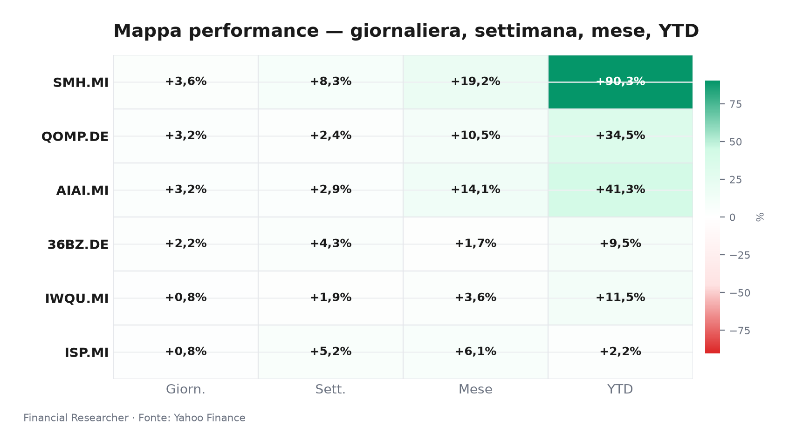
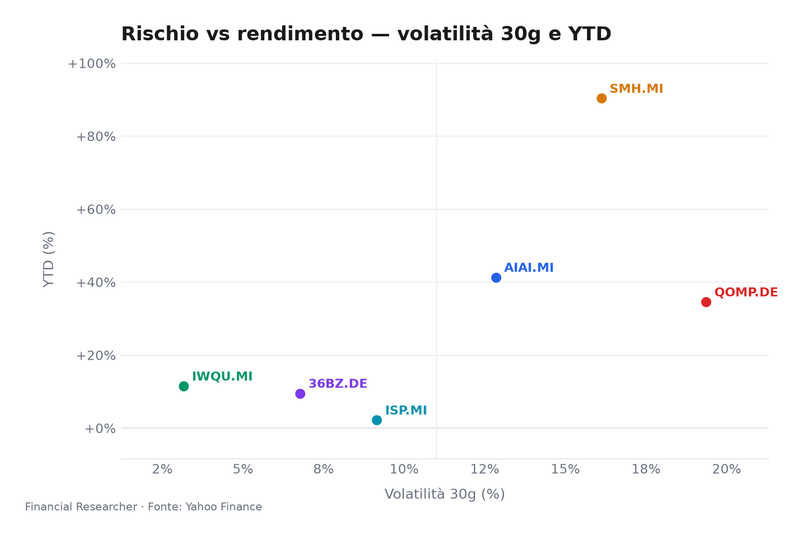
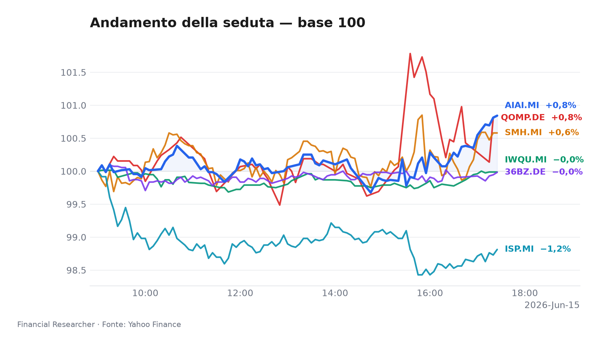
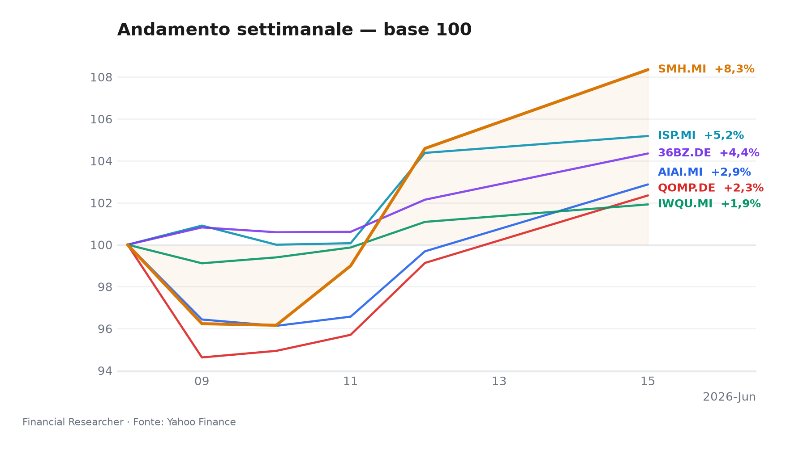
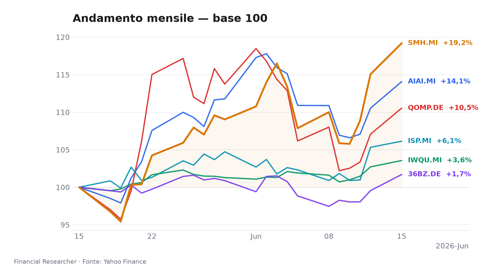
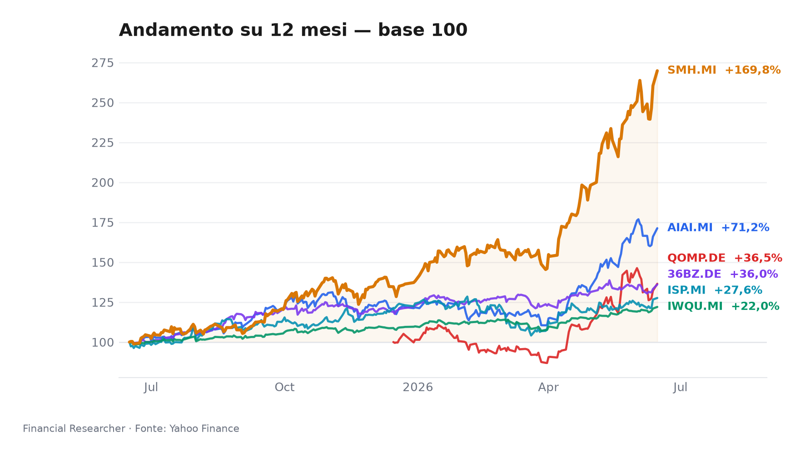

## 1. Title + mood hook
**Milano chiude con una leadership concentrata: semis e AI tengono il passo, mentre qualità e banche restano selettive.**

## 2. Executive Summary
- **L&G Artificial Intelligence UCITS ETF (AIAI.MI)** ▲ ha messo a segno un progresso di **3.20%** in giornata, **2.88%** su base settimanale e **41.29%** da inizio anno; il driver resta il tema strutturale dell’adozione AI, con il comparto ancora sostenuto dal flusso di capitali verso software e infrastruttura [1].
- **VanEck Semiconductor UCITS ETF (SMH.MI)** ▲ è stato il leader della seduta con **3.59%** in 1D, **8.35%** in 1W e **90.33%** YTD; il messaggio di fondo è un altro round di forza sul capex AI e sul ciclo dei chip, che continua a premiare il beta più puro dell’intero watchlist [2].
- **iShares Edge MSCI World Quality Factor UCITS ETF USD (Acc) (IWQU.MI)** ▲ ha guadagnato **0.82%** in 1D, **1.92%** in 1W e **11.50%** YTD; il fattore qualità resta ben posizionato come cuscinetto in un mercato ancora sensibile a tassi, utili e ampiezza del rally [3].
- **iShares Quantum Computing UCITS ETF USD (Acc) (QOMP.DE)** ▲ ha aggiunto **3.25%** in 1D, **2.35%** in 1W e **34.55%** YTD; il tema resta altamente opzionale e guidato da aspettative di milestone, finanziamenti e narrazione tecnologica più che da fondamentali tradizionali [4].
- **iShares MSCI China A UCITS ETF (36BZ.DE)** ▲ ha chiuso a **2.16%** in 1D, **4.35%** in 1W e **9.51%** YTD; la lettura dominante è un rimbalzo tattico ancora dipendente da sostegno macro e fiducia sulla domanda domestica cinese [5].
- **Intesa Sanpaolo S.p.A. (ISP.MI)** ▲ è avanzata di **0.77%** in giornata, **5.18%** in 1W e **2.19%** YTD; il titolo continua a prezzare una storia di valutazione, capital return e sensibilità allo spread italiano, con il recente flusso news centrato su MPS e su update di giudizio non ancora trasformati in nuove indicazioni analitiche [6][7].

## 3. Watchlist Performance Snapshot
**SMH.MI** è il leader di giornata, mentre **ISP.MI** chiude la sessione come laggard relativo; il resto del paniere resta ordinato, con AI, quantum e China A in tono positivo e qualità più difensiva [2][6].

## 4. What's Driving the Moves
- **L&G Artificial Intelligence UCITS ETF (AIAI.MI)**: non emergono headline materiali nel prefetch, quindi il movimento va letto soprattutto come prosecuzione della rotazione sul tema AI; il mercato continua a favorire esposizione a infrastruttura, software e monetizzazione dell’adozione enterprise, mentre il profilo di rischio resta legato a eventuale compressione dei multipli se il capex dei big tech dovesse rallentare [1][8].

- **VanEck Semiconductor UCITS ETF (SMH.MI)**: anche qui non compare una notizia singola materiale nel prefetch, ma il tono è coerente con una prosecuzione del rally dei semiconduttori, ancora trainato dalla domanda per acceleratori, memory ad alte prestazioni e investimenti lungo la filiera AI; il focus di mercato resta su foundry, HBM e segnali di tenuta degli ordini, con il comparto che rimane il beta più diretto al ciclo AI [2][8].

- **iShares Edge MSCI World Quality Factor UCITS ETF USD (Acc) (IWQU.MI)**: in assenza di headline specifiche, il driver principale è di posizionamento; il fattore qualità continua a intercettare domanda quando gli investitori cercano bilanci solidi, ROE elevato e minore leva, soprattutto in una fase in cui il rally non è ampio e la dispersione sugli utili può crescere [3][9].

- **iShares Quantum Computing UCITS ETF USD (Acc) (QOMP.DE)**: non risultano headline materiali nel prefetch; il movimento va letto come risposta a una narrativa di lungo periodo che resta molto sensibile a newsflow su funding, partnership e progressi commerciali. Il profilo resta più speculativo rispetto all’AI tradizionale, con drawdown potenzialmente più ampi quando il mercato riduce la propensione al rischio [4][9].

- **iShares MSCI China A UCITS ETF (36BZ.DE)**: non emergono headline materiali nel prefetch; il rimbalzo sembra ancora legato alla speranza di stimolo fiscale e monetario, oltre che a segnali di stabilizzazione su property e consumi. Il tema resta fragile: senza prove più convincenti di sostegno alla domanda interna e di stabilità del renminbi, il movimento rischia di restare tattico [5][10].

- **Intesa Sanpaolo S.p.A. (ISP.MI)**: il flusso recente è stato dominato da contenuti su storia di investimento, weak share price e soprattutto dalla notizia del **6 giugno** sul lancio dell’offerta per MPS, con possibile fusione attesa per dicembre 2026; il quadro resta quindi doppio, tra narrativa strategica di consolidamento e valutazione ancora condizionata da spread BTP-Bund, percorso dei tassi e attese su NII, cost of risk e payout [6][7][11].

## 5. Medium-Term Outlook
- **Bull case:** entro **2026-06-17**, un messaggio Fed più accomodante e dati che confermino resilienza del capex AI rafforzano **SMH.MI** e **AIAI.MI**, migliorano la leva narrativa su **QOMP.DE**, mantengono parte del supporto su **IWQU.MI** e lasciano **ISP.MI** relativamente stabile se lo spread italiano resta contenuto [12][8].

- **Base case:** tra **2026-07-24** e la successiva finestra dati, la combinazione di easing graduale ECB e utili Q2 in crescita moderata favorisce un barbell tra **IWQU.MI** e **ISP.MI**, con esposizione selettiva a **AIAI.MI** e **SMH.MI**; **36BZ.DE** resta in attesa di conferme su stimolo e fiducia domestica [7][11][10].

- **Bear case:** se a **luglio 2026** i dati inflattivi riaccelerano o se il quadro cinese peggiora su property, export controls o domanda interna, il mercato può risalire lungo la catena del rischio: multipli in contrazione per **AIAI.MI**, **SMH.MI** e **QOMP.DE**, debolezza persistente per **36BZ.DE** e repricing negativo su **ISP.MI** via spread sovrano e rischio credito [13][8][10].

## 6. Event Calendar
| Date (YYYY-MM-DD) | Event | Affected tickers/themes | Impact | [N] |
|---|---|---|---|---|
| 2026-06-16 | No confirmed forward events found in the 2026-06-15 to 2026-07-13 window for the watchlist based on available calendar/news checks | AIAI.MI, SMH.MI, IWQU.MI, QOMP.DE, 36BZ.DE, ISP.MI | Regulatory | [1][2] |

## 7. Correlated Themes
- **AI e semiconduttori** restano il medesimo asse direzionale per **AIAI.MI** e **SMH.MI**: quando il mercato prezza capex solido e supply chain in tenuta, i due strumenti tendono a muoversi nella stessa direzione, con **SMH.MI** più sensibile al beta del ciclo hardware [8].

- **Qualità e banche italiane** sono una coppia di copertura diversa ma compatibile: **IWQU.MI** tende a funzionare come ammortizzatore se la dispersione sugli utili aumenta, mentre **ISP.MI** beneficia di margini ancora resilienti ma resta vincolata alla traiettoria dei tassi e dello spread domestico [11][9].

- **Quantum e AI** condividono il traino narrativo, ma non lo stesso profilo di rischio: **QOMP.DE** reagisce più alla speranza di breakthrough e al funding, mentre **AIAI.MI** ha una base industriale più ampia e quindi una migliore ancoraggio alle metriche di adozione [4][8].

- **China A-shares** e **ISP.MI** sono entrambi sensibili al rischio macro locale, ma su canali diversi: **36BZ.DE** guarda a stimolo, property e fiducia del consumatore, mentre **ISP.MI** segue soprattutto spread sovrano, costo del capitale e percezione del rischio Italia [10][11].

## 8. Risks & Watchpoints
- **Rischio tassi e USD:** un percorso Fed più restrittivo o un dollaro più forte può sostenere parte dei flussi verso ETF quotati in EUR, ma nel contempo comprime multipli growth e irrigidisce le condizioni finanziarie globali, penalizzando **AIAI.MI**, **SMH.MI** e **QOMP.DE** [12][13].

- **Rischio spread Italia:** un allargamento del BTP-Bund restituirebbe pressione immediata su **ISP.MI**, sia per il canale mark-to-market sia per il sentiment sul comparto bancario italiano; il tema resta il principale watchpoint domestico del nome [7][13][11].

- **Rischio Cina:** senza segnali credibili di sostegno fiscale, immobiliare e al consumo, **36BZ.DE** rischia di rimanere intrappolata in rimbalzi brevi e reversibili; le notizie su PBoC e policy domestica restano il trigger da monitorare [10].

- **Rischio narrazione/valutazioni:** **QOMP.DE** resta esposto a correzioni rapide se il mercato riduce la tolleranza per storie lunghe e prive di cash flow vicino; anche **AIAI.MI** e **SMH.MI** possono soffrire se le aspettative su monetizzazione AI diventano troppo affollate [8][9].

- **Rischio evento non mappato:** l’assenza di catalyst confermati nel calendario non elimina il rischio di headline improvvise, soprattutto su M&A bancario, export controls, risultati di settore e messaggi di banca centrale [7][12].

## 9. References
## 10. Disclaimer
Questo documento è una watchlist executive per uso informativo e non costituisce consulenza di investimento, sollecitazione all’acquisto o alla vendita, né raccomandazione personalizzata. Le informazioni riflettono il contesto disponibile al momento della redazione e possono cambiare rapidamente con nuovi dati di mercato, notizie o aggiornamenti di calendario.

## Watchlist Performance Snapshot

**Leader 1D:** VanEck Semiconductor UCITS ETF (SMH.MI) (3.59%) · **Laggard 1D:** Intesa Sanpaolo S.p.A. (ISP.MI) (0.77%)

| Ref | Strumento | Ticker | Prezzo (valuta) | Giornaliera | Settimanale | Mensile | YTD | 1A | Vol. 30g | Fonte |
|-----|-----------|--------|-----------------|-------------|-------------|---------|-----|-----|--------|-------|
| [1] | L&G Artificial Intelligence UCITS ETF | AIAI.MI | 34,17 EUR | 3,20% | 2,88% | 14,07% | 41,29% | 71,24% | 12,84% | [1] |
| [2] | VanEck Semiconductor UCITS ETF | SMH.MI | 104,09 EUR | 3,59% | 8,35% | 19,19% | 90,33% | 169,80% | 16,11% | [2] |
| [3] | iShares Edge MSCI World Quality Factor UCITS ETF USD (Acc) | IWQU.MI | 75,89 EUR | 0,82% | 1,92% | 3,56% | 11,50% | 21,97% | 3,16% | [3] |
| [4] | iShares Quantum Computing UCITS ETF USD (Acc) | QOMP.DE | 5,88 EUR | 3,25% | 2,35% | 10,54% | 34,55% | 36,47% | 19,36% | [4] |
| [5] | iShares MSCI China A UCITS ETF | 36BZ.DE | 5,45 EUR | 2,16% | 4,35% | 1,70% | 9,51% | 36,04% | 6,77% | [5] |
| [6] | Intesa Sanpaolo S.p.A. | ISP.MI | 5,88 EUR | 0,77% | 5,18% | 6,13% | 2,19% | 27,58% | 9,15% | [6] |
| — | FTSE MIB | FTSEMIB.MI | 51835,95 EUR | 2,64% | 3,24% | 5,54% | 14,24% | 29,82% | 6,02% | — |
| — | STOXX Europe 600 | ^STOXX | 634,44 EUR | 0,19% | 2,04% | 3,77% | 5,43% | 16,00% | 4,62% | — |

### Performance Charts

## References

1. Yahoo Finance — AIAI.MI (L&G Artificial Intelligence UCITS ETF) — 2026-06-15 — https://finance.yahoo.com/quote/AIAI.MI
2. Yahoo Finance — SMH.MI (VanEck Semiconductor UCITS ETF) — 2026-06-15 — https://finance.yahoo.com/quote/SMH.MI
3. Yahoo Finance — IWQU.MI (iShares Edge MSCI World Quality Factor UCITS ETF USD (Acc)) — 2026-06-15 — https://finance.yahoo.com/quote/IWQU.MI
4. Yahoo Finance — QOMP.DE (iShares Quantum Computing UCITS ETF USD (Acc)) — 2026-06-15 — https://finance.yahoo.com/quote/QOMP.DE
5. Yahoo Finance — 36BZ.DE (iShares MSCI China A UCITS ETF) — 2026-06-15 — https://finance.yahoo.com/quote/36BZ.DE
6. Yahoo Finance — ISP.MI (Intesa Sanpaolo S.p.A.) — 2026-06-15 — https://finance.yahoo.com/quote/ISP.MI
7. Barrons.com — Mastercard and 9 Other Stocks to Buy as the Chip Rally Wanes — 2026-03-17 — https://finance.yahoo.com/m/1bfe515b-c3bd-34f7-aacc-3a33b268d9a3/mastercard-and-9-other-stocks.html
12. The Wall Street Journal — Stocks to Watch Recap: Marvell Technology, Apple, Broadcom, Strategy — 2026-06-08 — https://finance.yahoo.com/m/34a0ce12-e5d0-369b-99dd-2a53210f0376/stocks-to-watch-recap-.html

<!-- financial-researcher:run-metadata -->
## Run metadata

| | |
|---|---|
| Model profile | openrouter_auto_economy |
| Processing time | 1m 36s |
| LLM requests | 6 |
| Tokens (prompt / completion / total) | 17,472 / 9,093 / 26,565 |
| OpenRouter savings (1–10) | 4 |

**Models by agent**

| Agent | Model (configured → resolved) |
|---|---|
| Market analyst | `openrouter/openrouter/auto` → `openai/gpt-5.5-20260423` |
| News analyst | `openrouter/openrouter/auto` → `perplexity/sonar` |
| Outlook analyst | `openrouter/openrouter/auto` → `openai/gpt-5.5-20260423` |
| Calendar analyst | `openrouter/openrouter/auto` → `perplexity/sonar` |
| Chief strategist | `openrouter/openrouter/auto` → `perplexity/sonar` |
<!-- /financial-researcher:run-metadata -->
