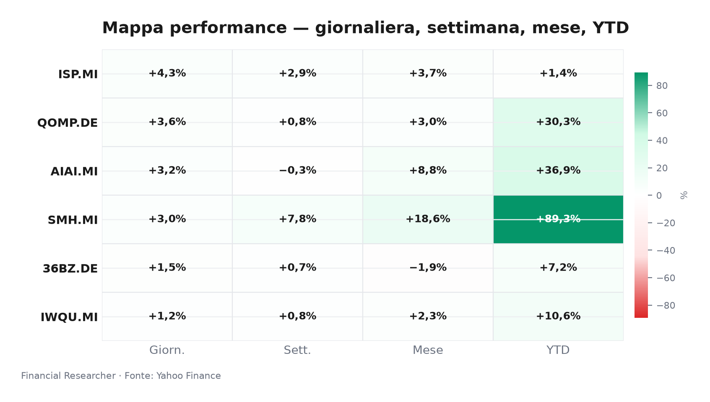
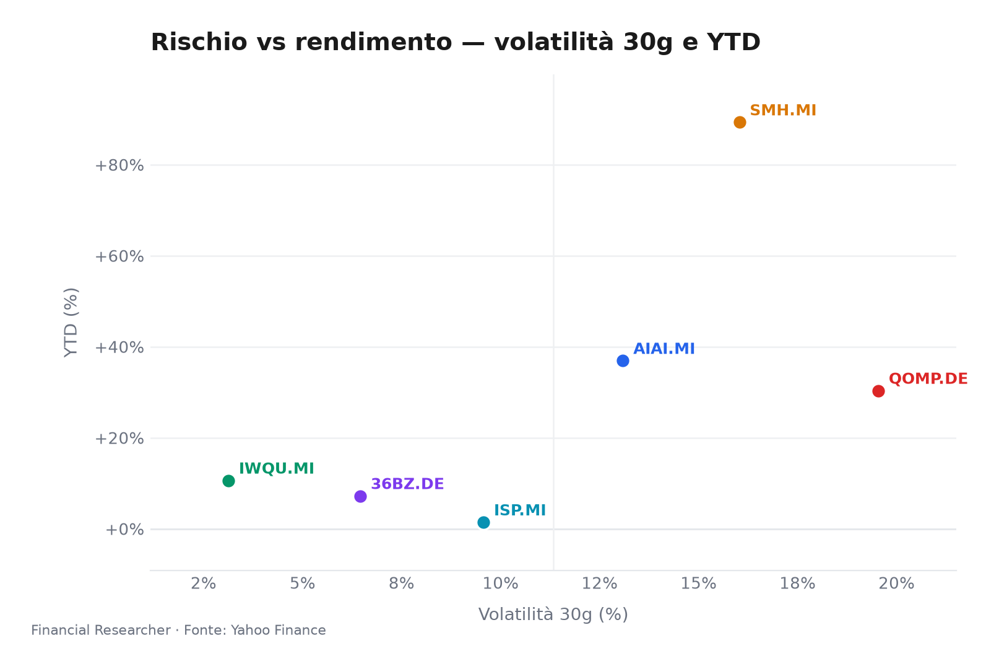
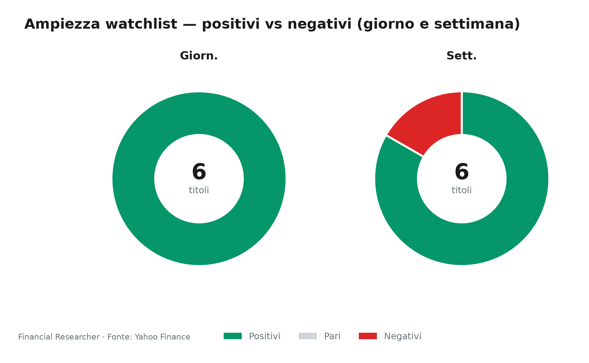
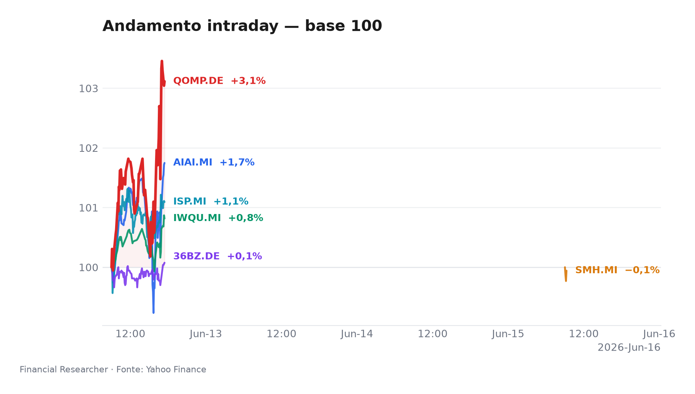
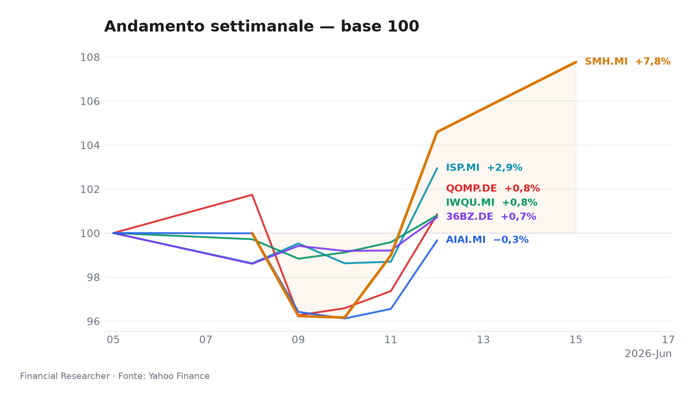

## Market mood
Il mercato apre con tono costruttivo: i temi ad alta duration e il credito domestico italiano partono forte, mentre la qualità resta il rifugio naturale se la leadership dovesse allargarsi meno del previsto.

## Executive Summary
- **L&G Artificial Intelligence UCITS ETF (AIAI.MI)** ha aperto in netto rialzo con **+3.23% 1D**, ma resta leggermente negativo su **-0.33% 1W** e mantiene un robusto **+36.90% YTD**; il movimento è coerente con il sostegno strutturale del tema AI, ancora guidato dalla monetizzazione dei capex hyperscaler e dalla sensibilità ai tassi reali[1].
- **VanEck Semiconductor UCITS ETF (SMH.MI)** è il motore più evidente del basket growth con **+3.04% 1D**, **+7.77% 1W** e **+89.30% YTD**; il contesto resta favorevole ai semiconduttori esposti alla domanda AI, anche se la concentrazione su pochi nomi e i vincoli geopolitici mantengono alta la volatilità[2].
- **iShares Edge MSCI World Quality Factor UCITS ETF USD (Acc) (IWQU.MI)** avanza **+1.22% 1D**, **+0.80% 1W** e **+10.59% YTD**; la qualità tiene bene come alternativa difensiva in un mercato ancora sensibile a tassi, utili e leva finanziaria[3].
- **iShares Quantum Computing UCITS ETF USD (Acc) (QOMP.DE)** guadagna **+3.58% 1D**, con **+0.85% 1W** e **+30.32% YTD**; il tema resta narrativo e ad alta duration, sostenuto da aspettative di commercializzazione più credibili ma ancora fragile rispetto a qualsiasi delusione sui tempi[4].
- **iShares MSCI China A UCITS ETF (36BZ.DE)** sale **+1.52% 1D**, con **+0.72% 1W** e **+7.20% YTD**; il rimbalzo resta soprattutto tattico, con il mercato che continua a chiedere più stimolo e una stabilizzazione credibile della domanda interna[5].
- **Intesa Sanpaolo S.p.A. (ISP.MI)** è il leader della lista con **+4.30% 1D**, **+2.94% 1W** e **+1.41% YTD**; il titolo beneficia del flusso sul comparto banche italiane e di un quadro fondamentale che, per ora, resta supportato da guidance e payout, pur in assenza di nuovi segnali dagli analisti[6].

## Watchlist Performance Snapshot

**Leader 1D:** Intesa Sanpaolo S.p.A. (ISP.MI) (4.30%) · **Laggard 1D:** iShares Edge MSCI World Quality Factor UCITS ETF USD (Acc) (IWQU.MI) (1.22%)

| Ref | Strumento | Ticker | Prezzo (valuta) | Giornaliera | Settimanale | Mensile | YTD | 1A | Vol. 30g | Fonte |
|-----|-----------|--------|-----------------|-------------|-------------|---------|-----|-----|--------|-------|
| [1] | L&G Artificial Intelligence UCITS ETF | AIAI.MI | 33,11 EUR | 3,23% | -0,33% | 8,81% | 36,90% | 65,05% | 13,09% | [1] |
| [2] | VanEck Semiconductor UCITS ETF | SMH.MI | 103,53 EUR | 3,04% | 7,77% | 18,55% | 89,30% | 168,35% | 16,03% | [2] |
| [3] | iShares Edge MSCI World Quality Factor UCITS ETF USD (Acc) | IWQU.MI | 75,27 EUR | 1,22% | 0,80% | 2,30% | 10,59% | 20,41% | 3,13% | [3] |
| [4] | iShares Quantum Computing UCITS ETF USD (Acc) | QOMP.DE | 5,70 EUR | 3,58% | 0,85% | 3,04% | 30,32% | 32,18% | 19,54% | [4] |
| [5] | iShares MSCI China A UCITS ETF | 36BZ.DE | 5,33 EUR | 1,52% | 0,72% | -1,95% | 7,20% | 32,77% | 6,46% | [5] |
| [6] | Intesa Sanpaolo S.p.A. | ISP.MI | 5,84 EUR | 4,30% | 2,94% | 3,68% | 1,41% | 28,54% | 9,57% | [6] |
| — | FTSE MIB | FTSEMIB.MI | 52189,76 EUR | 1,34% | 3,95% | 6,26% | 15,02% | 30,71% | 6,10% | — |
| — | STOXX Europe 600 | ^STOXX | 640,95 EUR | 1,22% | 3,09% | 4,83% | 6,51% | 17,19% | 4,73% | — |

### Performance Charts

## What's Driving the Moves
- **L&G Artificial Intelligence UCITS ETF (AIAI.MI)**: nessuna headline materiale è emersa nel prefetch; il movimento si legge quindi come espressione pura del tema AI, con il mercato che continua a scontare una traiettoria favorevole per i ricavi legati a software, infrastrutture e monetizzazione dei capex dei grandi hyperscaler[1]. Il supporto resta sensibile ai tassi e alla narrativa sui margini, ma per ora il flusso è ancora pro-risk[1].

- **VanEck Semiconductor UCITS ETF (SMH.MI)**: anche qui non c’è una notizia ETF-specifica nuova da citare; il driver resta il posizionamento sul ciclo dei chip, con forte esposizione a nomi come Nvidia e TSMC e quindi a domanda AI, restrizioni export verso la Cina e rischio geopolitico Taiwan[2]. Il rialzo di oggi è coerente con un mercato che continua a premiare gli asset più direttamente agganciati all’intelligenza artificiale[2].

- **iShares Edge MSCI World Quality Factor UCITS ETF USD (Acc) (IWQU.MI)**: nessuna headline materiale nel prefetch; la lettura è di puro fattore, con la qualità che assorbe bene l’incertezza quando il mercato alterna rotazioni tra crescita e difensiva[3]. Il profilo qualità tende a beneficiare di utili più affidabili, leva più bassa e minore sensibilità alla compressione dei multipli, ma rischia di restare indietro se la liquidità torna a inseguire beta e ciclici[3].

- **iShares Quantum Computing UCITS ETF USD (Acc) (QOMP.DE)**: non emerge un catalizzatore di notizia specifico; il tema quantum continua però a ricevere attenzione per la crescente credibilità industriale dei tempi di adozione e per l’opzionalità di lungo periodo[4]. Il controcanto è chiaro: l’ETF resta piccolo, concentrato sul racconto e quindi molto esposto a movimenti bruschi se il mercato chiede evidence più tangibile su commercializzazione e ricavi[4].

- **iShares MSCI China A UCITS ETF (36BZ.DE)**: il prefetch non mostra headline materiali, quindi il movimento va letto nel quadro del rischio Cina più ampio[5]. Il mercato continua a oscillare tra attesa di stimolo e scetticismo sulla domanda domestica: senza un miglioramento più visibile di property, fiducia delle famiglie e prezzi, il rerating resta limitato[5].

- **Intesa Sanpaolo S.p.A. (ISP.MI)**: il flusso resta guidato da una copertura recente che insiste su assenza di nuovi segnali dagli analisti e su una lettura della valutazione dopo la debolezza recente del titolo, mentre il contesto di settore rimane dominato dal focus sulle banche italiane[6][7]. Sullo sfondo pesa anche la narrazione strategica sul dossier MPS e sul consolidamento domestico; il mercato continua a prezzare solidità distributiva, ma osserva con attenzione il rischio di compressione del margine d’interesse in uno scenario di tassi più bassi[6][7].

## Medium-Term Outlook
- **Bull case:** entro **2026-09-30**, tagli Fed/ECB in linea con l’inflazione e utili AI ancora sopra attese alimentano un’estensione del rally nei temi ad alta duration; in questo scenario **AIAI.MI**, **SMH.MI** e **QOMP.DE** restano i più avvantaggiati, **IWQU.MI** partecipa in modo più ordinato e **ISP.MI** beneficia di un minor premio al rischio anche se il margine d’interesse si normalizza[1][2][3][4][6].
- **Base case:** tra **2026-07-01** e **2026-12-31**, la BCE prosegue con un allentamento graduale, la Fed resta dati-dipendente ma non aggressiva, la spesa AI regge e la Cina offre solo stimolo incrementale; il risultato è un contesto di range-to-up, con semis e quality ancora centrali, **ISP.MI** sostenuto da carry e payout, e **36BZ.DE** e **QOMP.DE** ancora più da satellite tattico che da core[2][3][4][5][6].
- **Bear case:** nel terzo trimestre **2026**, un ritorno di pressione su inflazione/tariffe, un Fed più restrittivo del previsto, dubbi sul capex AI o un peggioramento della deflazione cinese comprimono i multipli dei temi più lunghi; in questo quadro il mercato favorisce **IWQU.MI**, mentre **AIAI.MI**, **SMH.MI**, **QOMP.DE** e **36BZ.DE** restano i più vulnerabili alla riduzione del premio per la crescita[1][2][3][4][5].

## Event Calendar
| Date (YYYY-MM-DD) | Event | Affected tickers/themes | Impact | [N] |
|---|---|---|---|---|
| 2026-06-18 | US weekly initial jobless claims | IWQU.MI, QOMP.DE, 36BZ.DE; macro/risk appetite | Macro release | [8] |
| 2026-06-18 | ECB monetary policy rate decision | IWQU.MI, ISP.MI; rates, European financials | Central bank | [8] |
| 2026-06-30 | Eurozone flash CPI release | IWQU.MI, ISP.MI; inflation, ECB path | Macro release | [8] |
| 2026-07-08 | FOMC meeting minutes | IWQU.MI, SMH.MI, QOMP.DE; rates, duration-sensitive assets | Central bank | [8] |

## Correlated Themes
- **AIAI.MI**, **SMH.MI** e **QOMP.DE** condividono la stessa sensibilità alla duration: tassi reali in calo e narrativa sugli investimenti AI sostengono il gruppo, mentre qualsiasi dubbio su monetizzazione o capex lo colpisce in modo asimmetrico[1][2][4].
- **IWQU.MI** funziona come cuscinetto di portafoglio quando la leadership si restringe o il ciclo macro rallenta; la sua correlazione inversa rispetto ai temi più speculativi tende ad aumentare nelle fasi di stress su crescita e valutazioni[3].
- **36BZ.DE** si muove più con la politica interna cinese e il sentiment sulla domanda che con il resto della watchlist; senza segnali convincenti su property e consumo, il beta di tema resta condizionato[5].
- **ISP.MI** è la componente domestica più idiosincratica: beneficia di flussi su banche italiane e di una storia di capitale/payout, ma convive con il rischio di normalizzazione del margine e con il rumore regolatorio sul settore[6][7].

## Risks & Watchpoints
- Un ulteriore rafforzamento dell’euro potrebbe erodere parte dei rendimenti in valuta per i prodotti con esposizione USA non coperta, in particolare **AIAI.MI**, **SMH.MI** e **QOMP.DE**, anche se il driver fondamentale di tema restasse intatto[1][2][4].
- Se i dati macro USA sorprendono al rialzo o la Fed mantiene un tono più rigido, i segmenti ad alta duration potrebbero correggere più della media; in quel caso **AIAI.MI**, **SMH.MI** e **QOMP.DE** sarebbero i più esposti alla compressione dei multipli[1][2][4].
- Per **36BZ.DE**, il rischio principale è che il mercato continui a ricevere solo stimolo incrementale e non una vera svolta di fiducia: senza stabilizzazione del real estate e dei consumi, il rimbalzo può restare episodico[5].
- Per **ISP.MI**, la combinazione di pressione sul NII, possibile rumore politico/fiscale e normale deterioramento del credito può ridurre la velocità del trade se il mercato passa dalla storia di carry alla storia di difesa[6][7].

## References

1. Yahoo Finance — AIAI.MI (L&G Artificial Intelligence UCITS ETF) — 2026-06-15 — https://finance.yahoo.com/quote/AIAI.MI
2. Yahoo Finance — SMH.MI (VanEck Semiconductor UCITS ETF) — 2026-06-15 — https://finance.yahoo.com/quote/SMH.MI
3. Yahoo Finance — IWQU.MI (iShares Edge MSCI World Quality Factor UCITS ETF USD (Acc)) — 2026-06-15 — https://finance.yahoo.com/quote/IWQU.MI
4. Yahoo Finance — QOMP.DE (iShares Quantum Computing UCITS ETF USD (Acc)) — 2026-06-15 — https://finance.yahoo.com/quote/QOMP.DE
5. Yahoo Finance — 36BZ.DE (iShares MSCI China A UCITS ETF) — 2026-06-15 — https://finance.yahoo.com/quote/36BZ.DE
6. Yahoo Finance — ISP.MI (Intesa Sanpaolo S.p.A.) — 2026-06-15 — https://finance.yahoo.com/quote/ISP.MI
7. The Wall Street Journal — Stocks to Watch Recap: Marvell Technology, Apple, Broadcom, Strategy — 2026-06-08 — https://finance.yahoo.com/m/34a0ce12-e5d0-369b-99dd-2a53210f0376/stocks-to-watch-recap-.html
8. Barrons.com — Mastercard and 9 Other Stocks to Buy as the Chip Rally Wanes — 2026-03-17 — https://finance.yahoo.com/m/1bfe515b-c3bd-34f7-aacc-3a33b268d9a3/mastercard-and-9-other-stocks.html

## Disclaimer
Questa nota è un briefing informativo di mercato e non contiene raccomandazioni di investimento, acquisto o vendita. Le dinamiche descritte riflettono il contesto disponibile al momento dell’apertura e possono cambiare rapidamente con nuove notizie, dati macro o revisioni di consenso.

<!-- financial-researcher:run-metadata -->
## Run metadata

| | |
|---|---|
| Model profile | openrouter_auto_economy |
| Processing time | 2m 55s |
| LLM requests | 5 |
| Tokens (prompt / completion / total) | 14,118 / 13,731 / 27,849 |
| OpenRouter savings (1–10) | 4 |

**Models by agent**

| Agent | Model (configured → resolved) |
|---|---|
| Market analyst | `openrouter/openrouter/auto` → `openai/gpt-5.5-20260423` |
| News analyst | `openrouter/openrouter/auto` → `perplexity/sonar` |
| Outlook analyst | `openrouter/openrouter/auto` → `openai/gpt-5.5-20260423` |
| Calendar analyst | `openrouter/openrouter/auto` → `perplexity/sonar` |
| Chief strategist | `openrouter/openrouter/auto` → `perplexity/sonar` |
<!-- /financial-researcher:run-metadata -->
