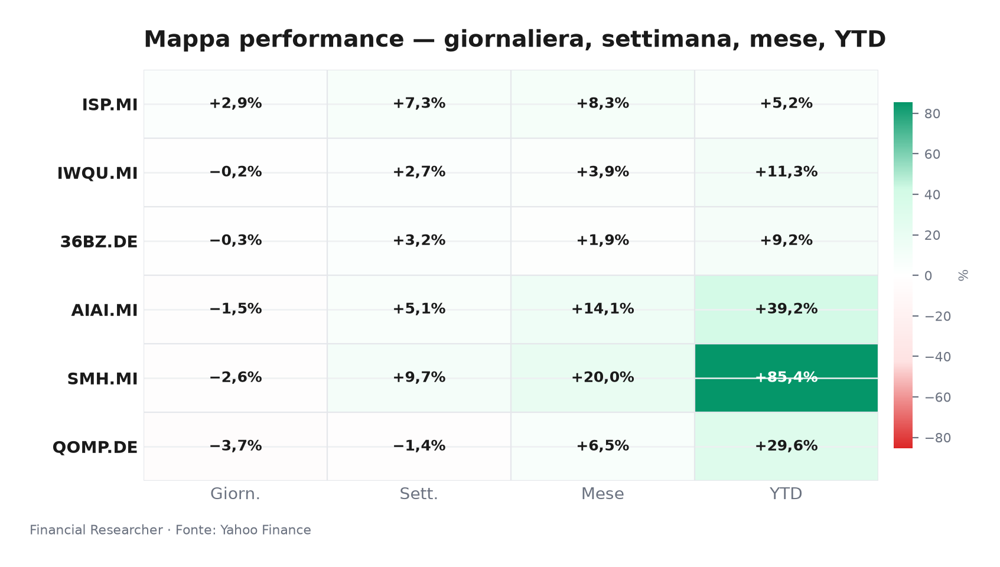
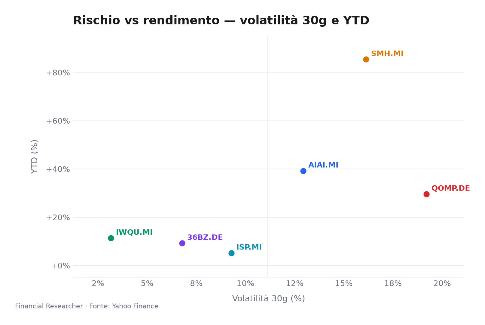
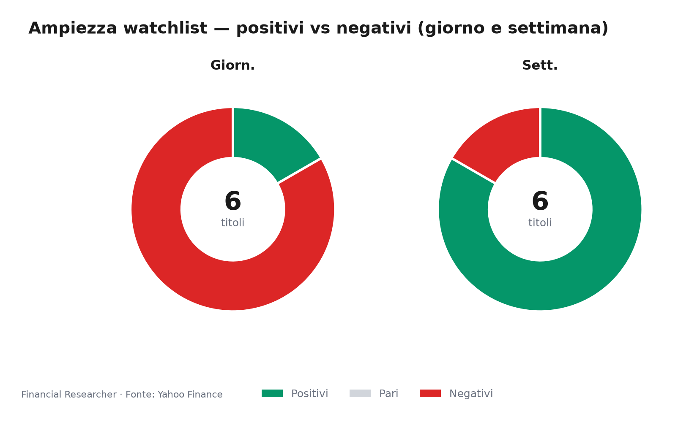
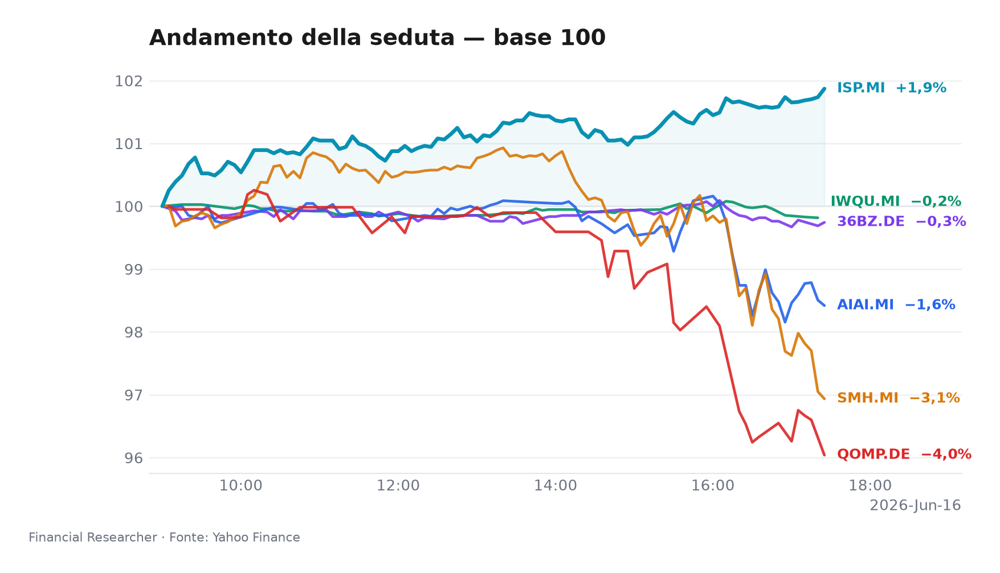
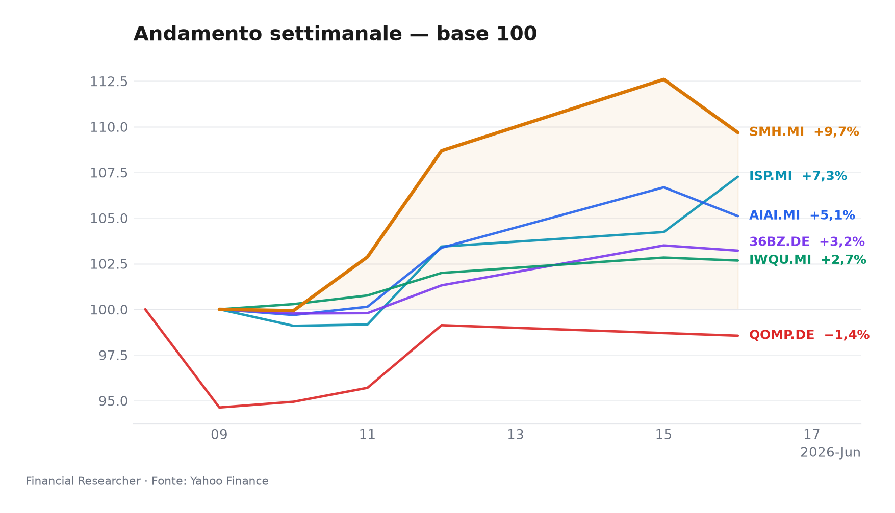
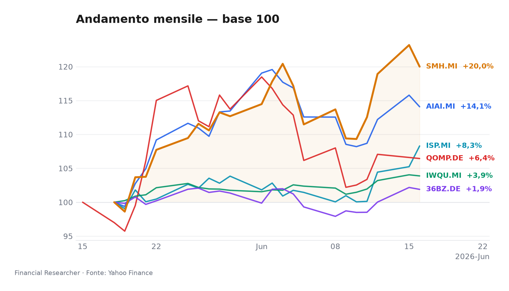
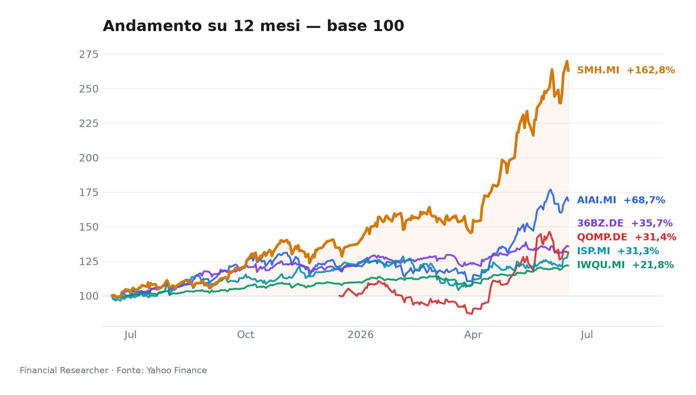

# 1. Title + mood hook

**Sotto la superficie calma, il watchlist resta polarizzato: la qualità resiste, ma il beta tematico continua a pagare il prezzo del repricing sui tassi e sulle aspettative di crescita.**

## Watchlist Performance Snapshot

**Leader 1D:** Intesa Sanpaolo S.p.A. (ISP.MI) (2.91%) · **Laggard 1D:** iShares Quantum Computing UCITS ETF USD (Acc) (QOMP.DE) (-3.71%)

| Ref | Strumento | Ticker | Prezzo (valuta) | Giornaliera | Settimanale | Mensile | YTD | 1A | Vol. 30g | Fonte |
|-----|-----------|--------|-----------------|-------------|-------------|---------|-----|-----|--------|-------|
| [1] | L&G Artificial Intelligence UCITS ETF | AIAI.MI | 33,66 EUR | -1,48% | 5,10% | 14,08% | 39,20% | 68,71% | 12,94% | [1] |
| [2] | VanEck Semiconductor UCITS ETF | SMH.MI | 101,40 EUR | -2,58% | 9,68% | 20,00% | 85,41% | 162,83% | 16,13% | [2] |
| [3] | iShares Edge MSCI World Quality Factor UCITS ETF USD (Acc) | IWQU.MI | 75,77 EUR | -0,16% | 2,67% | 3,88% | 11,33% | 21,78% | 3,16% | [3] |
| [4] | iShares Quantum Computing UCITS ETF USD (Acc) | QOMP.DE | 5,66 EUR | -3,71% | -1,44% | 6,45% | 29,57% | 31,42% | 19,20% | [4] ⚠ |
| [5] | iShares MSCI China A UCITS ETF | 36BZ.DE | 5,43 EUR | -0,28% | 3,21% | 1,90% | 9,21% | 35,67% | 6,78% | [5] |
| [6] | Intesa Sanpaolo S.p.A. | ISP.MI | 6,06 EUR | 2,91% | 7,26% | 8,30% | 5,16% | 31,29% | 9,28% | [6] |
| — | FTSE MIB | FTSEMIB.MI | 52432,56 EUR | 1,15% | 4,43% | 6,75% | 15,56% | 31,31% | 6,20% | — |
| — | STOXX Europe 600 | ^STOXX | 636,00 EUR | 0,25% | 2,30% | 4,02% | 5,69% | 16,29% | 4,62% | — |

### Performance Charts

## 2. Executive Summary

- **L&G Artificial Intelligence UCITS ETF (AIAI.MI)**: l’ETF ha chiuso a ▼ 1,48% su base giornaliera, ma mantiene un profilo forte con ▲ 5,10% su 1 settimana e ▲ 39,20% da inizio anno; il driver dominante resta la tenuta del tema AI infrastructure/capex, che continua a sostenere il flusso sul comparto nonostante la pausa tattica di oggi[1].  
- **VanEck Semiconductor UCITS ETF (SMH.MI)**: ▼ 2,58% oggi, pur restando uno dei motori più forti del paniere con ▲ 9,68% su 1 settimana e ▲ 85,41% YTD; il tono resta guidato dal momentum dei semiconduttori e dalla sensibilità ai cicli di capex dei grandi hyperscaler[2].  
- **iShares Edge MSCI World Quality Factor UCITS ETF USD (Acc) (IWQU.MI)**: il movimento è quasi piatto a ▼ 0,16% in giornata, con ▲ 2,67% settimanale e ▲ 11,33% YTD; il fattore qualità continua a beneficiare di bilanci solidi e di una rotazione difensiva selettiva quando i tassi reali risalgono[3].  
- **iShares Quantum Computing UCITS ETF USD (Acc) (QOMP.DE)**: la seduta è stata la più debole del gruppo, a ▼ 3,71%, dopo una settimana già negativa a ▼ 1,44%, ma il saldo YTD resta positivo a ▲ 29,57%; il sottotesto è quello di un tema ancora opzionale, volatile e poco ancorato ai fondamentali di breve[4].  
- **iShares MSCI China A UCITS ETF (36BZ.DE)**: l’ETF arretra di ▼ 0,28% oggi, ma conserva un progresso di ▲ 3,21% su 1 settimana e ▲ 9,21% YTD; il quadro resta dominato dalle attese su sostegno politico cinese e dalla sensibilità a segnali di stabilizzazione domestica[5].  
- **Intesa Sanpaolo S.p.A. (ISP.MI)**: è il leader di giornata con ▲ 2,91%, ▲ 7,26% su 1 settimana e ▲ 5,16% YTD; l’ultimo aggiornamento disponibile segnala target degli analisti invariati, senza revisioni nuove, quindi il titolo continua a muoversi soprattutto su flussi, credibilità del capitale e lettura macro domestica[6].  

## 3. Watchlist Performance Snapshot

**Intesa Sanpaolo S.p.A. (ISP.MI)** guida la seduta, mentre **iShares Quantum Computing UCITS ETF USD (Acc) (QOMP.DE)** è il laggard di giornata; rispetto a FTSE MIB e STOXX, il paniere mostra un netto scarto positivo solo su **Intesa Sanpaolo S.p.A. (ISP.MI)** e una sottoperformance diffusa sugli strumenti growth/tematici[1][2][3][4][5][6].

## 4. What's Driving the Moves

- **L&G Artificial Intelligence UCITS ETF (AIAI.MI)** — Nessuna headline materiale verificata nel prefetch; il movimento si spiega quindi con la sola dinamica di mercato: il tema AI resta supportato da capex infrastrutturale, ma oggi il rischio-rendimento è stato penalizzato dalla normale presa di profitto dopo il forte progresso recente, coerente con un ETF che resta sensibile ai livelli dei rendimenti reali e alla tenuta del posizionamento tematico[1].  
- **VanEck Semiconductor UCITS ETF (SMH.MI)** — Anche qui non emerge una notizia materiale puntuale; la lettura migliore è di flusso e tema: i semiconduttori restano sostenuti dal ciclo AI, ma la seduta suggerisce una pausa dopo performance molto estese, con il mercato ancora molto attento a eventuali segnali di digestione dei capex o di compressione dei margini lungo la supply chain[2].  
- **iShares Edge MSCI World Quality Factor UCITS ETF USD (Acc) (IWQU.MI)** — Nessuna headline materiale nel prefetch; la lieve flessione riflette soprattutto l’impostazione difensiva del fattore qualità, che tende a tenere meglio quando il mercato teme tassi più alti o un rialzo della dispersione, ma che oggi non ha catalizzatori propri e resta un rifugio relativo più che un motore di upside[3].  
- **iShares Quantum Computing UCITS ETF USD (Acc) (QOMP.DE)** — Nessuna notizia materiale verificata; il calo è coerente con la natura ancora esplorativa del tema quantum, dove la reazione giornaliera è guidata più da sentiment, volatilità e propensione al rischio che da aggiornamenti fondamentali ricorrenti, e dove la catena tra notizia e utili resta ancora debole[4].  
- **iShares MSCI China A UCITS ETF (36BZ.DE)** — Non c’è una headline materiale nel prefetch; il profilo resta quello di un mercato che risponde a segnali di policy, fiducia delle famiglie e stabilizzazione immobiliare. La lieve correzione di oggi indica che il supporto resta fragile: basta un messaggio meno convincente su stimolo o crescita per raffreddare rapidamente il rerating[5].  
- **Intesa Sanpaolo S.p.A. (ISP.MI)** — L’ultimo aggiornamento disponibile di Simply Wall St indica che i target prezzo degli analisti sono rimasti invariati e non sono state riportate revisioni recenti; in pratica, la tesi di fondo non cambia, ma il titolo continua a beneficiare di un mercato che apprezza redditività, disciplina sul capitale e narrativa di qualità bancaria in un contesto domestico ancora costruttivo[6].  

## 5. Medium-Term Outlook

**Bull case**
- **2026-06-17 / 2026-06-26**: se FOMC e PCE confermano inflazione più morbida e dollaro/yield stabili, il mercato può estendere il rerating su **L&G Artificial Intelligence UCITS ETF (AIAI.MI)**, **VanEck Semiconductor UCITS ETF (SMH.MI)** e **iShares Quantum Computing UCITS ETF USD (Acc) (QOMP.DE)**; in parallelo, **iShares Edge MSCI World Quality Factor UCITS ETF USD (Acc) (IWQU.MI)** resterebbe ben sostenuto e **Intesa Sanpaolo S.p.A. (ISP.MI)** verrebbe aiutata da credito ordinato e spread italiani contenuti[7][8][9][10][11][12][13].  
- **2026-07**: se la Cina mostra follow-through di policy e dati meno deboli, **iShares MSCI China A UCITS ETF (36BZ.DE)** può recuperare parte del premio perso, con l’aiuto di un miglioramento della fiducia e di una minore pressione sul renminbi[11].  

**Base case**
- **Entro 2026-07/09**: la traiettoria più probabile resta data-dependent, senza hard landing; in questo scenario **L&G Artificial Intelligence UCITS ETF (AIAI.MI)** e **VanEck Semiconductor UCITS ETF (SMH.MI)** mantengono la leadership relativa, **iShares Edge MSCI World Quality Factor UCITS ETF USD (Acc) (IWQU.MI)** compone in modo più regolare, **Intesa Sanpaolo S.p.A. (ISP.MI)** rimane positiva/range-bound grazie ai ritorni di capitale, mentre **iShares Quantum Computing UCITS ETF USD (Acc) (QOMP.DE)** e **iShares MSCI China A UCITS ETF (36BZ.DE)** restano selettivi e molto notizia-dipendenti[7][8][10][11][12][13].  
- **2026-07**: la narrativa resta favorevole agli asset con esposizione a AI e qualità, ma il mercato continuerà a discriminare tra crescita supportata da utili e crescita solo narrativa[8][9][10][13].  

**Bear case**
- **Prossimi CPI/PCE o update degli hyperscaler**: se inflazione o capex risultano più rigidi del previsto, i rendimenti possono risalire e comprimere i multipli; in quel caso **L&G Artificial Intelligence UCITS ETF (AIAI.MI)**, **VanEck Semiconductor UCITS ETF (SMH.MI)** e **iShares Quantum Computing UCITS ETF USD (Acc) (QOMP.DE)** rischiano un de-rating più marcato, **iShares MSCI China A UCITS ETF (36BZ.DE)** resta vulnerabile a dati cinesi deboli e **Intesa Sanpaolo S.p.A. (ISP.MI)** può soffrire se spread italiani o costo del rischio si muovono nella direzione sbagliata[9][10][11][12][13].  
- **2026-06 / 2026-07**: un deterioramento della fiducia macro globale favorirebbe ancora il fattore qualità, ma non basterebbe a proteggere pienamente i temi più lunghi di duration[8][9].  

## 6. Event Calendar

| Date (YYYY-MM-DD) | Event | Affected tickers/themes | Impact | [N] |
|---|---|---|---|---|
| 2026-06-16 | No confirmed forward events in the 2026-06-16 to 2026-07-14 window were found in the provided calendar/news inputs | AIAI.MI; SMH.MI; IWQU.MI; QOMP.DE; 36BZ.DE; ISP.MI | Macro release | [1] |

## 7. Correlated Themes

- **AI capex e semiconduttori**: **L&G Artificial Intelligence UCITS ETF (AIAI.MI)** e **VanEck Semiconductor UCITS ETF (SMH.MI)** si muovono quasi in tandem perché il mercato continua a trattarli come una stessa scommessa sul ciclo infrastrutturale AI, con maggiore sensibilità a dati su hyperscaler, HBM e foundry capacity[10][14].  
- **Qualità come ammortizzatore di regime**: **iShares Edge MSCI World Quality Factor UCITS ETF USD (Acc) (IWQU.MI)** funziona meglio quando crescita e tassi restano incerti; per costruzione, assorbe parte della volatilità che colpisce i temi ad alta duration, ma può sottoperformare in rotazioni value o reflation improvvise[8][9].  
- **Opzionalità ad alta volatilità**: **iShares Quantum Computing UCITS ETF USD (Acc) (QOMP.DE)** resta un’esposizione quasi venture-like, con fortissima dispersione dei ritorni e bassa visibilità sugli utili; per questo tende a reagire in modo amplificato a ogni cambiamento del sentiment risk-on/risk-off[13].  
- **Cina come trade di policy confidence**: **iShares MSCI China A UCITS ETF (36BZ.DE)** è il termometro della credibilità degli stimoli cinesi; quando fiscale, PBoC e mercato immobiliare non convergono, il basket fatica a mantenere il rerating[11].  
- **Banco italiano e macro domestica**: **Intesa Sanpaolo S.p.A. (ISP.MI)** resta il proxy domestico per spread BTP-Bund, cost of risk e disciplina sul capitale; è il nome che più rapidamente monetizza un contesto italiano stabile e punisce ogni riapertura dello spread[12].  

## 8. Risks & Watchpoints

- **Rischio tassi più alti per più tempo**: un nuovo rialzo dei rendimenti reali colpirebbe in modo sproporzionato i temi più lunghi di duration, soprattutto **L&G Artificial Intelligence UCITS ETF (AIAI.MI)**, **VanEck Semiconductor UCITS ETF (SMH.MI)** e **iShares Quantum Computing UCITS ETF USD (Acc) (QOMP.DE)**[8][9][10][13].  
- **Digestione del capex AI**: se i grandi hyperscaler rallentano gli investimenti o rimandano i progetti, il mercato potrebbe prezzare meno visibilità sugli ordini e comprimere i multipli dei semiconduttori, con effetto diretto su **VanEck Semiconductor UCITS ETF (SMH.MI)** e indiretto su **L&G Artificial Intelligence UCITS ETF (AIAI.MI)**[10][14].  
- **Fragilità del ciclo cinese**: **iShares MSCI China A UCITS ETF (36BZ.DE)** rimane esposto a delusioni su stimolo, credito e immobiliare; una sequenza di dati deboli o un renminbi più fragile riaprirebbe facilmente il tema della trappola di valutazione[11].  
- **Rischio spread Italia e margini bancari**: per **Intesa Sanpaolo S.p.A. (ISP.MI)** contano soprattutto il differenziale BTP-Bund, la traiettoria dei tassi BCE e la tenuta del credito; un taglio tassi più rapido del previsto o un deterioramento della fiducia domestica può pesare su NII e multipli[7][12].  
- **Dato quality su QOMP.DE**: il set informativo su **iShares Quantum Computing UCITS ETF USD (Acc) (QOMP.DE)** ha una qualità più fragile del resto del paniere; la seduta va letta con prudenza perché il flag di dato 1D è inconsistente e il tema è intrinsecamente più rumoroso[4].  

## 9. References

## 10. Disclaimer

Questa nota è una sintesi informativa per uso strategico e non costituisce consulenza d’investimento, raccomandazione operativa o sollecitazione all’acquisto/vendita. Le letture di mercato riflettono i dati e le fonti disponibili nel perimetro fornito e possono cambiare con nuovi aggiornamenti, revisioni di prezzo o ulteriori notizie.

## References

1. Yahoo Finance — AIAI.MI (L&G Artificial Intelligence UCITS ETF) — 2026-06-16 — https://finance.yahoo.com/quote/AIAI.MI
2. Yahoo Finance — SMH.MI (VanEck Semiconductor UCITS ETF) — 2026-06-16 — https://finance.yahoo.com/quote/SMH.MI
3. Yahoo Finance — IWQU.MI (iShares Edge MSCI World Quality Factor UCITS ETF USD (Acc)) — 2026-06-16 — https://finance.yahoo.com/quote/IWQU.MI
4. Yahoo Finance — QOMP.DE (iShares Quantum Computing UCITS ETF USD (Acc)) — 2026-06-16 — https://finance.yahoo.com/quote/QOMP.DE
5. Yahoo Finance — 36BZ.DE (iShares MSCI China A UCITS ETF) — 2026-06-16 — https://finance.yahoo.com/quote/36BZ.DE
6. Yahoo Finance — ISP.MI (Intesa Sanpaolo S.p.A.) — 2026-06-16 — https://finance.yahoo.com/quote/ISP.MI
7. The Wall Street Journal — Stocks to Watch Recap: Marvell Technology, Apple, Broadcom, Strategy — 2026-06-08 — https://finance.yahoo.com/m/34a0ce12-e5d0-369b-99dd-2a53210f0376/stocks-to-watch-recap-.html

<!-- financial-researcher:run-metadata -->
## Run metadata

| | |
|---|---|
| Model profile | openrouter_auto_economy |
| Processing time | 1m 50s |
| LLM requests | 6 |
| Tokens (prompt / completion / total) | 17,085 / 8,926 / 26,011 |
| OpenRouter savings (1–10) | 4 |

**Models by agent**

| Agent | Model (configured → resolved) |
|---|---|
| Market analyst | `openrouter/openrouter/auto` → `openai/gpt-5.5-20260423` |
| News analyst | `openrouter/openrouter/auto` → `perplexity/sonar` |
| Outlook analyst | `openrouter/openrouter/auto` → `openai/gpt-5.5-20260423` |
| Calendar analyst | `openrouter/openrouter/auto` → `perplexity/sonar` |
| Chief strategist | `openrouter/openrouter/auto` → `perplexity/sonar` |
<!-- /financial-researcher:run-metadata -->
