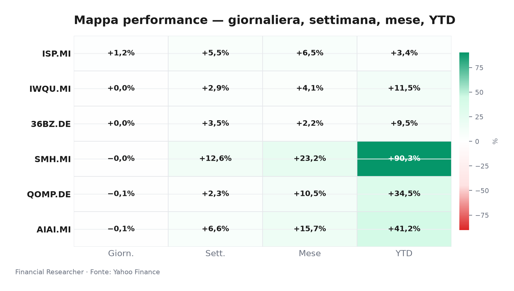
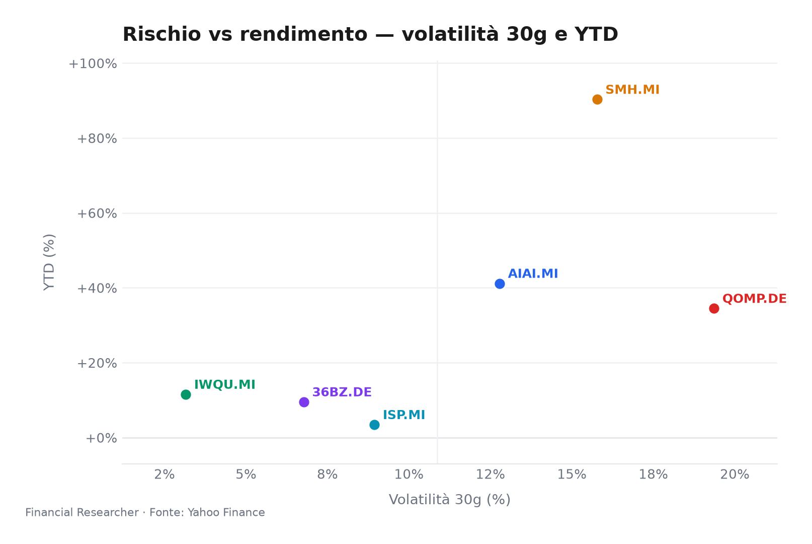
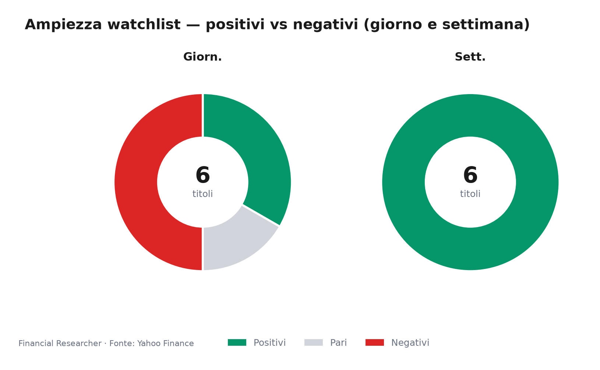
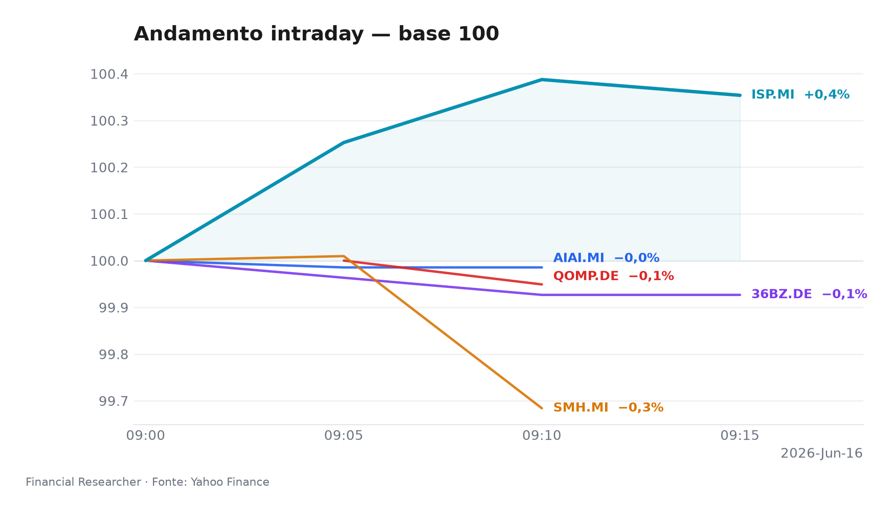
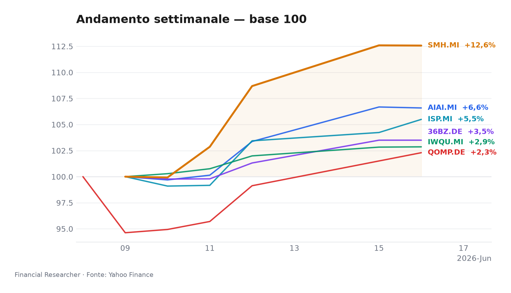

## 1. Title + mood hook
Mercato in modalità “selettivo ma ancora risk-on”: i flussi premiano i temi strutturali e la qualità bancaria, mentre il beta resta sensibile a Fed, PCE e liquidità di breve.

## 2. Executive Summary
- **L&G Artificial Intelligence UCITS ETF (AIAI.MI)** ► leggero arretramento giornaliero, ma il quadro resta costruttivo con **1D -0.09%**, **1W 6.59%** e **YTD 41.16%**; il driver resta la domanda per AI e infrastrutture, con sensibilità alta ai tassi reali e alle valutazioni elevate.[1]
- **VanEck Semiconductor UCITS ETF (SMH.MI)** ► piatta su base giornaliera ma con una traiettoria ancora nettamente superiore al mercato: **1D -0.02%**, **1W 12.57%**, **YTD 90.29%**; il supporto arriva dal ciclo AI-chip e dalla tenuta della domanda in filiera.[2]
- **iShares Edge MSCI World Quality Factor UCITS ETF USD (Acc) (IWQU.MI)** ► movimento quasi invariato con profilo difensivo in evidenza: **1D 0.03%**, **1W 2.86%**, **YTD 11.53%**; il fattore qualità continua a offrire cuscinetto in fasi di volatilità macro.[3]
- **iShares Quantum Computing UCITS ETF USD (Acc) (QOMP.DE)** ► lieve flessione giornaliera ma performance di tema ancora forte: **1D -0.05%**, **1W 2.30%**, **YTD 34.48%**; il sostegno resta narrativo e di posizionamento, con rischio elevato di drawdown se il sentiment si raffredda.[4]
- **iShares MSCI China A UCITS ETF (36BZ.DE)** ► seduta neutrale con tono costruttivo di breve: **1D 0.00%**, **1W 3.50%**, **YTD 9.51%**; il tema è ancora guidato dalla speranza di stimolo, ma frenato da deflazione e domanda interna debole.[5]
- **Intesa Sanpaolo S.p.A. (ISP.MI)** ► guida la giornata tra i sei nomi con **1D 1.21%**, **1W 5.49%** e **YTD 3.43%**; il titolo beneficia del dibattito su utili, target invariati e capacità di sostenere payout nonostante la pressione del ciclo tassi.[6]

## 3. Watchlist Performance Snapshot
Leader di seduta **Intesa Sanpaolo S.p.A. (ISP.MI)**; laggard **L&G Artificial Intelligence UCITS ETF (AIAI.MI)**, con un movimento contenuto e coerente con un’apertura post-asta concentrata.[6][1]

## 4. What's Driving the Moves
- **L&G Artificial Intelligence UCITS ETF (AIAI.MI)**: non emergono headline materiali nel prefetch; il movimento va letto come espressione di prese di beneficio tattiche dopo un forte avanzamento recente, in un contesto in cui il tema AI resta sostenuto dalla domanda infrastrutturale ma è più vulnerabile alla sensibilità sui tassi e alle valutazioni.[1][7][8]

- **VanEck Semiconductor UCITS ETF (SMH.MI)**: anche qui non c’è una notizia singola dominante nel prefetch; la tenuta relativa riflette la persistenza del ciclo AI-chip e l’idea che la domanda legata a data center, GPU e supply chain dei semiconduttori continui a reggere meglio del resto del mercato, pur con rischio geopolitico e commerciale ancora aperto.[2][7]

- **iShares Edge MSCI World Quality Factor UCITS ETF USD (Acc) (IWQU.MI)**: l’andamento piatto è coerente con un fattore che tende a proteggere quando il mercato alterna rotazioni rapide e cresce l’incertezza sui tassi; il contenuto premio giornaliero non segnala catalizzatori specifici, ma conferma la funzione di stabilizzatore del portafoglio nel breve.[3][9]

- **iShares Quantum Computing UCITS ETF USD (Acc) (QOMP.DE)**: non risultano headline materiali nel prefetch; la dinamica resta quindi soprattutto tecnica e tematica, con un posizionamento ancora guidato da aspettative di lungo termine su quantum ed enabling tech, ma con liquidità ridotta e rischio di oscillazioni amplificate.[4]

- **iShares MSCI China A UCITS ETF (36BZ.DE)**: l’assenza di una headline specifica lascia in primo piano il contesto macro: la narrativa “stimulus put” sostiene l’interesse tattico, ma il rerating resta limitato da deflazione, consumi fragili e frizioni commerciali, che impediscono al rally di trasformarsi in fiducia strutturale.[5][10]

- **Intesa Sanpaolo S.p.A. (ISP.MI)**: il driver è duplice. Da un lato, Simply Wall St segnala che il quadro degli analyst target resta invariato, quindi il mercato sta prezzando continuità e non una revisione del consenso; dall’altro, il fondo macro resta favorevole al titolo grazie a utili robusti, capitale solido e dividend story, anche se la normalizzazione dei margini da tassi BCE più bassi è un freno evidente.[6][11]

## 5. Medium-Term Outlook
- **Bull case — trigger datato 2026-06-18/2026-07-03**: se il messaggio della Fed nei prossimi appuntamenti conferma un percorso di tagli entro fine anno e i flussi su AI restano sostenuti dagli ordini di luglio, i comparti duration/AI/semis possono continuare a guidare; in questo scenario **L&G Artificial Intelligence UCITS ETF (AIAI.MI)** e **VanEck Semiconductor UCITS ETF (SMH.MI)** restano i principali beneficiari, mentre **Intesa Sanpaolo S.p.A. (ISP.MI)** trae supporto indiretto da spread più stabili e fiducia sulla remunerazione.[12][13][7]

- **Base case — trigger datato 2026-07-24**: con ECB e Fed ancora data-dependent, Q2 in pubblicazione e Cina solo gradualmente sostenuta dagli stimoli, il mercato tende a favorire qualità e visibilità sugli utili; in questo scenario **iShares Edge MSCI World Quality Factor UCITS ETF USD (Acc) (IWQU.MI)** e **Intesa Sanpaolo S.p.A. (ISP.MI)** restano i cardini difensivi, mentre **L&G Artificial Intelligence UCITS ETF (AIAI.MI)** e **VanEck Semiconductor UCITS ETF (SMH.MI)** selezionano i sottotemi con più leva sui ricavi.[11][10][9]

- **Bear case — trigger datato 2026-07-31**: se la stagione utili mostra pressione margini da tariffe o assorbimento del capex AI, e la Fed rinvia di nuovo l’allentamento, il mercato può penalizzare i temi più “long duration”; qui **iShares Quantum Computing UCITS ETF USD (Acc) (QOMP.DE)** e, in misura minore, **L&G Artificial Intelligence UCITS ETF (AIAI.MI)** risultano più esposti a de-rating, mentre **iShares Edge MSCI World Quality Factor UCITS ETF USD (Acc) (IWQU.MI)** e **Intesa Sanpaolo S.p.A. (ISP.MI)** offrono maggiore tenuta relativa.[12][8][9][11]

## 6. Event Calendar
| Date (YYYY-MM-DD) | Event | Affected tickers/themes | Impact | [N] |
|---|---|---|---|---|
| 2026-06-19 | U.S. **Juneteenth** holiday closes major U.S. markets, reducing global trading liquidity and U.S.-linked ETF price discovery. | AIAI.MI, SMH.MI, IWQU.MI, QOMP.DE, 36BZ.DE, ISP.MI; liquidity | Macro release | [11] |
| 2026-06-19 | U.S. **S&P Global Flash PMI** release is scheduled for 2026-06-19, a key read on growth and risk appetite. | IWQU.MI, 36BZ.DE, AIAI.MI; macro/risk assets | Macro release | [11] |
| 2026-06-26 | U.S. **PCE inflation** release is scheduled for 2026-06-26, a major rate-cut expectation input. | IWQU.MI, SMH.MI, QOMP.DE, 36BZ.DE; rates/sensitives | Macro release | [11] |
| 2026-07-03 | U.S. **Nonfarm Payrolls** release is scheduled for 2026-07-03, with outsized impact on rates and equity factor rotations. | IWQU.MI, SMH.MI, QOMP.DE, 36BZ.DE; labor/rates | Macro release | [11] |

## 7. Correlated Themes
- Il blocco **AI-semiconductor** resta il motore più potente della watchlist: **L&G Artificial Intelligence UCITS ETF (AIAI.MI)** e **VanEck Semiconductor UCITS ETF (SMH.MI)** si muovono in tandem quando il mercato prezza maggiore visibilità sugli investimenti in data center, calcolo e capacità produttiva.[7]
- Il tema **quality vs beta** è il secondo asse chiave: **iShares Edge MSCI World Quality Factor UCITS ETF USD (Acc) (IWQU.MI)** tende a tenere meglio nelle fasi di incertezza sui tassi, mentre i temi più lunghi e speculativi restano più vulnerabili a repricing improvvisi.[9]
- **Quantum computing** mantiene una correlazione più narrativa che fondamentale: **iShares Quantum Computing UCITS ETF USD (Acc) (QOMP.DE)** beneficia del sentiment sugli enabling technologies, ma il suo profilo di liquidità lo rende amplificatore di volatilità più che puro barometro del settore.
- **China A-shares** sono sempre più una storia di policy: **iShares MSCI China A UCITS ETF (36BZ.DE)** reagisce soprattutto a segnali di stimolo e crescita, non a una ripresa organica già consolidata.[10]
- **Intesa Sanpaolo S.p.A. (ISP.MI)** è la coda domestica del trade macro: la banca resta sensibile alla traiettoria BCE, ma il mercato continua a valorizzare capitale, utili e payout come buffer rispetto al calo graduale dei margini.[11]

## 8. Risks & Watchpoints
- **Rischio Fed/PCE**: un dato PCE più caldo del previsto o una Fed più cauta del mercato può comprimere i multipli dei temi growth e duration, con impatto immediato su **L&G Artificial Intelligence UCITS ETF (AIAI.MI)**, **VanEck Semiconductor UCITS ETF (SMH.MI)** e **iShares Quantum Computing UCITS ETF USD (Acc) (QOMP.DE)**.[12][13]
- **Rischio concentrazione narrativa**: i temi AI e quantum hanno già prezzato molta aspettativa; senza nuove prove di monetizzazione, il mercato può passare da entusiasmo a consolidamento rapido, soprattutto su strumenti tematici meno liquidi come **iShares Quantum Computing UCITS ETF USD (Acc) (QOMP.DE)**.
- **Rischio Cina**: il sostegno policy può migliorare il sentiment, ma la combinazione di deflazione e domanda interna ancora fragile limita la durata del recupero su **iShares MSCI China A UCITS ETF (36BZ.DE)**.[10]
- **Rischio margine bancario**: per **Intesa Sanpaolo S.p.A. (ISP.MI)**, il nodo non è il capitale ma la traiettoria del net interest income in un contesto di ulteriori tagli BCE; la tenuta del titolo dipende dalla capacità di assorbire questa normalizzazione senza erodere la narrativa di payout.[11]
- **Rischio liquidità estiva**: il calendario tra Juneteenth, CPI/PCE e payrolls può amplificare movimenti non lineari, con effetti più marcati sugli ETF tematici e sulle sedute di apertura a Milano.[11]

## 9. References
- [1]
- [2]
- [3]
- [4]
- [5]
- [6]
- [11]

## 10. Disclaimer
This briefing is for informational purposes only and does not constitute investment advice, a recommendation, or an offer to buy or sell any financial instrument. Market conditions, prices, and event timing may change rapidly, and readers should verify details independently before making any decision.

## Watchlist Performance Snapshot

**Leader 1D:** Intesa Sanpaolo S.p.A. (ISP.MI) (1.21%) · **Laggard 1D:** L&G Artificial Intelligence UCITS ETF (AIAI.MI) (-0.09%)

| Ref | Strumento | Ticker | Prezzo (valuta) | Giornaliera | Settimanale | Mensile | YTD | 1A | Vol. 30g | Fonte |
|-----|-----------|--------|-----------------|-------------|-------------|---------|-----|-----|--------|-------|
| [1] | L&G Artificial Intelligence UCITS ETF | AIAI.MI | 34,14 EUR | -0,09% | 6,59% | 15,69% | 41,16% | 71,09% | 12,78% | [1] |
| [2] | VanEck Semiconductor UCITS ETF | SMH.MI | 104,07 EUR | -0,02% | 12,57% | 23,16% | 90,29% | 169,75% | 15,77% | [2] |
| [3] | iShares Edge MSCI World Quality Factor UCITS ETF USD (Acc) | IWQU.MI | 75,91 EUR | 0,03% | 2,86% | 4,07% | 11,53% | 22,00% | 3,15% | [3] |
| [4] | iShares Quantum Computing UCITS ETF USD (Acc) | QOMP.DE | 5,88 EUR | -0,05% | 2,30% | 10,49% | 34,48% | 36,40% | 19,36% | [4] ⚠ |
| [5] | iShares MSCI China A UCITS ETF | 36BZ.DE | 5,45 EUR | 0,00% | 3,50% | 2,18% | 9,51% | 36,04% | 6,77% | [5] |
| [6] | Intesa Sanpaolo S.p.A. | ISP.MI | 5,96 EUR | 1,21% | 5,49% | 6,51% | 3,43% | 29,12% | 8,94% | [6] |
| — | FTSE MIB | FTSEMIB.MI | 52275,04 EUR | 0,85% | 4,11% | 6,43% | 15,21% | 30,92% | 6,14% | — |
| — | STOXX Europe 600 | ^STOXX | 636,23 EUR | 0,28% | 2,33% | 4,06% | 5,73% | 16,33% | 4,63% | — |

### Performance Charts

## References

1. Yahoo Finance — AIAI.MI (L&G Artificial Intelligence UCITS ETF) — 2026-06-16 — https://finance.yahoo.com/quote/AIAI.MI
2. Yahoo Finance — SMH.MI (VanEck Semiconductor UCITS ETF) — 2026-06-16 — https://finance.yahoo.com/quote/SMH.MI
3. Yahoo Finance — IWQU.MI (iShares Edge MSCI World Quality Factor UCITS ETF USD (Acc)) — 2026-06-16 — https://finance.yahoo.com/quote/IWQU.MI
4. Yahoo Finance — QOMP.DE (iShares Quantum Computing UCITS ETF USD (Acc)) — 2026-06-16 — https://finance.yahoo.com/quote/QOMP.DE
5. Yahoo Finance — 36BZ.DE (iShares MSCI China A UCITS ETF) — 2026-06-16 — https://finance.yahoo.com/quote/36BZ.DE
6. Yahoo Finance — ISP.MI (Intesa Sanpaolo S.p.A.) — 2026-06-16 — https://finance.yahoo.com/quote/ISP.MI
11. The Wall Street Journal — Stocks to Watch Recap: Marvell Technology, Apple, Broadcom, Strategy — 2026-06-08 — https://finance.yahoo.com/m/34a0ce12-e5d0-369b-99dd-2a53210f0376/stocks-to-watch-recap-.html

<!-- financial-researcher:run-metadata -->
## Run metadata

| | |
|---|---|
| Model profile | openrouter_auto_economy |
| Processing time | 4m 9s |
| LLM requests | 6 |
| Tokens (prompt / completion / total) | 25,684 / 17,453 / 43,137 |
| OpenRouter savings (1–10) | 4 |

**Models by agent**

| Agent | Model (configured → resolved) |
|---|---|
| Market analyst | `openrouter/openrouter/auto` → `openai/gpt-5.5-20260423` |
| News analyst | `openrouter/openrouter/auto` → `perplexity/sonar` |
| Outlook analyst | `openrouter/openrouter/auto` → `openai/gpt-5.5-20260423` |
| Calendar analyst | `openrouter/openrouter/auto` → `perplexity/sonar` |
| Chief strategist | `openrouter/openrouter/auto` → `perplexity/sonar` |
<!-- /financial-researcher:run-metadata -->
