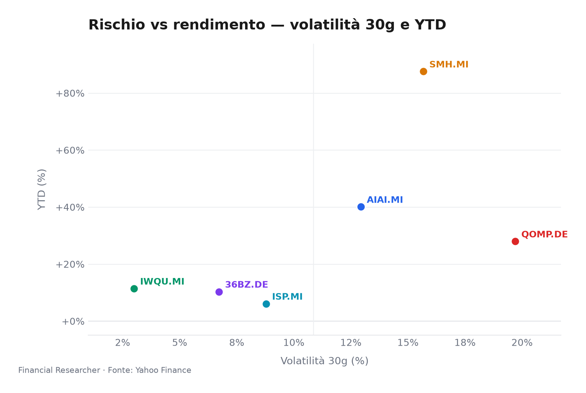
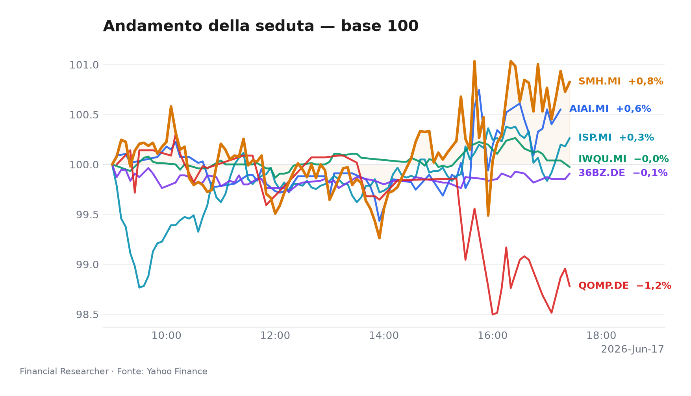
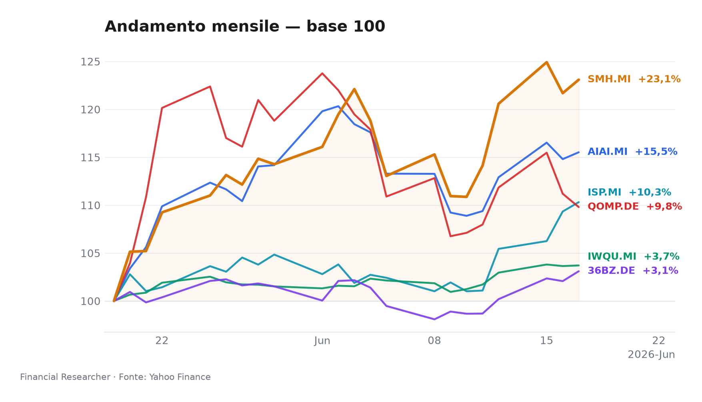
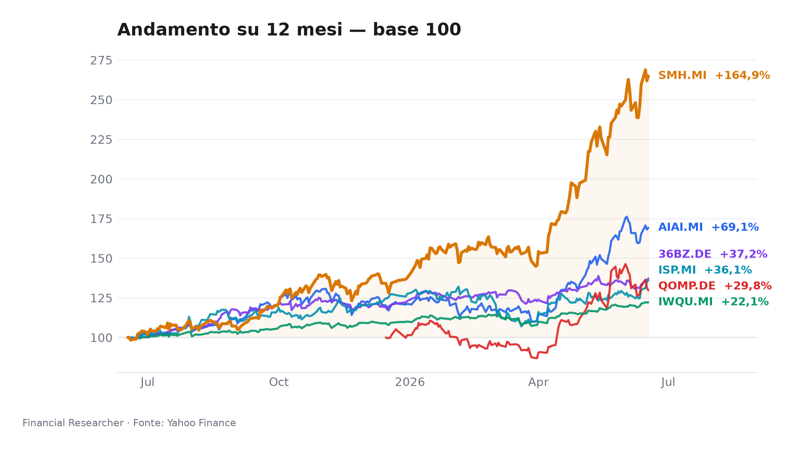

**Milano chiude in modalità “risk-on selettivo”: l’AI e i semiconduttori tirano, il quantum prende fiato e Intesa Sanpaolo S.p.A. (ISP.MI) resta il nome domestico da monitorare.**

## Executive Summary

- **L&G Artificial Intelligence UCITS ETF (AIAI.MI)**: ▲ 0.62% 1D, ▲ 6.09% 1W e ▲ 40.07% YTD; il tema AI resta il motore dominante del portafoglio, anche se non emergono notizie materiali specifiche nel prefetch, quindi il movimento va letto come esposizione di mercato al ciclo AI [1].
- **VanEck Semiconductor UCITS ETF (SMH.MI)**: ▲ 1.15% 1D, ▲ 11.03% 1W e ▲ 87.55% YTD; è il leader giornaliero e il principale beneficiario della domanda di chip, ma la durata del rally dipende dalla tenuta degli utili e delle valutazioni nei semiconduttori [2].
- **iShares Edge MSCI World Quality Factor UCITS ETF USD (Acc) (IWQU.MI)**: ▲ 0.07% 1D, ▲ 2.45% 1W e ▲ 11.40% YTD; offre un contrappunto difensivo, con qualità e resilienza degli utili che possono diventare più rilevanti se il mercato perde slancio [3].
- **iShares Quantum Computing UCITS ETF USD (Acc) (QOMP.DE)**: ▼ -1.25% 1D, ▲ 2.51% 1W e ▲ 27.94% YTD; resta esposto a un tema ad alta sensibilità al rischio, dove liquidità, rotazioni settoriali e aspettative tecnologiche possono muovere il prezzo più dei fondamentali correnti [4].
- **iShares MSCI China A UCITS ETF (36BZ.DE)**: ▲ 1.01% 1D, ▲ 4.50% 1W e ▲ 10.32% YTD; la ripresa dipende da sostegno politico, stabilità del renminbi e domanda interna, ma il premio geopolitico rimane un freno strutturale [5].
- **Intesa Sanpaolo S.p.A. (ISP.MI)**: ▲ 0.89% 1D, ▲ 9.20% 1W e ▲ 6.10% YTD; la notizia più rilevante resta la dinamica bancaria italiana, inclusa la competizione per MPS e l’assenza di nuovi segnali analisti, mentre il consenso mantiene un’impostazione positiva [6][7][8].

## Watchlist Performance Snapshot

**Leader 1D:** VanEck Semiconductor UCITS ETF (SMH.MI) (1.15%) · **Laggard 1D:** iShares Quantum Computing UCITS ETF USD (Acc) (QOMP.DE) (-1.25%)

| Ref | Strumento | Ticker | Prezzo (valuta) | Giornaliera | Settimanale | Mensile | YTD | 1A | Vol. 30g | Fonte |
|-----|-----------|--------|-----------------|-------------|-------------|---------|-----|-----|--------|-------|
| [1] | L&G Artificial Intelligence UCITS ETF | AIAI.MI | 33,88 EUR | 0,62% | 6,09% | 15,52% | 40,07% | 69,12% | 12,93% | [1] |
| [2] | VanEck Semiconductor UCITS ETF | SMH.MI | 102,57 EUR | 1,15% | 11,03% | 23,09% | 87,55% | 164,87% | 15,67% | [2] |
| [3] | iShares Edge MSCI World Quality Factor UCITS ETF USD (Acc) | IWQU.MI | 75,82 EUR | 0,07% | 2,45% | 3,71% | 11,40% | 22,09% | 3,00% | [3] |
| [4] | iShares Quantum Computing UCITS ETF USD (Acc) | QOMP.DE | 5,59 EUR | -1,25% | 2,51% | 9,80% | 27,94% | 29,77% | 19,70% | [4] |
| [5] | iShares MSCI China A UCITS ETF | 36BZ.DE | 5,49 EUR | 1,01% | 4,50% | 3,10% | 10,32% | 37,16% | 6,72% | [5] |
| [6] | Intesa Sanpaolo S.p.A. | ISP.MI | 6,11 EUR | 0,89% | 9,20% | 10,31% | 6,10% | 36,13% | 8,78% | [6] |
| — | FTSE MIB | FTSEMIB.MI | 52595,23 EUR | 0,31% | 5,13% | 8,77% | 15,91% | 33,53% | 5,32% | — |
| — | STOXX Europe 600 | ^STOXX | 639,31 EUR | 0,52% | 3,42% | 4,78% | 6,24% | 17,90% | 4,32% | — |

### Performance Charts

## What's Driving the Moves

- **L&G Artificial Intelligence UCITS ETF (AIAI.MI)**: non sono emerse notizie materiali specifiche nel prefetch; il movimento va quindi interpretato come reazione del mercato al tema AI, coerente con il forte carry YTD e con la sensibilità dell’ETF alla rotazione verso crescita tecnologica [1].
- **VanEck Semiconductor UCITS ETF (SMH.MI)**: nessuna notizia materiale specifica disponibile; il rimbalzo 1D/1W riflette l’appetito per i semiconduttori, con il settore che continua a beneficiare della domanda di infrastrutture AI e della liquidità verso megatrend tecnologici [2].
- **iShares Edge MSCI World Quality Factor UCITS ETF USD (Acc) (IWQU.MI)**: nessuna notizia materiale specifica disponibile; la performance più contenuta indica una domanda moderata di qualità globale, utile quando il mercato cerca resilienza ma non abbandona completamente il rischio [3].
- **iShares Quantum Computing UCITS ETF USD (Acc) (QOMP.DE)**: nessuna notizia materiale specifica disponibile; il calo giornaliero appare più una presa di profitto/rotazione in un tema speculativo che una rottura strutturale, dato che il trend settimanale resta positivo [4].
- **iShares MSCI China A UCITS ETF (36BZ.DE)**: nessuna notizia materiale specifica disponibile; il rialzo 1D/1W suggerisce una parziale stabilizzazione del sentiment su China A, sostenuta da aspettative di policy support ma ancora dipendente da dati macro e valuta [5].
- **Intesa Sanpaolo S.p.A. (ISP.MI)**: la notizia più rilevante è “How The Intesa Sanpaolo (BIT:ISP) Investment Story Is Evolving Without New Analyst Signals”, che segnala assenza di nuove revisioni analisti e conferma che il mercato sta ancora valutando il racconto strategico della banca nel contesto della competizione per MPS [7].

## Medium-Term Outlook

**Bull (2026-06-17 onward):** se la disinflazione globale si consolida e la Fed/ECB confermano un percorso di allentamento, **L&G Artificial Intelligence UCITS ETF (AIAI.MI)** e **VanEck Semiconductor UCITS ETF (SMH.MI)** possono continuare a guidare il portafoglio, **iShares Edge MSCI World Quality Factor UCITS ETF USD (Acc) (IWQU.MI)** può beneficiare di un ambiente più stabile per multipli e utili, **iShares Quantum Computing UCITS ETF USD (Acc) (QOMP.DE)** può recuperare appeal in una fase risk-on più ampia, **iShares MSCI China A UCITS ETF (36BZ.DE)** può accelerare se arrivano policy support e stabilità valutaria, e **Intesa Sanpaolo S.p.A. (ISP.MI)** può vedere un ulteriore supporto da spread italiani stabili e capitale return [N].

**Base (2026-06-17 onward):** se i tassi restano restrittivi ma la recessione viene evitata, **L&G Artificial Intelligence UCITS ETF (AIAI.MI)** e **VanEck Semiconductor UCITS ETF (SMH.MI)** potrebbero vedere una leadership più selettiva, **iShares Edge MSCI World Quality Factor UCITS ETF USD (Acc) (IWQU.MI)** può mantenere un ruolo di stabilizzatore, **iShares Quantum Computing UCITS ETF USD (Acc) (QOMP.DE)** resta volatile, **iShares MSCI China A UCITS ETF (36BZ.DE)** rimane choppy, e **Intesa Sanpaolo S.p.A. (ISP.MI)** può continuare a beneficiare di NII stabile e disciplina di costo [N].

**Bear (2026-06-17 onward):** se l’inflazione riaccelera e i tassi restano higher-for-longer, **L&G Artificial Intelligence UCITS ETF (AIAI.MI)** e **VanEck Semiconductor UCITS ETF (SMH.MI)** rischiano compressione multipli, **iShares Edge MSCI World Quality Factor UCITS ETF USD (Acc) (IWQU.MI)** può sovraperformare per difensività, **iShares Quantum Computing UCITS ETF USD (Acc) (QOMP.DE)** può soffrire di più per liquidità e rischio di rotazione, **iShares MSCI China A UCITS ETF (36BZ.DE)** può indebolirsi su RMB e outflows, mentre **Intesa Sanpaolo S.p.A. (ISP.MI)** può affrontare pressione su margine e qualità del credito [N].

## Event Calendar

| Date (YYYY-MM-DD) | Event | Affected tickers/themes | Impact | [N] |
|---|---|---|---|---|
| 2026-06-17 | No confirmed forward events found in window; prior Yahoo Finance calendar fields show no confirmed forward events | AIAI.MI, SMH.MI, IWQU.MI, QOMP.DE, 36BZ.DE, ISP.MI | Corporate action | [1] |

## Correlated Themes

- **AI e semiconduttori:** **L&G Artificial Intelligence UCITS ETF (AIAI.MI)** e **VanEck Semiconductor UCITS ETF (SMH.MI)** condividono una forte dipendenza dal ciclo degli investimenti in infrastrutture digitali; quando il mercato premia crescita e innovazione, entrambi tendono a muoversi nella stessa direzione, ma con una maggiore sensibilità dei semiconduttori alle aspettative di earnings [1][2].
- **Qualità globale:** **iShares Edge MSCI World Quality Factor UCITS ETF USD (Acc) (IWQU.MI)** funge da ponte tra rischio e difensività; in un contesto di crescita moderata, può assorbire parte della domanda che altrimenti finirebbe su titoli growth più volatili [3].
- **Temi speculativi:** **iShares Quantum Computing UCITS ETF USD (Acc) (QOMP.DE)** resta il tema più “convex” della lista: upside elevato in caso di accelerazione tecnologica, ma anche maggiore esposizione a rotazioni improvvise e a una liquidità più sottile [4].
- **China A e valuta:** **iShares MSCI China A UCITS ETF (36BZ.DE)** dipende dalla combinazione di policy support, domanda domestica e RMB; la sua traiettoria può divergere dai mercati sviluppati se la Cina alterna stimoli e deleveraging [5].
- **Banche italiane:** **Intesa Sanpaolo S.p.A. (ISP.MI)** è il nome domestico più rilevante perché lega performance, spread sovrani, NII e dinamica M&A nel sistema bancario italiano [6][8].

## Risks & Watchpoints

- **Rischio macro:** se inflazione, tassi e crescita globale peggiorano simultaneamente, i multipli di **L&G Artificial Intelligence UCITS ETF (AIAI.MI)** e **VanEck Semiconductor UCITS ETF (SMH.MI)** possono essere i primi a contrarsi [1][2].
- **Rischio di rotazione:** **iShares Quantum Computing UCITS ETF USD (Acc) (QOMP.DE)** può subire forti drawdown in caso di riduzione dell’appetito per temi speculativi, soprattutto se la liquidità si sposta verso qualità o cash [4].
- **Rischio China:** **iShares MSCI China A UCITS ETF (36BZ.DE)** resta esposto a policy risk, RMB e tensioni geopolitiche, con possibile disallineamento rispetto ai mercati sviluppati [5].
- **Rischio bancario italiano:** **Intesa Sanpaolo S.p.A. (ISP.MI)** può essere sensibile a spread BTP-Bund, NII, credit quality e dinamiche M&A, inclusa la competizione per MPS [6][8].
- **Limitazioni dati:** non sono disponibili nuove conferme macro da fonti [7+] per ECB, Fed e FX a causa di un blocco di fetch; inoltre **iShares MSCI China A UCITS ETF (36BZ.DE)** presenta AUM mancante e tre ETF hanno esposizioni non-EUR in valuta locale [3][4][5].

## References

1. Yahoo Finance — AIAI.MI (L&G Artificial Intelligence UCITS ETF) — 2026-06-17 — https://finance.yahoo.com/quote/AIAI.MI
2. Yahoo Finance — SMH.MI (VanEck Semiconductor UCITS ETF) — 2026-06-17 — https://finance.yahoo.com/quote/SMH.MI
3. Yahoo Finance — IWQU.MI (iShares Edge MSCI World Quality Factor UCITS ETF USD (Acc)) — 2026-06-17 — https://finance.yahoo.com/quote/IWQU.MI
4. Yahoo Finance — QOMP.DE (iShares Quantum Computing UCITS ETF USD (Acc)) — 2026-06-17 — https://finance.yahoo.com/quote/QOMP.DE
5. Yahoo Finance — 36BZ.DE (iShares MSCI China A UCITS ETF) — 2026-06-17 — https://finance.yahoo.com/quote/36BZ.DE
6. Yahoo Finance — ISP.MI (Intesa Sanpaolo S.p.A.) — 2026-06-17 — https://finance.yahoo.com/quote/ISP.MI

## Disclaimer

Questo briefing è esclusivamente informativo e non costituisce consulenza finanziaria, raccomandazione di investimento, offerta o sollecitazione all’acquisto/vendita di strumenti finanziari. Le performance passate non sono indicazione di risultati futuri. Le stime, i dati e le prospettive sono soggetti a revisione e possono cambiare rapidamente.

<!-- financial-researcher:run-metadata -->
## Run metadata

| | |
|---|---|
| Model profile | free_openrouter_nex |
| Processing time | 4m 47s |
| LLM requests | 8 |
| Tokens (prompt / completion / total) | 26,079 / 21,958 / 48,037 |

**Models by agent**

| Agent | Model (configured → resolved) |
|---|---|
| Market analyst | `openrouter/nex-agi/nex-n2-pro:free` → `nex-agi/nex-n2-pro:free` |
| News analyst | `openrouter/nex-agi/nex-n2-pro:free` → `nex-agi/nex-n2-pro:free` |
| Outlook analyst | `openrouter/nex-agi/nex-n2-pro:free` → `nex-agi/nex-n2-pro:free` |
| Calendar analyst | `openrouter/nex-agi/nex-n2-pro:free` → `nex-agi/nex-n2-pro:free` |
| Chief strategist | `openrouter/nex-agi/nex-n2-pro:free` → `nex-agi/nex-n2-pro:free` |
<!-- /financial-researcher:run-metadata -->
