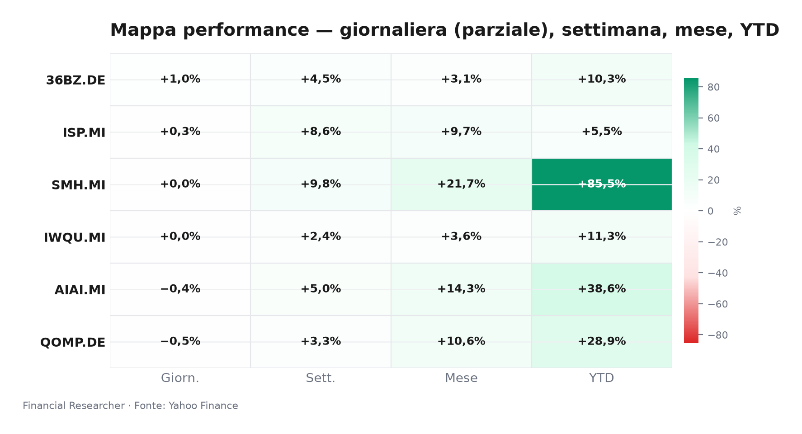
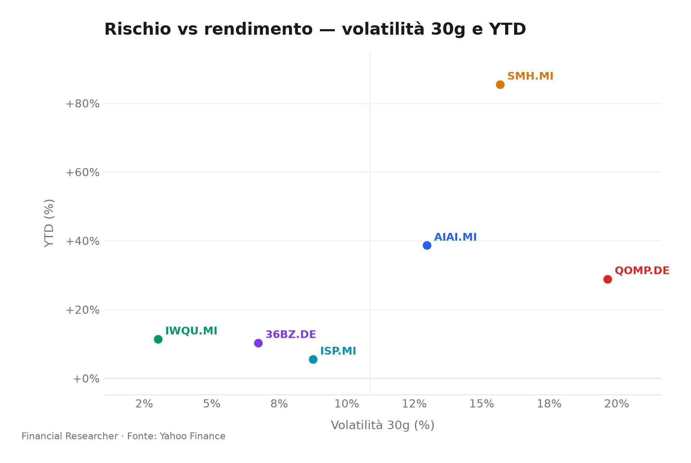
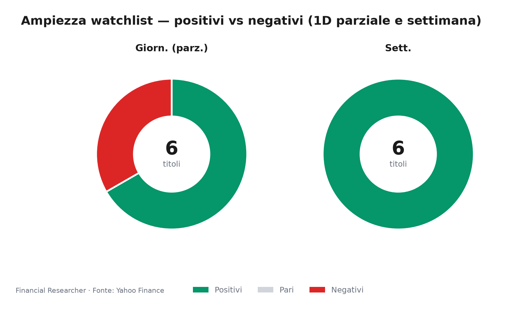
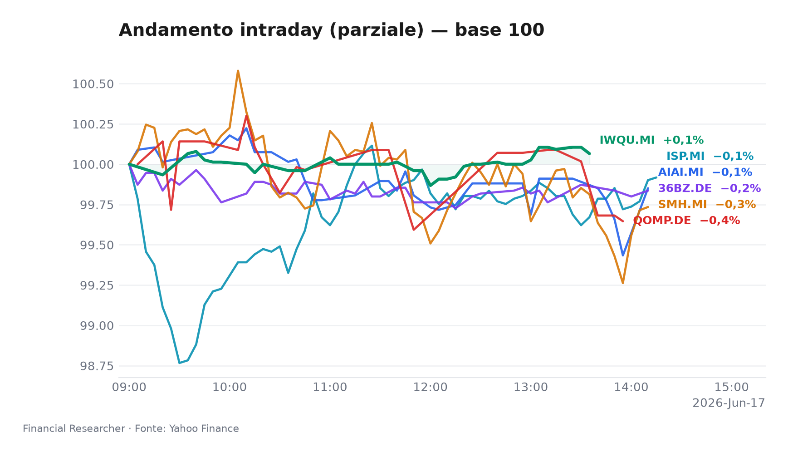
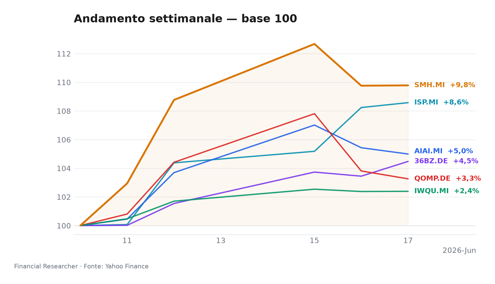

## Executive Summary

**Mercato a metà seduta: il rally tecnologico tiene, ma la rotazione cerca conferme prima del pomeriggio.**

- **L&G Artificial Intelligence UCITS ETF (AIAI.MI)**: ▼ -0.42% in 1D, ▲ +5.00% in 1W e ▲ +38.62% YTD; il tema AI resta il perno, ma la debolezza intraday segnala prese di beneficio su un paniere già molto re-rated [1].
- **VanEck Semiconductor UCITS ETF (SMH.MI)**: ▲ +0.02% in 1D, ▲ +9.79% in 1W e ▲ +85.45% YTD; è il leader assoluto su settimana e anno, trainato dalla sensibilità ai semiconduttori e all’infrastruttura AI [2].
- **iShares Edge MSCI World Quality Factor UCITS ETF USD (Acc) (IWQU.MI)**: ▲ +0.01% in 1D, ▲ +2.39% in 1W e ▲ +11.34% YTD; funziona da stabilizzatore di portafoglio se il mercato premia qualità, cash-flow e minore leva [3].
- **iShares Quantum Computing UCITS ETF USD (Acc) (QOMP.DE)**: ▼ -0.53% in 1D, ▲ +3.26% in 1W e ▲ +28.88% YTD; resta un satellite ad alta beta, più esposto a momentum e liquidità che a fondamentali immediati [4].
- **iShares MSCI China A UCITS ETF (36BZ.DE)**: ▲ +0.99% in 1D, ▲ +4.48% in 1W e ▲ +10.30% YTD; è il migliore parziale della giornata, ma il trend richiede conferme da politica fiscale, credito e flussi esteri [5].
- **Intesa Sanpaolo S.p.A. (ISP.MI)**: ▲ +0.31% in 1D, ▲ +8.58% in 1W e ▲ +5.49% YTD; il titolo reagisce alla settimana bancaria, mentre la strategia Mps e il contesto tassi definiscono il rischio/rendimento [6].

## Watchlist Performance Snapshot

**Leader 1D:** iShares MSCI China A UCITS ETF (36BZ.DE) (0.99%) · **Laggard 1D:** iShares Quantum Computing UCITS ETF USD (Acc) (QOMP.DE) (-0.53%)

| Ref | Strumento | Ticker | Prezzo (valuta) | Giornaliera | Settimanale | Mensile | YTD | 1A | Vol. 30g | Fonte |
|-----|-----------|--------|-----------------|-------------|-------------|---------|-----|-----|--------|-------|
| [1] | L&G Artificial Intelligence UCITS ETF | AIAI.MI | 33,52 EUR | -0,42% | 5,00% | 14,32% | 38,62% | 67,37% | 12,97% | [1] |
| [2] | VanEck Semiconductor UCITS ETF | SMH.MI | 101,42 EUR | 0,02% | 9,79% | 21,71% | 85,45% | 161,90% | 15,68% | [2] |
| [3] | iShares Edge MSCI World Quality Factor UCITS ETF USD (Acc) | IWQU.MI | 75,78 EUR | 0,01% | 2,39% | 3,65% | 11,34% | 22,03% | 3,01% | [3] |
| [4] | iShares Quantum Computing UCITS ETF USD (Acc) | QOMP.DE | 5,63 EUR | -0,53% | 3,26% | 10,60% | 28,88% | 30,72% | 19,66% | [4] |
| [5] | iShares MSCI China A UCITS ETF | 36BZ.DE | 5,48 EUR | 0,99% | 4,48% | 3,08% | 10,30% | 37,13% | 6,72% | [5] |
| [6] | Intesa Sanpaolo S.p.A. | ISP.MI | 6,08 EUR | 0,31% | 8,58% | 9,68% | 5,49% | 35,35% | 8,75% | [6] |
| — | FTSE MIB | FTSEMIB.MI | 52513,87 EUR | 0,16% | 4,97% | 8,60% | 15,74% | 33,33% | 5,32% | — |
| — | STOXX Europe 600 | ^STOXX | 637,92 EUR | 0,30% | 3,19% | 4,55% | 6,01% | 17,64% | 4,31% | — |

### Performance Charts

## What's Driving the Moves

- **L&G Artificial Intelligence UCITS ETF (AIAI.MI)**: nessuna notizia materiale specifica nel prefetch; il movimento va letto attraverso l’esposizione tematica AI, con 1D/1W spiegati dai dati di mercato e dal ciclo di capital expenditure in infrastruttura digitale [1]. La debolezza odierna non cancella il forte YTD, ma suggerisce che il mercato stia discriminando fra esposizione “pura” all’AI e titoli con revisioni utili più visibili.
- **VanEck Semiconductor UCITS ETF (SMH.MI)**: nessuna notizia materiale specifica nel prefetch; il rally settimanale riflette la forza dei semiconduttori, settore che resta il proxy più diretto dell’infrastruttura AI e della domanda di acceleratori [2]. Il contesto WSJ su Marvell, Apple, Broadcom e Strategy conferma che l’attenzione resta concentrata su earnings, capex e concentrazione dei megacap tech, utile sfondo ma non driver diretto dell’ETF [7].
- **iShares Edge MSCI World Quality Factor UCITS ETF USD (Acc) (IWQU.MI)**: nessuna notizia materiale specifica nel prefetch; la tenuta 1D/1W deriva dall’esposizione a società globali con profili di qualità, bilanci solidi e minori distorsioni speculative [3]. In una fase di tassi ancora incerta, **iShares Edge MSCI World Quality Factor UCITS ETF USD (Acc) (IWQU.MI)** offre un contrappunto agli ETF tematici, anche se il suo YTD resta lontano dai leader growth.
- **iShares Quantum Computing UCITS ETF USD (Acc) (QOMP.DE)**: nessuna notizia materiale specifica nel prefetch; il calo intraday va interpretato come rotazione fuori da tematiche più speculative dopo un buon 1W [4]. Il tema quantum resta strutturalmente interessante, ma l’AUM contenuto e la volatilità dei titoli hardware/software emergenti rendono **iShares Quantum Computing UCITS ETF USD (Acc) (QOMP.DE)** più sensibile al rischio di liquidità.
- **iShares MSCI China A UCITS ETF (36BZ.DE)**: nessuna notizia materiale specifica nel prefetch; il rimbalzo odierno segnala una pausa positiva nel sentiment sulle A-share, sostenuta da aspettative di supporto politico e da flussi in cerca di valuation più accessibili [5]. La forza resta però condizionale: senza dati macro, credito e property più solidi, il rialzo può restare tattico.
- **Intesa Sanpaolo S.p.A. (ISP.MI)**: lo sfondo dominante è la strategia su Mps, con **Intesa Sanpaolo S.p.A. (ISP.MI)** al centro della riorganizzazione bancaria italiana e della competizione per Monte dei Paschi [8]. Le analisi Simply Wall St. sottolineano un investment story in evoluzione senza nuovi segnali analisti, coerente con un titolo che combina dividendo, solidità patrimoniale e rischio M&A [9].

## Medium-Term Outlook

- **Bull (trigger 2026-06-18)**: se gli Stati Uniti pubblicano un CPI più morbido e il mercato anticipa tagli Fed senza riaccendere l’inflazione europea, **VanEck Semiconductor UCITS ETF (SMH.MI)** e **L&G Artificial Intelligence UCITS ETF (AIAI.MI)** possono beneficiare di tassi scontati più bassi e appetite per growth [1], [2]. **iShares MSCI China A UCITS ETF (36BZ.DE)** guadagnerebbe da risk-on e flussi esteri; **Intesa Sanpaolo S.p.A. (ISP.MI)** terrebbe meglio se i rendimenti scendono senza compressione eccessiva del margine di interesse [5], [6].
- **Base (trigger 2026-06-30)**: in uno scenario di dati alterni, tagli graduali e capex AI ancora robusto, la leadership resta concentrata su **VanEck Semiconductor UCITS ETF (SMH.MI)** e, in misura più difensiva, su **iShares Edge MSCI World Quality Factor UCITS ETF USD (Acc) (IWQU.MI)** [2], [3]. **L&G Artificial Intelligence UCITS ETF (AIAI.MI)** dovrebbe restare volatile ma positivo, mentre **iShares Quantum Computing UCITS ETF USD (Acc) (QOMP.DE)** dipenderà da nuovi annunci su partnership cloud, R&D e milestone hardware [4]. **iShares MSCI China A UCITS ETF (36BZ.DE)** richiede politiche cinesi più concrete; **Intesa Sanpaolo S.p.A. (ISP.MI)** può restare rangebound finché il dossier Mps non chiarisce tempi e condizioni [5], [6].
- **Bear (trigger 2026-07-15)**: inflazione appiccicosa, Fed hawkish e dollaro forte comprimerebbero i multipli di **L&G Artificial Intelligence UCITS ETF (AIAI.MI)**, **VanEck Semiconductor UCITS ETF (SMH.MI)** e **iShares Quantum Computing UCITS ETF USD (Acc) (QOMP.DE)** [1], [2], [4]. In questo scenario, **iShares Edge MSCI World Quality Factor UCITS ETF USD (Acc) (IWQU.MI)** avrebbe un ruolo più difensivo, ma non immune alla correzione globale; **iShares MSCI China A UCITS ETF (36BZ.DE)** soffrirebbe per flussi in uscita e RMB debole; **Intesa Sanpaolo S.p.A. (ISP.MI)** risentirebbe di yield più alti, BTP più volatili e pressione sul credito [3], [5], [6].

## Event Calendar

| Date (YYYY-MM-DD) | Event | Affected tickers/themes | Impact | [N] |
|---|---|---|---|---|
| 2026-06-17 | No confirmed forward catalysts verified for AIAI.MI, SMH.MI, IWQU.MI, QOMP.DE, 36BZ.DE, ISP.MI in 2026-06-17..2026-07-15 | Watchlist ETFs / ISP.MI | Corporate action | [7] |

## Correlated Themes

- **AI capex e semiconduttori**: **L&G Artificial Intelligence UCITS ETF (AIAI.MI)** e **VanEck Semiconductor UCITS ETF (SMH.MI)** restano esposti allo stesso ciclo di spesa, ma con profili diversi: il primo cattura l’ecosistema AI più ampio, il secondo concentra il rischio su chip, foundry e attrezzature [1], [2].
- **Qualità globale vs growth speculativo**: **iShares Edge MSCI World Quality Factor UCITS ETF USD (Acc) (IWQU.MI)** e **iShares Quantum Computing UCITS ETF USD (Acc) (QOMP.DE)** rappresentano due estremi della curva rischio/rendimento: cash-flow consolidati contro opzioni tecnologiche a lungo termine [3], [4].
- **China policy beta**: **iShares MSCI China A UCITS ETF (36BZ.DE)** reagisce a stimoli fiscali, credito immobiliare e stabilità del renminbi; il suo rimbalzo può coesistere con una rotazione globale se gli investitori cercano valuation arretrate [5].
- **Banche italiane e M&A**: **Intesa Sanpaolo S.p.A. (ISP.MI)** resta il proxy più liquido della qualità bancaria italiana, ma il premio riflette anche l’esecuzione del dossier Mps, dividendi e sensibilità ai tassi [6], [8].

## Risks & Watchpoints

- **Tassi e dollaro**: dati Eurozona/USA più caldi possono rafforzare il dollaro e alzare i rendimenti reali, penalizzando growth, AI, quantum e China A-share [1], [2], [4], [5].
- **Concentrazione AI/semiconduttori**: **VanEck Semiconductor UCITS ETF (SMH.MI)** e **L&G Artificial Intelligence UCITS ETF (AIAI.MI)** dipendono da poche traiettorie di earnings; delusioni su capex o export controls possono generare correzioni rapide [1], [2].
- **Liquidità tematica**: **iShares Quantum Computing UCITS ETF USD (Acc) (QOMP.DE)** ha AUM contenuto e beta elevato; in fasi di de-risking, spread e drawdown possono amplificare il movimento [4].
- **Rischio Cina**: **iShares MSCI China A UCITS ETF (36BZ.DE)** può rimbalzare senza trend se policy, property e flussi esteri non confermano la ripresa [5].
- **Esecuzione M&A bancario**: **Intesa Sanpaolo S.p.A. (ISP.MI)** deve trasformare l’opportunità Mps in valore senza deteriorare capitale, dividendi o disciplina sui costi [6], [8].
- **Dati incompleti di metà seduta**: le performance 1D sono parziali e non vanno annualizzate; per ETF in USD share class, il cambio EUR/USD può incidere sulla lettura del rendimento [3], [4].

## Disclaimer

Il presente documento è redatto a scopo informativo per il ruolo di chief strategist e non costituisce consulenza finanziaria, sollecitazione all’investimento, offerta, raccomandazione personalizzata o indicazione di buy/sell/hold. Le performance sono dati di mercato parziali o storici e non garantiscono risultati futuri. Le notizie citate sono contesto di ricerca; gli eventi possono cambiare rapidamente e richiedono aggiornamento prima di ogni decisione di portafoglio.

## References

1. Yahoo Finance — AIAI.MI (L&G Artificial Intelligence UCITS ETF) — 2026-06-17 — https://finance.yahoo.com/quote/AIAI.MI
2. Yahoo Finance — SMH.MI (VanEck Semiconductor UCITS ETF) — 2026-06-17 — https://finance.yahoo.com/quote/SMH.MI
3. Yahoo Finance — IWQU.MI (iShares Edge MSCI World Quality Factor UCITS ETF USD (Acc)) — 2026-06-17 — https://finance.yahoo.com/quote/IWQU.MI
4. Yahoo Finance — QOMP.DE (iShares Quantum Computing UCITS ETF USD (Acc)) — 2026-06-17 — https://finance.yahoo.com/quote/QOMP.DE
5. Yahoo Finance — 36BZ.DE (iShares MSCI China A UCITS ETF) — 2026-06-17 — https://finance.yahoo.com/quote/36BZ.DE
6. Yahoo Finance — ISP.MI (Intesa Sanpaolo S.p.A.) — 2026-06-17 — https://finance.yahoo.com/quote/ISP.MI
7. The Wall Street Journal — Stocks to Watch Recap: Marvell Technology, Apple, Broadcom, Strategy — 2026-06-08 — https://finance.yahoo.com/m/34a0ce12-e5d0-369b-99dd-2a53210f0376/stocks-to-watch-recap-.html

<!-- financial-researcher:run-metadata -->
## Run metadata

| | |
|---|---|
| Model profile | free_openrouter_nex |
| Processing time | 7m 7s |
| LLM requests | 6 |
| Tokens (prompt / completion / total) | 18,583 / 28,220 / 46,803 |

**Models by agent**

| Agent | Model (configured → resolved) |
|---|---|
| Market analyst | `openrouter/nex-agi/nex-n2-pro:free` → `nex-agi/nex-n2-pro:free` |
| News analyst | `openrouter/nex-agi/nex-n2-pro:free` → `nex-agi/nex-n2-pro:free` |
| Outlook analyst | `openrouter/nex-agi/nex-n2-pro:free` → `nex-agi/nex-n2-pro:free` |
| Calendar analyst | `openrouter/nex-agi/nex-n2-pro:free` → `nex-agi/nex-n2-pro:free` |
| Chief strategist | `openrouter/nex-agi/nex-n2-pro:free` → `nex-agi/nex-n2-pro:free` |
<!-- /financial-researcher:run-metadata -->
