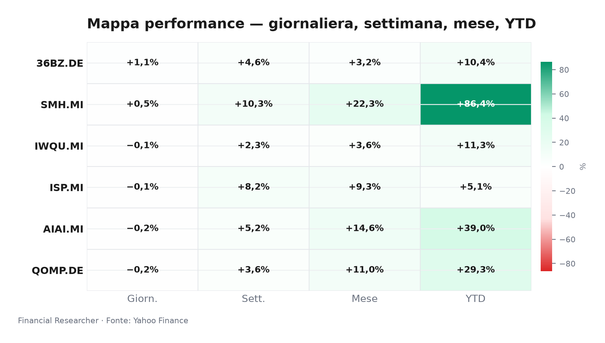
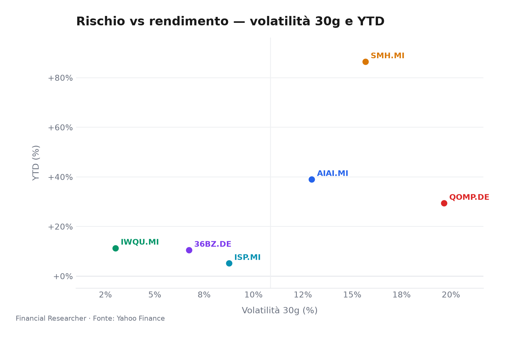
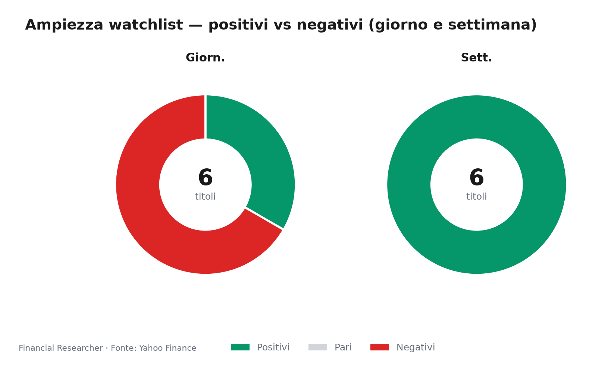
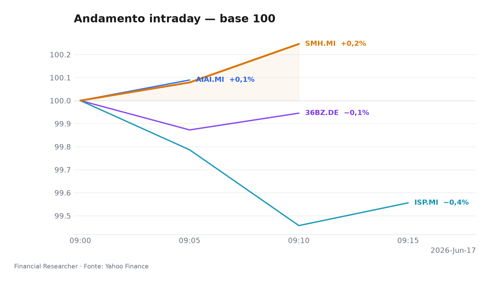
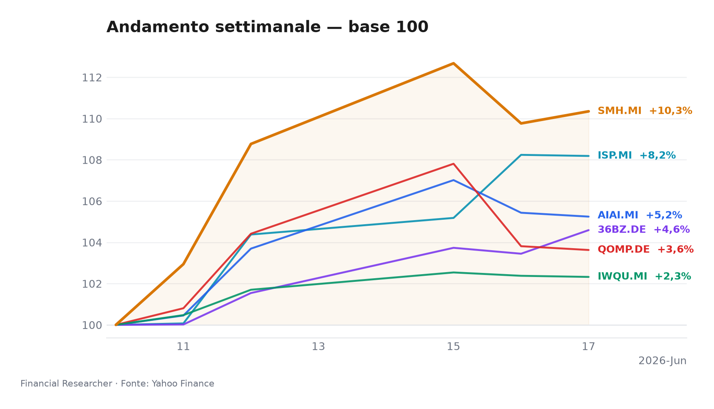

## Title + mood hook
Milan opens with a split personality: tech and China A-share momentum pulse higher, while quality and AI funds pause after a powerful year-to-date run.

## Executive Summary
- **VanEck Semiconductor UCITS ETF (SMH.MI)** leads the watchlist with a ▲ +10.35% one-week move and ▲ +86.40% year-to-date gain, as semiconductor exposure remains the cleanest expression of global AI capex strength; the only caution is valuation sensitivity after a parabolic run [2].
- **iShares MSCI China A UCITS ETF (36BZ.DE)** is the post-open 1D leader at ▲ +1.10%, helped by China A-share beta and a weaker local starting point after mixed macro data; this is a tactical rebound signal, not yet proof of a sustained China rerating [5].
- **Intesa Sanpaolo S.p.A. (ISP.MI)** is the most idiosyncratic name in the Milan lens: the 1D print is flat at ▼ -0.05%, but the ▲ +8.19% one-week move reflects M&A, capital and shareholder-return expectations rather than ordinary rate beta [6].
- **L&G Artificial Intelligence UCITS ETF (AIAI.MI)** posts a modest ▼ -0.18% 1D move after an impressive ▲ +5.25% week and ▲ +38.95% YTD return, suggesting profit-taking in AI-linked assets rather than a change in the structural AI demand thesis [1].
- **iShares Quantum Computing UCITS ETF USD (Acc) (QOMP.DE)** is tied for the weakest 1D print at ▼ -0.18%, despite a ▲ +3.63% week and ▲ +29.34% YTD move; liquidity and thematic concentration keep the risk premium elevated [4].
- **iShares Edge MSCI World Quality Factor UCITS ETF USD (Acc) (IWQU.MI)** is the steadier ballast at ▼ -0.05% 1D, ▲ +2.32% 1W and ▲ +11.27% YTD; it benefits from quality exposure, but USD translation and high US yields can cap upside [3].

## Watchlist Performance Snapshot

**Leader 1D:** iShares MSCI China A UCITS ETF (36BZ.DE) (1.10%) · **Laggard 1D:** iShares Quantum Computing UCITS ETF USD (Acc) (QOMP.DE) (-0.18%)

| Ref | Strumento | Ticker | Prezzo (valuta) | Giornaliera | Settimanale | Mensile | YTD | 1A | Vol. 30g | Fonte |
|-----|-----------|--------|-----------------|-------------|-------------|---------|-----|-----|--------|-------|
| [1] | L&G Artificial Intelligence UCITS ETF | AIAI.MI | 33,60 EUR | -0,18% | 5,25% | 14,60% | 38,95% | 67,77% | 12,95% | [1] |
| [2] | VanEck Semiconductor UCITS ETF | SMH.MI | 101,94 EUR | 0,53% | 10,35% | 22,33% | 86,40% | 163,24% | 15,67% | [2] |
| [3] | iShares Edge MSCI World Quality Factor UCITS ETF USD (Acc) | IWQU.MI | 75,73 EUR | -0,05% | 2,32% | 3,58% | 11,27% | 21,95% | 3,01% | [3] |
| [4] | iShares Quantum Computing UCITS ETF USD (Acc) | QOMP.DE | 5,65 EUR | -0,18% | 3,63% | 10,99% | 29,34% | 31,18% | 19,65% | [4] |
| [5] | iShares MSCI China A UCITS ETF | 36BZ.DE | 5,49 EUR | 1,10% | 4,59% | 3,20% | 10,42% | 37,28% | 6,73% | [5] |
| [6] | Intesa Sanpaolo S.p.A. | ISP.MI | 6,05 EUR | -0,05% | 8,19% | 9,28% | 5,11% | 34,86% | 8,76% | [6] |
| — | FTSE MIB | FTSEMIB.MI | 52382,90 EUR | -0,09% | 4,71% | 8,33% | 15,45% | 33,00% | 5,33% | — |
| — | STOXX Europe 600 | ^STOXX | 636,52 EUR | 0,08% | 2,97% | 4,32% | 5,78% | 17,38% | 4,31% | — |

### Performance Charts

## What's Driving the Moves
- **L&G Artificial Intelligence UCITS ETF (AIAI.MI)**: no issuer-specific material headline was found in the prefetch; the 1D and 1W move is best read through AI-theme exposure and post-open noise, with the ETF’s strong YTD profile indicating that investors are still willing to own the AI capex cycle despite short-term pauses [1].
- **VanEck Semiconductor UCITS ETF (SMH.MI)**: no issuer-specific material headline was found in the prefetch; the move is driven by semiconductor beta, where AI infrastructure demand, Nvidia/TSMC strength and tight supply-chain expectations continue to support the asset class, while ASML and export-control headlines remain the key swing factors [2].
- **iShares Edge MSCI World Quality Factor UCITS ETF USD (Acc) (IWQU.MI)**: no issuer-specific material headline was found in the prefetch; the muted 1D move reflects quality’s defensive role as ECB easing supports duration, while the ETF’s USD exposure means stronger dollar conditions can offset some global equity strength [3].
- **iShares Quantum Computing UCITS ETF USD (Acc) (QOMP.DE)**: no issuer-specific material headline was found in the prefetch; the post-open dip is consistent with a thematic, liquidity-sensitive product where funding milestones and technical breakthroughs matter more than near-term earnings visibility [4].
- **iShares MSCI China A UCITS ETF (36BZ.DE)**: no issuer-specific material headline was found in the prefetch; the 1D outperformance reflects China A-share rebound dynamics, while the medium-term setup still depends on fiscal support, property stabilization and RMB direction after mixed May data and unchanged LPRs [5].
- **Intesa Sanpaolo S.p.A. (ISP.MI)**: the relevant material context is M&A and analyst-story evolution, including the June 10 Simply Wall St. headline “How The Intesa Sanpaolo (BIT:ISP) Investment Story Is Evolving Without New Analyst Signals”; the stock’s recent strength is being shaped by the Monte dei Paschi bid, capital strength and shareholder-return expectations, while ECB cuts reduce net-interest-income upside [6][7].

## Medium-Term Outlook
- **Bull case — H2 2026**: **VanEck Semiconductor UCITS ETF (SMH.MI)** and **L&G Artificial Intelligence UCITS ETF (AIAI.MI)** benefit if US inflation cools, the Fed turns dovish and AI earnings confirm capex durability; **Intesa Sanpaolo S.p.A. (ISP.MI)** benefits if ECB easing lands with resilient euro-area growth, contained credit costs and continued capital returns; **iShares MSCI China A UCITS ETF (36BZ.DE)** rerates if China delivers a credible fiscal/property package and the RMB stabilises [1][2][8][9].
- **Base case — H2 2026**: ECB easing remains gradual and the Fed stays on hold, leaving **iShares Edge MSCI World Quality Factor UCITS ETF USD (Acc) (IWQU.MI)** and **iShares Quantum Computing UCITS ETF USD (Acc) (QOMP.DE)** range-bound to moderately positive; **VanEck Semiconductor UCITS ETF (SMH.MI)** remains a leadership candidate but needs earnings confirmation, while **Intesa Sanpaolo S.p.A. (ISP.MI)** digests lower NII tailwinds and **iShares MSCI China A UCITS ETF (36BZ.DE)** remains policy-sensitive rather than self-sustaining [1][2][4][5][6].
- **Bear case — H2 2026**: US CPI re-accelerates and the Fed turns hawkish, lifting yields and the dollar; that pressures **L&G Artificial Intelligence UCITS ETF (AIAI.MI)**, **VanEck Semiconductor UCITS ETF (SMH.MI)**, **iShares Edge MSCI World Quality Factor UCITS ETF USD (Acc) (IWQU.MI)** and **iShares Quantum Computing UCITS ETF USD (Acc) (QOMP.DE)** through multiple compression, while weaker China stimulus or RMB depreciation would hurt **iShares MSCI China A UCITS ETF (36BZ.DE)** and tighter export controls would hit semiconductor-linked assets [2][3][5][6][8][9].

## Event Calendar
| Date (YYYY-MM-DD) | Event | Affected tickers/themes | Impact | [N] |
|---|---|---|---|---|
| 2026-06-17 | ECB monetary policy meeting begins | ISP.MI; rates-sensitive ETFs AIAI.MI, SMH.MI, IWQU.MI, QOMP.DE | Central bank | https://www.ecb.europa.eu/press/calendars/mopo/html/index.en.html |
| 2026-06-18 | ECB monetary policy meeting / rate decision | ISP.MI; EUR rates, European quality/growth ETFs | Central bank | https://www.ecb.europa.eu/press/calendars/mopo/html/index.en.html |
| 2026-07-14 | US CPI release, June 2026 | AIAI.MI, SMH.MI, IWQU.MI, QOMP.DE; USD/rates-sensitive growth assets | Macro release | https://www.bls.gov/schedule/news_release/cpi.htm |
| 2026-07-14 | US PPI release, June 2026 | SMH.MI, AIAI.MI, IWQU.MI, QOMP.DE; inflation/rates sensitivity | Macro release | https://www.bls.gov/schedule/news_release/ppi.htm |
| 2026-07-15 | US Advance Retail Sales report, June 2026 | AIAI.MI, IWQU.MI, QOMP.DE; global growth/risk appetite | Macro release | https://www.census.gov/retail/marts/www/schedule.html |

## Correlated Themes
- AI capex is the common denominator for **L&G Artificial Intelligence UCITS ETF (AIAI.MI)** and **VanEck Semiconductor UCITS ETF (SMH.MI)**; the theme remains powerful, but the risk is that expectations move faster than earnings.
- Quality and duration are linked through **iShares Edge MSCI World Quality Factor UCITS ETF USD (Acc) (IWQU.MI)**: ECB cuts support defensive equity leadership, but sticky US inflation and a stronger dollar limit the benefit.
- China A-share exposure in **iShares MSCI China A UCITS ETF (36BZ.DE)** is a policy trade first and a valuation trade second; without stimulus follow-through, rebounds can fade quickly.
- Quantum computing in **iShares Quantum Computing UCITS ETF USD (Acc) (QOMP.DE)** remains a structural optionality theme, where technical milestones matter more than current revenue visibility.
- Italian bank sentiment around **Intesa Sanpaolo S.p.A. (ISP.MI)** is tied to M&A, capital discipline and the fading net-interest-income tailwind from ECB easing.

## Risks & Watchpoints
- **Data limitation**: post-open prints are noisy because volumes are auction-concentrated; the 09:30 snapshot should not be overread as an intraday trend.
- **FX risk**: **iShares Edge MSCI World Quality Factor UCITS ETF USD (Acc) (IWQU.MI)**, **iShares Quantum Computing UCITS ETF USD (Acc) (QOMP.DE)** and **iShares MSCI China A UCITS ETF (36BZ.DE)** carry USD or CNY translation risk that can distort EUR-traded returns.
- **Policy risk**: ECB easing supports banks and quality, but if the Fed stays hawkish the dollar can rise and pressure growth assets.
- **Thematic concentration**: **L&G Artificial Intelligence UCITS ETF (AIAI.MI)**, **VanEck Semiconductor UCITS ETF (SMH.MI)** and **iShares Quantum Computing UCITS ETF USD (Acc) (QOMP.DE)** are exposed to valuation compression if AI capex or quantum milestones disappoint.
- **M&A execution risk**: **Intesa Sanpaolo S.p.A. (ISP.MI)** could face integration, regulatory or capital-allocation concerns if the Monte dei Paschi bid becomes more complex.

## Disclaimer
This briefing is for information only and does not constitute investment advice, a recommendation, or an offer to buy or sell any instrument. All figures are based on the supplied post-open data and may change rapidly.

## References

1. Yahoo Finance — AIAI.MI (L&G Artificial Intelligence UCITS ETF) — 2026-06-17 — https://finance.yahoo.com/quote/AIAI.MI
2. Yahoo Finance — SMH.MI (VanEck Semiconductor UCITS ETF) — 2026-06-17 — https://finance.yahoo.com/quote/SMH.MI
3. Yahoo Finance — IWQU.MI (iShares Edge MSCI World Quality Factor UCITS ETF USD (Acc)) — 2026-06-17 — https://finance.yahoo.com/quote/IWQU.MI
4. Yahoo Finance — QOMP.DE (iShares Quantum Computing UCITS ETF USD (Acc)) — 2026-06-17 — https://finance.yahoo.com/quote/QOMP.DE
5. Yahoo Finance — 36BZ.DE (iShares MSCI China A UCITS ETF) — 2026-06-17 — https://finance.yahoo.com/quote/36BZ.DE
6. Yahoo Finance — ISP.MI (Intesa Sanpaolo S.p.A.) — 2026-06-17 — https://finance.yahoo.com/quote/ISP.MI
7. The Wall Street Journal — Stocks to Watch Recap: Marvell Technology, Apple, Broadcom, Strategy — 2026-06-08 — https://finance.yahoo.com/m/34a0ce12-e5d0-369b-99dd-2a53210f0376/stocks-to-watch-recap-.html

<!-- financial-researcher:run-metadata -->
## Run metadata

| | |
|---|---|
| Model profile | free_openrouter_nex |
| Processing time | 5m 48s |
| LLM requests | 6 |
| Tokens (prompt / completion / total) | 17,416 / 26,425 / 43,841 |

**Models by agent**

| Agent | Model (configured → resolved) |
|---|---|
| Market analyst | `openrouter/nex-agi/nex-n2-pro:free` → `nex-agi/nex-n2-pro:free` |
| News analyst | `openrouter/nex-agi/nex-n2-pro:free` → `nex-agi/nex-n2-pro:free` |
| Outlook analyst | `openrouter/nex-agi/nex-n2-pro:free` → `nex-agi/nex-n2-pro:free` |
| Calendar analyst | `openrouter/nex-agi/nex-n2-pro:free` → `nex-agi/nex-n2-pro:free` |
| Chief strategist | `openrouter/nex-agi/nex-n2-pro:free` → `nex-agi/nex-n2-pro:free` |
<!-- /financial-researcher:run-metadata -->
