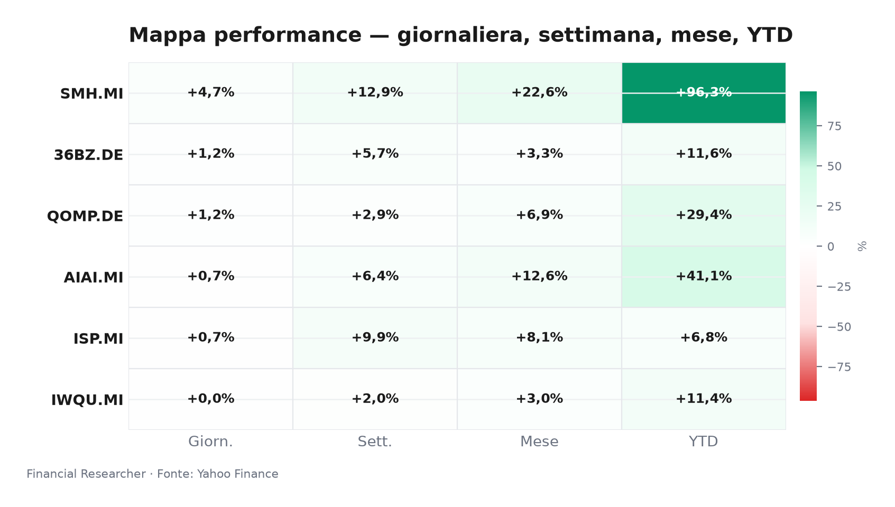
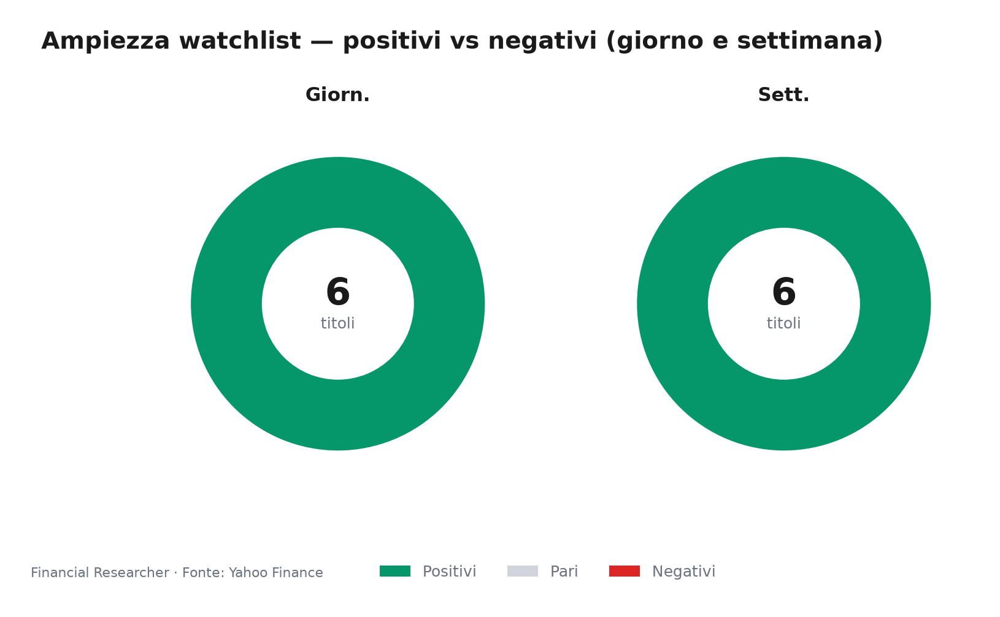
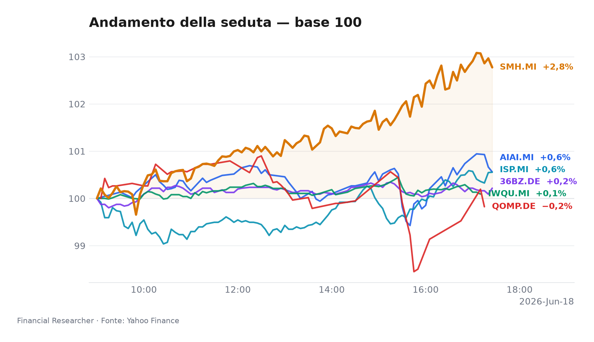
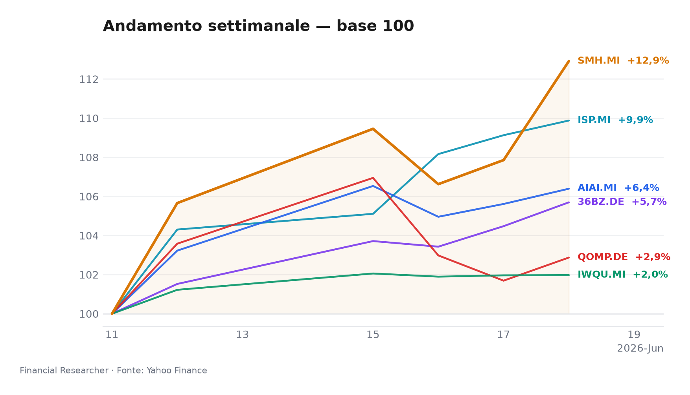
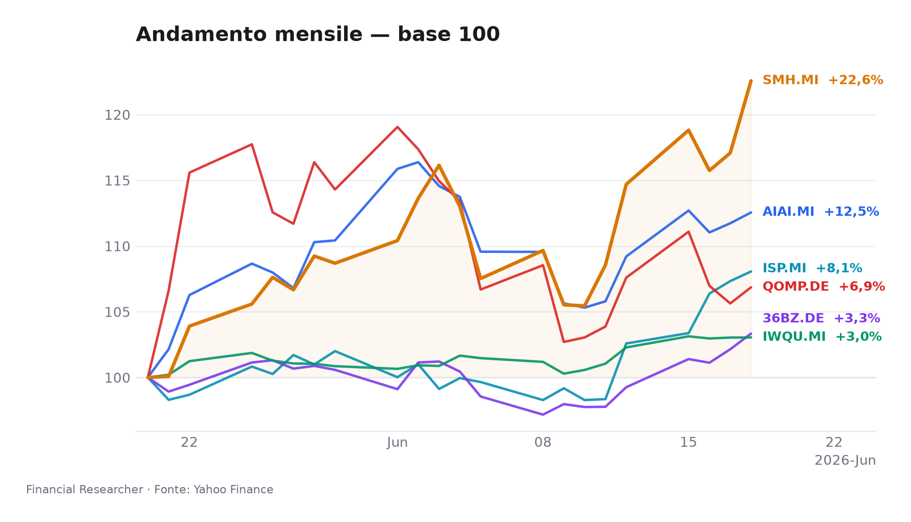
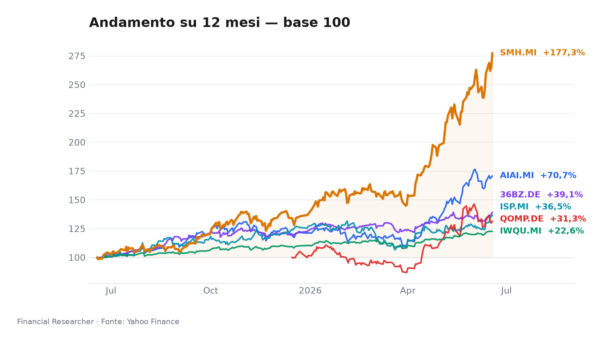

# Watchlist Milano: tecnologia sprinta, qualità attende

*Mercato: rischio selettivo — i semiconduttori corrono, la quality trattiene il respiro e Intesa Sanpaolo negozia il premio M&A.*

## Executive Summary

- **L&G Artificial Intelligence UCITS ETF (AIAI.MI)**: ▲ 1D +0.74%, 1W +6.39%, YTD +41.10% [1]. Impact NONE: nessuna notizia materiale nel prefetch; il driver resta il tema AI/semiconduttori, non un catalyst issuer-specific.
- **VanEck Semiconductor UCITS ETF (SMH.MI)**: ▲ 1D +4.69%, 1W +12.91%, YTD +96.34% [2]. Impact NONE: leader della watchlist; il WSJ segue Marvell, Apple, Broadcom e Strategy come contesto tematico, non come notizia ETF-specific [7].
- **iShares Edge MSCI World Quality Factor UCITS ETF USD (Acc) (IWQU.MI)**: ▲ 1D +0.01%, 1W +1.98%, YTD +11.42% [3]. Impact NONE: qualità difensiva, beta contenuto e rendimenti EUR che incorporano FX USD.
- **iShares Quantum Computing UCITS ETF USD (Acc) (QOMP.DE)**: ▲ 1D +1.16%, 1W +2.87%, YTD +29.43% [4]. Impact NONE: nessun catalyst issuer; movimento coerente con appetite per innovazione di lungo ciclo.
- **iShares MSCI China A UCITS ETF (36BZ.DE)**: ▲ 1D +1.17%, 1W +5.70%, YTD +11.60% [5]. Impact NONE: rimbalzo China A legato a liquidità/risk-on; AUM non disponibile nel set.
- **Intesa Sanpaolo S.p.A. (ISP.MI)**: ▲ 1D +0.69%, 1W +9.88%, YTD +6.83% [6]. Impact MEDIUM: Simply Wall St valuta la debolezza recente [8] e Euronews riporta il bid Mps/merger a dicembre 2026 [9]; entrambe sono BACKGROUND, non causalità intraday.

## Watchlist Performance Snapshot

**Leader 1D:** VanEck Semiconductor UCITS ETF (SMH.MI) (4.69%) · **Laggard 1D:** iShares Edge MSCI World Quality Factor UCITS ETF USD (Acc) (IWQU.MI) (0.01%)

| Ref | Strumento | Ticker | Prezzo (valuta) | Giornaliera | Settimanale | Mensile | YTD | 1A | Vol. 30g | Fonte |
|-----|-----------|--------|-----------------|-------------|-------------|---------|-----|-----|--------|-------|
| [1] | L&G Artificial Intelligence UCITS ETF | AIAI.MI | 34,12 EUR | 0,74% | 6,39% | 12,55% | 41,10% | 70,66% | 12,67% | [1] |
| [2] | VanEck Semiconductor UCITS ETF | SMH.MI | 107,38 EUR | 4,69% | 12,91% | 22,57% | 96,34% | 177,29% | 16,15% | [2] |
| [3] | iShares Edge MSCI World Quality Factor UCITS ETF USD (Acc) | IWQU.MI | 75,83 EUR | 0,01% | 1,98% | 3,04% | 11,42% | 22,56% | 3,00% | [3] |
| [4] | iShares Quantum Computing UCITS ETF USD (Acc) | QOMP.DE | 5,66 EUR | 1,16% | 2,87% | 6,86% | 29,43% | 31,28% | 19,71% | [4] |
| [5] | iShares MSCI China A UCITS ETF | 36BZ.DE | 5,55 EUR | 1,17% | 5,70% | 3,33% | 11,60% | 39,09% | 6,79% | [5] |
| [6] | Intesa Sanpaolo S.p.A. | ISP.MI | 6,15 EUR | 0,69% | 9,88% | 8,06% | 6,83% | 36,47% | 8,78% | [6] |
| — | FTSE MIB | FTSEMIB.MI | 52688,22 EUR | 0,49% | 4,32% | 7,13% | 16,12% | 33,66% | 5,22% | — |
| — | STOXX Europe 600 | ^STOXX | 637,14 EUR | -0,34% | 2,51% | 4,22% | 5,88% | 17,92% | 4,32% | — |

### Performance Charts

## What's Driving the Moves

- **L&G Artificial Intelligence UCITS ETF (AIAI.MI)** — Impact NONE. Nessuna headline materiale; con dati Yahoo [1], la lettura più pulita è tema/mercato: il basket AI/semiconduttori ha sostenuto il rimbalzo 1D/1W, ma non c’è una causa news-specific da attribuire alla seduta.
- **VanEck Semiconductor UCITS ETF (SMH.MI)** — Impact NONE. Nessuna notizia ETF-specific; il contesto WSJ su Marvell, Apple, Broadcom e Strategy conferma che il semiconduttore è il centro narrativo [7], mentre i dati di mercato spiegano il rimbalzo 1D/1W senza trasformarlo in causalità issuer [2].
- **iShares Edge MSCI World Quality Factor UCITS ETF USD (Acc) (IWQU.MI)** — Impact NONE. Nessuna headline materiale; la forza moderata 1D/1W riflette qualità globale e minore beta, con rendimenti EUR esposti a USD [3].
- **iShares Quantum Computing UCITS ETF USD (Acc) (QOMP.DE)** — Impact NONE. Nessun catalyst materiale; il movimento 1D/1W è una lettura di rischio tematico su quantum computing, non un evento societario [4].
- **iShares MSCI China A UCITS ETF (36BZ.DE)** — Impact NONE. Nessuna headline materiale; il rimbalzo 1D/1W va interpretato come China A/risk-on, con cautela perché AUM non disponibile [5].
- **Intesa Sanpaolo S.p.A. (ISP.MI)** — Impact MEDIUM. Il titolo da registrare è “Assessing Intesa Sanpaolo (BIT:ISP) Valuation After Recent Share Price Weakness” del 2026-06-11 [8]; il bid Mps/merger a dicembre 2026 resta BACKGROUND [9]. La seduta resta guidata da mercato bancario, capital return e pricing del deal, non da una singola news intraday.

## Medium-Term Outlook

Scenario base: crescita selettiva, tassi come filtro, M&A bancario come premio idiosincratico.

- **L&G Artificial Intelligence UCITS ETF (AIAI.MI)**: Bull se CPI 2026-07-14 e PPI 2026-07-15 raffreddano i rendimenti e l’AI capex si allarga; Base se i tassi restano in range; Bear se l’inflazione riaccelera e comprime i multipli growth.
- **VanEck Semiconductor UCITS ETF (SMH.MI)**: Bull se i nomi citati dal WSJ confermano domanda e margini [7]; Base se il settore resta forte ma volatile; Bear se CPI/PPI sorpendono al rialzo o riemergono vincoli export.
- **iShares Edge MSCI World Quality Factor UCITS ETF USD (Acc) (IWQU.MI)**: Bull se retail sales 2026-07-16 segnala rallentamento e premia qualità; Base se il fattore resta stabile; Bear se USD e tassi salgono insieme.
- **iShares Quantum Computing UCITS ETF USD (Acc) (QOMP.DE)**: Bull se funding, policy o partnership riducono il rischio “story stock”; Base se resta volatile e selettivo; Bear se il risk-off penalizza temi di lungo ciclo.
- **iShares MSCI China A UCITS ETF (36BZ.DE)**: Bull se liquidità e policy cinesi sostengono China A; Base se il rally resta dipendente dal sentiment; Bear se il rischio globale si raffredda dopo i dati USA 14-16 luglio.
- **Intesa Sanpaolo S.p.A. (ISP.MI)**: Bull se l’esecuzione Mps resta credibile verso dicembre 2026 [9]; Base se regolatori e capitale assorbono parte del premio; Bear se asset quality, integrazione o diluizione pesano sulla narrativa [8].

## Event Calendar

Prossimi trigger macro: inflazione e consumi USA, con canali ufficiali indicati nella tabella.

| Date (YYYY-MM-DD) | Event | Affected tickers/themes | Impact | [N] |
|---|---|---|---|---|
| 2026-07-14 | U.S. CPI inflation report, June 2026 | AIAI.MI, SMH.MI, IWQU.MI, QOMP.DE, 36BZ.DE / rates-sensitive growth tech | Macro release | https://www.bls.gov/schedule/ |
| 2026-07-15 | U.S. PPI inflation report, June 2026 | AIAI.MI, SMH.MI, IWQU.MI, QOMP.DE, 36BZ.DE / rates-sensitive growth tech | Macro release | https://www.bls.gov/schedule/ |
| 2026-07-16 | U.S. advance retail sales, June 2026 | IWQU.MI, 36BZ.DE / global consumer and quality equities | Macro release | https://www.census.gov/retail/marts/www/schedule.html |

## Correlated Themes

- La catena AI/semiconduttori collega **L&G Artificial Intelligence UCITS ETF (AIAI.MI)** e **VanEck Semiconductor UCITS ETF (SMH.MI)**: il driver non è una singola headline ETF, ma pricing di capex, margini e appetite per growth [1][2][7].
- **iShares Edge MSCI World Quality Factor UCITS ETF USD (Acc) (IWQU.MI)** e **iShares Quantum Computing UCITS ETF USD (Acc) (QOMP.DE)** condividono sensibilità a USD/EUR e duration implicita; i rendimenti EUR incorporano FX USD [3][4].
- **iShares MSCI China A UCITS ETF (36BZ.DE)** aggiunge beta geografico: China A reagisce a liquidità, policy e rischio globale, ma il set non fornisce AUM [5].
- **Intesa Sanpaolo S.p.A. (ISP.MI)** resta il nodo italiano: tassi, dividendi, regolazione e Mps possono spostare il premio relativo più dei dati macro generali [8][9].

## Risks & Watchpoints

- Macro surprise: CPI 2026-07-14, PPI 2026-07-15 e retail sales 2026-07-16 possono cambiare il discount rate per growth, quality e China A.
- Crowding tematico: AI, semiconduttori e quantum possono perdere multipli rapidamente se i tassi salgono o se gli utili non confermano le aspettative.
- FX: **iShares Edge MSCI World Quality Factor UCITS ETF USD (Acc) (IWQU.MI)** e **iShares Quantum Computing UCITS ETF USD (Acc) (QOMP.DE)** hanno rendimenti EUR influenzati da USD [3][4].
- Data limitations: nessuna quotazione stale per i sei strumenti [1][2][3][4][5][6]; AUM non disponibile per **iShares MSCI China A UCITS ETF (36BZ.DE)** [5]; nessun prefetch news materiale per gli ETF.
- **Intesa Sanpaolo S.p.A. (ISP.MI)**: rischio esecuzione Mps, scrutinio regolatorio, capitale e asset quality; le news restano BACKGROUND, non causalità intraday [8][9].
- Disciplina fonti: non trattare schede ETF, profili o headline issuer-mismatch come catalyst diretti.

## References

1. Yahoo Finance — AIAI.MI (L&G Artificial Intelligence UCITS ETF) — 2026-06-18 — https://finance.yahoo.com/quote/AIAI.MI
2. Yahoo Finance — SMH.MI (VanEck Semiconductor UCITS ETF) — 2026-06-18 — https://finance.yahoo.com/quote/SMH.MI
3. Yahoo Finance — IWQU.MI (iShares Edge MSCI World Quality Factor UCITS ETF USD (Acc)) — 2026-06-18 — https://finance.yahoo.com/quote/IWQU.MI
4. Yahoo Finance — QOMP.DE (iShares Quantum Computing UCITS ETF USD (Acc)) — 2026-06-18 — https://finance.yahoo.com/quote/QOMP.DE
5. Yahoo Finance — 36BZ.DE (iShares MSCI China A UCITS ETF) — 2026-06-18 — https://finance.yahoo.com/quote/36BZ.DE
6. Yahoo Finance — ISP.MI (Intesa Sanpaolo S.p.A.) — 2026-06-18 — https://finance.yahoo.com/quote/ISP.MI
7. The Wall Street Journal — Stocks to Watch Recap: Marvell Technology, Apple, Broadcom, Strategy — 2026-06-08 — https://finance.yahoo.com/m/34a0ce12-e5d0-369b-99dd-2a53210f0376/stocks-to-watch-recap-.html

## Disclaimer

Memo strategico a uso informativo, non raccomandazione di investimento né sollecitazione all’acquisto, vendita o mantenimento di strumenti finanziari. Le performance passate non garantiscono risultati futuri; verificare dati, rischi di cambio, liquidità e adeguatezza prima di ogni decisione.

<!-- financial-researcher:run-metadata -->
## Run metadata

| | |
|---|---|
| Model profile | free_openrouter_nex |
| Processing time | 7m 32s |
| LLM requests | 6 |
| Tokens (prompt / completion / total) | 17,182 / 37,017 / 54,199 |

**Models by agent**

| Agent | Model (configured → resolved) |
|---|---|
| Market analyst | `openrouter/nex-agi/nex-n2-pro:free` → `nex-agi/nex-n2-pro:free` |
| News analyst | `openrouter/nex-agi/nex-n2-pro:free` → `nex-agi/nex-n2-pro:free` |
| Outlook analyst | `openrouter/nex-agi/nex-n2-pro:free` → `nex-agi/nex-n2-pro:free` |
| Calendar analyst | `openrouter/nex-agi/nex-n2-pro:free` → `nex-agi/nex-n2-pro:free` |
| Chief strategist | `openrouter/nex-agi/nex-n2-pro:free` → `nex-agi/nex-n2-pro:free` |
<!-- /financial-researcher:run-metadata -->
