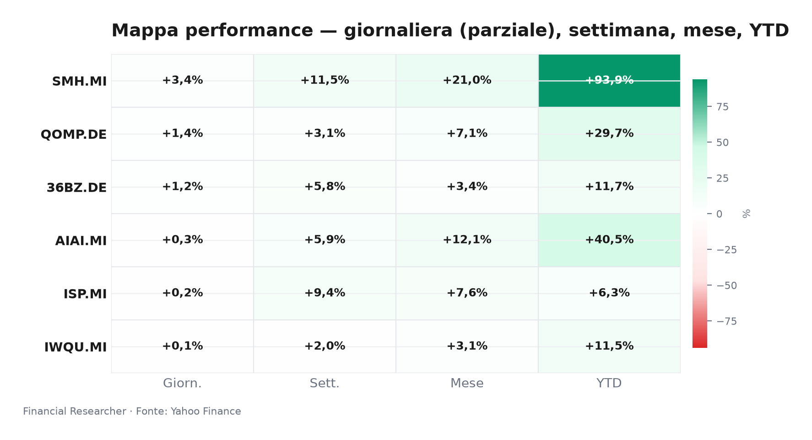
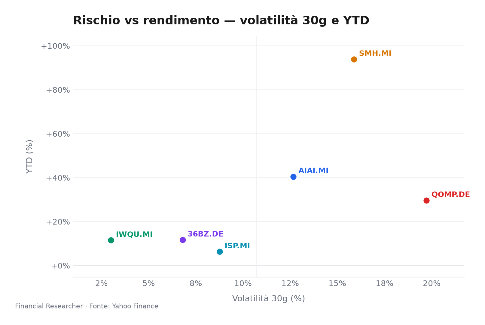
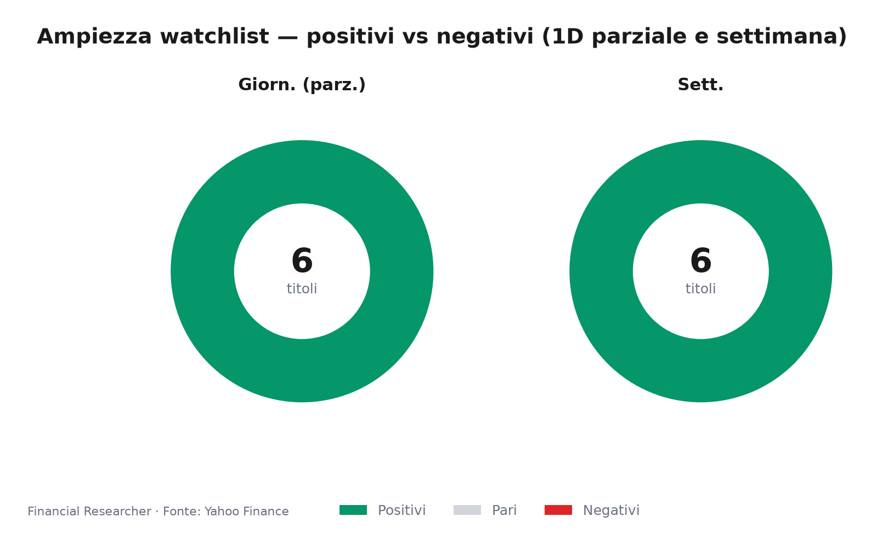
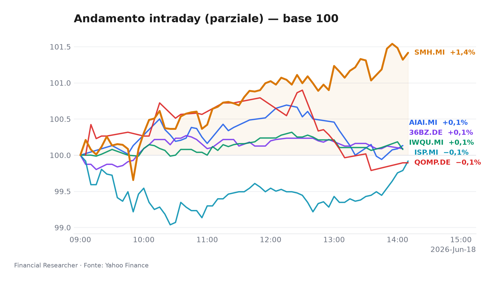
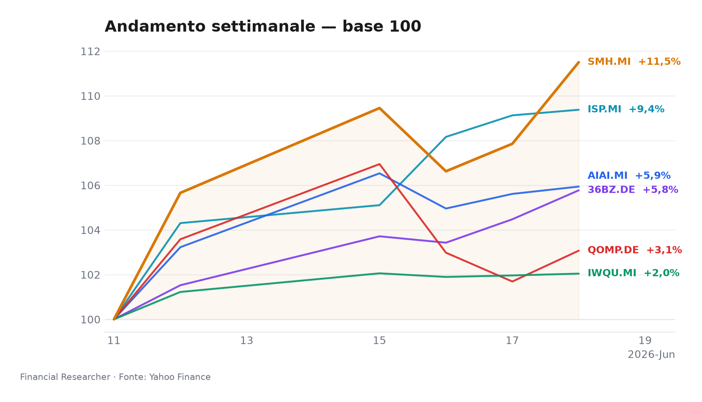

# Milan Midday Watchlist Briefing

**Market mood:** AI and semiconductors are sprinting, quality is holding the line, and Intesa is testing the market’s appetite for bank M&A conviction.

## Executive Summary

- **L&G Artificial Intelligence UCITS ETF (AIAI.MI)** remains the cleanest Milan-listed expression of the AI capex cycle, with ▲ 0.31% 1D, ▲ 5.94% 1W and ▲ 40.50% YTD, helped by broad AI thematic demand rather than a fresh issuer-specific headline [1]. The key watch is whether the rally broadens from semiconductor winners into the wider AI infrastructure stack.
- **VanEck Semiconductor UCITS ETF (SMH.MI)** is the session leader and the strongest momentum position, with ▲ 3.38% 1D, ▲ 11.50% 1W and ▲ 93.89% YTD [2]. The move reflects semiconductor/AI leadership, but the valuation and crowding risk are now central to strategist discussion.
- **iShares Edge MSCI World Quality Factor UCITS ETF USD (Acc) (IWQU.MI)** is stable but less dynamic, with ▲ 0.08% 1D, ▲ 2.04% 1W and ▲ 11.49% YTD [3]. It offers defensive quality exposure, though USD/EUR translation and softer global risk appetite can mute relative returns.
- **iShares Quantum Computing UCITS ETF USD (Acc) (QOMP.DE)** is up ▲ 1.36% 1D, ▲ 3.07% 1W and ▲ 29.68% YTD, reflecting speculative thematic support rather than near-term earnings visibility [4]. Its smaller AUM and USD exposure make it more sensitive to liquidity and FX.
- **iShares MSCI China A UCITS ETF (36BZ.DE)** is recovering with ▲ 1.24% 1D, ▲ 5.77% 1W and ▲ 11.69% YTD, helped by policy support expectations for China A shares [5]. The rebound is promising, but property stress, deflation pressure and yuan volatility remain material constraints.
- **Intesa Sanpaolo S.p.A. (ISP.MI)** is up ▲ 0.23% 1D, ▲ 9.38% 1W and ▲ 6.34% YTD, with medium-impact background news around valuation and the Mps bid shaping sentiment [6][7]. The stock’s near-term path depends on whether investors prioritise capital returns and merger optionality or NIM compression and execution risk.

## Watchlist Performance Snapshot

**Leader 1D:** VanEck Semiconductor UCITS ETF (SMH.MI) (3.38%) · **Laggard 1D:** iShares Edge MSCI World Quality Factor UCITS ETF USD (Acc) (IWQU.MI) (0.08%)

| Ref | Strumento | Ticker | Prezzo (valuta) | Giornaliera | Settimanale | Mensile | YTD | 1A | Vol. 30g | Fonte |
|-----|-----------|--------|-----------------|-------------|-------------|---------|-----|-----|--------|-------|
| [1] | L&G Artificial Intelligence UCITS ETF | AIAI.MI | 33,98 EUR | 0,31% | 5,94% | 12,07% | 40,50% | 69,93% | 12,67% | [1] |
| [2] | VanEck Semiconductor UCITS ETF | SMH.MI | 106,04 EUR | 3,38% | 11,50% | 21,04% | 93,89% | 173,83% | 15,88% | [2] |
| [3] | iShares Edge MSCI World Quality Factor UCITS ETF USD (Acc) | IWQU.MI | 75,88 EUR | 0,08% | 2,04% | 3,11% | 11,49% | 22,64% | 3,00% | [3] |
| [4] | iShares Quantum Computing UCITS ETF USD (Acc) | QOMP.DE | 5,67 EUR | 1,36% | 3,07% | 7,06% | 29,68% | 31,53% | 19,72% | [4] |
| [5] | iShares MSCI China A UCITS ETF | 36BZ.DE | 5,55 EUR | 1,24% | 5,77% | 3,41% | 11,69% | 39,19% | 6,80% | [5] |
| [6] | Intesa Sanpaolo S.p.A. | ISP.MI | 6,12 EUR | 0,23% | 9,38% | 7,57% | 6,34% | 35,85% | 8,76% | [6] |
| — | FTSE MIB | FTSEMIB.MI | 52588,52 EUR | 0,30% | 4,12% | 6,93% | 15,90% | 33,41% | 5,22% | — |
| — | STOXX Europe 600 | ^STOXX | 636,35 EUR | -0,46% | 2,38% | 4,09% | 5,75% | 17,77% | 4,33% | — |

### Performance Charts

## What's Driving the Moves

- **L&G Artificial Intelligence UCITS ETF (AIAI.MI)** has no material prefetch headline, so the 1D/1W move is best explained through market data and AI theme exposure rather than news flow [1]. The ETF’s performance is consistent with continued investor demand for AI infrastructure exposure, even as the absence of a fresh catalyst keeps the move more beta-driven than event-driven.
- **VanEck Semiconductor UCITS ETF (SMH.MI)** also has no material prefetch headline, so the sharp ▲ 3.38% 1D and ▲ 11.50% 1W move is best read as semiconductor beta catching the AI capex wave [2]. The Wall Street Journal recap on Marvell, Apple, Broadcom and Strategy provides cross-market context for why AI-linked chip names remain the market’s most watched risk-on assets [8].
- **iShares Edge MSCI World Quality Factor UCITS ETF USD (Acc) (IWQU.MI)** has no material prefetch headline, so its modest ▲ 0.08% 1D and ▲ 2.04% 1W move reflects quality-factor steadiness rather than a new catalyst [3]. In a late-cycle backdrop, its tilt toward resilient earnings, high ROE and lower leverage remains useful, but it lacks the explosive upside of AI/semiconductor exposure.
- **iShares Quantum Computing UCITS ETF USD (Acc) (QOMP.DE)** has no material prefetch headline, so the ▲ 1.36% 1D and ▲ 3.07% 1W move is best explained by thematic risk appetite and quantum-computing sentiment [4]. The theme benefits from policy and cloud-partnership narratives, yet commercialization remains early and AUM is much smaller than the AI and semiconductor ETFs.
- **iShares MSCI China A UCITS ETF (36BZ.DE)** has no material prefetch headline, so the ▲ 1.24% 1D and ▲ 5.77% 1W move is best explained by China A beta and policy-support expectations [5]. The key driver is not a single headline but the market’s willingness to price incremental stimulus, liquidity support and local project approvals.
- **Intesa Sanpaolo S.p.A. (ISP.MI)** has a medium-impact background item: “Assessing Intesa Sanpaolo (BIT:ISP) Valuation After Recent Share Price Weakness,” dated 2026-06-11 from Simply Wall St [7]. That valuation discussion sits alongside the broader background narrative that Intesa’s bid for Mps and the December 2026 merger timetable are central to the stock’s strategic rerating debate [9].

## Medium-Term Outlook

**Bull case — 18-Jun-26 to Q4 2026:**  
The ECB’s 25bp deposit-rate cut to 1.75% and its data-dependent easing path can support European risk appetite, while the Fed’s hold at 3.75–4.00% keeps the USD supportive for USD-exposed ETFs [8][9]. In that setup, **VanEck Semiconductor UCITS ETF (SMH.MI)** and **L&G Artificial Intelligence UCITS ETF (AIAI.MI)** benefit from AI capex persistence, **iShares MSCI China A UCITS ETF (36BZ.DE)** benefits from China policy support, and **Intesa Sanpaolo S.p.A. (ISP.MI)** benefits from resilient net interest income plus merger optionality.

**Base case — next 3 to 6 months:**  
The most likely path is a rotation between AI momentum, quality defence and selective China relief. **iShares Edge MSCI World Quality Factor UCITS ETF USD (Acc) (IWQU.MI)** should remain a stabiliser if global growth worries rise, while **iShares Quantum Computing UCITS ETF USD (Acc) (QOMP.DE)** stays more sentiment-driven and less tied to near-term fundamentals [4][10]. For **Intesa Sanpaolo S.p.A. (ISP.MI)**, the base case is range-bound strength supported by dividends and buybacks, but capped by NIM pressure and merger execution risk [11].

**Bear case — H2 2026:**  
A hawkish US inflation surprise, a USD disorderly move, or a renewed AI capex/export-control shock would pressure **VanEck Semiconductor UCITS ETF (SMH.MI)** and **L&G Artificial Intelligence UCITS ETF (AIAI.MI)** most directly [7][12][13]. A China stimulus disappointment would hurt **iShares MSCI China A UCITS ETF (36BZ.DE)**, while a sharper credit-cycle turn would test **Intesa Sanpaolo S.p.A. (ISP.MI)** despite its strong capital position [14][11]. **iShares Edge MSCI World Quality Factor UCITS ETF USD (Acc) (IWQU.MI)** would likely outperform in a risk-off regime, but FX translation and global earnings revisions could still cap returns [3][10].

## Event Calendar

| Date (YYYY-MM-DD) | Event | Affected tickers/themes | Impact | [N] |
|---|---|---|---|---|
|  |  |  |  |  |

## Correlated Themes

- **AI capex as the dominant cross-asset driver:** **L&G Artificial Intelligence UCITS ETF (AIAI.MI)** and **VanEck Semiconductor UCITS ETF (SMH.MI)** are both tied to the same structural narrative: hyperscaler spending, chip demand, and the market’s willingness to pay for AI-linked growth [1][2].
- **Quality versus momentum:** **iShares Edge MSCI World Quality Factor UCITS ETF USD (Acc) (IWQU.MI)** sits on the other side of the trade, offering a steadier profile when investors prefer earnings durability over multiple expansion [3][10].
- **China policy beta:** **iShares MSCI China A UCITS ETF (36BZ.DE)** is the cleanest Milan-watchlist expression of China A relief, but it remains highly sensitive to PBOC action, property stabilization and local project approvals [5][14].
- **Bank M&A and European financials:** **Intesa Sanpaolo S.p.A. (ISP.MI)** is the only single-name bank in the watchlist, so it carries a different risk profile from the ETFs: more direct exposure to NIM, credit costs, and merger execution [9][11].

## Risks & Watchpoints

- **Intraday data risk:** all 1D figures are partial-session readings and can change materially before the close [1][2][3][4][5][6].
- **FX translation risk:** **iShares Edge MSCI World Quality Factor UCITS ETF USD (Acc) (IWQU.MI)**, **iShares Quantum Computing UCITS ETF USD (Acc) (QOMP.DE)** and **iShares MSCI China A UCITS ETF (36BZ.DE)** all embed currency exposure that can distort EUR returns [3][4][5].
- **Thematic crowding:** **L&G Artificial Intelligence UCITS ETF (AIAI.MI)** and **VanEck Semiconductor UCITS ETF (SMH.MI)** have strong momentum, but that also means they are vulnerable to a sudden AI capex reassessment [1][2].
- **China policy disappointment:** **iShares MSCI China A UCITS ETF (36BZ.DE)** can rally quickly, but the rebound is fragile if stimulus underwhelms or property stress persists [5][14].
- **Bank execution risk:** **Intesa Sanpaolo S.p.A. (ISP.MI)** remains exposed to merger integration, NIM compression and credit-cycle surprises despite its strong capital position [9][11].

## Disclaimer

This briefing is for informational purposes only and does not constitute investment advice, a recommendation, or an offer to buy or sell any instrument. All figures are subject to change, especially because the session is still in progress. Investors should consider their own objectives, risk tolerance and liquidity needs before making any decision.

## References

1. Yahoo Finance — AIAI.MI (L&G Artificial Intelligence UCITS ETF) — 2026-06-18 — https://finance.yahoo.com/quote/AIAI.MI
2. Yahoo Finance — SMH.MI (VanEck Semiconductor UCITS ETF) — 2026-06-18 — https://finance.yahoo.com/quote/SMH.MI
3. Yahoo Finance — IWQU.MI (iShares Edge MSCI World Quality Factor UCITS ETF USD (Acc)) — 2026-06-18 — https://finance.yahoo.com/quote/IWQU.MI
4. Yahoo Finance — QOMP.DE (iShares Quantum Computing UCITS ETF USD (Acc)) — 2026-06-18 — https://finance.yahoo.com/quote/QOMP.DE
5. Yahoo Finance — 36BZ.DE (iShares MSCI China A UCITS ETF) — 2026-06-18 — https://finance.yahoo.com/quote/36BZ.DE
6. Yahoo Finance — ISP.MI (Intesa Sanpaolo S.p.A.) — 2026-06-18 — https://finance.yahoo.com/quote/ISP.MI
8. The Wall Street Journal — Stocks to Watch Recap: Marvell Technology, Apple, Broadcom, Strategy — 2026-06-08 — https://finance.yahoo.com/m/34a0ce12-e5d0-369b-99dd-2a53210f0376/stocks-to-watch-recap-.html

<!-- financial-researcher:run-metadata -->
## Run metadata

| | |
|---|---|
| Model profile | free_openrouter_nex |
| Processing time | 24m 34s |
| LLM requests | 8 |
| Tokens (prompt / completion / total) | 23,605 / 105,434 / 129,039 |

**Models by agent**

| Agent | Model (configured → resolved) |
|---|---|
| Market analyst | `openrouter/nex-agi/nex-n2-pro:free` → `nex-agi/nex-n2-pro:free` |
| News analyst | `openrouter/nex-agi/nex-n2-pro:free` → `nex-agi/nex-n2-pro:free` |
| Outlook analyst | `openrouter/nex-agi/nex-n2-pro:free` → `nex-agi/nex-n2-pro:free` |
| Calendar analyst | `openrouter/nex-agi/nex-n2-pro:free` → `nex-agi/nex-n2-pro:free` |
| Chief strategist | `openrouter/nex-agi/nex-n2-pro:free` → `nex-agi/nex-n2-pro:free` |
<!-- /financial-researcher:run-metadata -->
