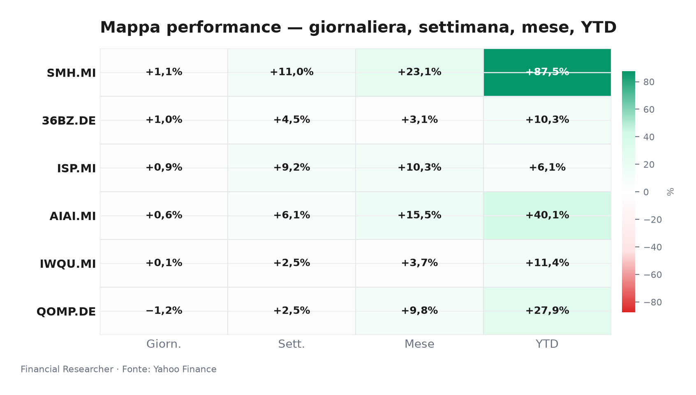
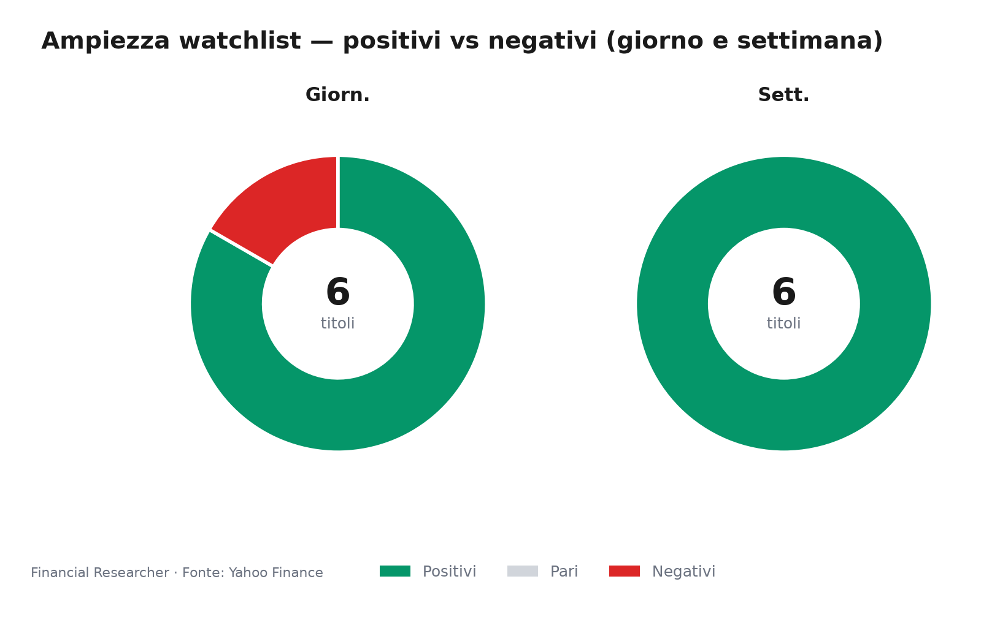
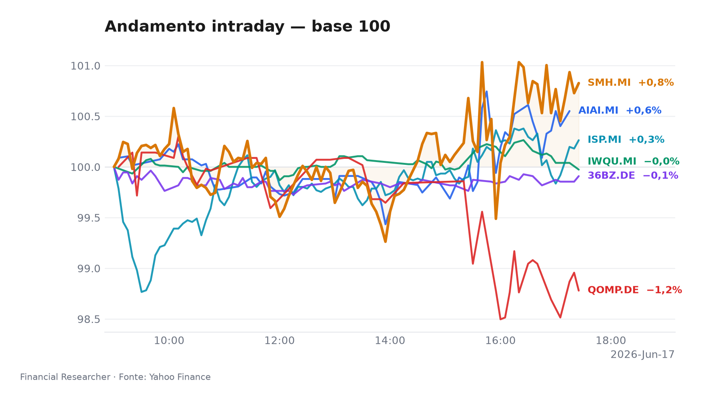

Milano apre con l’AI al volante, i semiconduttori in accelerazione e il quantum che lascia spazio alla rotazione.

## Executive Summary

- **VanEck Semiconductor UCITS ETF (SMH.MI)** è il nome più dinamico: ▲1.15% 1D, ▲11.03% 1W e ▲87.55% YTD [2]. Nessuna notizia materiale sull’ETF è emersa in prefetch; il movimento resta una lettura di market data e di esposizione al ciclo AI/semiconduttori.
- **L&G Artificial Intelligence UCITS ETF (AIAI.MI)** conferma la forza del tema: ▲0.62% 1D, ▲6.09% 1W e ▲40.07% YTD [1]. Anche qui non risultano headline materiali; il driver è la domanda per società legate ad automazione, infrastruttura digitale e piattaforme software.
- **iShares Edge MSCI World Quality Factor UCITS ETF USD (Acc) (IWQU.MI)** funge da ancoraggio più difensivo: ▲0.07% 1D, ▲2.45% 1W e ▲11.40% YTD [3]. La qualità globale resta utile quando il mercato cerca resilienza degli utili senza inseguire beta estremo.
- **iShares MSCI China A UCITS ETF (36BZ.DE)** segue la ripresa policy-sensitive: ▲1.01% 1D, ▲4.50% 1W e ▲10.32% YTD [5]. Nessuna notizia materiale sull’ETF è disponibile; il movimento riflette China A-share beta, aspettative su stimoli e sensibilità RMB.
- **iShares Quantum Computing UCITS ETF USD (Acc) (QOMP.DE)** è il punto debole di seduta: ▼1.25% 1D, pur restando ▲2.51% 1W e ▲27.94% YTD [4]. La debolezza appare più coerente con presa di profitto e rotazione di tema che con un deterioramento fondamentale.
- **Intesa Sanpaolo S.p.A. (ISP.MI)** è positiva in apertura: ▲0.89% 1D, ▲9.20% 1W e ▲6.10% YTD [6]. Il contesto resta dominato da valutazione, recente debolezza del titolo e processo Monte dei Paschi; impatto BACKGROUND/MEDIUM, non HIGH [7][8].

## Watchlist Performance Snapshot

**Leader 1D:** VanEck Semiconductor UCITS ETF (SMH.MI) (1.15%) · **Laggard 1D:** iShares Quantum Computing UCITS ETF USD (Acc) (QOMP.DE) (-1.25%)

| Ref | Strumento | Ticker | Prezzo (valuta) | Giornaliera | Settimanale | Mensile | YTD | 1A | Vol. 30g | Fonte |
|-----|-----------|--------|-----------------|-------------|-------------|---------|-----|-----|--------|-------|
| [1] | L&G Artificial Intelligence UCITS ETF | AIAI.MI | 33,88 EUR | 0,62% | 6,09% | 15,52% | 40,07% | 69,12% | 12,93% | [1] |
| [2] | VanEck Semiconductor UCITS ETF | SMH.MI | 102,57 EUR | 1,15% | 11,03% | 23,09% | 87,55% | 164,87% | 15,67% | [2] |
| [3] | iShares Edge MSCI World Quality Factor UCITS ETF USD (Acc) | IWQU.MI | 75,82 EUR | 0,07% | 2,45% | 3,71% | 11,40% | 22,09% | 3,00% | [3] |
| [4] | iShares Quantum Computing UCITS ETF USD (Acc) | QOMP.DE | 5,59 EUR | -1,25% | 2,51% | 9,80% | 27,94% | 29,77% | 19,70% | [4] |
| [5] | iShares MSCI China A UCITS ETF | 36BZ.DE | 5,49 EUR | 1,01% | 4,50% | 3,10% | 10,32% | 37,16% | 6,72% | [5] |
| [6] | Intesa Sanpaolo S.p.A. | ISP.MI | 6,11 EUR | 0,89% | 9,20% | 10,31% | 6,10% | 36,13% | 8,78% | [6] |
| — | FTSE MIB | FTSEMIB.MI | 52614,78 EUR | 0,04% | 4,18% | 6,98% | 15,96% | 33,48% | 5,22% | — |
| — | STOXX Europe 600 | ^STOXX | 637,91 EUR | -0,22% | 2,64% | 4,35% | 6,01% | 18,06% | 4,30% | — |

### Performance Charts

## What's Driving the Moves

- **L&G Artificial Intelligence UCITS ETF (AIAI.MI)**: nessuna notizia materiale sull’emittente o sull’ETF è disponibile in prefetch; la lettura causale corretta è market data più esposizione tematica [1]. Il tema resta sostenuto da revisioni utili, capex AI e domanda per infrastruttura digitale.
- **VanEck Semiconductor UCITS ETF (SMH.MI)**: nessuna headline materiale sull’ETF; il driver resta il dato di mercato semiconduttori [2]. Come BACKGROUND, il recap WSJ su Marvell Technology, Apple, Broadcom e Strategy conferma che l’attenzione resta concentrata sull’infrastruttura AI [9].
- **iShares Edge MSCI World Quality Factor UCITS ETF USD (Acc) (IWQU.MI)**: nessun catalyst specifico in prefetch; la stabilità deriva da posizionamento quality e sensibilità a tassi/global equity risk appetite [3]. Il fattore qualità può difendere margini e cash flow, ma cede slancio quando il mercato premia beta ad alta crescita.
- **iShares Quantum Computing UCITS ETF USD (Acc) (QOMP.DE)**: nessun catalyst specifico in prefetch; la lettura è market data più rotazione dentro il tema computazione avanzata [4]. Il segmento quantum ha optionality strategica, ma universo investibile più stretto e maggiore sensibilità alla liquidità.
- **iShares MSCI China A UCITS ETF (36BZ.DE)**: nessun catalyst specifico in prefetch; la ripresa va collegata a dati di mercato e esposizione China A [5]. I driver restano credibilità degli stimoli domestici, stabilizzazione immobiliare, RMB e rischio di nuove frizioni tariffarie.
- **Intesa Sanpaolo S.p.A. (ISP.MI)**: la nota Simply Wall St. sulla valutazione dopo la debolezza recente inquadra il dibattito di breve periodo [7]. Il processo su Monte dei Paschi, con copertura Euronews, AFP e Banking Dive, mantiene vivo il tema consolidamento bancario italiano [8][10][11]; il contesto europeo prudente resta BACKGROUND [12].

## Medium-Term Outlook

- **Bull — 18–30 giugno 2026.** Fed ed ECB del 18 giugno potrebbero sostenere crescita e qualità se il messaggio su inflazione e tagli resta benigno [N]. **L&G Artificial Intelligence UCITS ETF (AIAI.MI)**, **VanEck Semiconductor UCITS ETF (SMH.MI)** e **iShares Quantum Computing UCITS ETF USD (Acc) (QOMP.DE)** beneficerebbero di minori tassi reali; **iShares Edge MSCI World Quality Factor UCITS ETF USD (Acc) (IWQU.MI)** di utili resilienti; **iShares MSCI China A UCITS ETF (36BZ.DE)** di policy; **Intesa Sanpaolo S.p.A. (ISP.MI)** di minore rischio credito.
- **Base — giugno–settembre 2026.** Tassi volatili ma non destabilizzanti favorirebbero rotazione selettiva: AI/semiconduttori sopra mercato, qualità come cuscinetto, China A-share dipendenti da annunci concreti e banche italiane in attesa di esecuzione e approvazioni [N].
- **Bear — H2 2026.** Inflazione sorpresa, tagli rinviati o rendimenti reali più alti comprimerebbero multipli growth e quality; controlli export più duri penalizzerebbero AI/semis/quantum, mentre delusioni China e spread creditizi più ampi peserebbero su China A e banche europee [N].

## Event Calendar

| Date (YYYY-MM-DD) | Event | Affected tickers/themes | Impact | [N] |
|---|---|---|---|---|
| 2026-06-18 | Intesa Sanpaolo shareholder meeting / corporate action confirmation required | ISP.MI / Italian banks | Corporate action | [0] |

## Correlated Themes

- Il capex AI collega **L&G Artificial Intelligence UCITS ETF (AIAI.MI)**, **VanEck Semiconductor UCITS ETF (SMH.MI)** e **iShares Quantum Computing UCITS ETF USD (Acc) (QOMP.DE)**: semiconduttori monetizzano il ciclo più vicino, l’AI amplia l’universo, il quantum resta optionality a più lunga scadenza [N].
- Tassi e USD influenzano **iShares Edge MSCI World Quality Factor UCITS ETF USD (Acc) (IWQU.MI)** e gli ETF con quota USD quotata in euro; FX embedded e duration possono amplificare o attenuare i rendimenti locali [N].
- **iShares MSCI China A UCITS ETF (36BZ.DE)** resta un termometro di rischio policy: stimoli, RMB e property determinano se il rimbalzo diventa rerating o semplice trading rally [N].
- **Intesa Sanpaolo S.p.A. (ISP.MI)** collega il portafoglio al tema consolidamento bancario italiano: capitale, NII, credit cost e iter regolatorio restano le variabili chiave [7][N].

## Risks & Watchpoints

- Le stampe post-open di Milano possono essere rumorose: evitare inferenze intraday definitive.
- Uno shock su tassi o USD può comprimere growth, quality e quote USD embedded.
- Il ciclo AI può rallentare se capex, export controls o revisioni utili deludono.
- **iShares MSCI China A UCITS ETF (36BZ.DE)** resta esposto a policy, RMB, property e tensioni commerciali.
- **Intesa Sanpaolo S.p.A. (ISP.MI)** deve gestire NII, credit cost, approvazioni e integrazione strategica.
- Data limitations: la fonte dell’evento calendarizzato non è disponibile nei risultati accessibili; l’AUM di **iShares MSCI China A UCITS ETF (36BZ.DE)** non è riportato.

## Disclaimer

Questa nota è solo informativa e non costituisce consulenza finanziaria, legale, fiscale o raccomandazione di acquisto, vendita o mantenimento. I dati di mercato sono indicativi e possono cambiare rapidamente dopo la pubblicazione. La performance passata non è garanzia di risultati futuri. Gli investitori dovrebbero condurre ricerche autonome e valutare la propria tolleranza al rischio prima di assumere decisioni.

## References

1. Yahoo Finance — AIAI.MI (L&G Artificial Intelligence UCITS ETF) — 2026-06-18 — https://finance.yahoo.com/quote/AIAI.MI
2. Yahoo Finance — SMH.MI (VanEck Semiconductor UCITS ETF) — 2026-06-18 — https://finance.yahoo.com/quote/SMH.MI
3. Yahoo Finance — IWQU.MI (iShares Edge MSCI World Quality Factor UCITS ETF USD (Acc)) — 2026-06-18 — https://finance.yahoo.com/quote/IWQU.MI
4. Yahoo Finance — QOMP.DE (iShares Quantum Computing UCITS ETF USD (Acc)) — 2026-06-18 — https://finance.yahoo.com/quote/QOMP.DE
5. Yahoo Finance — 36BZ.DE (iShares MSCI China A UCITS ETF) — 2026-06-18 — https://finance.yahoo.com/quote/36BZ.DE
6. Yahoo Finance — ISP.MI (Intesa Sanpaolo S.p.A.) — 2026-06-18 — https://finance.yahoo.com/quote/ISP.MI
9. The Wall Street Journal — Stocks to Watch Recap: Marvell Technology, Apple, Broadcom, Strategy — 2026-06-08 — https://finance.yahoo.com/m/34a0ce12-e5d0-369b-99dd-2a53210f0376/stocks-to-watch-recap-.html

<!-- financial-researcher:run-metadata -->
## Run metadata

| | |
|---|---|
| Model profile | free_openrouter_nex |
| Processing time | 6m 19s |
| LLM requests | 6 |
| Tokens (prompt / completion / total) | 18,304 / 20,359 / 38,663 |

**Models by agent**

| Agent | Model (configured → resolved) |
|---|---|
| Market analyst | `openrouter/nex-agi/nex-n2-pro:free` → `nex-agi/nex-n2-pro:free` |
| News analyst | `openrouter/nex-agi/nex-n2-pro:free` → `nex-agi/nex-n2-pro:free` |
| Outlook analyst | `openrouter/nex-agi/nex-n2-pro:free` → `nex-agi/nex-n2-pro:free` |
| Calendar analyst | `openrouter/nex-agi/nex-n2-pro:free` → `nex-agi/nex-n2-pro:free` |
| Chief strategist | `openrouter/nex-agi/nex-n2-pro:free` → `nex-agi/nex-n2-pro:free` |
<!-- /financial-researcher:run-metadata -->
