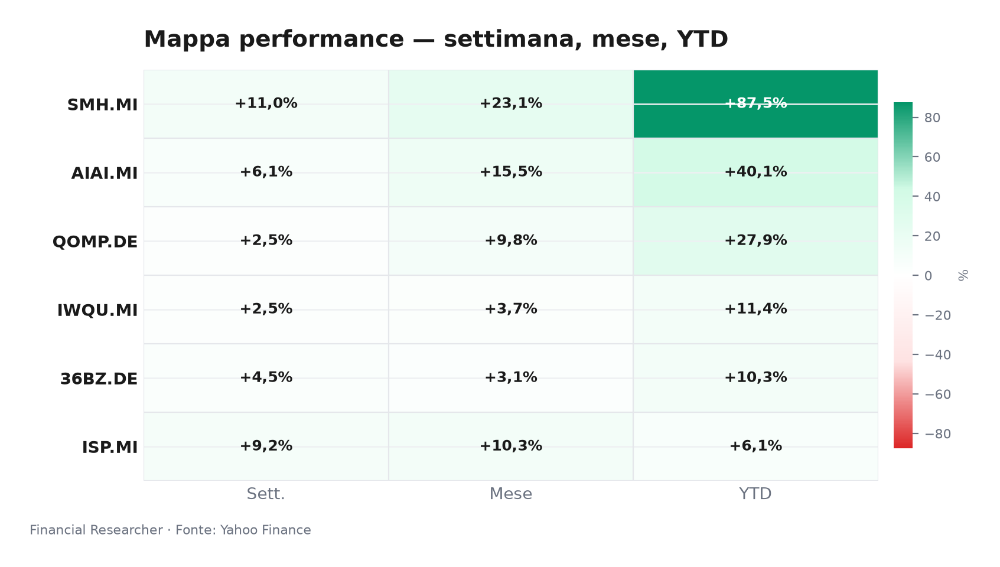
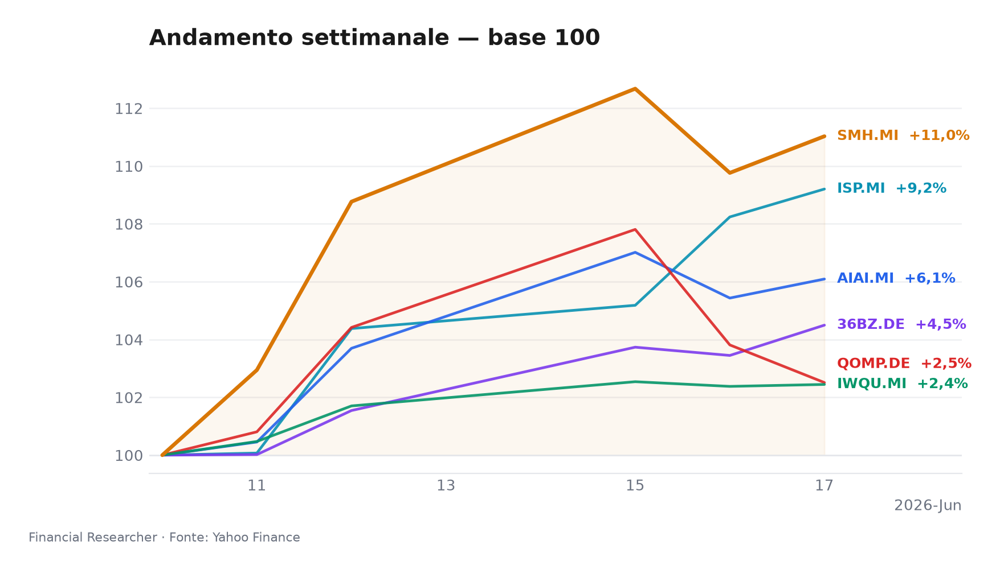

# Milan Executive Watchlist Briefing — Pre-open 18 June 2026

Milano entra in seduta con un mood a due velocità: tecnologia globale in accelerazione, banche italiane in rimonta dopo una fase di debolezza.

## Executive Summary

- **L&G Artificial Intelligence UCITS ETF (AIAI.MI)**: ▲ +0.62% 1D, ▲ +6.09% 1W, ▲ +40.07% YTD; nessun catalyst issuer-specific, driver resta l’esposizione strutturale al tema AI [1].
- **VanEck Semiconductor UCITS ETF (SMH.MI)**: ▲ +1.15% 1D, ▲ +11.03% 1W, ▲ +87.55% YTD; il momentum è trainato dai semiconduttori, senza news materiale specifica in prefetch [2].
- **iShares Edge MSCI World Quality Factor UCITS ETF USD (Acc) (IWQU.MI)**: ▲ +0.07% 1D, ▲ +2.45% 1W, ▲ +11.40% YTD; profilo difensivo-quality, con cautela FX USD/EUR [3].
- **iShares Quantum Computing UCITS ETF USD (Acc) (QOMP.DE)**: ▼ -1.25% 1D, ▲ +2.51% 1W, ▲ +27.94% YTD; tema ad alta volatilità, nessuna notizia causale specifica [4].
- **iShares MSCI China A UCITS ETF (36BZ.DE)**: ▲ +1.01% 1D, ▲ +4.50% 1W, ▲ +10.32% YTD; rimbalzo China A-share, ma restano incertezze su FX e AUM [5].
- **Intesa Sanpaolo S.p.A. (ISP.MI)**: ▲ +0.89% 1D, ▲ +9.20% 1W, ▲ +6.10% YTD; rimbalzo collegato alla rivalutazione post-debolezza e al dossier M&A MPS [6][7].

## Watchlist Performance Snapshot

**Leader 1D:** VanEck Semiconductor UCITS ETF (SMH.MI) (1.15%) · **Laggard 1D:** iShares Quantum Computing UCITS ETF USD (Acc) (QOMP.DE) (-1.25%)

| Ref | Strumento | Ticker | Prezzo (valuta) | Giornaliera | Settimanale | Mensile | YTD | 1A | Vol. 30g | Fonte |
|-----|-----------|--------|-----------------|-------------|-------------|---------|-----|-----|--------|-------|
| [1] | L&G Artificial Intelligence UCITS ETF | AIAI.MI | 33,88 EUR | 0,62% | 6,09% | 15,52% | 40,07% | 69,12% | 12,93% | [1] |
| [2] | VanEck Semiconductor UCITS ETF | SMH.MI | 102,57 EUR | 1,15% | 11,03% | 23,09% | 87,55% | 164,87% | 15,67% | [2] |
| [3] | iShares Edge MSCI World Quality Factor UCITS ETF USD (Acc) | IWQU.MI | 75,82 EUR | 0,07% | 2,45% | 3,71% | 11,40% | 22,09% | 3,00% | [3] |
| [4] | iShares Quantum Computing UCITS ETF USD (Acc) | QOMP.DE | 5,59 EUR | -1,25% | 2,51% | 9,80% | 27,94% | 29,77% | 19,70% | [4] |
| [5] | iShares MSCI China A UCITS ETF | 36BZ.DE | 5,49 EUR | 1,01% | 4,50% | 3,10% | 10,32% | 37,16% | 6,72% | [5] |
| [6] | Intesa Sanpaolo S.p.A. | ISP.MI | 6,11 EUR | 0,89% | 9,20% | 10,31% | 6,10% | 36,13% | 8,78% | [6] |
| — | FTSE MIB | FTSEMIB.MI | 52595,23 EUR | 0,31% | 5,13% | 8,77% | 15,91% | 33,53% | 5,32% | — |
| — | STOXX Europe 600 | ^STOXX | 639,31 EUR | 0,52% | 3,42% | 4,78% | 6,24% | 17,90% | 4,32% | — |

### Performance Charts

## What's Driving the Moves

- **L&G Artificial Intelligence UCITS ETF (AIAI.MI)** — Impact NONE: nessuna notizia materiale in prefetch; il movimento 1D/1W va letto come esposizione di mercato al tema AI, non come news causale specifica [1].
- **VanEck Semiconductor UCITS ETF (SMH.MI)** — Impact NONE: nessuna notizia materiale in prefetch; il rialzo riflette il beta ai semiconduttori e alla domanda infrastrutturale per AI, senza catalyst aziendale diretto [2].
- **iShares Edge MSCI World Quality Factor UCITS ETF USD (Acc) (IWQU.MI)** — Impact NONE: nessuna notizia materiale in prefetch; il movimento resta coerente con un’esposizione global quality, mentre il cambio USD/EUR può amplificare o smorzare i rendimenti in euro [3].
- **iShares Quantum Computing UCITS ETF USD (Acc) (QOMP.DE)** — Impact NONE: nessuna notizia materiale in prefetch; la debolezza 1D è interpretabile come rotazione dentro un tema speculativo, non come deterioramento fondamentale dell’ETF [4].
- **iShares MSCI China A UCITS ETF (36BZ.DE)** — Impact NONE: nessuna notizia materiale in prefetch; il rimbalzo segue l’esposizione alle A-share cinesi, ma resta sensibile a yuan, politiche domestiche e flussi esteri [5].
- **Intesa Sanpaolo S.p.A. (ISP.MI)** — Impact MEDIUM: il driver di ricerca è la lettura sulla valutazione dopo la recente debolezza del prezzo [7]. BACKGROUND: la competizione per MPS e il possibile consolidamento bancario italiano restano il contesto dominante, con ulteriori articoli che descrivono l’evoluzione dell’investment story e la rivalità tra banche italiane [8][9][10][11].

## Medium-Term Outlook

- **L&G Artificial Intelligence UCITS ETF (AIAI.MI)** — Bull: entro il 30 giugno, nuove guidance AI/cloud possono sostenere i multipli; Base: nel Q3 la leadership resta selettiva; Bear: una correzione dei mega-cap tech comprimerebbe il premio tematico [1].
- **VanEck Semiconductor UCITS ETF (SMH.MI)** — Bull: entro luglio, capex AI e domanda chip rafforzano il trend; Base: volatilità alta ma direzione positiva; Bear: controlli export, inventari o delusioni sugli utili pesano sul settore [2].
- **iShares Edge MSCI World Quality Factor UCITS ETF USD (Acc) (IWQU.MI)** — Bull: se tassi e volatilità premiano qualità e bilanci solidi; Base: performance stabile ma meno esplosiva della tecnologia; Bear: rotazione verso ciclici e debolezza USD/EUR riducono il vantaggio relativo [3].
- **iShares Quantum Computing UCITS ETF USD (Acc) (QOMP.DE)** — Bull: entro fine giugno, milestone tecnologici o contratti pubblici riacendono il rischio; Base: tema ad alta beta con rally intermittenti; Bear: derating da funding e assenza di ricavi visibili [4].
- **iShares MSCI China A UCITS ETF (36BZ.DE)** — Bull: entro fine mese, segnali su PMI, consumi o sostegno policy; Base: stabilizzazione graduale; Bear: yuan debole, property stress o tensioni geopolitiche frenano i flussi [5].
- **Intesa Sanpaolo S.p.A. (ISP.MI)** — Bull: entro dicembre 2026, un percorso più chiaro su MPS e rendimenti può sostenere la valutazione; Base: il mercato continua a pesare capitale, M&A e dividendi; Bear: premium eccessivo, requisiti regolamentari o integrazione complessa comprimono il rialzo [7][8][9][10][11].

## Event Calendar

| Date (YYYY-MM-DD) | Event | Affected tickers/themes | Impact | [N] |
|---|---|---|---|---|

## Correlated Themes

- **L&G Artificial Intelligence UCITS ETF (AIAI.MI)** e **VanEck Semiconductor UCITS ETF (SMH.MI)** condividono il filo conduttore dell’infrastruttura AI: software, cloud e semiconduttori reagiscono agli stessi impulsi di capex e utili [1][2][7].
- **iShares Edge MSCI World Quality Factor UCITS ETF USD (Acc) (IWQU.MI)** funziona come contrappeso più difensivo rispetto ai temi growth, soprattutto se la volatilità torna a premiare bilanci solidi [3].
- **iShares Quantum Computing UCITS ETF USD (Acc) (QOMP.DE)** resta una scommessa opzionale: meno liquida, più narrativa e più esposta a fasi di rischio-on/risk-off [4].
- **iShares MSCI China A UCITS ETF (36BZ.DE)** aggiunge diversificazione geografica, ma introduce un secondo canale di rischio: policy cinese e tassi di cambio [5].
- **Intesa Sanpaolo S.p.A. (ISP.MI)** collega il portafoglio al ciclo bancario europeo, ai tassi e alla possibile riorganizzazione del settore in Italia [9][10][11][12].

## Risks & Watchpoints

- Concentrazione tematica: **L&G Artificial Intelligence UCITS ETF (AIAI.MI)** e **VanEck Semiconductor UCITS ETF (SMH.MI)** possono amplificare drawdown se il mercato riduce il premio AI.
- FX e struttura prodotto: **iShares Edge MSCI World Quality Factor UCITS ETF USD (Acc) (IWQU.MI)**, **iShares Quantum Computing UCITS ETF USD (Acc) (QOMP.DE)** e **iShares MSCI China A UCITS ETF (36BZ.DE)** hanno esposizioni valutarie rilevanti; AUM non disponibile per **iShares MSCI China A UCITS ETF (36BZ.DE)** [3][4][5].
- China risk: **iShares MSCI China A UCITS ETF (36BZ.DE)** resta esposto a policy, property, yuan e flussi esteri; il rimbalzo non elimina il rischio di volatilità [5].
- Banking/M&A risk: **Intesa Sanpaolo S.p.A. (ISP.MI)** deve essere monitorata su capitale, integrazione MPS, reazione dei regulator e pricing del consenso [7][8][9][10][11].
- Data limitations: nessuna quotazione fresca risulta stale; nessuna notizia materiale in prefetch per gli ETF tematici; nessun evento forward confermato nel calendario analista [1][2][3][4][5].

## References

1. Yahoo Finance — AIAI.MI (L&G Artificial Intelligence UCITS ETF) — 2026-06-18 — https://finance.yahoo.com/quote/AIAI.MI
2. Yahoo Finance — SMH.MI (VanEck Semiconductor UCITS ETF) — 2026-06-18 — https://finance.yahoo.com/quote/SMH.MI
3. Yahoo Finance — IWQU.MI (iShares Edge MSCI World Quality Factor UCITS ETF USD (Acc)) — 2026-06-18 — https://finance.yahoo.com/quote/IWQU.MI
4. Yahoo Finance — QOMP.DE (iShares Quantum Computing UCITS ETF USD (Acc)) — 2026-06-18 — https://finance.yahoo.com/quote/QOMP.DE
5. Yahoo Finance — 36BZ.DE (iShares MSCI China A UCITS ETF) — 2026-06-18 — https://finance.yahoo.com/quote/36BZ.DE
6. Yahoo Finance — ISP.MI (Intesa Sanpaolo S.p.A.) — 2026-06-18 — https://finance.yahoo.com/quote/ISP.MI
7. The Wall Street Journal — Stocks to Watch Recap: Marvell Technology, Apple, Broadcom, Strategy — 2026-06-08 — https://finance.yahoo.com/m/34a0ce12-e5d0-369b-99dd-2a53210f0376/stocks-to-watch-recap-.html

## Disclaimer

La presente nota è informativa e non costituisce sollecitazione all’investimento, consulenza finanziaria personalizzata, né raccomandazione di acquisto, vendita o mantenimento.

<!-- financial-researcher:run-metadata -->
## Run metadata

| | |
|---|---|
| Model profile | free_openrouter_nex |
| Processing time | 10m 12s |
| LLM requests | 6 |
| Tokens (prompt / completion / total) | 19,475 / 34,927 / 54,402 |

**Models by agent**

| Agent | Model (configured → resolved) |
|---|---|
| Market analyst | `openrouter/nex-agi/nex-n2-pro:free` → `nex-agi/nex-n2-pro:free` |
| News analyst | `openrouter/nex-agi/nex-n2-pro:free` → `nex-agi/nex-n2-pro:free` |
| Outlook analyst | `openrouter/nex-agi/nex-n2-pro:free` → `nex-agi/nex-n2-pro:free` |
| Calendar analyst | `openrouter/nex-agi/nex-n2-pro:free` → `nex-agi/nex-n2-pro:free` |
| Chief strategist | `openrouter/nex-agi/nex-n2-pro:free` → `nex-agi/nex-n2-pro:free` |
<!-- /financial-researcher:run-metadata -->
