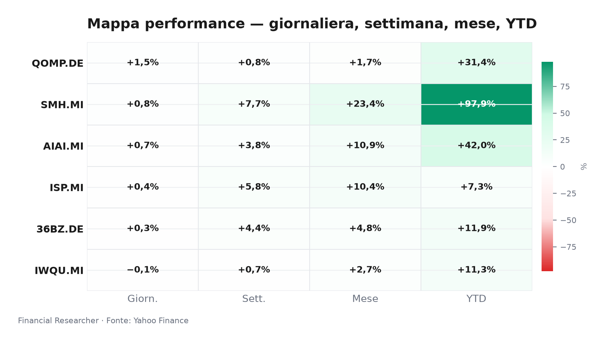
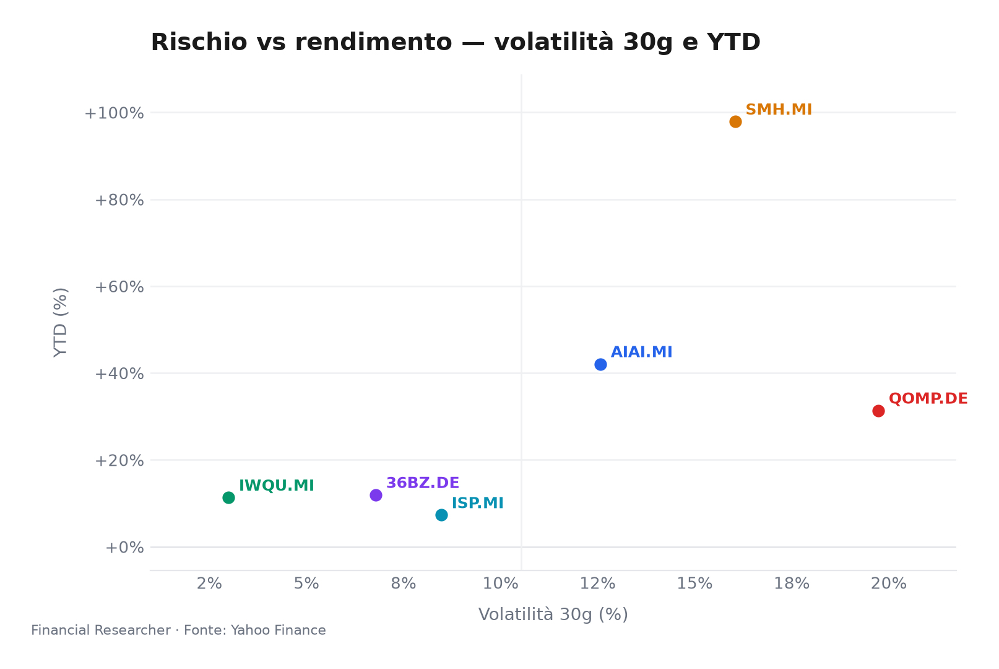
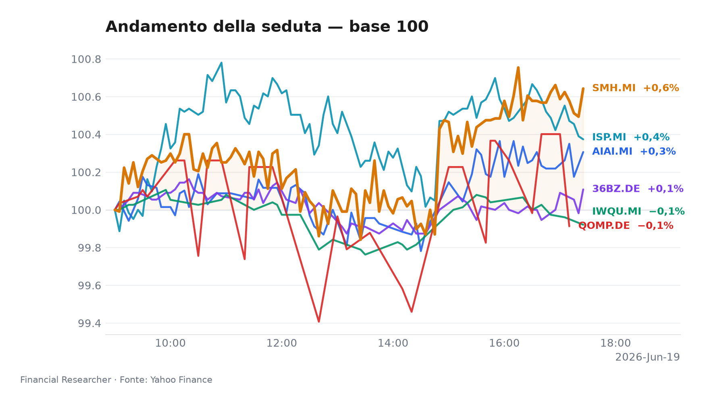
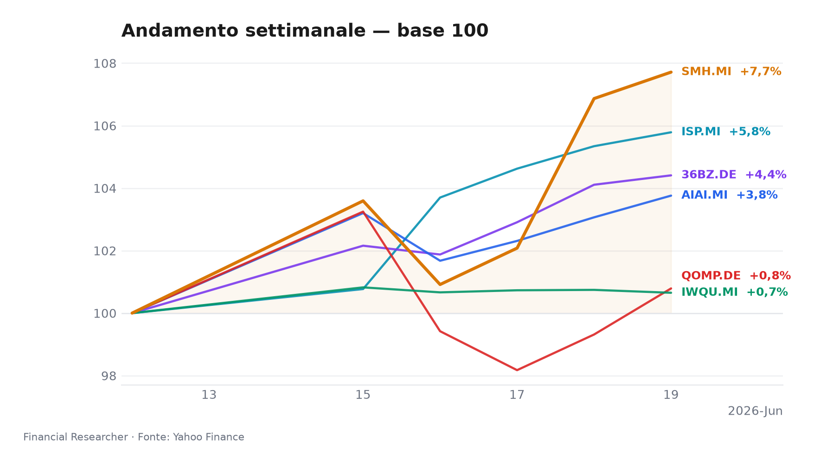
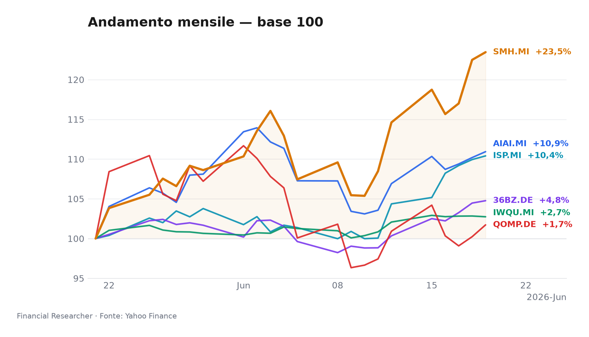
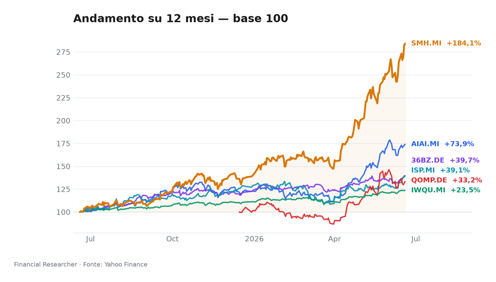

**Milan Executive Watchlist — Close Borsa Italiana, 19 giugno 2026**  
*Milano chiude in modalità «risk-on selettivo»: l’AI accende i beta lunghi, il quality resta con la mano sul freno.*

## Executive Summary

- **L&G Artificial Intelligence UCITS ETF (AIAI.MI)**: 1D ▲+0.67%, 1W ▲+3.76%, YTD ▲+42.05%; nessun catalyst materiale in prefetch, quindi il rally è una lettura di esposizione ad AI e data-center. La chiave per lo stratega è distinguere flussi tematici da earnings breadth: senza headline, il tema resta beta puro [1].
- **VanEck Semiconductor UCITS ETF (SMH.MI)**: 1D ▲+0.79%, 1W ▲+7.71%, YTD ▲+97.90%; il driver dominante è il momentum semiconduttori, con AI capex e utili hardware come contesto. Il punto da monitorare è se l’allargamento degli utili sostenga il multiplo o solo i ricavi [2].
- **iShares Edge MSCI World Quality Factor UCITS ETF USD (Acc) (IWQU.MI)**: 1D ▼-0.09%, 1W ▲+0.65%, YTD ▲+11.31%; qualità globale difensiva, ma oggi meno favorita rispetto ai beta AI. Il taglio BCE è supporto di sfondo per cash flow stabili, non un acceleratore immediato [3], [7].
- **iShares Quantum Computing UCITS ETF USD (Acc) (QOMP.DE)**: 1D ▲+1.48%, 1W ▲+0.79%, YTD ▲+31.35%; quantum resta opzionalità long-duration, più sensibile a policy/tech milestones che agli utili. La lettura strategica è theme optionality: alto potenziale, ma validation ancora lontana [4].
- **iShares MSCI China A UCITS ETF (36BZ.DE)**: 1D ▲+0.29%, 1W ▲+4.41%, YTD ▲+11.93%; A-share beta dipende da fiscal/property support, yuan e domanda domestica. Il rally è leggibile come policy beta, ma la sostenibilità richiede dati macro cinesi meno fragili [5].
- **Intesa Sanpaolo S.p.A. (ISP.MI)**: 1D ▲+0.42%, 1W ▲+5.79%, YTD ▲+7.28%; headline Simply Wall St. segnala nessun nuovo segnale analisti, mentre MPS resta catalyst di medio periodo. Per lo stratega, il nodo è qualità del capitale e disciplina sui dividendi [6], [7].

## Watchlist Performance Snapshot

**Leader 1D:** iShares Quantum Computing UCITS ETF USD (Acc) (QOMP.DE) (1.48%) · **Laggard 1D:** iShares Edge MSCI World Quality Factor UCITS ETF USD (Acc) (IWQU.MI) (-0.09%)

| Ref | Strumento | Ticker | Prezzo (valuta) | Giornaliera | Settimanale | Mensile | YTD | 1A | Vol. 30g | Fonte |
|-----|-----------|--------|-----------------|-------------|-------------|---------|-----|-----|--------|-------|
| [1] | L&G Artificial Intelligence UCITS ETF | AIAI.MI | 34,35 EUR | 0,67% | 3,76% | 10,93% | 42,05% | 73,95% | 12,57% | [1] |
| [2] | VanEck Semiconductor UCITS ETF | SMH.MI | 108,23 EUR | 0,79% | 7,71% | 23,45% | 97,90% | 184,07% | 16,04% | [2] |
| [3] | iShares Edge MSCI World Quality Factor UCITS ETF USD (Acc) | IWQU.MI | 75,76 EUR | -0,09% | 0,65% | 2,74% | 11,31% | 23,47% | 2,99% | [3] |
| [4] | iShares Quantum Computing UCITS ETF USD (Acc) | QOMP.DE | 5,74 EUR | 1,48% | 0,79% | 1,72% | 31,35% | 33,23% | 19,73% | [4] |
| [5] | iShares MSCI China A UCITS ETF | 36BZ.DE | 5,57 EUR | 0,29% | 4,41% | 4,76% | 11,93% | 39,74% | 6,78% | [5] |
| [6] | Intesa Sanpaolo S.p.A. | ISP.MI | 6,18 EUR | 0,42% | 5,79% | 10,40% | 7,28% | 39,13% | 8,47% | [6] |
| — | FTSE MIB | FTSEMIB.MI | 52848,93 EUR | 0,48% | 4,64% | 7,46% | 16,47% | 35,71% | 5,22% | — |
| — | STOXX Europe 600 | ^STOXX | 635,61 EUR | -0,24% | 2,27% | 3,97% | 5,63% | 18,61% | 4,35% | — |

### Performance Charts

## What's Driving the Moves

- **L&G Artificial Intelligence UCITS ETF (AIAI.MI)** — BACKGROUND: nessuna notizia materiale nel prefetch; non attribuisco il movimento 1D a una headline causale. La lettura utile è l’esposizione a software, infrastruttura dati e semiconduttori abilitanti, con flussi e breadth del tema come variabili di mercato [1].
- **VanEck Semiconductor UCITS ETF (SMH.MI)** — BACKGROUND: nessuna notizia materiale; il momentum resta guidato da semiconduttori e AI capex. Il driver osservabile è la domanda di data center e la normalizzazione della supply chain, non un evento issuer-specific [2].
- **iShares Edge MSCI World Quality Factor UCITS ETF USD (Acc) (IWQU.MI)** — BACKGROUND: nessuna notizia materiale; il fattore quality premia cash flow resilienti, ma oggi resta meno favorito dei beta AI. Il taglio BCE è contesto di tasso, non una causal headline sull’ETF [3], [7].
- **iShares Quantum Computing UCITS ETF USD (Acc) (QOMP.DE)** — BACKGROUND: nessuna notizia materiale; quantum è più sensibile a milestone tecnologiche e policy funding che a utili correnti. Il rimbalzo 1D va letto come opzionalità long-duration, non come segnale fondamentale definitivo [4].
- **iShares MSCI China A UCITS ETF (36BZ.DE)** — BACKGROUND: nessuna notizia materiale; l’indice China A resta un barometro di fiscal support, property stabilization e yuan. La forza 1W indica policy beta, ma il tema resta fragile senza domanda domestica [5].
- **Intesa Sanpaolo S.p.A. (ISP.MI)** — BACKGROUND/RESEARCH: la headline Simply Wall St. «How The Intesa Sanpaolo (BIT:ISP) Investment Story Is Evolving Without New Analyst Signals» segnala assenza di nuove revisioni analisti; il contesto operativo resta l’offerta pubblica di scambio su MPS e il timetable di integrazione [7].

## Medium-Term Outlook

- **Bull — trigger by 2026-09-30:** se il percorso BCE dopo il taglio di 25bp resta credibile [7], gli utili AI confermano il capex e Pechino stabilizza domanda e property, **L&G Artificial Intelligence UCITS ETF (AIAI.MI)**, **VanEck Semiconductor UCITS ETF (SMH.MI)**, **iShares Quantum Computing UCITS ETF USD (Acc) (QOMP.DE)**, **iShares MSCI China A UCITS ETF (36BZ.DE)** e **Intesa Sanpaolo S.p.A. (ISP.MI)** beneficiano di discount rate e risk premium più bassi; **iShares Edge MSCI World Quality Factor UCITS ETF USD (Acc) (IWQU.MI)** cattura resilienza earnings.
- **Base — 2026-H2/2027-H1:** easing BCE graduale, Fed data-dependent e supporto Cina discontinuo lasciano positivo il core quality/AI, tattici quantum e China A, stabile **Intesa Sanpaolo S.p.A. (ISP.MI)** se NII, dividendi e buyback restano difendibili.
- **Bear — trigger by 2026-12-31:** inflazione rialzista, shock geopolitico, export controls su AI o rialzo dei credit costs comprimono multipli growth e quality, mentre **Intesa Sanpaolo S.p.A. (ISP.MI)** paga spread bancari e rischio integrazione MPS.

## Event Calendar

| Date (YYYY-MM-DD) | Event | Affected tickers/themes | Impact | [N] |
|---|---|---|---|---|
|  |  |  |  |  |

## Correlated Themes

- **AI stack:** **L&G Artificial Intelligence UCITS ETF (AIAI.MI)**, **VanEck Semiconductor UCITS ETF (SMH.MI)** e **iShares Quantum Computing UCITS ETF USD (Acc) (QOMP.DE)** condividono sensibilità a duration e risk appetite, ma con maturità diverse: AI applicata, semiconduttori e opzionalità computazionale.
- **Rates channel:** il taglio BCE sostiene **iShares Edge MSCI World Quality Factor UCITS ETF USD (Acc) (IWQU.MI)** e i growth ETF; per **Intesa Sanpaolo S.p.A. (ISP.MI)** il beneficio dipende da curva, credit costs e stabilità del funding.
- **Policy channel:** **iShares MSCI China A UCITS ETF (36BZ.DE)** e **Intesa Sanpaolo S.p.A. (ISP.MI)** sono entrambi policy-beta, ma il primo risponde a Pechino, il secondo a regolatori, MPS e consolidamento bancario italiano.

## Risks & Watchpoints

- **Rates/inflation:** un rimbalzo inflattivo riaprirebbe il trade dei rendimenti reali e comprimerebbe i multipli dei beta growth, incluso il quality più difensivo [7].
- **Concentration/liquidity:** **L&G Artificial Intelligence UCITS ETF (AIAI.MI)**, **VanEck Semiconductor UCITS ETF (SMH.MI)** e **iShares Quantum Computing UCITS ETF USD (Acc) (QOMP.DE)** restano esposti a flussi tematici e nicchie di liquidità.
- **China policy/FX:** **iShares MSCI China A UCITS ETF (36BZ.DE)** può perdere slancio se fiscal support, property e yuan non confermano il rally.
- **Bank execution:** **Intesa Sanpaolo S.p.A. (ISP.MI)** deve trasformare MPS in valore senza diluire disciplina su capitale, dividendi e buyback.
- **Data limitations:** nessun evento forward confermato nel calendario; AUM mancante per **iShares MSCI China A UCITS ETF (36BZ.DE)**; nessuna headline materiale per gli ETF; quotazioni close 2026-06-19 in EUR, senza effetto FX.

## References

1. Yahoo Finance — AIAI.MI (L&G Artificial Intelligence UCITS ETF) — 2026-06-19 — https://finance.yahoo.com/quote/AIAI.MI
2. Yahoo Finance — SMH.MI (VanEck Semiconductor UCITS ETF) — 2026-06-19 — https://finance.yahoo.com/quote/SMH.MI
3. Yahoo Finance — IWQU.MI (iShares Edge MSCI World Quality Factor UCITS ETF USD (Acc)) — 2026-06-19 — https://finance.yahoo.com/quote/IWQU.MI
4. Yahoo Finance — QOMP.DE (iShares Quantum Computing UCITS ETF USD (Acc)) — 2026-06-19 — https://finance.yahoo.com/quote/QOMP.DE
5. Yahoo Finance — 36BZ.DE (iShares MSCI China A UCITS ETF) — 2026-06-19 — https://finance.yahoo.com/quote/36BZ.DE
6. Yahoo Finance — ISP.MI (Intesa Sanpaolo S.p.A.) — 2026-06-19 — https://finance.yahoo.com/quote/ISP.MI
7. The Wall Street Journal — Stocks to Watch Recap: Marvell Technology, Apple, Broadcom, Strategy — 2026-06-08 — https://finance.yahoo.com/m/34a0ce12-e5d0-369b-99dd-2a53210f0376/stocks-to-watch-recap-.html

## Disclaimer

Il briefing è informativo e non costituisce consulenza finanziaria, raccomandazione di investimento né sollecitazione all’acquisto, vendita o sottoscrizione di strumenti.

<!-- financial-researcher:run-metadata -->
## Run metadata

| | |
|---|---|
| Model profile | free_openrouter_nex |
| Processing time | 8m 28s |
| LLM requests | 9 |
| Tokens (prompt / completion / total) | 30,893 / 39,889 / 70,782 |

**Models by agent**

| Agent | Model (configured → resolved) |
|---|---|
| Market analyst | `openrouter/nex-agi/nex-n2-pro:free` → `nex-agi/nex-n2-pro:free` |
| News analyst | `openrouter/nex-agi/nex-n2-pro:free` → `nex-agi/nex-n2-pro:free` |
| Outlook analyst | `openrouter/nex-agi/nex-n2-pro:free` → `nex-agi/nex-n2-pro:free` |
| Calendar analyst | `openrouter/nex-agi/nex-n2-pro:free` → `nex-agi/nex-n2-pro:free` |
| Chief strategist | `openrouter/nex-agi/nex-n2-pro:free` → `nex-agi/nex-n2-pro:free` |
<!-- /financial-researcher:run-metadata -->
