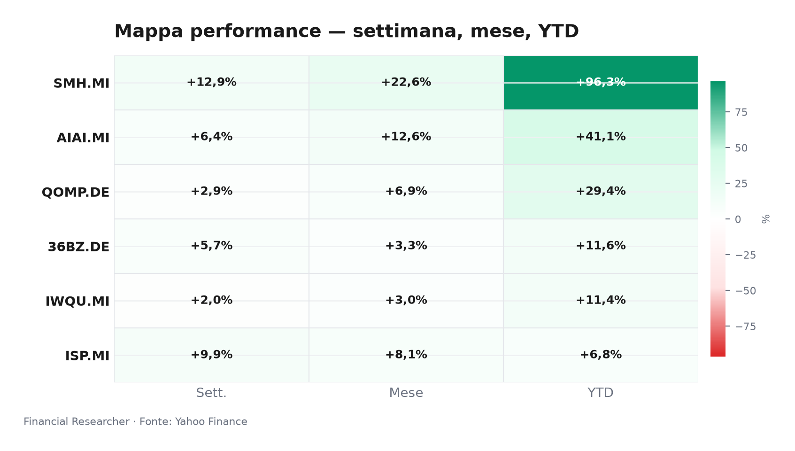
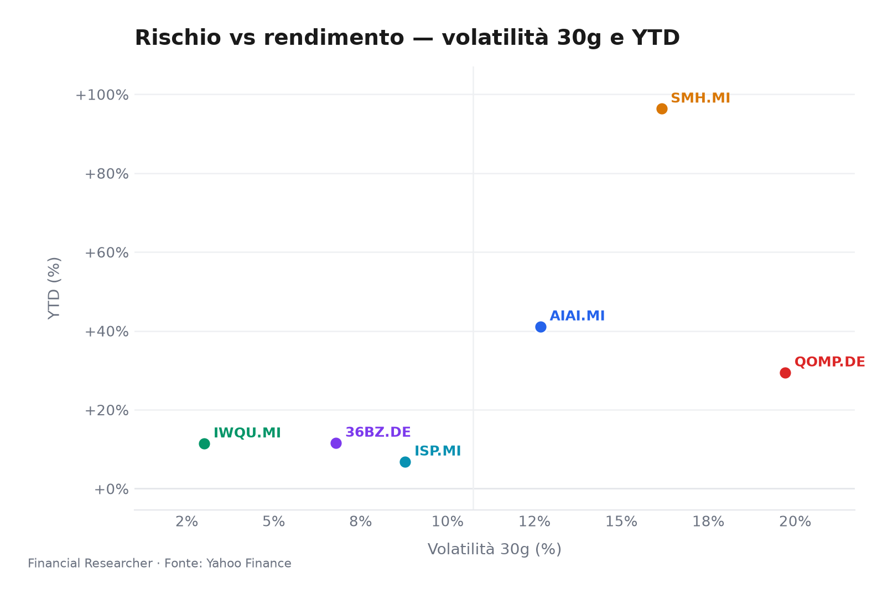
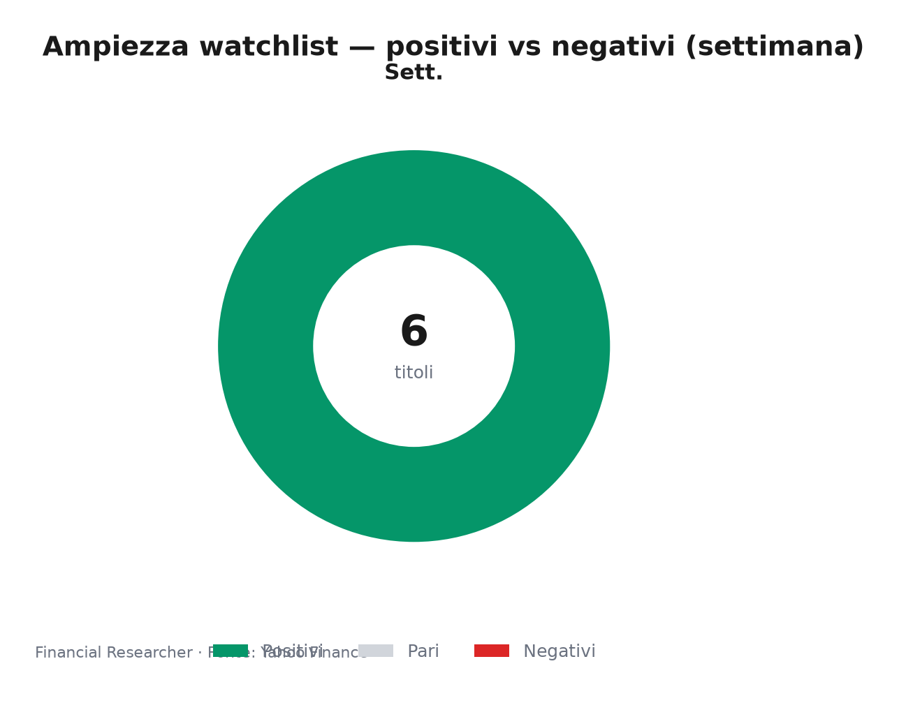

# Milan Market Watchlist Briefing — Pre-open, 2026-06-19

Markets are chasing AI heat, but Milan’s pre-open read is less “broad risk-on” than “capital rotating into the strongest technology and banking stories.”

## Executive Summary

- **L&G Artificial Intelligence UCITS ETF (AIAI.MI)**: the AI theme remains firmly in leadership mode, with **L&G Artificial Intelligence UCITS ETF (AIAI.MI)** up ▲0.74% on the day, ▲6.39% over one week and ▲41.10% year to date, as investors continue to price AI capex visibility into listed thematic exposure [1].
- **VanEck Semiconductor UCITS ETF (SMH.MI)**: **VanEck Semiconductor UCITS ETF (SMH.MI)** is the clear momentum leader, up ▲4.69% 1D, ▲12.91% 1W and ▲96.34% YTD, led by semiconductor and AI-hardware demand expectations rather than issuer-specific news [2].
- **iShares Edge MSCI World Quality Factor UCITS ETF USD (Acc) (IWQU.MI)**: **iShares Edge MSCI World Quality Factor UCITS ETF USD (Acc) (IWQU.MI)** is the calm anchor, up a modest ▲0.01% 1D, ▲1.98% 1W and ▲11.42% YTD, signalling that quality exposure is participating but not leading the current rally [3].
- **iShares Quantum Computing UCITS ETF USD (Acc) (QOMP.DE)**: **iShares Quantum Computing UCITS ETF USD (Acc) (QOMP.DE)** is rising ▲1.16% 1D, ▲2.87% 1W and ▲29.43% YTD, benefiting from technology sentiment while remaining more event-driven and less liquid than core AI/semiconductor exposure [4].
- **iShares MSCI China A UCITS ETF (36BZ.DE)**: **iShares MSCI China A UCITS ETF (36BZ.DE)** is up ▲1.17% 1D, ▲5.70% 1W and ▲11.60% YTD, with China A beta improving but still dependent on policy support, FX stability and earnings repair [5].
- **Intesa Sanpaolo S.p.A. (ISP.MI)**: **Intesa Sanpaolo S.p.A. (ISP.MI)** is the Milan banking watchpoint, up ▲0.69% 1D, ▲9.88% 1W and ▲6.83% YTD; the key medium-term debate is whether the MPS bid and capital-return profile can offset NII normalisation and sovereign-spread risk [6].

## Watchlist Performance Snapshot

**Leader 1D:** VanEck Semiconductor UCITS ETF (SMH.MI) (4.69%) · **Laggard 1D:** iShares Edge MSCI World Quality Factor UCITS ETF USD (Acc) (IWQU.MI) (0.01%)

| Ref | Strumento | Ticker | Prezzo (valuta) | Giornaliera | Settimanale | Mensile | YTD | 1A | Vol. 30g | Fonte |
|-----|-----------|--------|-----------------|-------------|-------------|---------|-----|-----|--------|-------|
| [1] | L&G Artificial Intelligence UCITS ETF | AIAI.MI | 34,12 EUR | 0,74% | 6,39% | 12,55% | 41,10% | 70,66% | 12,67% | [1] |
| [2] | VanEck Semiconductor UCITS ETF | SMH.MI | 107,38 EUR | 4,69% | 12,91% | 22,57% | 96,34% | 177,29% | 16,15% | [2] |
| [3] | iShares Edge MSCI World Quality Factor UCITS ETF USD (Acc) | IWQU.MI | 75,83 EUR | 0,01% | 1,98% | 3,04% | 11,42% | 22,56% | 3,00% | [3] |
| [4] | iShares Quantum Computing UCITS ETF USD (Acc) | QOMP.DE | 5,66 EUR | 1,16% | 2,87% | 6,86% | 29,43% | 31,28% | 19,71% | [4] |
| [5] | iShares MSCI China A UCITS ETF | 36BZ.DE | 5,55 EUR | 1,17% | 5,70% | 3,33% | 11,60% | 39,09% | 6,79% | [5] |
| [6] | Intesa Sanpaolo S.p.A. | ISP.MI | 6,15 EUR | 0,69% | 9,88% | 8,06% | 6,83% | 36,47% | 8,78% | [6] |
| — | FTSE MIB | FTSEMIB.MI | 52688,22 EUR | 0,18% | 5,13% | 8,77% | 15,91% | 33,43% | 5,32% | — |
| — | STOXX Europe 600 | ^STOXX | 637,14 EUR | -0,34% | 3,42% | 4,78% | 6,24% | 18,32% | 4,32% | — |

### Performance Charts

## What's Driving the Moves

- **L&G Artificial Intelligence UCITS ETF (AIAI.MI)**: no material issuer-specific headline was found; the 1D and 1W move should be read through AI thematic ETF NAV exposure, hyperscaler capex expectations and the broader semiconductor/AI hardware complex [1].
- **VanEck Semiconductor UCITS ETF (SMH.MI)**: no material issuer-specific headline was found; the move is being driven by semiconductor/AI hardware exposure, with **VanEck Semiconductor UCITS ETF (SMH.MI)** acting as the highest-beta Milan-listed proxy for AI infrastructure demand [2].
- **iShares Edge MSCI World Quality Factor UCITS ETF USD (Acc) (IWQU.MI)**: no material issuer-specific headline was found; the muted move reflects global quality-factor exposure, where earnings resilience supports participation but technology-led rotation limits relative leadership [3].
- **iShares Quantum Computing UCITS ETF USD (Acc) (QOMP.DE)**: no material issuer-specific headline was found; the advance reflects quantum-computing thematic sentiment and risk appetite, not a company-level catalyst [4].
- **iShares MSCI China A UCITS ETF (36BZ.DE)**: no material issuer-specific headline was found; the move is tied to China A market sentiment, yuan dynamics and the market’s search for policy-supported beta [5].
- **Intesa Sanpaolo S.p.A. (ISP.MI)**: the relevant background item is “How The Intesa Sanpaolo (BIT:ISP) Investment Story Is Evolving Without New Analyst Signals,” which frames **Intesa Sanpaolo S.p.A. (ISP.MI)** as a bank whose investment narrative is evolving without fresh analyst signals, while the MPS bid and capital-return expectations remain the strategic variables [7].

## Medium-Term Outlook

- **Bull case — dated trigger: 2026-06-19 onward**: **L&G Artificial Intelligence UCITS ETF (AIAI.MI)** and **VanEck Semiconductor UCITS ETF (SMH.MI)** benefit if hyperscaler capex and semiconductor order data stay firm; **iShares Edge MSCI World Quality Factor UCITS ETF USD (Acc) (IWQU.MI)** outperforms if growth softens without earnings deterioration; **iShares Quantum Computing UCITS ETF USD (Acc) (QOMP.DE)** rallies on policy or funding headlines; **iShares MSCI China A UCITS ETF (36BZ.DE)** rebounds on credible fiscal or monetary easing; and **Intesa Sanpaolo S.p.A. (ISP.MI)** rerates if the yield curve stays benign and capital return is confirmed [7][8][9][10][11][12].
- **Base case — dated trigger: 2026-06-19 onward**: AI leaders offset valuation and export-control concerns, allowing **L&G Artificial Intelligence UCITS ETF (AIAI.MI)** and **VanEck Semiconductor UCITS ETF (SMH.MI)** to remain volatile but supported; **iShares Edge MSCI World Quality Factor UCITS ETF USD (Acc) (IWQU.MI)** acts as a defensive ballast; **iShares Quantum Computing UCITS ETF USD (Acc) (QOMP.DE)** trades on sentiment more than fundamentals; **iShares MSCI China A UCITS ETF (36BZ.DE)** remains range-bound as policy offsets property and earnings drag; and **Intesa Sanpaolo S.p.A. (ISP.MI)** balances gradual ECB easing against NII normalisation [7][8][9][10][11][12].
- **Bear case — dated trigger: 2026-06-19 onward**: hotter US data, higher real yields or weaker AI guidance would pressure **L&G Artificial Intelligence UCITS ETF (AIAI.MI)**, **VanEck Semiconductor UCITS ETF (SMH.MI)** and **iShares Quantum Computing UCITS ETF USD (Acc) (QOMP.DE)**; **iShares Edge MSCI World Quality Factor UCITS ETF USD (Acc) (IWQU.MI)** would likely de-rate less but still participate in a broad risk-off move; **iShares MSCI China A UCITS ETF (36BZ.DE)** would suffer from yuan pressure or stimulus disappointment; and **Intesa Sanpaolo S.p.A. (ISP.MI)** would face multiple compression if Italian spreads widen or asset quality deteriorates [7][13][8][10][11][12].

## Event Calendar

| Date (YYYY-MM-DD) | Event | Affected tickers/themes | Impact | [N] |
|---|---|---|---|---|
| 2026-06-19 | No confirmed forward events in window after verification; Yahoo Finance calendar had no confirmed forward events. | AIAI.MI, SMH.MI, IWQU.MI, QOMP.DE, 36BZ.DE, ISP.MI | Earnings | [0] |

## Correlated Themes

- **AI capex and semiconductor earnings dispersion**: **L&G Artificial Intelligence UCITS ETF (AIAI.MI)** and **VanEck Semiconductor UCITS ETF (SMH.MI)** are linked by the same demand chain, but **VanEck Semiconductor UCITS ETF (SMH.MI)** carries more direct semiconductor beta while **L&G Artificial Intelligence UCITS ETF (AIAI.MI)** blends AI software, infrastructure and platform exposure [1][2].
- **Quality versus duration**: **iShares Edge MSCI World Quality Factor UCITS ETF USD (Acc) (IWQU.MI)** should be read as the lower-volatility counterweight to **iShares Quantum Computing UCITS ETF USD (Acc) (QOMP.DE)**, because quality earnings tend to cushion multiple compression when rates rise [3][4].
- **China policy beta and FX**: **iShares MSCI China A UCITS ETF (36BZ.DE)** is sensitive to policy credibility, yuan stability and domestic credit impulse; a stronger USD can therefore cap gains even when local policy headlines improve [5][13].
- **Italian banks and sovereign spreads**: **Intesa Sanpaolo S.p.A. (ISP.MI)** is driven by ECB easing expectations, net interest income normalisation, dividend/buyback capacity and the Italian sovereign-risk channel; the MPS bid adds strategic upside but also execution and regulatory complexity [12].

## Risks & Watchpoints

- **Rates and real yields**: hotter US CPI or labour data could lift real yields, pressuring long-duration technology, quantum and semiconductor valuations while lifting the discount rate applied to banks [7].
- **AI capex disappointment**: any sign that hyperscaler spending is slowing would hit **L&G Artificial Intelligence UCITS ETF (AIAI.MI)** and **VanEck Semiconductor UCITS ETF (SMH.MI)** faster than broad quality exposure [8].
- **China policy and FX risk**: **iShares MSCI China A UCITS ETF (36BZ.DE)** remains vulnerable to yuan weakness, property drag or stimulus that fails to translate into credit growth [13][11].
- **Italian banking execution risk**: **Intesa Sanpaolo S.p.A. (ISP.MI)** faces integration, regulatory and capital-allocation risk around the MPS bid, even if the strategic rationale is clear [12].
- **Data limitations**: no live futures or order-book data were available; **iShares MSCI China A UCITS ETF (36BZ.DE)** has missing AUM; **iShares Edge MSCI World Quality Factor UCITS ETF USD (Acc) (IWQU.MI)** and **iShares Quantum Computing UCITS ETF USD (Acc) (QOMP.DE)** carry embedded USD exposure; and no material issuer-specific headlines were found for the five ETFs [3][4][5].

## Disclaimer

This briefing is for strategic information purposes only and does not constitute investment advice, a recommendation, an offer, or a solicitation to buy or sell any financial instrument. Performance figures are historical and do not guarantee future results.

## References

1. Yahoo Finance — AIAI.MI (L&G Artificial Intelligence UCITS ETF) — 2026-06-19 — https://finance.yahoo.com/quote/AIAI.MI
2. Yahoo Finance — SMH.MI (VanEck Semiconductor UCITS ETF) — 2026-06-19 — https://finance.yahoo.com/quote/SMH.MI
3. Yahoo Finance — IWQU.MI (iShares Edge MSCI World Quality Factor UCITS ETF USD (Acc)) — 2026-06-19 — https://finance.yahoo.com/quote/IWQU.MI
4. Yahoo Finance — QOMP.DE (iShares Quantum Computing UCITS ETF USD (Acc)) — 2026-06-19 — https://finance.yahoo.com/quote/QOMP.DE
5. Yahoo Finance — 36BZ.DE (iShares MSCI China A UCITS ETF) — 2026-06-19 — https://finance.yahoo.com/quote/36BZ.DE
6. Yahoo Finance — ISP.MI (Intesa Sanpaolo S.p.A.) — 2026-06-19 — https://finance.yahoo.com/quote/ISP.MI
7. The Wall Street Journal — Stocks to Watch Recap: Marvell Technology, Apple, Broadcom, Strategy — 2026-06-08 — https://finance.yahoo.com/m/34a0ce12-e5d0-369b-99dd-2a53210f0376/stocks-to-watch-recap-.html

<!-- financial-researcher:run-metadata -->
## Run metadata

| | |
|---|---|
| Model profile | free_openrouter_nex |
| Processing time | 5m 4s |
| LLM requests | 6 |
| Tokens (prompt / completion / total) | 18,868 / 33,355 / 52,223 |

**Models by agent**

| Agent | Model (configured → resolved) |
|---|---|
| Market analyst | `openrouter/nex-agi/nex-n2-pro:free` → `nex-agi/nex-n2-pro:free` |
| News analyst | `openrouter/nex-agi/nex-n2-pro:free` → `nex-agi/nex-n2-pro:free` |
| Outlook analyst | `openrouter/nex-agi/nex-n2-pro:free` → `nex-agi/nex-n2-pro:free` |
| Calendar analyst | `openrouter/nex-agi/nex-n2-pro:free` → `nex-agi/nex-n2-pro:free` |
| Chief strategist | `openrouter/nex-agi/nex-n2-pro:free` → `nex-agi/nex-n2-pro:free` |
<!-- /financial-researcher:run-metadata -->
