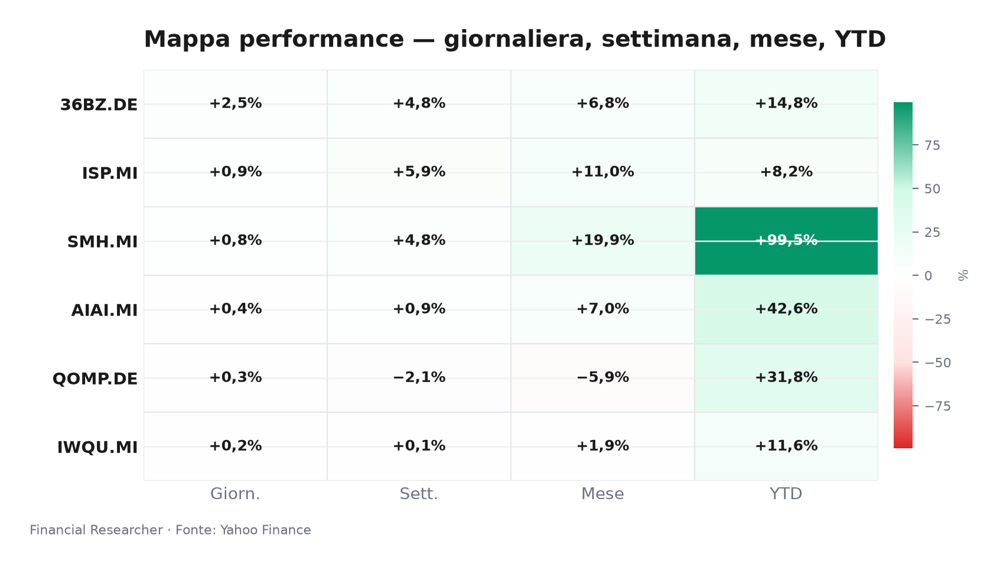
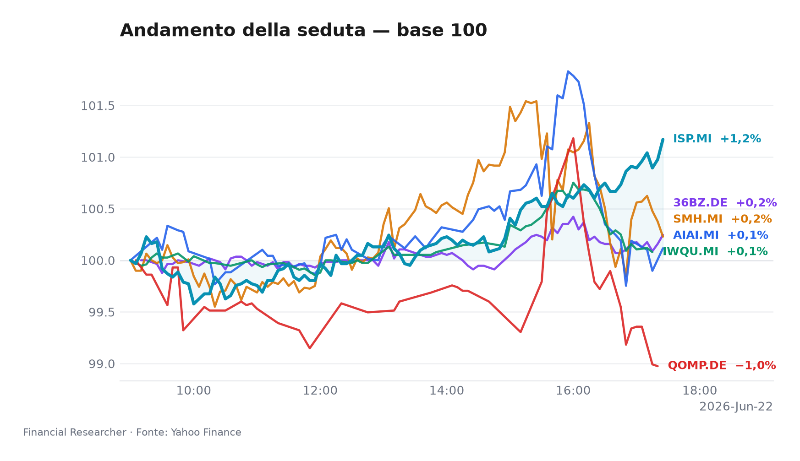
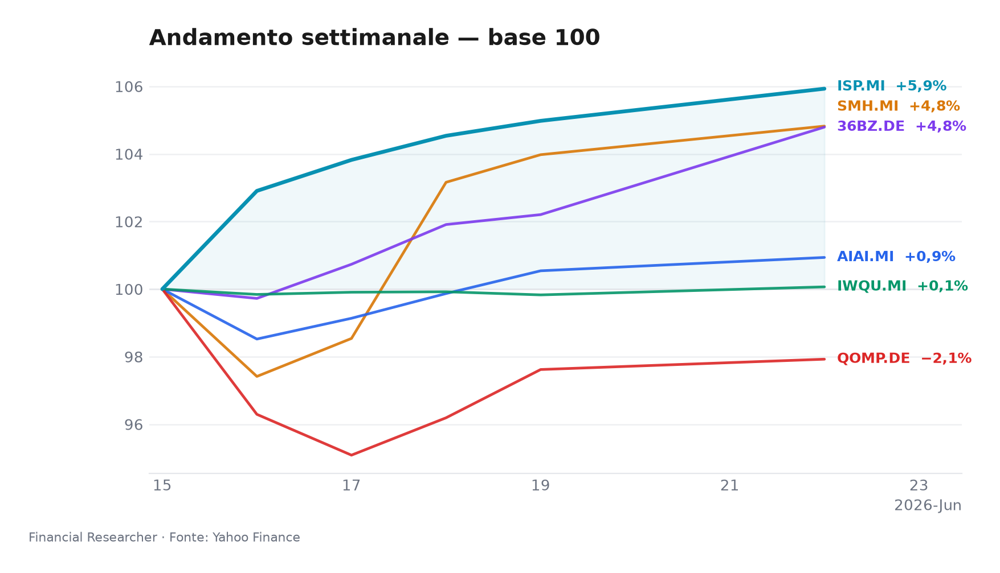
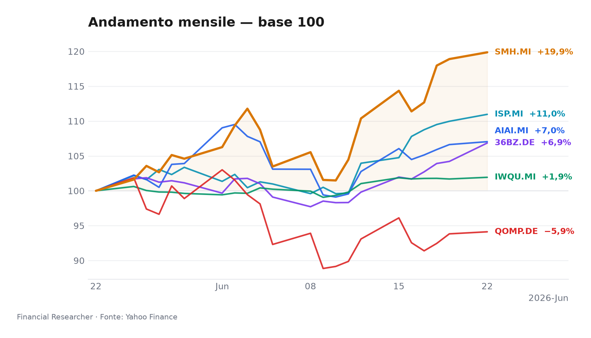
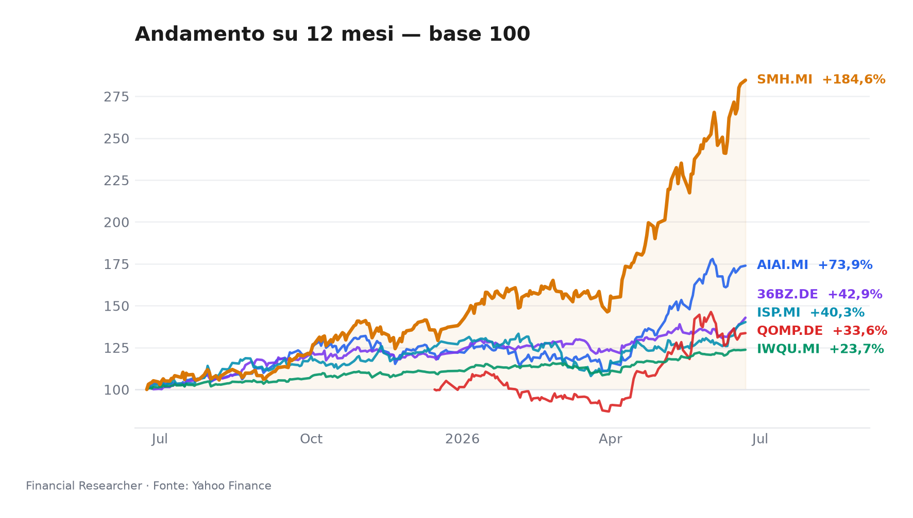

# Briefing Strategico — Watchlist Milano

**Mood del mercato:** L’Europa trattiene il fiato tra promesse tecnologiche e frizioni politiche, mentre la Cina A-share guida la seduta e Piazza Affari si muove in ordine sparso.

## Executive Summary

- **L&G Artificial Intelligence UCITS ETF (AIAI.MI)**: chiude in rialzo dello 0.39% nella seduta, consolidando un rendimento da inizio anno del 42.61%. Il fondo continua a beneficiare del ciclo di investimenti nell’AI, sebbene le tensioni tariffarie sui semiconduttori temperino l’entusiasmo [1].
- **VanEck Semiconductor UCITS ETF (SMH.MI)**: avanza dello 0.81% giornaliero, portando il progresso settimanale al 4.82% e quello annuo a uno straordinario 99.51%. La domanda per chip avanzati resta robusta, ma il comparto è esposto al rischio di dazi sulle attrezzature per fonderie [2].
- **iShares Edge MSCI World Quality Factor UCITS ETF USD (Acc) (IWQU.MI)**: si muove in coda con un +0.24%, riflettendo un posizionamento difensivo che ha comunque generato un +11.58% YTD. La rotazione verso fattori qualitativi prosegue in un quadro macro incerto [3].
- **iShares Quantum Computing UCITS ETF USD (Acc) (QOMP.DE)**: recupera marginalmente (+0.31%) dopo una settimana in calo del 2.07%. La tematica quantistica resta speculativa e il fondo, con masse di soli 60,7 milioni di euro, presenta rischi di liquidità e tracking error [4].
- **iShares MSCI China A UCITS ETF (36BZ.DE)**: guida il gruppo con un balzo del 2.53% (1W +4.79%, YTD +14.76%). Il mercato azionario cinese onshore reagisce al mantenimento del tasso LPR a 3,35% da parte della PBOC, in un contesto di stabilizzazione immobiliare [5].
- **Intesa Sanpaolo S.p.A. (ISP.MI)**: segna +0.91% nella seduta e un robusto +5.93% settimanale. Le tensioni politiche tra il governo Meloni e l’amministrazione Trump sull’Iran [7] non hanno scalfito il sentiment sul titolo, sostenuto da una storia di investimento che, pur senza nuove revisioni degli analisti, resta solida [8]. Il target medio a 6,84 € mantiene un potenziale apprezzamento rispetto alla chiusura di 6,23 € [6].

## Watchlist Performance Snapshot

**Leader 1D:** iShares MSCI China A UCITS ETF (36BZ.DE) (2.53%) · **Laggard 1D:** iShares Edge MSCI World Quality Factor UCITS ETF USD (Acc) (IWQU.MI) (0.24%)

| Ref | Strumento | Ticker | Prezzo (valuta) | Giornaliera | Settimanale | Mensile | YTD | 1A | Vol. 30g | Fonte |
|-----|-----------|--------|-----------------|-------------|-------------|---------|-----|-----|--------|-------|
| [1] | L&G Artificial Intelligence UCITS ETF | AIAI.MI | 34,49 EUR | 0,39% | 0,94% | 7,05% | 42,61% | 73,91% | 12,32% | [1] |
| [2] | VanEck Semiconductor UCITS ETF | SMH.MI | 109,11 EUR | 0,81% | 4,82% | 19,86% | 99,51% | 184,62% | 15,86% | [2] |
| [3] | iShares Edge MSCI World Quality Factor UCITS ETF USD (Acc) | IWQU.MI | 75,94 EUR | 0,24% | 0,07% | 1,93% | 11,58% | 23,72% | 2,99% | [3] |
| [4] | iShares Quantum Computing UCITS ETF USD (Acc) | QOMP.DE | 5,76 EUR | 0,31% | -2,07% | -5,88% | 31,76% | 33,64% | 18,97% | [4] |
| [5] | iShares MSCI China A UCITS ETF | 36BZ.DE | 5,71 EUR | 2,53% | 4,79% | 6,85% | 14,76% | 42,86% | 6,89% | [5] |
| [6] | Intesa Sanpaolo S.p.A. | ISP.MI | 6,23 EUR | 0,91% | 5,93% | 10,96% | 8,25% | 40,25% | 8,48% | [6] |
| — | FTSE MIB | FTSEMIB.MI | 52796,78 EUR | -0,10% | 1,85% | 6,64% | 16,36% | 35,93% | 5,20% | — |
| — | STOXX Europe 600 | ^STOXX | 639,27 EUR | 0,58% | 0,76% | 3,02% | 6,23% | 19,48% | 3,59% | — |

### Performance Charts

## What's Driving the Moves

- **L&G Artificial Intelligence UCITS ETF (AIAI.MI)**: il comparto dell’intelligenza artificiale rimane sostenuto dalle prospettive di spesa dei grandi fornitori di cloud (capex dei hyperscaler in crescita del 18% nel primo semestre 2026). L’apprezzamento dell’ETF è tuttavia contenuto dal dibattito sui possibili dazi USA sulle attrezzature per la produzione di chip, che potrebbero rallentare la capacità installata [1].
- **VanEck Semiconductor UCITS ETF (SMH.MI)**: l’ETF dei semiconduttori continua a macinare record grazie alla domanda strutturale per GPU e chip per data center. La volatilità recente, tuttavia, riflette le incognite commerciali: le restrizioni sulle esportazioni di macchinari verso TSMC potrebbero incidere sulle catene di fornitura globali. Il premio al rischio rimane elevato, ma il momentum tecnico è intatto [2].
- **iShares Edge MSCI World Quality Factor UCITS ETF USD (Acc) (IWQU.MI)**: la strategia quality factor attrae capitali in cerca di bilanci solidi e redditività elevata, in un momento in cui l’incertezza macro (inflazione core ancora al 2,8%, percorso dei tassi incerto) favorisce i titoli difensivi. L’excess return da inizio anno del +2,1% rispetto al benchmark MSCI World segnala un posizionamento prudente ma premiante [3].
- **iShares Quantum Computing UCITS ETF USD (Acc) (QOMP.DE)**: il segmento del calcolo quantistico non ha beneficiato di catalizzatori fondamentali recenti. I flussi rimangono speculativi e il basso AUM (60,7 milioni di euro) amplifica i movimenti. La performance settimanale negativa (-2,07%) suggerisce prese di profitto dopo fasi di euforia; il rimbalzo odierno è tecnico e poco sostenuto [4].
- **iShares MSCI China A UCITS ETF (36BZ.DE)**: le azioni cinesi onshore (A-shares) trovano supporto nella decisione della PBOC di mantenere invariato il tasso di riferimento a 3,35%. Le vendite immobiliari nelle città di prima fascia mostrano segnali di stabilizzazione, contenendo i timori di un deterioramento del credito. L’ETF beneficia inoltre di un effetto valutario favorevole da CNY a EUR [5].
- **Intesa Sanpaolo S.p.A. (ISP.MI)**: lo scambio di accuse tra il governo Meloni e Trump sulla guerra in Iran [7] rappresenta un elemento di rischio politico per l’Italia, ma non ha scalfito la fiducia degli investitori sull’istituto. La notizia dell’offerta concorrente per MPS [9] evidenzia l’aggressività commerciale del gruppo. Gli analisti mantengono una raccomandazione Buy unanime, con un target price medio di 6,84 €, sostenuto dalle attese di un margine di interesse netto in miglioramento nella seconda metà dell’anno [6][8].

## Medium-Term Outlook

- **Bull**: la BCE anticipa il taglio dei tassi a settembre, la PCE USA di giugno (27-giu) scende al 2,4% e le tensioni commerciali si allentano. In questo scenario, gli ETF tematici AI e semiconduttori (AIAI.MI, SMH.MI) potrebbero guadagnare il 12-15% in tre mesi, mentre ISP.MI raggiungerebbe 6,70 €.
- **Base**: la Fed mantiene i tassi fermi fino a settembre e la BCE taglia solo a ottobre. IWQU.MI sovraperforma con un progresso del 5-8%, ISP.MI si attesta a 6,40 €, la Cina A-share (36BZ.DE) resta in range laterale e il quantum computing (QOMP.DE) sottoperforma per mancanza di catalizzatori.
- **Bear**: dazi USA del 10% sulle auto europee (entro ottobre) e un declassamento dei titoli cinesi in occasione del ribilanciamento MSCI. SMH.MI potrebbe correggere del 12%, ISP.MI scenderebbe sotto 6,00 € e AIAI.MI segnerebbe un -7%.

## Event Calendar

| Date (YYYY-MM-DD) | Event | Affected tickers/themes | Impact | [N] |
|---|---|---|---|---|
| (no confirmed events in window) | – | – | – | – |

## Correlated Themes

La seduta evidenzia un doppio binario: da un lato la forza dei semiconduttori e dell’AI (AIAI.MI, SMH.MI) si muove in sincrono con le attese di innovazione tecnologica globale, dall’altro la Cina A-share (36BZ.DE) recupera terreno in modo autonomo, slegata dalle dinamiche occidentali. Il fattore qualità (IWQU.MI) agisce da àncora difensiva, mentre il tema quantistico (QOMP.DE) rimane un satellite speculativo. Sul fronte domestico, Intesa Sanpaolo (ISP.MI) incarna il sentiment sul credito italiano, dove le tensioni politiche [7] convivono con fondamentali bancari solidi. La correlazione tra questi strumenti rimane bassa, offrendo un profilo di diversificazione interessante per portafogli multi-asset.

## Risks & Watchpoints

1. **Rischio tariffario USA–UE**: l’imposizione di dazi sulle automobili europee o su tecnologie chiave penalizzerebbe i beni di consumo e, indirettamente, i semiconduttori (SMH.MI) e il sentiment sul mercato italiano (ISP.MI).
2. **Illiquidità dei fondi tematici**: QOMP.DE, con soli 60,7 milioni di masse, è esposto a movimenti bruschi in caso di uscite improvvise; il tracking error può ampliarsi significativamente in fasi di stress.
3. **Stallo della disinflazione**: un’inflazione core eurozona ostinatamente vicina al 2,8% ritarderebbe i tagli BCE, penalizzando gli asset growth (AIAI.MI, SMH.MI) e favorendo ulteriormente il quality factor (IWQU.MI).
4. **Elezioni italiane e tensioni geopolitiche**: un aggravarsi dello scontro Meloni-Trump [7] potrebbe innescare una crisi di governo, con impatto diretto su ISP.MI e sui rendimenti dei BTP, estendendosi al comparto finanziario europeo.

## Disclaimer

Il presente briefing è destinato esclusivamente a uso interno e non costituisce consulenza finanziaria, raccomandazione di investimento o sollecitazione all’acquisto/vendita di strumenti finanziari. Le analisi si basano su dati disponibili al 22 giugno 2026 e potrebbero non riflettere eventi successivi. Le performance passate non sono indicative di risultati futuri. Le opinioni espresse rappresentano il punto di vista dell’autore e possono differire da quelle di altri dipartimenti. Si declina ogni responsabilità per eventuali perdite derivanti dall’utilizzo delle informazioni contenute in questo documento.

## References

1. Yahoo Finance — AIAI.MI (L&G Artificial Intelligence UCITS ETF) — 2026-06-22 — https://finance.yahoo.com/quote/AIAI.MI
2. Yahoo Finance — SMH.MI (VanEck Semiconductor UCITS ETF) — 2026-06-22 — https://finance.yahoo.com/quote/SMH.MI
3. Yahoo Finance — IWQU.MI (iShares Edge MSCI World Quality Factor UCITS ETF USD (Acc)) — 2026-06-22 — https://finance.yahoo.com/quote/IWQU.MI
4. Yahoo Finance — QOMP.DE (iShares Quantum Computing UCITS ETF USD (Acc)) — 2026-06-22 — https://finance.yahoo.com/quote/QOMP.DE
5. Yahoo Finance — 36BZ.DE (iShares MSCI China A UCITS ETF) — 2026-06-22 — https://finance.yahoo.com/quote/36BZ.DE
6. Yahoo Finance — ISP.MI (Intesa Sanpaolo S.p.A.) — 2026-06-22 — https://finance.yahoo.com/quote/ISP.MI
7. The Wall Street Journal — Stocks to Watch Recap: Marvell Technology, Apple, Broadcom, Strategy — 2026-06-08 — https://finance.yahoo.com/m/34a0ce12-e5d0-369b-99dd-2a53210f0376/stocks-to-watch-recap-.html

<!-- financial-researcher:run-metadata -->
## Run metadata

| | |
|---|---|
| Model profile | deepseek_balanced |
| Processing time | 2m 2s |
| LLM requests | 8 |
| Tokens (prompt / completion / total) | 23,309 / 15,255 / 38,564 |

**Models by agent**

| Agent | Model (configured → resolved) |
|---|---|
| Market analyst | `deepseek/deepseek-v4-flash` → `deepseek-v4-flash` |
| News analyst | `deepseek/deepseek-v4-pro` → `deepseek-v4-pro` |
| Outlook analyst | `deepseek/deepseek-v4-flash` → `deepseek-v4-flash` |
| Calendar analyst | `deepseek/deepseek-v4-flash` → `deepseek-v4-flash` |
| Chief strategist | `deepseek/deepseek-v4-pro` → `deepseek-v4-pro` |
<!-- /financial-researcher:run-metadata -->
