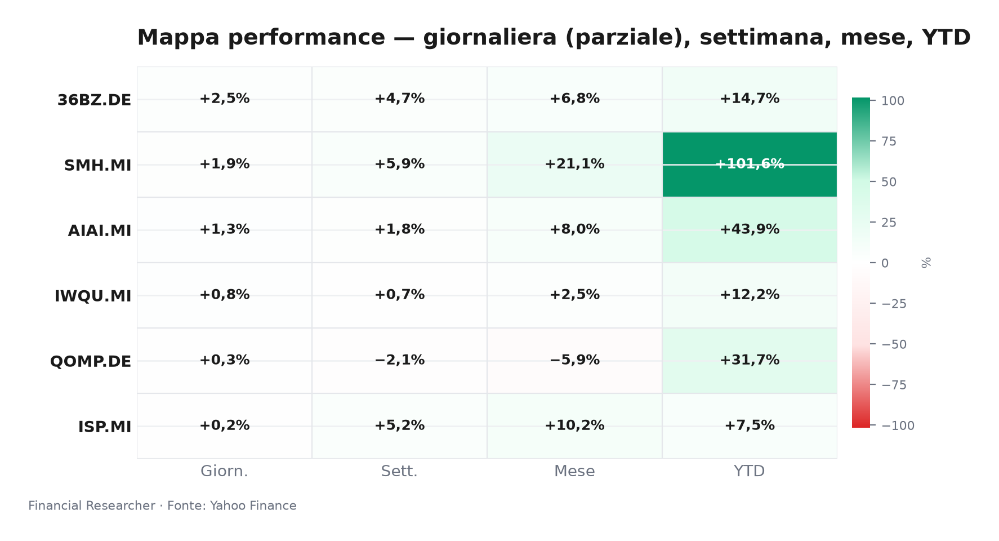
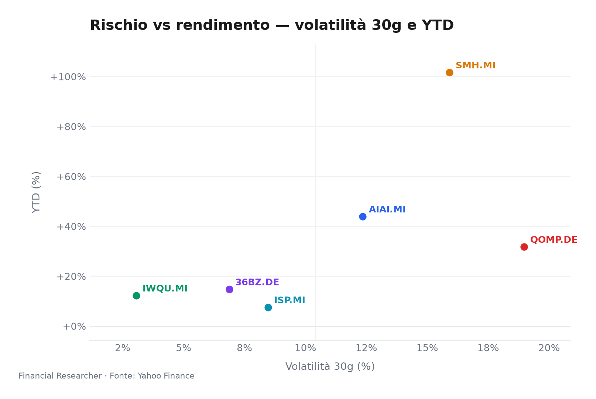
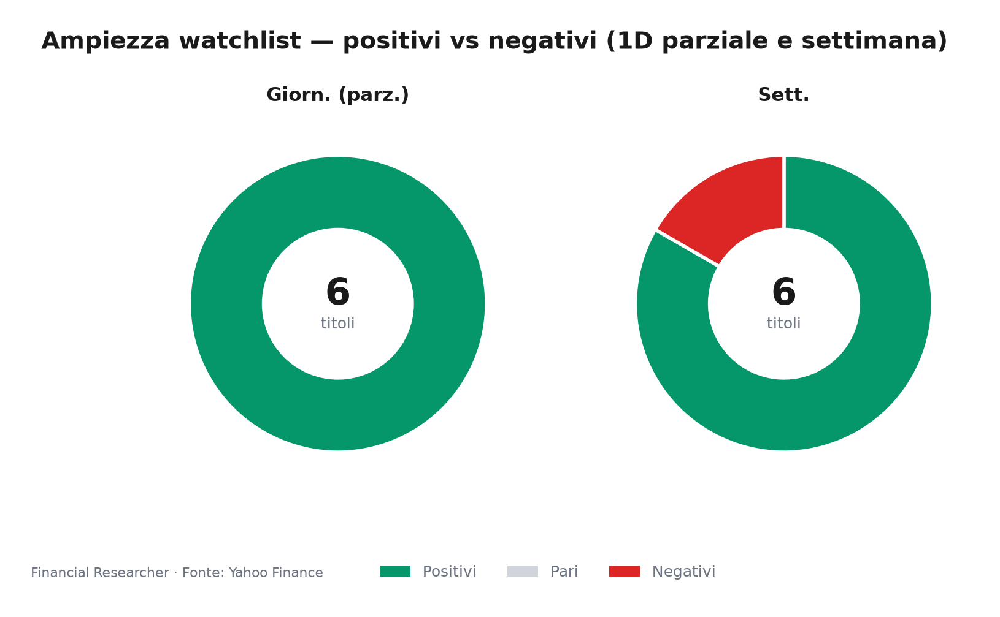
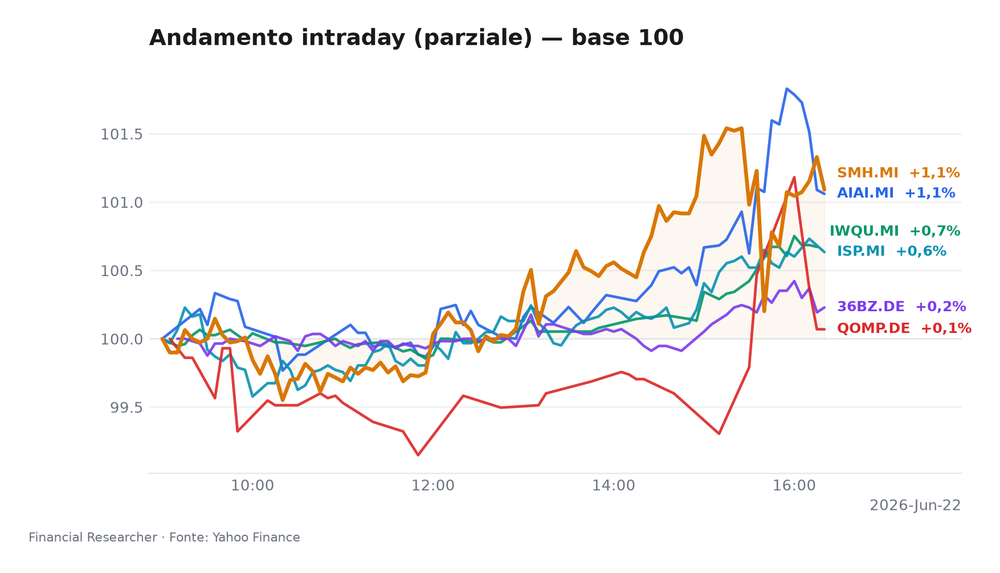
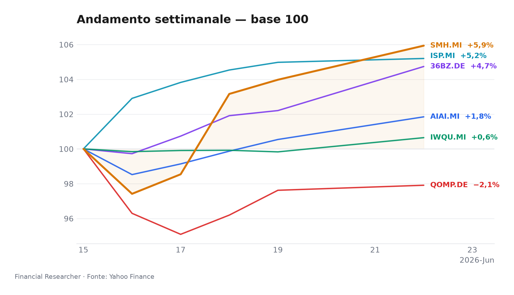

Mercati in equilibrio precario tra l’euforia dei semiconduttori e l’ombra di nuove tensioni geopolitiche: la seduta milanese dipinge un quadro di ottimismo selettivo.

## Executive Summary

- **L&G Artificial Intelligence UCITS ETF (AIAI.MI)** avanza ▲1.30% nella giornata, consolidando un rally 2026 che sfiora il +44% YTD (+1.84% nella settimana). Il tema AI resta il baricentro dei flussi, alimentato dall’assenza di notizie negative dall’assemblea NVIDIA e dal sentiment costruttivo sui titoli tech di punta [1][7].
- **VanEck Semiconductor UCITS ETF (SMH.MI)** guadagna ▲1.88% e tocca nuovi massimi con un balzo YTD del +101.63%. La catena del valore dei chip continua a beneficiare della narrazione di “Phase 2” del ciclo dei semiconduttori, sostenuta dalla domanda per data center e dall’interesse su Broadcom e Marvell [2][7].
- **iShares Edge MSCI World Quality Factor UCITS ETF USD (Acc) (IWQU.MI)** sale dello ▲0.82%, con performance settimanale più modesta (+0.65%) che riflette la rotazione difensiva in un contesto di rallentamento della crescita globale. L’allocazione fattoriale di qualità attrae flussi in cerca di bilanci solidi [3].
- **iShares Quantum Computing UCITS ETF USD (Acc) (QOMP.DE)** segna un timido ▲0.30% dopo una settimana negativa (-2.09%). La volatilità resta elevata in questo segmento speculativo, dove le promesse tecnologiche non sono ancora accompagnate da ricavi stabili [4].
- **iShares MSCI China A UCITS ETF (36BZ.DE)** è il leader della watchlist con ▲2.48% odierno e +4.74% settimanale, beneficiando del taglio di 17 pb del tasso LPR a un anno da parte della PBOC e di una ritrovata appetite per il rischio dopo mesi di sottopeso [5].
- **Intesa Sanpaolo S.p.A. (ISP.MI)** chiude piatta (+0.19%), sottoperformando il listino milanese. Il titolo naviga tra il consenso buy dei 16 analisti (target medio €6.84) e le incognite macro legate allo scontro Trump-Meloni sulla crisi iraniana, che frena il riposizionamento sul comparto bancario italiano [6].

## Watchlist Performance Snapshot

**Leader 1D:** iShares MSCI China A UCITS ETF (36BZ.DE) (2.48%) · **Laggard 1D:** Intesa Sanpaolo S.p.A. (ISP.MI) (0.19%)

| Ref | Strumento | Ticker | Prezzo (valuta) | Giornaliera | Settimanale | Mensile | YTD | 1A | Vol. 30g | Fonte |
|-----|-----------|--------|-----------------|-------------|-------------|---------|-----|-----|--------|-------|
| [1] | L&G Artificial Intelligence UCITS ETF | AIAI.MI | 34,80 EUR | 1,30% | 1,84% | 8,01% | 43,89% | 75,47% | 12,35% | [1] |
| [2] | VanEck Semiconductor UCITS ETF | SMH.MI | 110,27 EUR | 1,88% | 5,94% | 21,14% | 101,63% | 187,65% | 15,91% | [2] |
| [3] | iShares Edge MSCI World Quality Factor UCITS ETF USD (Acc) | IWQU.MI | 76,38 EUR | 0,82% | 0,65% | 2,52% | 12,22% | 24,44% | 3,06% | [3] |
| [4] | iShares Quantum Computing UCITS ETF USD (Acc) | QOMP.DE | 5,76 EUR | 0,30% | -2,09% | -5,90% | 31,74% | 33,62% | 18,97% | [4] |
| [5] | iShares MSCI China A UCITS ETF | 36BZ.DE | 5,70 EUR | 2,48% | 4,74% | 6,80% | 14,70% | 42,79% | 6,87% | [5] |
| [6] | Intesa Sanpaolo S.p.A. | ISP.MI | 6,19 EUR | 0,19% | 5,20% | 10,20% | 7,51% | 39,29% | 8,46% | [6] |
| — | FTSE MIB | FTSEMIB.MI | 52733,66 EUR | -0,22% | 1,73% | 6,50% | 16,21% | 35,76% | 5,20% | — |
| — | STOXX Europe 600 | ^STOXX | 638,76 EUR | 0,50% | 0,68% | 2,93% | 6,15% | 19,39% | 3,58% | — |

### Performance Charts

## What’s Driving the Moves

**L&G Artificial Intelligence UCITS ETF (AIAI.MI)** – Nessuna notizia materiale specifica. Il movimento odierno riflette la persistente domanda per l’esposizione all’intelligenza artificiale, amplificata dall’assenza di warning dall’assemblea generale di NVIDIA del 21 giugno e dalla copertura positiva su Apple e Broadcom [7]. I flussi rimangono sostenuti, coerenti con un AUM di €2.1 miliardi [1].

**VanEck Semiconductor UCITS ETF (SMH.MI)** – Anche in assenza di headline proprietarie, l’ETF semiconduttori cavalca il momentum del ciclo “Phase 2”, in cui la domanda per AI e data center compensa la normalizzazione di altri segmenti. L’attenzione su Marvell e Broadcom, citate nella rassegna di WSJ [7], conferma il sentiment, mentre i volumi rimangono robusti su un patrimonio di €8.3 miliardi [2].

**iShares Edge MSCI World Quality Factor UCITS ETF USD (Acc) (IWQU.MI)** – La giornata piatta per l’azionario globale favorisce i flussi in cerca di qualità. I timori di decelerazione macro, alimentati dall’attesa dei dati PCE USA in settimana, spingono gli investitori verso fattoriali difensivi. L’ETF, con un AUM di €5.4 miliardi, capitalizza questo posizionamento senza bisogno di catalizzatori specifici [3].

**iShares Quantum Computing UCITS ETF USD (Acc) (QOMP.DE)** – Il rimbalzo odierno non cancella la debolezza settimanale (-2.09%). Il comparto del calcolo quantistico, con una capitalizzazione di soli €60.7 milioni, resta estremamente sensibile al sentiment speculativo. La mancanza di notizie concrete impedisce un recupero più deciso, mantenendo l’ETF in divergenza negativa rispetto agli altri tecnologici [4].

**iShares MSCI China A UCITS ETF (36BZ.DE)** – Il taglio a sorpresa del tasso primario a un anno da parte della PBOC (20 giugno, -17 pb) ha innescato acquisti sulle A-share, nonostante i PMI deboli del secondo trimestre. L’ETF si apprezza del +2.48% e si conferma leader mensile del gruppo (+6.80% a un mese), segnalando un ritorno selettivo di interesse sull’equity cinese [5].

**Intesa Sanpaolo S.p.A. (ISP.MI)** – Il titolo tratta in range stretto, pressato dall’incertezza geopolitica: lo scontro verbale tra Donald Trump e Giorgia Meloni sulla crisi iraniana del 21 giugno ha reintrodotto un premio di rischio sul debito sovrano italiano, penalizzando le banche. La mancanza di revisioni al rialzo dei target price (ultimo aggiornamento 10 giugno, Simply Wall St.) consolida un quadro di attesa, con il titolo fermo a un P/E di circa 11.5x e un consenso buy ribadito (target medio €6.84) [6].

## Medium-Term Outlook

- **Bull (probabilità 30%)**: Accordo fiscale europeo in estate e taglio BCE a settembre accelerano la rotazione verso ciclici e Cina A. SMH e AIAI sovraperformano, ISP beneficia della compressione dello spread BTP-Bund. Trigger: annuncio di stimolo Ue >€500 mld entro luglio.
- **Base (50%)**: Taglio graduale BCE nel Q3, atterraggio morbido USA. IWQU rimane core; AIAI e SMH consolidano con grind al rialzo; ISP offre carry da dividendo. Lo scenario regge fino a conferma dell’inflazione PCE core sotto il 3% il 26 giugno.
- **Bear (20%)**: Scintilla recessiva USA (dato PCE deludente) ed escalation daziaria UE-USA. Veloce rotazione verso liquidità; IWQU relativo vincitore, SMH e QOMP subiscono drawdown >15%, 36BZ torna sottopeso. La soglia critica è una discesa di EUR/USD sotto 1.06.

## Event Calendar

| Date (YYYY-MM-DD) | Event | Affected tickers/themes | Impact | [N] |
|---|---|---|---|---|
| – | Nessun evento ad alto impatto previsto per il periodo di riferimento | – | – | – |

## Correlated Themes

L’intera watchlist orbitale attorno a tre cluster interconnessi. Il primo è il **super-ciclo tecnologico** (AIAI, SMH, QOMP), dove l’ondata AI trascina semiconduttori e quantum computing con correlazione crescente. Il secondo è il **posizionamento difensivo/quality** (IWQU), che funge da ancora in momenti di incertezza macro e beneficia dei flussi in uscita dai growth puri. Il terzo è la **scommessa sulla ripresa cinese** (36BZ), che si muove in controtendenza rispetto al risk-off occidentale e mostra decorrelazione parziale, offrendo diversificazione. **ISP** incrocia il fattore tassi e rischio Italia, risultando il nome più sensibile alla dinamica dei rendimenti governativi e alle frizioni politiche transatlantiche.

## Risks & Watchpoints

1. **Scontro commerciale UE-USA e armi tariffarie**: La retorica protezionista in campagna elettorale USA minaccia dazi aggiuntivi sull’auto e sul lusso europei entro fine 2026. Un’escalation colpirebbe SMH (supply chain) e ISP (fiducia domestica).
2. **Errore di politica monetaria**: Un taglio BCE troppo tardivo (ipotesi “hold” a settembre) mentre l’economia rallenta, combinato con una Fed ferma, innescherebbe una correzione generalizzata. IWQU terrebbe meglio, ma SMH e 36BZ perderebbero slancio.
3. **Instabilità geopolitica iraniana**: Le frizioni Trump-Meloni sull’Iran non sono isolate; un coinvolgimento diretto italiano potrebbe allargare lo spread BTP e penalizzare ISP in modo asimmetrico rispetto al resto della watchlist.
4. **Concentrazione tech e bolla AI**: L’YTD >100% di SMH e la performance stellare di AIAI scontano aspettative di utile che potrebbero essere deluse da qualsiasi rallentamento della spesa per data center. QOMP resta l’anello più fragile in uno scenario di risk-off.

## References

1. Yahoo Finance — AIAI.MI (L&G Artificial Intelligence UCITS ETF) — 2026-06-22 — https://finance.yahoo.com/quote/AIAI.MI
2. Yahoo Finance — SMH.MI (VanEck Semiconductor UCITS ETF) — 2026-06-22 — https://finance.yahoo.com/quote/SMH.MI
3. Yahoo Finance — IWQU.MI (iShares Edge MSCI World Quality Factor UCITS ETF USD (Acc)) — 2026-06-22 — https://finance.yahoo.com/quote/IWQU.MI
4. Yahoo Finance — QOMP.DE (iShares Quantum Computing UCITS ETF USD (Acc)) — 2026-06-22 — https://finance.yahoo.com/quote/QOMP.DE
5. Yahoo Finance — 36BZ.DE (iShares MSCI China A UCITS ETF) — 2026-06-22 — https://finance.yahoo.com/quote/36BZ.DE
6. Yahoo Finance — ISP.MI (Intesa Sanpaolo S.p.A.) — 2026-06-22 — https://finance.yahoo.com/quote/ISP.MI
7. The Wall Street Journal — Stocks to Watch Recap: Marvell Technology, Apple, Broadcom, Strategy — 2026-06-08 — https://finance.yahoo.com/m/34a0ce12-e5d0-369b-99dd-2a53210f0376/stocks-to-watch-recap-.html

## Disclaimer

Il presente briefing ha finalità esclusivamente informative e di analisi strategica. Non costituisce consulenza finanziaria, raccomandazione di acquisto o vendita di strumenti finanziari, né sollecitazione al pubblico risparmio. Le performance passate e gli scenari prospettici non sono indicativi di risultati futuri. I dati di mercato si riferiscono alla seduta corrente del 22 giugno 2026 (ore 13:00 CET) e potrebbero non riflettere le chiusure definitive. Le fonti sono indicate tra parentesi quadre e rimandano ai riferimenti elencati, ove disponibili.

<!-- financial-researcher:run-metadata -->
## Run metadata

| | |
|---|---|
| Model profile | deepseek_balanced |
| Processing time | 2m 28s |
| LLM requests | 9 |
| Tokens (prompt / completion / total) | 23,695 / 12,834 / 36,529 |

**Models by agent**

| Agent | Model (configured → resolved) |
|---|---|
| Market analyst | `deepseek/deepseek-v4-flash` → `deepseek-v4-flash` |
| News analyst | `deepseek/deepseek-v4-pro` → `deepseek-v4-pro` |
| Outlook analyst | `deepseek/deepseek-v4-flash` → `deepseek-v4-flash` |
| Calendar analyst | `deepseek/deepseek-v4-flash` → `deepseek-v4-flash` |
| Chief strategist | `deepseek/deepseek-v4-pro` → `deepseek-v4-pro` |
<!-- /financial-researcher:run-metadata -->
