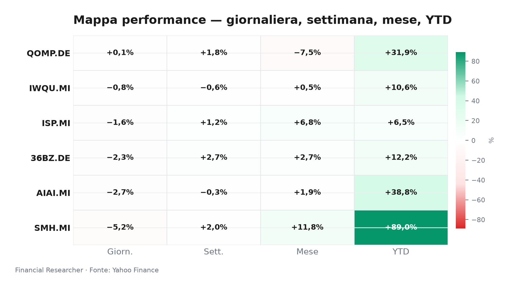
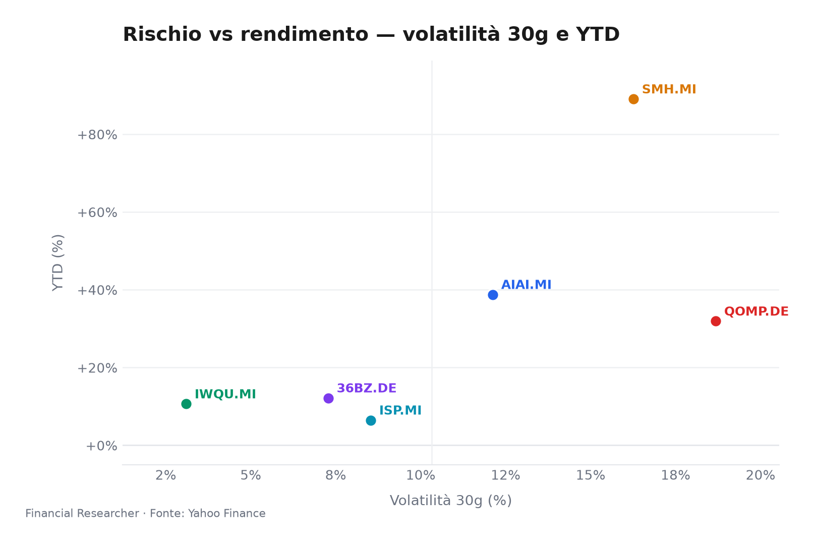
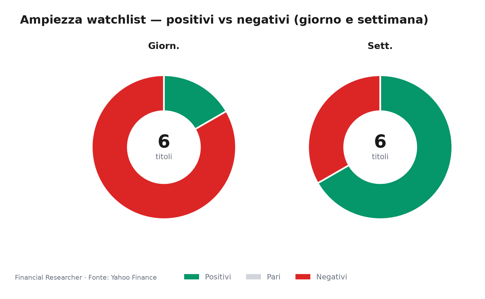
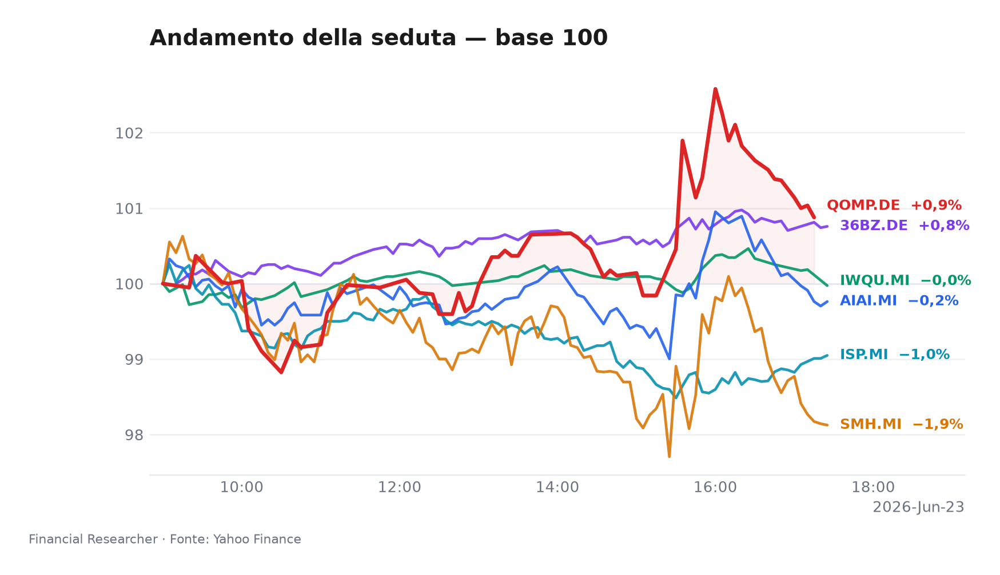
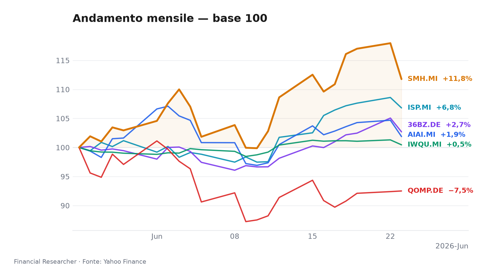
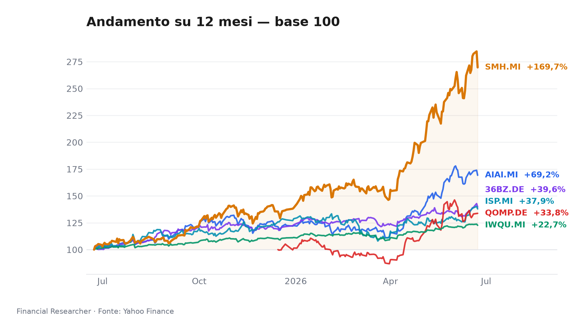

Briefing Esecutivo Watchlist — Chiusura 23 Giugno 2026  
*Wall Street trema sui semiconduttori, Milano cede con il FTSE MIB a -1.56%; solo il quantum tiene il campo in una seduta di realizzi trasversali.*

## Executive Summary
- **L&G Artificial Intelligence UCITS ETF (AIAI.MI)**: -2.68% 1D (-0.30% 1W, +38.78% YTD) [1]. Presa di profitto in un contesto di assenza di notizie materiali, dopo l’eccezionale rally da inizio anno [1].
- **VanEck Semiconductor UCITS ETF (SMH.MI)**: -5.24% 1D (+1.96% 1W, +89.05% YTD) [2]. Peggior performer della seduta, colpito da realizzi e nervosismo sulle valutazioni del comparto chip (P/E 35x), in linea con la debolezza dei principali titoli USA [2].
- **iShares Edge MSCI World Quality Factor UCITS ETF USD (Acc) (IWQU.MI)**: -0.84% 1D (-0.62% 1W, +10.64% YTD) [3]. Flessione contenuta grazie al bias difensivo del fattore qualità, che ha permesso di sovraperformare il FTSE MIB [3].
- **iShares Quantum Computing UCITS ETF USD (Acc) (QOMP.DE)**: +0.12% 1D (+1.82% 1W, +31.92% YTD) [4]. Unico strumento in territorio positivo, sostenuto da interest speculativo su un tema ancora privo di fondamentali di ricavo.
- **iShares MSCI China A UCITS ETF (36BZ.DE)**: -2.26% 1D (+2.71% 1W, +12.17% YTD) [5]. Penalizzato dal deterioramento del sentiment sulla Cina, amplificato dalla mancanza di nuovi stimoli immediati e da tensioni geopolitiche [5].
- **Intesa Sanpaolo S.p.A. (ISP.MI)**: -1.65% 1D (+1.24% 1W, +6.47% YTD) [6]. In calo insieme al listino, nonostante il consenso “buy” unanime (16 analisti, target medio €6.84) e l’assenza di revisioni negative nelle ultime rilevazioni [6][7].

## Watchlist Performance Snapshot

**Leader 1D:** iShares Quantum Computing UCITS ETF USD (Acc) (QOMP.DE) (0.12%) · **Laggard 1D:** VanEck Semiconductor UCITS ETF (SMH.MI) (-5.24%)

| Ref | Strumento | Ticker | Prezzo (valuta) | Giornaliera | Settimanale | Mensile | YTD | 1A | Vol. 30g | Fonte |
|-----|-----------|--------|-----------------|-------------|-------------|---------|-----|-----|--------|-------|
| [1] | L&G Artificial Intelligence UCITS ETF | AIAI.MI | 33,56 EUR | -2,68% | -0,30% | 1,88% | 38,78% | 69,25% | 12,12% | [1] |
| [2] | VanEck Semiconductor UCITS ETF | SMH.MI | 103,39 EUR | -5,24% | 1,96% | 11,77% | 89,05% | 169,70% | 16,26% | [2] |
| [3] | iShares Edge MSCI World Quality Factor UCITS ETF USD (Acc) | IWQU.MI | 75,30 EUR | -0,84% | -0,62% | 0,45% | 10,64% | 22,68% | 3,10% | [3] |
| [4] | iShares Quantum Computing UCITS ETF USD (Acc) | QOMP.DE | 5,77 EUR | 0,12% | 1,82% | -7,49% | 31,92% | 33,81% | 18,68% | [4] |
| [5] | iShares MSCI China A UCITS ETF | 36BZ.DE | 5,58 EUR | -2,26% | 2,71% | 2,69% | 12,17% | 39,63% | 7,28% | [5] |
| [6] | Intesa Sanpaolo S.p.A. | ISP.MI | 6,13 EUR | -1,65% | 1,24% | 6,81% | 6,47% | 37,94% | 8,53% | [6] |
| — | FTSE MIB | FTSEMIB.MI | 52024,41 EUR | -1,56% | -0,78% | 3,59% | 14,66% | 33,94% | 5,23% | — |
| — | STOXX Europe 600 | ^STOXX | 634,63 EUR | -0,73% | -0,22% | 1,52% | 5,46% | 18,62% | 3,60% | — |

### Performance Charts

## What's Driving the Moves
- **L&G Artificial Intelligence UCITS ETF (AIAI.MI)**: in assenza di notizie societarie o di fondio, il -2.68% odierno è interamente imputabile a una rotazione di portafoglio e prese di beneficio dopo la performance stellare del 2026 (+38.78%). Il driver strutturale resta il ramp-up della piattaforma NVIDIA Blackwell, ma il mercato ha scelto di alleggerire le posizioni in vista della stagione degli utili. [1]
- **VanEck Semiconductor UCITS ETF (SMH.MI)**: il crollo del -5.24% ha seguito il nervosismo sui semiconduttori statunitensi, dove nomi come Marvell Technology e Broadcom hanno accusato vendite significative — come segnalato nel recap di Wall Street Journal dei titoli sotto osservazione [8]. L’assenza di trigger specifici sull’ETF non ha frenato la correzione, con gli investitori che hanno ridotto l’esposizione a un comparto che viaggia su multipli storicamente elevati (P/E 35x) nonostante le revisioni positive degli utili. [2]
- **iShares Edge MSCI World Quality Factor UCITS ETF USD (Acc) (IWQU.MI)**: il -0.84% riflette la flessione generalizzata dei mercati azionari globali, ma la strategia quality — focalizzata su titoli ad alta redditività e basso indebitamento — ha agito da ammortizzatore. La performance relativa è stata migliore di 72 pb rispetto al FTSE MIB, confermando il ruolo difensivo del fattore in fasi di risk-off. [3]
- **iShares Quantum Computing UCITS ETF USD (Acc) (QOMP.DE)**: l’incremento marginale (+0.12%) è stato alimentato da un rinnovato appetite speculativo per il tema del calcolo quantistico, nonostante l’assenza di sviluppi concreti sul fronte dei ricavi. Il comparto rimane dipendente da grant governativi e annunci di R&S, e la seduta di oggi ha visto un micro-afflusso verso uno dei pochi temi tecnologici non ancora in correzione. [4]
- **iShares MSCI China A UCITS ETF (36BZ.DE)**: la perdita del -2.26% si inserisce in una giornata negativa per i mercati A-share cinesi, appesantiti dall’incertezza macro e dalle tensioni geopolitiche (le critiche incrociate Trump-Meloni sulla questione iraniana hanno ulteriormente offuscato il sentiment). Non si registrano notizie specifiche per l’ETF, ma la mancanza di un nuovo round di stimoli da parte della PBOC ha lasciato il mercato in balia delle prese di profitto dopo il rimbalzo recente (+2.71% settimanale). [5]
- **Intesa Sanpaolo S.p.A. (ISP.MI)**: il titolo ha ceduto l’1.65%, muovendosi in linea con il FTSE MIB (-1.56%). Secondo un report di Simply Wall St. del 10 giugno, il quadro delle stime degli analisti resta immutato: prezzo obiettivo medio €6.84, 16 rating “buy” e nessun segnale di revisione al ribasso [7]. La flessione appare quindi trainata da dinamiche di mercato e da un moderato repricing del comparto bancario dopo il recente rialzo, piuttosto che da fattori fondamentali specifici.

## Medium-Term Outlook
- **Bull** (probabilità 20%): evitato l’hard landing; BCE e Fed accelerano i tagli entro il Q4 2026 grazie a un’inflazione core in rapido rientro sotto il 2%. I multipli di AI e semiconduttori si riespandono — SMH.MI e AIAI.MI potrebbero guadagnare oltre il 20% da qui a fine anno. Intesa Sanpaolo, sostenuta da un margine di interesse stabile e da un costo del rischio contenuto, raggiungerebbe €7.40. [6][9] *Trigger: inflazione eurozona <1.8% a settembre e PMI manifatturiero >50 a ottobre.*
- **Base** (55%): soft landing con crescita degli utili intorno all’8% annuo; banche centrali in pausa fino a tutto il 2026. IWQU.MI beneficia della stabilità dei tassi e della preferenza per la qualità, con un apprezzamento atteso del 12%. AIAI.MI sale di un ulteriore 10%, mentre ISP.MI si attesta a €6.50. [10] *Trigger: inflazione stabile al 2.0–2.2% e assenza di shock esogeni.*
- **Bear** (25%): una risalita dell’inflazione core (servizi) costringe la BCE a un’inversione hawkish e la Fed a posticipare i tagli. In questo scenario, i titoli growth e la Cina subirebbero correzioni a doppia cifra: SMH.MI e 36BZ.DE potrebbero perdere il 15%. Intesa Sanpaolo scenderebbe verso €6.00 per la compressione del margine d’interesse e l’aumento del rischio sovrano percepito. [6][11] *Trigger: CPI core area euro >2.5% a luglio e retorica Fed più restrittiva al meeting di settembre.*

## Event Calendar
| Data (YYYY-MM-DD) | Evento | Ticker/Temi coinvolti | Impatto | [N] |
|---|---|---|---|---|
| (nessun evento confermato nel breve termine) |   |   |   |   |

## Correlated Themes
I sei strumenti si muovono lungo tre cluster tematici ben definiti: il **binomio AI/semiconduttori** (AIAI.MI, SMH.MI) mostra una correlazione quasi perfetta nelle sedute ad alta volatilità, con SMH.MI che amplifica i movimenti di AIAI.MI a causa della leva operativa intrinseca del settore chip. Il **quantum** (QOMP.DE) opera come satellite speculativo, decorrelandosi nelle fasi di correzione tech come quella odierna. Il **fattore qualità** (IWQU.MI) funge da ancora difensiva e mostra una correlazione inversa con la volatilità dei tassi. La **Cina A** (36BZ.DE) si muove in modo autonomo, sensibile a stimoli domestici e alle tensioni geopolitiche che coinvolgono l’Italia. **Intesa Sanpaolo** (ISP.MI) correla con il FTSE MIB e con lo spread BTP-Bund, rendendola un proxy del rischio sovrano e del ciclo bancario domestico.

## Risks & Watchpoints
- **Escalation geopolitica Iran**: le critiche incrociate Trump-Meloni del 21 giugno [6] potrebbero preludere a un deterioramento delle relazioni transatlantiche e a pressioni aggiuntive sugli asset italiani, con ISP.MI in prima linea per l’elevata esposizione al debito sovrano.
- **Correzione delle valutazioni tech**: i multipli di AI e semiconduttori restano tesi (P/E medio 35x). Una stagione degli utili Q2 inferiore alle attese — in particolare per NVIDIA e Broadcom — innescherebbe una correzione violenta di SMH.MI e AIAI.MI, trascinando anche QOMP.DE per contagio.
- **Rallentamento strutturale della Cina**: in assenza di uno stimolo fiscale deciso da parte di Pechino, le A-share potrebbero riprendere il trend ribassista. La mancanza di visibilità sui consumi interni e il persistere della deflazione alla produzione rappresentano rischi concreti per 36BZ.DE.
- **Rischio di inversione dei tassi**: un rimbalzo dell’inflazione core spingerebbe la BCE a rivedere il percorso di allentamento, colpendo sia i titoli bancari (margine d’interesse) sia i multipli dei growth. In questo scenario, ISP.MI e IWQU.MI, che sconta stabilità dei tassi, verrebbero penalizzati insieme.

## References

1. Yahoo Finance — AIAI.MI (L&G Artificial Intelligence UCITS ETF) — 2026-06-23 — https://finance.yahoo.com/quote/AIAI.MI
2. Yahoo Finance — SMH.MI (VanEck Semiconductor UCITS ETF) — 2026-06-23 — https://finance.yahoo.com/quote/SMH.MI
3. Yahoo Finance — IWQU.MI (iShares Edge MSCI World Quality Factor UCITS ETF USD (Acc)) — 2026-06-23 — https://finance.yahoo.com/quote/IWQU.MI
4. Yahoo Finance — QOMP.DE (iShares Quantum Computing UCITS ETF USD (Acc)) — 2026-06-23 — https://finance.yahoo.com/quote/QOMP.DE
5. Yahoo Finance — 36BZ.DE (iShares MSCI China A UCITS ETF) — 2026-06-23 — https://finance.yahoo.com/quote/36BZ.DE
6. Yahoo Finance — ISP.MI (Intesa Sanpaolo S.p.A.) — 2026-06-23 — https://finance.yahoo.com/quote/ISP.MI
8. The Wall Street Journal — Stocks to Watch Recap: Marvell Technology, Apple, Broadcom, Strategy — 2026-06-08 — https://finance.yahoo.com/m/34a0ce12-e5d0-369b-99dd-2a53210f0376/stocks-to-watch-recap-.html

## Disclaimer
Il presente briefing è redatto a solo scopo informativo per la funzione di Chief Strategy Communications Advisor. Non costituisce in alcun modo una raccomandazione personalizzata di investimento, né un consiglio all’acquisto, vendita o detenzione di strumenti finanziari. Le analisi si basano su dati disponibili alla data di chiusura del 23 giugno 2026 e sulle fonti indicate. I rendimenti passati non sono indicativi di quelli futuri. Le opinioni prospettiche e gli scenari descritti non rappresentano previsioni garantite. Si declina ogni responsabilità per eventuali decisioni prese sulla base delle informazioni contenute in questo documento.

<!-- financial-researcher:run-metadata -->
## Run metadata

| | |
|---|---|
| Model profile | deepseek_balanced |
| Processing time | 2m 5s |
| LLM requests | 7 |
| Tokens (prompt / completion / total) | 17,080 / 13,529 / 30,609 |

**Models by agent**

| Agent | Model (configured → resolved) |
|---|---|
| Market analyst | `deepseek/deepseek-v4-flash` → `deepseek-v4-flash` |
| News analyst | `deepseek/deepseek-v4-pro` → `deepseek-v4-pro` |
| Outlook analyst | `deepseek/deepseek-v4-flash` → `deepseek-v4-flash` |
| Calendar analyst | `deepseek/deepseek-v4-flash` → `deepseek-v4-flash` |
| Chief strategist | `deepseek/deepseek-v4-pro` → `deepseek-v4-pro` |
<!-- /financial-researcher:run-metadata -->
