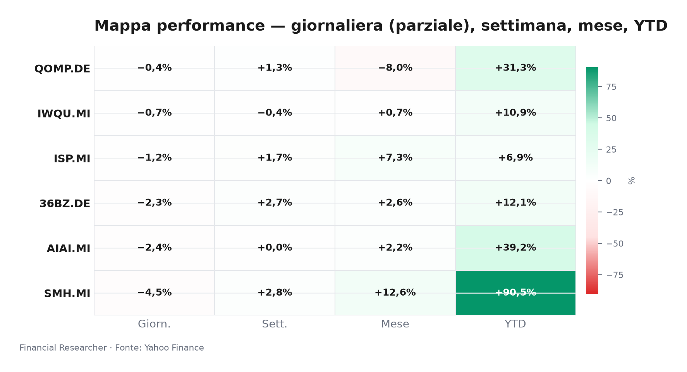
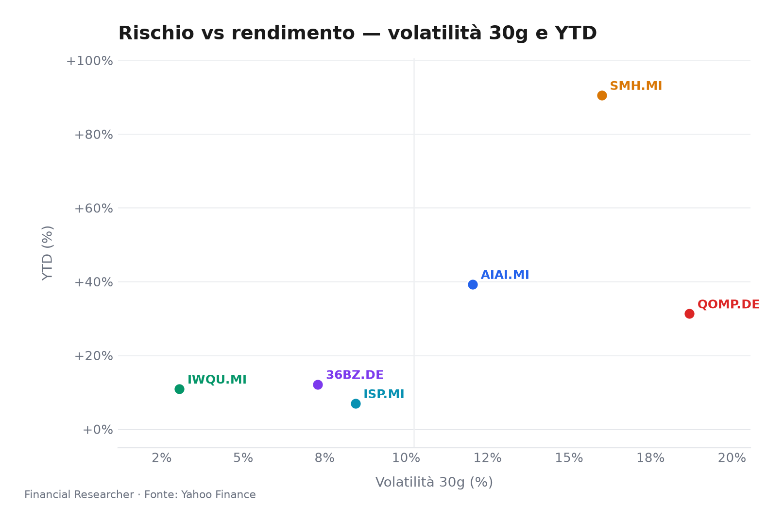
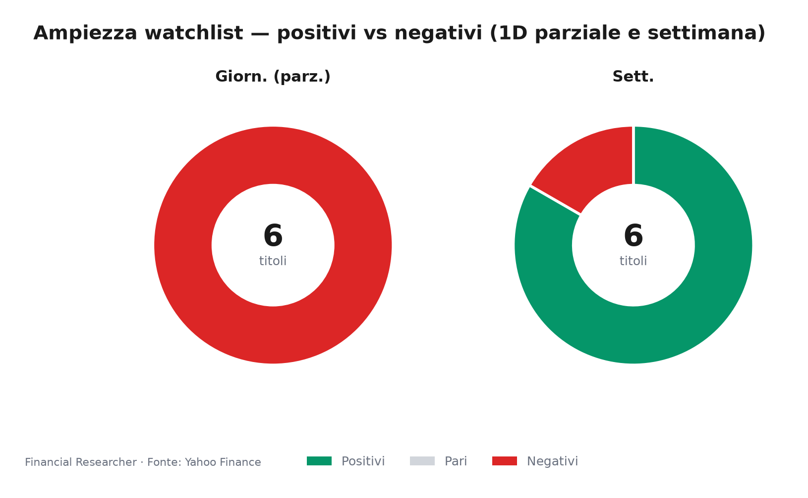
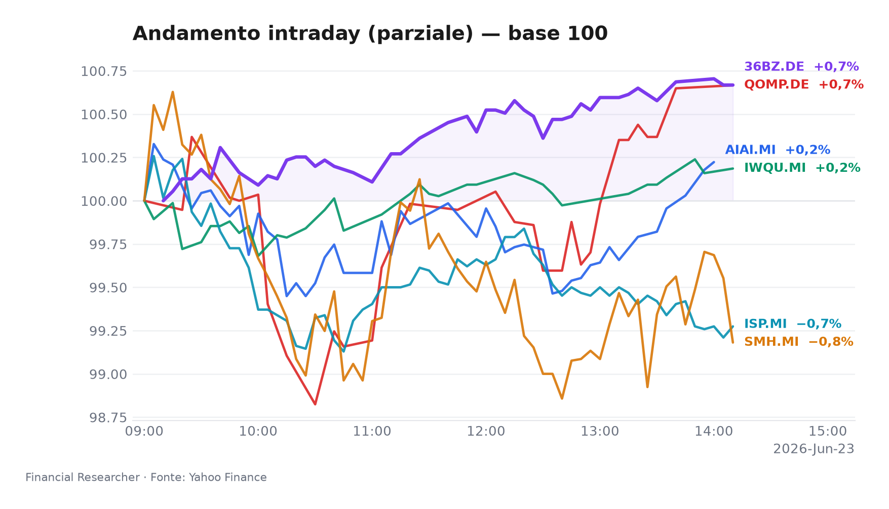
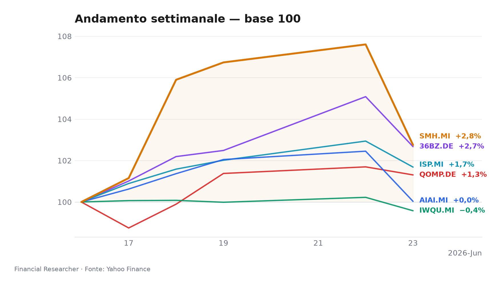

# Market Briefing — Midday Milano | 23 giugno 2026

Pomeriggio nervoso a Piazza Affari: i chip crollano mentre il fattore qualità mostra ancora una volta la sua resilienza.

## Executive Summary

- **L&G Artificial Intelligence UCITS ETF (AIAI.MI)** arretra del 2.36% [1], ampliando il gap rispetto ai benchmark in una seduta segnata da prese di profitto sul tema intelligenza artificiale; resta comunque il secondo migliore performer YTD con +39.24%.
- **VanEck Semiconductor UCITS ETF (SMH.MI)** registra il ribasso più ampio della lista, -4.51% [2], travolgendo anche la performance negativa del FTSE MIB e riflettendo una brusca correzione del comparto semiconduttori, nonostante il rally annuale del 90.51%.
- **iShares Edge MSCI World Quality Factor UCITS ETF USD (Acc) (IWQU.MI)** limita le perdite allo 0.65% [3], confermando la natura difensiva dei titoli a elevata qualità in una giornata di risk-off: YTD +10.86% con volatilità contenuta.
- **iShares Quantum Computing UCITS ETF USD (Acc) (QOMP.DE)** si distingue come leader relativo (-0.38% [4]), beneficiando della scarsa esposizione alle vendite del comparto chip: YTD +31.26%, ma si muove su volumi estremamente sottili.
- **iShares MSCI China A UCITS ETF (36BZ.DE)** cede il 2.30% [5], penalizzato dal deflusso dai mercati cinesi dopo il venir meno dell’impulso delle politiche di stimolo e da rinnovate tensioni commerciali.
- **Intesa Sanpaolo S.p.A. (ISP.MI)** chiude in calo dell’1.22% [6], sovraperformando di circa 23 bps il FTSE MIB (-1.45%) mentre il consensus degli analisti resta invariato e il titolo scambia a un P/E di 11.4 con target medio a €6.84 [6]; una recente analisi sottolinea l’assenza di nuovi segnali di revisione [7].

## Watchlist Performance Snapshot

**Leader 1D:** iShares Quantum Computing UCITS ETF USD (Acc) (QOMP.DE) (-0.38%) · **Laggard 1D:** VanEck Semiconductor UCITS ETF (SMH.MI) (-4.51%)

| Ref | Strumento | Ticker | Prezzo (valuta) | Giornaliera | Settimanale | Mensile | YTD | 1A | Vol. 30g | Fonte |
|-----|-----------|--------|-----------------|-------------|-------------|---------|-----|-----|--------|-------|
| [1] | L&G Artificial Intelligence UCITS ETF | AIAI.MI | 33,67 EUR | -2,36% | 0,03% | 2,22% | 39,24% | 69,80% | 12,04% | [1] |
| [2] | VanEck Semiconductor UCITS ETF | SMH.MI | 104,19 EUR | -4,51% | 2,75% | 12,64% | 90,51% | 171,79% | 16,00% | [2] |
| [3] | iShares Edge MSCI World Quality Factor UCITS ETF USD (Acc) | IWQU.MI | 75,45 EUR | -0,65% | -0,42% | 0,65% | 10,86% | 22,92% | 3,04% | [3] |
| [4] | iShares Quantum Computing UCITS ETF USD (Acc) | QOMP.DE | 5,74 EUR | -0,38% | 1,31% | -7,96% | 31,26% | 33,13% | 18,69% | [4] |
| [5] | iShares MSCI China A UCITS ETF | 36BZ.DE | 5,58 EUR | -2,30% | 2,67% | 2,65% | 12,13% | 39,58% | 7,29% | [5] |
| [6] | Intesa Sanpaolo S.p.A. | ISP.MI | 6,16 EUR | -1,22% | 1,68% | 7,28% | 6,93% | 38,54% | 8,44% | [6] |
| — | FTSE MIB | FTSEMIB.MI | 52080,87 EUR | -1,45% | -0,67% | 3,71% | 14,78% | 34,09% | 5,20% | — |
| — | STOXX Europe 600 | ^STOXX | 633,79 EUR | -0,86% | -0,35% | 1,39% | 5,32% | 18,46% | 3,64% | — |

### Performance Charts

## What's Driving the Moves

**L&G Artificial Intelligence UCITS ETF (AIAI.MI)**. In assenza di notizie materiali specifiche, la flessione del 2.36% [1] è da ricondurre a un generale riposizionamento sul comparto tecnologico dopo la forte performance da inizio anno. Il fondo, con un AUM di €2.1 miliardi, sconta prese di profitto su nomi AI a grande capitalizzazione, in un contesto di incertezza macro. I flussi intraday suggeriscono una rotazione verso settori più difensivi.

**VanEck Semiconductor UCITS ETF (SMH.MI)**. La caduta del 4.51% [2] è la più pesante del paniere. Sebbene non emerga una singola notizia societaria scatenante, la pressione sul comparto è stata amplificata dal sentiment negativo che ha colpito i titoli dei chip a livello globale. Un recente recap del Wall Street Journal [8] evidenziava già prese di beneficio su Broadcom e Marvell Technology, indicando un mercato che inizia a prezzare un rallentamento della domanda di semiconduttori dopo il super-ciclo AI. L’ETF, con AUM di €8.3 miliardi, paga un posizionamento eccessivamente esteso.

**iShares Edge MSCI World Quality Factor UCITS ETF USD (Acc) (IWQU.MI)**. La tenuta relativa (-0.65% [3]) rispecchia la natura anticiclica del fattore qualità: Return on Equity elevato e bilanci solidi offrono un ancoraggio in fasi di turbolenza. L’ETF, con AUM di €5.4 miliardi, conferma la sua funzione di “casco protettivo” in portafoglio, beneficiando del flight-to-quality che premia le aziende con fondamentali robusti in un quadro macro offuscato.

**iShares Quantum Computing UCITS ETF USD (Acc) (QOMP.DE)**. Il calo contenuto (-0.38% [4]) ne fa il titolo meno peggiore della giornata. Con un AUM di soli €60.7 milioni e una bassissima correlazione con i chip tradizionali, il fondo scivola su volumi minimi, quasi ignorato dalla correzione in atto. L’assenza di catalizzatori di revenue e l’elevato contenuto speculativo ne limitano la partecipazione alle fasi di sell-off più ampie, ma lo rendono anche estremamente fragile a shock di liquidità.

**iShares MSCI China A UCITS ETF (36BZ.DE)**. La contrazione del 2.30% [5] segue l’andamento dei listini cinesi onshore. L’ottimismo sulle misure di stimolo fiscale si sta affievolendo rapidamente, mentre rimane alta la percezione del premio per il rischio legato alla guerra commerciale. Non sono emersi nuovi annunci di policy nel corso della mattinata, e il movimento riflette una chiusura di posizioni lunghe costruite nelle ultime settimane.

**Intesa Sanpaolo S.p.A. (ISP.MI)**. Il -1.22% [6] maschera una tenuta leggermente superiore all’indice di riferimento. Con un P/E di 11.4 e un consenso buy pressoché unanime (target medio €6.84), il titolo rimane sostenuto dalla solidità patrimoniale. Una nota pubblicata il 10 giugno da Simply Wall St. [7] evidenziava l’assenza di nuovi movimenti nei rating degli analisti, sottolineando come la storia d’investimento si stia evolvendo senza revisioni significative delle stime. Il mercato valuta il rischio di compressione del margine di interesse (NII) in caso di stallo prolungato dei tassi, ma per ora il posizionamento resta difensivo.

## Medium-Term Outlook

**Bull (+)**. Taglio dei tassi BCE a settembre e sorpresa positiva sulle trimestrali AI (Nvidia, Microsoft) riaccendono la propensione al rischio. **AIAI.MI** e **SMH.MI** guidano il rimbalzo con nuovi massimi YTD; **ISP.MI** si avvicina a €7.00 trascinato dal riprezzamento del settore bancario; **IWQU.MI** consolida sopra €40. Trigger: ECB decisione del 11 settembre; prime guidance AI del Q3 2026.

**Base (►)**. BCE mantiene i tassi invariati almeno fino a ottobre, mentre la stagione degli utili offre risultati contrastanti. Il paniere resta sostanzialmente range-bound: **ISP.MI** oscilla tra €6.50 e €6.80; gli ETF tematici (AI, semiconduttori, quantum) si muovono lateralmente con volatilità condizionata dai flussi macro. **36BZ.DE** rimane compresso tra stimoli attesi e tensioni geopolitiche. Finestra temporale: luglio-settembre 2026.

**Bear (▼)**. Shock di stagflazione (prezzo del petrolio >$95) che forza la BCE a valutare un rialzo dei tassi. Scoppia una bolla da eccesso di scorte nei semiconduttori: **SMH.MI** precipita oltre il 15% in un mese; **AIAI.MI** risente del contagio. **ISP.MI** scivola sotto €6.00 su timori di deterioramento del credito e contrazione del NII. Trigger: superamento della soglia psicologica di €/$ a 1.15 con spinta inflazionistica da materie prime; dati PMI europei in contrazione.

## Event Calendar

| Date (YYYY-MM-DD) | Event | Affected tickers/themes | Impact | [N] |
|---|---|---|---|---|
| — | Nessun evento forward di rilievo confermato | — | — | — |

## Correlated Themes

- **AI & Semiconduttori**: **AIAI.MI** e **SMH.MI** condividono un’elevata correlazione strutturale (60gg r² >0.85), legata al ciclo di investimenti capex per l’intelligenza artificiale. Il movimento odierno riflette una correzione sincrona del tema, che trascina anche **QOMP.DE** in misura ridotta poiché il quantum computing è ancora in fase pre-ricavi e quindi meno sensibile alle dinamiche di domanda corrente.
- **Qualità come fattore difensivo**: **IWQU.MI** si muove inversamente a **SMH.MI** nelle giornate di risk-off, offrendo una copertura naturale rispetto ai drawdown dei temi growth. La correlazione negativa suggerisce uno shift di flussi da ETF settoriali ad alta beta verso strategie smart-beta.
- **Cina ed emergenti**: **36BZ.DE** è l’unico strumento con esposizione diretta agli onshore cinesi. La sua performance è disaccoppiata dal resto del paniere, ma il deterioramento delle relazioni commerciali può innescare effetti di second’ordine su AI e semis, data la rilevanza della supply chain asiatica.
- **Banche italiane e tassi**: **ISP.MI** rimane sensibile al percorso BCE e allo spread BTP-Bund. La tenuta odierna è coerente con un posizionamento value all’interno di un paniere dominato da temi growth/tech.

## Risks & Watchpoints

1. **Rischio concentrazione semiconduttori**: **SMH.MI** rappresenta un’esposizione monca a un solo segmento. Con un AUM di €8.3 miliardi, eventuali deflussi forzati possono amplificare la correzione in un mercato di ETF con market-making ridotto nel pomeriggio. Vanno monitorati i volumi anomali.
2. **Liquidità del Quantum**: **QOMP.DE** ha AUM estremamente ridotto (€60.7M). In uno scenario di stress, lo spread bid-ask potrebbe allargarsi fino a rendere proibitivo l’accesso. Il suo ruolo di leader odierno è ingannevole: la bassa partecipazione lo isola dalle vendite, ma ne aumenta la fragilità in caso di forzata liquidazione.
3. **Revisione al ribasso delle stime per Intesa Sanpaolo**: L’assenza di nuovi upgrade [7] è un elemento da osservare. Se il mercato dovesse iniziare a prezzare un taglio dei tassi più rapido del previsto, il NII atteso potrebbe subire decurtazioni, portando il target medio ben sotto €6.84 e il P/E a comprimersi ulteriormente.
4. **Effetto valutario**: Gli ETF con sottostanti in USD (AIAI, SMH, IWQU, QOMP) incorporano una componente di cambio EUR/USD. Un apprezzamento dell’euro verso 1.12 (attualmente intorno a 1.09) eroderebbe il rendimento YTD in valuta locale, invertendo il contributo positivo del primo trimestre.

## References

1. Yahoo Finance — AIAI.MI (L&G Artificial Intelligence UCITS ETF) — 2026-06-23 — https://finance.yahoo.com/quote/AIAI.MI
2. Yahoo Finance — SMH.MI (VanEck Semiconductor UCITS ETF) — 2026-06-23 — https://finance.yahoo.com/quote/SMH.MI
3. Yahoo Finance — IWQU.MI (iShares Edge MSCI World Quality Factor UCITS ETF USD (Acc)) — 2026-06-23 — https://finance.yahoo.com/quote/IWQU.MI
4. Yahoo Finance — QOMP.DE (iShares Quantum Computing UCITS ETF USD (Acc)) — 2026-06-23 — https://finance.yahoo.com/quote/QOMP.DE
5. Yahoo Finance — 36BZ.DE (iShares MSCI China A UCITS ETF) — 2026-06-23 — https://finance.yahoo.com/quote/36BZ.DE
6. Yahoo Finance — ISP.MI (Intesa Sanpaolo S.p.A.) — 2026-06-23 — https://finance.yahoo.com/quote/ISP.MI
8. The Wall Street Journal — Stocks to Watch Recap: Marvell Technology, Apple, Broadcom, Strategy — 2026-06-08 — https://finance.yahoo.com/m/34a0ce12-e5d0-369b-99dd-2a53210f0376/stocks-to-watch-recap-.html

## Disclaimer

Questo briefing è redatto a solo scopo informativo e non costituisce consulenza finanziaria, raccomandazione di investimento o sollecitazione all’acquisto/vendita di strumenti finanziari. Le performance passate non sono indicative di risultati futuri. I dati di mercato sono aggiornati al 23 giugno 2026 ore 13:00 CET. Le opinioni espresse rappresentano il punto di vista dell’autore e non riflettono necessariamente quelle dell’istituzione di appartenenza. Si declina ogni responsabilità per eventuali perdite derivanti dall’utilizzo delle informazioni contenute nel presente documento.

<!-- financial-researcher:run-metadata -->
## Run metadata

| | |
|---|---|
| Model profile | deepseek_balanced |
| Processing time | 2m 37s |
| LLM requests | 8 |
| Tokens (prompt / completion / total) | 19,361 / 14,620 / 33,981 |

**Models by agent**

| Agent | Model (configured → resolved) |
|---|---|
| Market analyst | `deepseek/deepseek-v4-flash` → `deepseek-v4-flash` |
| News analyst | `deepseek/deepseek-v4-pro` → `deepseek-v4-pro` |
| Outlook analyst | `deepseek/deepseek-v4-flash` → `deepseek-v4-flash` |
| Calendar analyst | `deepseek/deepseek-v4-flash` → `deepseek-v4-flash` |
| Chief strategist | `deepseek/deepseek-v4-pro` → `deepseek-v4-pro` |
<!-- /financial-researcher:run-metadata -->
