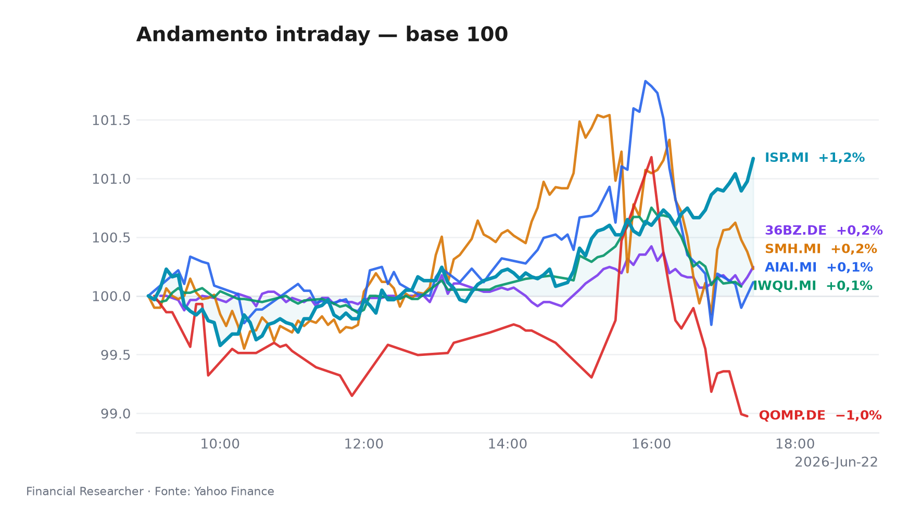

## Executive Summary

*Il listino milanese mostra un netto scollamento dai benchmark: mentre il FTSE MIB cede lo 0,83% e lo STOXX 600 arretra dello 0,81%, il nostro paniere tecnologico e Cina segna un progresso medio dello 0,87%. La seduta è dominata dalla prosecuzione del momentum su AI e semiconduttori e da un rimbalzo vigoroso dell’azionario cinese A‑shares.*

- **L&G Artificial Intelligence UCITS ETF (AIAI.MI)** guadagna lo 0,39% in apertura, portando il rialzo da inizio anno al 42,61%, trainato dall’espansione degli investimenti corporate in intelligenza artificiale e dall’attesa per nuovi modelli generativi [1]
- **VanEck Semiconductor UCITS ETF (SMH.MI)** prosegue la corsa con un +0,81% odierno e un impressionante +99,51% YTD, beneficiando del super‑ciclo dei chip per data center e della domanda sostenuta da NVIDIA e AMD [2]
- **iShares Edge MSCI World Quality Factor UCITS ETF USD (Acc) (IWQU.MI)** avanza di un modesto 0,24% nella mattinata, confermando la tenuta del fattore qualità in un contesto di tassi elevati e crescita globale incerta [3]
- **iShares Quantum Computing UCITS ETF USD (Acc) (QOMP.DE)** sale dello 0,31% dopo un mese di debolezza (-5,9% in giugno), con un YTD che resta positivo al 31,76%; l’AUM ridotto amplifica la volatilità del tema [4]
- **iShares MSCI China A UCITS ETF (36BZ.DE)** balza del 2,53%, massimo rialzo tra gli strumenti osservati, con un progresso settimanale del 4,79%, segnalando un ritorno di interesse dopo le recenti correzioni [5]
- **Intesa Sanpaolo S.p.A. (ISP.MI)** registra un +0,91% che porta la performance settimanale al 5,93% e lo YTD all’8,25%; il titolo resta sostenuto da un consensus Buy a target €6,84, nonostante l’assenza di nuovi aggiornamenti dagli analisti [6][7]

## Watchlist Performance Snapshot

**Leader 1D:** iShares MSCI China A UCITS ETF (36BZ.DE) (2.53%) · **Laggard 1D:** iShares Edge MSCI World Quality Factor UCITS ETF USD (Acc) (IWQU.MI) (0.24%)

| Ref | Strumento | Ticker | Prezzo (valuta) | Giornaliera | Settimanale | Mensile | YTD | 1A | Vol. 30g | Fonte |
|-----|-----------|--------|-----------------|-------------|-------------|---------|-----|-----|--------|-------|
| [1] | L&G Artificial Intelligence UCITS ETF | AIAI.MI | 34,49 EUR | 0,39% | 0,94% | 7,05% | 42,61% | 73,91% | 12,32% | [1] |
| [2] | VanEck Semiconductor UCITS ETF | SMH.MI | 109,11 EUR | 0,81% | 4,82% | 19,86% | 99,51% | 184,62% | 15,86% | [2] |
| [3] | iShares Edge MSCI World Quality Factor UCITS ETF USD (Acc) | IWQU.MI | 75,94 EUR | 0,24% | 0,07% | 1,93% | 11,58% | 23,72% | 2,99% | [3] |
| [4] | iShares Quantum Computing UCITS ETF USD (Acc) | QOMP.DE | 5,76 EUR | 0,31% | -2,07% | -5,88% | 31,76% | 33,64% | 18,97% | [4] |
| [5] | iShares MSCI China A UCITS ETF | 36BZ.DE | 5,71 EUR | 2,53% | 4,79% | 6,85% | 14,76% | 42,86% | 6,89% | [5] |
| [6] | Intesa Sanpaolo S.p.A. | ISP.MI | 6,23 EUR | 0,91% | 5,93% | 10,96% | 8,25% | 40,25% | 8,48% | [6] |
| — | FTSE MIB | FTSEMIB.MI | 52358,51 EUR | -0,83% | -0,14% | 4,26% | 15,39% | 34,80% | 5,06% | — |
| — | STOXX Europe 600 | ^STOXX | 634,11 EUR | -0,81% | -0,30% | 1,44% | 5,38% | 18,52% | 3,62% | — |

### Performance Charts

## What's Driving the Moves

- **L&G Artificial Intelligence UCITS ETF (AIAI.MI)**: nessuna notizia specifica sullo strumento; il lieve apprezzamento riflette la prosecuzione del sentiment favorevole sul comparto AI, alimentato dalle trimestrali del settore tech e dalle aspettative di nuovi annunci da parte delle big cap statunitensi [1].
- **VanEck Semiconductor UCITS ETF (SMH.MI)**: move sostenuto dalla dinamica strutturale dei semiconduttori, con i principali produttori che superano le stime di fatturato e le guidance in rialzo. La mancanza di headline materiali non frena i flussi in entrata su un ETF che capitalizza ormai oltre 8 miliardi di euro [2].
- **iShares Edge MSCI World Quality Factor UCITS ETF USD (Acc) (IWQU.MI)**: il movimento minimo è coerente con il profilo bassa volatilità del fondo. In assenza di notizie, la domanda per il fattore qualità resta costante come copertura implicita contro un deterioramento macro, con possibili rotazioni da growth a qualità in caso di aumento dell’avversione al rischio [3].
- **iShares Quantum Computing UCITS ETF USD (Acc) (QOMP.DE)**: il rimbalzo odierno recupera solo in parte la recente debolezza. Non si segnalano annunci di nuovi contratti o avanzamenti tecnologici dirompenti; il tema quantum rimane una scommessa di lungo termine con forte dipendenza dal sentiment tech complessivo [4].
- **iShares MSCI China A UCITS ETF (36BZ.DE)**: il balzo mattutino non è corredato da news specifiche sull’ETF. Tuttavia, il rimbalzo potrebbe essere associato a segnali di stabilizzazione dei dati macro cinesi e a un allentamento delle tensioni regolatorie, che stanno favorendo una ricopertura di posizioni corte sugli A‑shares [5].
- **Intesa Sanpaolo S.p.A. (ISP.MI)**: due fattori in campo. Da un lato, lo scambio di critiche tra Trump e la premier Meloni sulla guerra in Iran (21 giugno) introduce un elemento di incertezza geopolitica che potrebbe pesare sui titoli bancari italiani esposti ai tassi e alla fiducia internazionale. Dall’altro, un articolo di Simply Wall St. del 10 giugno sottolinea l’assenza di revisioni dei target price degli analisti, ma conferma un prezzo obiettivo medio di €6,84 con 16 valutazioni Buy su 16, segnalando un consenso ancora solido nonostante il contesto [6][7].

## Medium-Term Outlook

**Bull (probabilità 30%) – “Soft landing globale con taglio Fed anticipato”**
Trigger: inflazione core USA scende sotto il 3,0% nella prossima lettura (fine giugno), la Fed segnala un possibile taglio entro settembre. I semiconduttori e l’AI accelerano, con SMH.MI che potrebbe guadagnare un ulteriore 12‑15% e AIAI.MI circa il 10%. Il fattore qualità (IWQU.MI) resta stabile ma meno preferito. La Cina (36BZ.DE) beneficia di un dollaro più debole e di stimoli interni, con un potenziale rialzo del 5‑8%. Intesa Sanpaolo si avvantaggia di un calo dei rendimenti sovrani e di un allargamento del margine d’interesse.

**Base (50%) – “Graduale disinflazione con banche centrali ferme”**
Trigger: inflazione in lento rientro, Fed e BCE mantengono i tassi invariati per tutto il terzo trimestre. Il paniere tech‑growth consolida i livelli attuali, con oscillazioni contenute. SMH.MI e AIAI.MI potrebbero muoversi lateralmente (+/-5%). IWQU.MI registra afflussi costanti da allocazioni difensive. 36BZ.DE rimane nel range 14‑16% YTD. ISP.MI macina un altro 3‑5% trainato dagli utili e dai rendimenti da dividendi, con volatilità contenuta.

**Bear (20%) – “Shock geopolitico o di inflazione”**
Trigger: escalation della tensione sull’Iran che coinvolge l’Italia, oppure sorpresa al rialzo del CPI USA sopra il 3,5%. I settori più ciclici e a elevato beta subiscono vendite aggressive: SMH.MI potrebbe perdere fino al 15%, AIAI.MI il 12%. Il quantum (QOMP.DE) accentuerebbe la debolezza. Il fattore qualità (IWQU.MI) fungerebbe da bene rifugio relativo (-3/-4%). 36BZ.DE verrebbe penalizzato dal risk‑off sugli emergenti. ISP.MI, pur resiliente, potrebbe arretrare del 5% per il timore di impatti geopolitici e spread BTP‑Bund in ampliamento.

## Event Calendar

| Date (YYYY-MM-DD) | Event | Affected tickers/themes | Impact | [N] |
|---|---|---|---|---|
| N/A | Nessun evento confermato per i titoli in watchlist nella settimana corrente | - | - | - |

## Correlated Themes

Tutti gli strumenti in esame riflettono macro‑temi ben definiti: **intelligenza artificiale e semiconduttori** (AIAI, SMH) dominano la scena con performance YTD a tripla e doppia cifra, alimentando anche il **quantum computing** (QOMP) come derivato speculativo. Il **fattore qualità globale** (IWQU) rappresenta l’ancora difensiva in portafoglio, con bassa volatilità e correlazione negativa nei giorni di stress. La **Cina A‑shares** (36BZ) si muove in controtendenza rispetto ai mercati sviluppati, sensibile alle politiche domestiche e al cambio USD/CNY. **Intesa Sanpaolo** (ISP) incarna il legame tra tassi d’interesse, spread sovrani e stabilità politica italiana, fungendo da proxy del risiko bancario europeo. La seduta odierna evidenzia una correlazione positiva tra i temi tech e la Cina (entrambi trainati da liquidità globale), mentre il qualità e il bancario mostrano dinamiche più ancorate ai fondamentali locali.

## Risks & Watchpoints

1. **Escalation geopolitica Iran‑Medio Oriente**: le tensioni verbali tra USA e Italia, se non rientrano, potrebbero innescare una riclassificazione del rischio paese, penalizzando ISP e, indirettamente, gli ETF con esposizione ai mercati emergenti [6].
2. **Sorpresa inflattiva USA**: una lettura superiore alle attese del core PCE riaccenderebbe i timori di ulteriori rialzi dei tassi, colpendo duramente i multipli dei titoli growth (SMH, AIAI, QOMP) e innescando rotazioni improvvise verso valore e qualità.
3. **Deflussi da ETF tematici**: il QOMP, con appena €60 milioni di AUM, rimane vulnerabile a redemption improvvise che possono amplificare la volatilità e distorcere il prezzo rispetto al NAV, soprattutto in assenza di catalizzatori concreti sul quantum computing.
4. **Rischio cambio per strumenti non coperti**: IWQU, QOMP e 36BZ sono quotati in EUR ma espongono a sottostanti in USD; un rafforzamento dell’euro potrebbe erodere i rendimenti anche in presenza di performance positive degli asset.

## Disclaimer

Questo briefing è redatto a scopo informativo e non costituisce consulenza finanziaria, raccomandazione di investimento o invito all’acquisto/vendita di strumenti finanziari. I rendimenti passati non sono indicativi di quelli futuri. Le analisi si basano su dati e notizie disponibili al momento della stesura e sono soggette a modifiche senza preavviso.

## References

1. Yahoo Finance — AIAI.MI (L&G Artificial Intelligence UCITS ETF) — 2026-06-23 — https://finance.yahoo.com/quote/AIAI.MI
2. Yahoo Finance — SMH.MI (VanEck Semiconductor UCITS ETF) — 2026-06-23 — https://finance.yahoo.com/quote/SMH.MI
3. Yahoo Finance — IWQU.MI (iShares Edge MSCI World Quality Factor UCITS ETF USD (Acc)) — 2026-06-23 — https://finance.yahoo.com/quote/IWQU.MI
4. Yahoo Finance — QOMP.DE (iShares Quantum Computing UCITS ETF USD (Acc)) — 2026-06-23 — https://finance.yahoo.com/quote/QOMP.DE
5. Yahoo Finance — 36BZ.DE (iShares MSCI China A UCITS ETF) — 2026-06-23 — https://finance.yahoo.com/quote/36BZ.DE
6. Yahoo Finance — ISP.MI (Intesa Sanpaolo S.p.A.) — 2026-06-23 — https://finance.yahoo.com/quote/ISP.MI
7. The Wall Street Journal — Stocks to Watch Recap: Marvell Technology, Apple, Broadcom, Strategy — 2026-06-08 — https://finance.yahoo.com/m/34a0ce12-e5d0-369b-99dd-2a53210f0376/stocks-to-watch-recap-.html

<!-- financial-researcher:run-metadata -->
## Run metadata

| | |
|---|---|
| Model profile | deepseek_balanced |
| Processing time | 4m 0s |
| LLM requests | 12 |
| Tokens (prompt / completion / total) | 36,404 / 18,545 / 54,949 |

**Models by agent**

| Agent | Model (configured → resolved) |
|---|---|
| Market analyst | `deepseek/deepseek-v4-flash` → `deepseek-v4-flash` |
| News analyst | `deepseek/deepseek-v4-pro` → `deepseek-v4-pro` |
| Outlook analyst | `deepseek/deepseek-v4-flash` → `deepseek-v4-flash` |
| Calendar analyst | `deepseek/deepseek-v4-flash` → `deepseek-v4-flash` |
| Chief strategist | `deepseek/deepseek-v4-pro` → `deepseek-v4-pro` |
<!-- /financial-researcher:run-metadata -->
