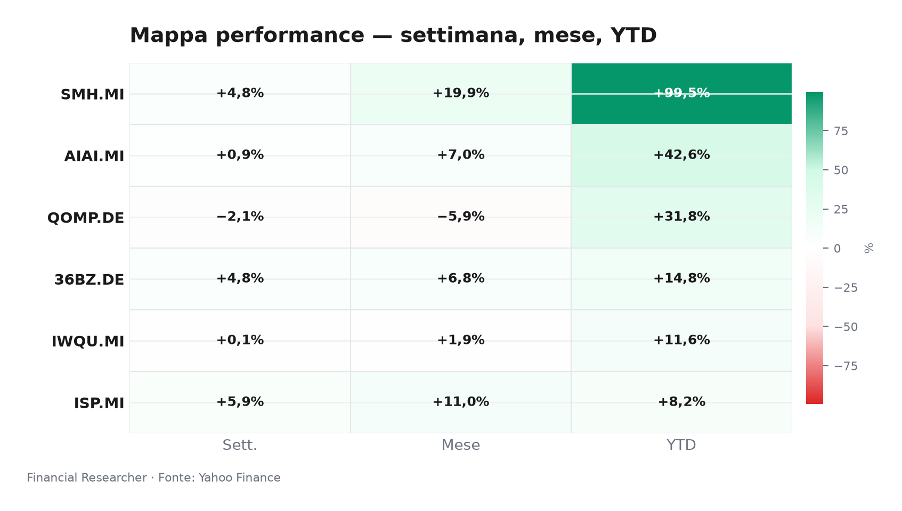
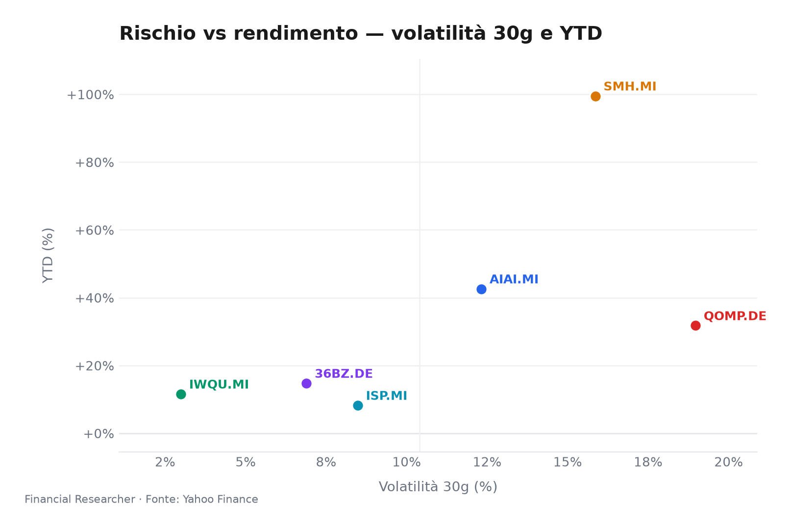
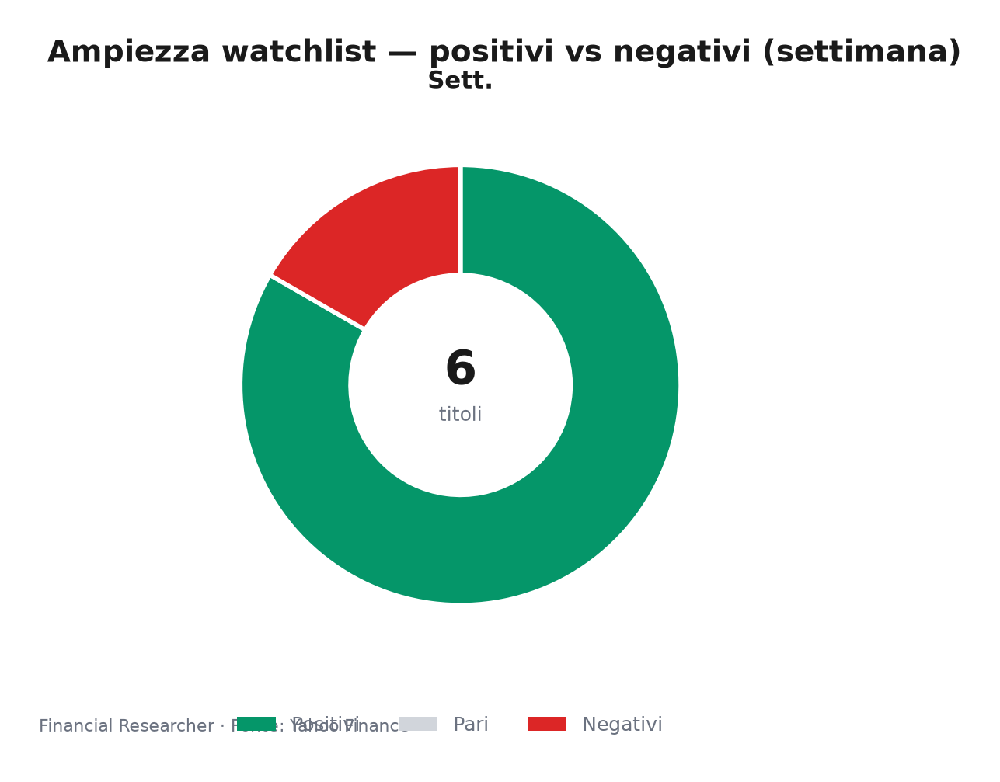

# Watchlist Briefing: 23 Giugno 2026 – Pre-Apertura Milano

**Umore di mercato:** L’impero dei chip non conosce ostacoli, ma le scintille tra Roma e Washington iniettano un filo di cautela sui listini italiani.

## Executive Summary

- **L&G Artificial Intelligence UCITS ETF (AIAI.MI)** registra un +0.39% nell’ultimo giorno e un impressionante +42.61% da inizio anno, sostenuto da un’allocazione tematica che continua a beneficiare della riallocazione globale verso l’intelligenza artificiale, in assenza di notizie societarie specifiche [1].
- **VanEck Semiconductor UCITS ETF (SMH.MI)** sale dello 0.81% nella seduta precedente e del 99.51% YTD, confermandosi la componente più performante del paniere, grazie alla persistenza della domanda strutturale per semiconduttori e all’espansione dei capex hyperscaler, anche se mancano nuovi headline di rilievo [2].
- **iShares Edge MSCI World Quality Factor UCITS ETF USD (Acc) (IWQU.MI)** avanza di un modesto 0.24% (1D) e dell’11.58% YTD, riflettendo un posizionamento difensivo che ha retto in un contesto di tassi elevati, pur pagando un momentum di breve termine molto contenuto [3].
- **iShares Quantum Computing UCITS ETF USD (Acc) (QOMP.DE)** recupera lo 0.31% in singola seduta ma evidenzia un calo del 2.07% nell’ultima settimana e un saldo da inizio anno comunque positivo (+31.76%), segnalando che la narrativa quantistica resta speculativa e fortemente dipendente da catalizzatori tecnologici ancora assenti [4].
- **iShares MSCI China A UCITS ETF (36BZ.DE)** balza del 2.53% nella giornata di ieri (+14.76% YTD) – leader del watchlist – interpretando il taglio a sorpresa del Loan Prime Rate a 1 anno da parte della PBOC e le attese di ulteriori stimoli fiscali dal Politburo di luglio [5].
- **Intesa Sanpaolo S.p.A. (ISP.MI)** segna +0.91% (1D) e +8.25% YTD, con la solidità del margine d’interesse a fare da scudo, ma il deterioramento delle relazioni tra Italia e Stati Uniti dopo lo scambio di critiche Meloni–Trump sulla guerra in Iran introduce un nuovo elemento di incertezza politica [6] [7].

## Watchlist Performance Snapshot

**Leader 1D:** iShares MSCI China A UCITS ETF (36BZ.DE) (2.53%) · **Laggard 1D:** iShares Edge MSCI World Quality Factor UCITS ETF USD (Acc) (IWQU.MI) (0.24%)

| Ref | Strumento | Ticker | Prezzo (valuta) | Giornaliera | Settimanale | Mensile | YTD | 1A | Vol. 30g | Fonte |
|-----|-----------|--------|-----------------|-------------|-------------|---------|-----|-----|--------|-------|
| [1] | L&G Artificial Intelligence UCITS ETF | AIAI.MI | 34,49 EUR | 0,39% | 0,94% | 7,05% | 42,61% | 73,91% | 12,32% | [1] |
| [2] | VanEck Semiconductor UCITS ETF | SMH.MI | 109,11 EUR | 0,81% | 4,82% | 19,86% | 99,51% | 184,62% | 15,86% | [2] |
| [3] | iShares Edge MSCI World Quality Factor UCITS ETF USD (Acc) | IWQU.MI | 75,94 EUR | 0,24% | 0,07% | 1,93% | 11,58% | 23,72% | 2,99% | [3] |
| [4] | iShares Quantum Computing UCITS ETF USD (Acc) | QOMP.DE | 5,76 EUR | 0,31% | -2,07% | -5,88% | 31,76% | 33,64% | 18,97% | [4] |
| [5] | iShares MSCI China A UCITS ETF | 36BZ.DE | 5,71 EUR | 2,53% | 4,79% | 6,85% | 14,76% | 42,86% | 6,89% | [5] |
| [6] | Intesa Sanpaolo S.p.A. | ISP.MI | 6,23 EUR | 0,91% | 5,93% | 10,96% | 8,25% | 40,25% | 8,48% | [6] |
| — | FTSE MIB | FTSEMIB.MI | 52796,78 EUR | -0,10% | 1,85% | 6,64% | 16,36% | 35,93% | 5,20% | — |
| — | STOXX Europe 600 | ^STOXX | 639,27 EUR | 0,58% | 0,76% | 3,02% | 6,23% | 19,48% | 3,59% | — |

### Performance Charts

## What's Driving the Moves

**L&G Artificial Intelligence UCITS ETF (AIAI.MI)**  
L’ETF continua a essere trainato dal riposizionamento tematico post-NVIDIA GTC e dalla convinzione che la spesa in infrastrutture AI rimarrà robusta fino al 2027. In mancanza di notizie proprietarie, la performance recente (+7.05% su 1 mese) riflette un flusso costante di capitali verso il segmento AI, sostenuto da stime al rialzo sulla domanda di server e acceleratori. I dati di mercato [1] indicano un AUM di 2.1 miliardi di euro, segno di una partecipazione istituzionale robusta.

**VanEck Semiconductor UCITS ETF (SMH.MI)**  
Assenza di headline materiali, ma il +4.82% settimanale e il quasi raddoppio YTD (+99.51%) testimoniano il momento eccezionale del comparto semiconduttori. Il mercato sconta ordinativi in crescita per TSMC e ASML nel trimestre in corso, con gli investitori che guardano oltre la stagionalità estiva. L’AUM di 8.3 miliardi di euro conferma SMH come benchmark di riferimento per il settore [2].

**iShares Edge MSCI World Quality Factor UCITS ETF USD (Acc) (IWQU.MI)**  
Il fattore qualità sta operando da scudo in un regime di tassi alti e crescita globalmente modesta. L’avanzamento trascurabile dello 0.07% in settimana e l’1.93% mensile suggeriscono che i flussi in entrata derivano più da rotazioni difensive che da espansione multipli. L’ETF, con patrimonio di 5.4 miliardi, mantiene un profilo decorrelato rispetto al momentum crescita puro [3].

**iShares Quantum Computing UCITS ETF USD (Acc) (QOMP.DE)**  
La dinamica fortemente negativa nel breve termine (-5.88% su 1 mese) contrasta con il rimbalzo contenuto seduta per seduta. Il settore del calcolo quantistico soffre l’assenza di catalizzatori concreti: l’hype post-Nobel e alcune partnership industriali non si sono ancora tradotte in ricavi significativi. L’esigua massa gestita (60.7 milioni di euro) accentua la volatilità e rende il prodotto sensibile a movimenti speculativi [4].

**iShares MSCI China A UCITS ETF (36BZ.DE)**  
La seduta del 22 giugno è stata dominata dalla decisione della Banca Popolare Cinese di tagliare il tasso LPR a 1 anno di 10 punti base. La mossa, unita alle indiscrezioni su un imminente pacchetto di stimolo fiscale, ha riacceso l’interesse per le azioni cinesi di classe A. Il balzo del 2.53% fa dell’ETF il miglior performer quotidiano e si somma a un +4.79% settimanale, confermando un momento di recupero tecnico [5].

**Intesa Sanpaolo S.p.A. (ISP.MI)**  
Il titolo ha mostrato resilienza (+0.91%), sostenuto da un profilo di margine d’interesse ancora favorevole e da una cedola competitiva. Tuttavia, il contesto ha subito un parziale deterioramento nelle ultime 48 ore: lo scambio di dichiarazioni dure tra il Presidente Trump e la Premier Meloni riguardo all’intervento in Iran [7] ha fatto temere attriti che potrebbero coinvolgere le relazioni commerciali e finanziarie dell’Italia. La notizia, di impatto CAUSALE medio, si innesta su un quadro già reso complesso dal mancato aggiornamento dei target degli analisti [8] e dal risk-on speculativo dell’offerta su MPS [9]. La capitalizzazione di 108.7 miliardi e il rapporto P/E di 11.5 restano fattori di supporto, ma l’ombra geopolitica merita prudenza [6].

## Medium-Term Outlook

**Scenario Toro 🔼**
- *Trigger*: Stagione degli utili USA (Q2 2026) supera le attese, con guidance rialzista su AI e cloud. PBOC annuncia misure fiscali concrete entro la riunione del Politburo di metà luglio.
- *Impatto*: AIAI e SMH potrebbero accelerare di un ulteriore 8–12% nel trimestre, con QOMP in grado di rimbalzare del 15% su rinnovato hype. IWQU accompagna la rotazione difensiva ma con rialzi più contenuti (+2–3%), ISP beneficia del flusso nei bancari europei e 36BZ colma il gap di recupero.

**Scenario Base ▶️**
- *Trigger*: Macro stabile – BCE in pausa a luglio, Fed ferma fino a novembre, stimoli cinesi moderati ma senza sorprese. Nessuna escalation geopolitica rilevante.
- *Impatto*: IWQU prosegue la lenta progressione (+2–3% nel trimestre) come casaforte. ISP consolida intorno a €6.84 (target medio degli analisti) con ritorno totale attorno al 5% incluso dividendo. 36BZ rimane in range laterale dopo il rialzo tecnico, AIAI e SMH assorbono le prese di profitto estive ma mantengono il vantaggio YTD.

**Scenario Orso 🔽**
- *Trigger*: Sorpresa hawkish della Bank of Japan che innesca un unwinding del carry trade sullo yen; oppure una riaccelerazione del CPI USA che sposta il primo taglio Fed al 2027.
- *Impatto*: IWQU potrebbe cedere il 5% in un sell-off generalizzato della qualità, mentre SMH correggerebbe del 10% per timori di eccesso di inventario. ISP sottoperformerebbe il MIB a causa di un allargamento dello spread BTP–Bund indotto dalle tensioni politiche internazionali, e QOMP potrebbe scivolare ulteriormente del 15–20% in fuga dal rischio.

## Event Calendar

Nessun evento ad alto impatto confermato nella finestra di osservazione immediata.

| Data (YYYY-MM-DD) | Evento | Ticker/temi impattati | Impatto | [N] |
|---|---|---|---|---|
|  |  |  |  |  |

## Correlated Themes

- **Tecnologia e AI**: AIAI.MI, SMH.MI e QOMP.DE condividono la dipendenza dal ciclo di investimenti in intelligenza artificiale. La correlazione tra AI e semiconduttori resta elevata (>0.85 a 1 mese), mentre il quantum mantiene un beta più speculativo rispetto ai due ETF core.
- **Qualità e difesa**: IWQU.MI agisce come contraltare decorrelato: la rotazione verso fattori qualitativi premia società con alti ROE e basso indebitamento, in un contesto di tassi persistentemente alti.
- **Rischio Cina**: 36BZ.DE si muove in funzione degli stimoli di Pechino e dei negoziati tariffari. La correlazione con gli indici globali è bassa, offrendo effetto diversificazione ma anche vulnerabilità a improvvise strette regolatorie.
- **Bancari italiani e geopolitica**: ISP.MI incorpora sia la traiettoria dei tassi europei sia il premio per il rischio sovrano italiano. L’attuale scaramuccia Meloni–Trump rappresenta una nuova variabile che può influenzare l’intero comparto finanziario, non solo il titolo.

## Risks & Watchpoints

1. **Escalation Italia–USA**: Un ulteriore deterioramento delle relazioni diplomatiche, con possibili minacce tariffarie o sanzioni finanziarie, potrebbe far schizzare lo spread BTP-Bund e penalizzare ISP e l’intero listino milanese, annullando i guadagni da inizio anno del settore bancario.
2. **Sorpresa BoJ / Carry Trade Unwind**: Una normalizzazione più rapida della politica monetaria giapponese innescherebbe un violento riprezzamento del carry sullo yen, con vendite forzate su ETF tematici e emergenti. QOMP e 36BZ sarebbero i più esposti per dimensione ridotta e liquidità.
3. **Frenata ordini semiconduttori**: L’inizio della stagione degli utili ad agosto sarà cruciale. Se TSMC o ASML segnalassero un rallentamento delle commesse per eccesso di scorte, SMH e AIAI potrebbero subire una correzione a doppia cifra, trascinando l’intero comparto growth.
4. **Crisi di fiducia sulla Cina**: Le tensioni commerciali con gli Stati Uniti, unite a dati macro deludenti nonostante gli stimoli, potrebbero invertire bruscamente il recupero recente di 36BZ, con un impatto sproporzionato data la concentrazione geografica dell’ETF.

## Disclaimer

Il presente briefing ha esclusivamente finalità informative e non costituisce consulenza finanziaria, raccomandazione di investimento o sollecitazione all’acquisto/vendita di strumenti finanziari. Le performance passate e le analisi prospettiche non sono indicative di rendimenti futuri. I dati di mercato provengono da fonti ritenute affidabili ma non possono essere garantiti nella completezza e accuratezza.

## References

1. Yahoo Finance — AIAI.MI (L&G Artificial Intelligence UCITS ETF) — 2026-06-23 — https://finance.yahoo.com/quote/AIAI.MI
2. Yahoo Finance — SMH.MI (VanEck Semiconductor UCITS ETF) — 2026-06-23 — https://finance.yahoo.com/quote/SMH.MI
3. Yahoo Finance — IWQU.MI (iShares Edge MSCI World Quality Factor UCITS ETF USD (Acc)) — 2026-06-23 — https://finance.yahoo.com/quote/IWQU.MI
4. Yahoo Finance — QOMP.DE (iShares Quantum Computing UCITS ETF USD (Acc)) — 2026-06-23 — https://finance.yahoo.com/quote/QOMP.DE
5. Yahoo Finance — 36BZ.DE (iShares MSCI China A UCITS ETF) — 2026-06-23 — https://finance.yahoo.com/quote/36BZ.DE
6. Yahoo Finance — ISP.MI (Intesa Sanpaolo S.p.A.) — 2026-06-23 — https://finance.yahoo.com/quote/ISP.MI
8. The Wall Street Journal — Stocks to Watch Recap: Marvell Technology, Apple, Broadcom, Strategy — 2026-06-08 — https://finance.yahoo.com/m/34a0ce12-e5d0-369b-99dd-2a53210f0376/stocks-to-watch-recap-.html

<!-- financial-researcher:run-metadata -->
## Run metadata

| | |
|---|---|
| Model profile | deepseek_balanced |
| Processing time | 3m 28s |
| LLM requests | 14 |
| Tokens (prompt / completion / total) | 41,000 / 21,325 / 62,325 |

**Models by agent**

| Agent | Model (configured → resolved) |
|---|---|
| Market analyst | `deepseek/deepseek-v4-flash` → `deepseek-v4-flash` |
| News analyst | `deepseek/deepseek-v4-pro` → `deepseek-v4-pro` |
| Outlook analyst | `deepseek/deepseek-v4-flash` → `deepseek-v4-flash` |
| Calendar analyst | `deepseek/deepseek-v4-flash` → `deepseek-v4-flash` |
| Chief strategist | `deepseek/deepseek-v4-pro` → `deepseek-v4-pro` |
<!-- /financial-researcher:run-metadata -->
