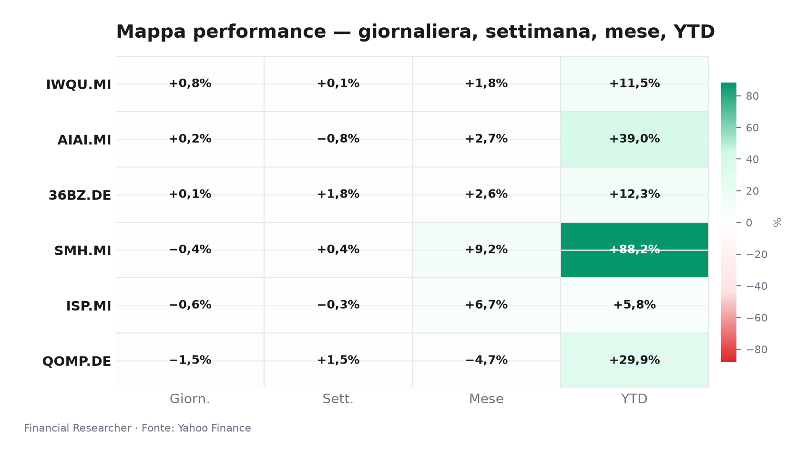
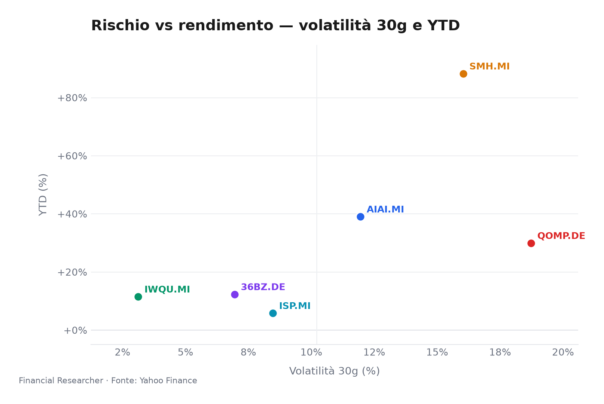
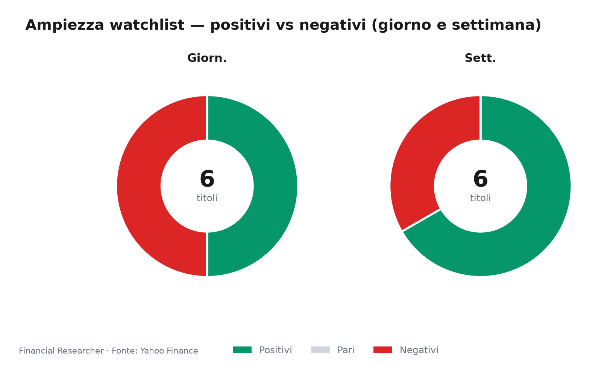
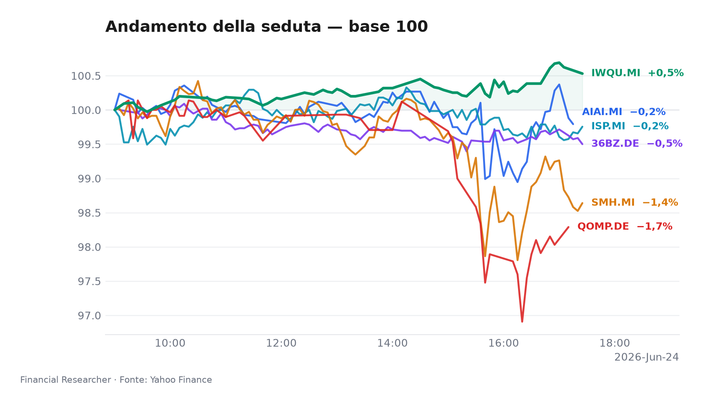
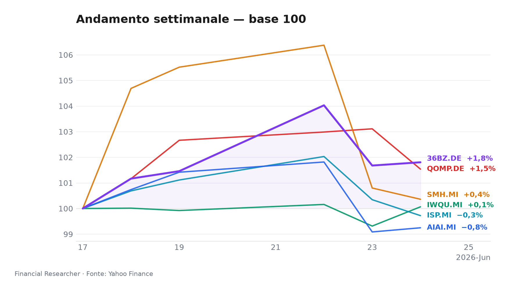
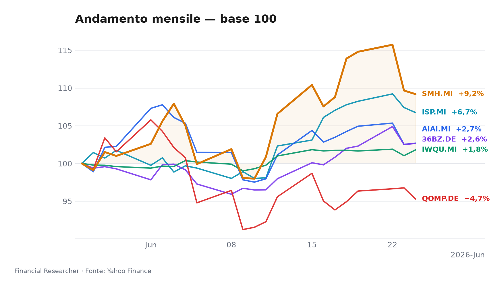
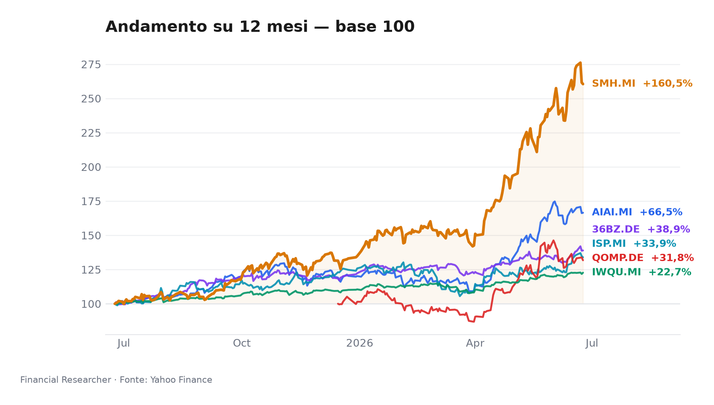

Briefing Strategico: 24 Giugno 2026  
*Tra silenzi geopolitici e rotazioni discrete, i mercati respingono l’1D mentre la qualità globale strappa un rialzo e il quantum computing si corregge con vigore.*

## Executive Summary

- **L&G Artificial Intelligence UCITS ETF (AIAI.MI)** segna un modesto +0,16% nella seduta (1W -0,75%, YTD +39,01%), consolidando il poderoso rally annuo sostenuto dall’hype strutturale sull’Intelligenza Artificiale, in assenza di notizie specifiche sullo strumento [1].  
- **VanEck Semiconductor UCITS ETF (SMH.MI)** cede lo 0,44% in 1D (1W +0,36%, YTD +88,22%) tra prese di profitto dopo la performance stellare da inizio anno, con gli investitori che riposizionano il rischio in un comparto ancora dominato dalla narrativa della domanda di chip per AI [2].  
- **iShares Edge MSCI World Quality Factor UCITS ETF USD (Acc) (IWQU.MI)** guadagna +0,76% in 1D (1W +0,07%, YTD +11,48%), sovraperformando nettamente il FTSE MIB di 295 punti base, grazie alla rotazione verso fattori difensivi e di qualità in un quadro macro incerto [3].  
- **iShares Quantum Computing UCITS ETF USD (Acc) (QOMP.DE)** è il fanalino di coda con un -1,53% (1W +1,54%, YTD +29,91%), soggetto a prese di beneficio su un tema altamente speculativo e all’aumento della volatilità implicita (30d 18,7%) [4].  
- **iShares MSCI China A UCITS ETF (36BZ.DE)** avanza dello 0,13% (1W +1,80%, YTD +12,31%), sostenuto da un timido rimbalzo delle azioni cinesi di classe A in attesa di nuovi stimoli e da un clima commerciale meno teso [5].  
- **Intesa Sanpaolo S.p.A. (ISP.MI)** arretra dello 0,62% (1W -0,28%, YTD +5,81%), appesantita dall’offerta pubblica di acquisto rivale per Monte dei Paschi e dalle crescenti tensioni politiche tra Italia e Stati Uniti sulla questione iraniana, che offuscano il sentiment bancario [6] [7] [8].

## Watchlist Performance Snapshot

**Leader 1D:** iShares Edge MSCI World Quality Factor UCITS ETF USD (Acc) (IWQU.MI) (0.76%) · **Laggard 1D:** iShares Quantum Computing UCITS ETF USD (Acc) (QOMP.DE) (-1.53%)

| Ref | Strumento | Ticker | Prezzo (valuta) | Giornaliera | Settimanale | Mensile | YTD | 1A | Vol. 30g | Fonte |
|-----|-----------|--------|-----------------|-------------|-------------|---------|-----|-----|--------|-------|
| [1] | L&G Artificial Intelligence UCITS ETF | AIAI.MI | 33,62 EUR | 0,16% | -0,75% | 2,69% | 39,01% | 66,48% | 11,95% | [1] |
| [2] | VanEck Semiconductor UCITS ETF | SMH.MI | 102,94 EUR | -0,44% | 0,36% | 9,19% | 88,22% | 160,48% | 16,03% | [2] |
| [3] | iShares Edge MSCI World Quality Factor UCITS ETF USD (Acc) | IWQU.MI | 75,87 EUR | 0,76% | 0,07% | 1,80% | 11,48% | 22,69% | 3,12% | [3] |
| [4] | iShares Quantum Computing UCITS ETF USD (Acc) | QOMP.DE | 5,68 EUR | -1,53% | 1,54% | -4,71% | 29,91% | 31,76% | 18,73% | [4] |
| [5] | iShares MSCI China A UCITS ETF | 36BZ.DE | 5,58 EUR | 0,13% | 1,80% | 2,65% | 12,31% | 38,92% | 6,95% | [5] |
| [6] | Intesa Sanpaolo S.p.A. | ISP.MI | 6,09 EUR | -0,62% | -0,28% | 6,74% | 5,81% | 33,93% | 8,47% | [6] |
| — | FTSE MIB | FTSEMIB.MI | 51638,94 EUR | -2,19% | -1,82% | 3,49% | 13,81% | 30,82% | 5,25% | — |
| — | STOXX Europe 600 | ^STOXX | 635,16 EUR | 0,08% | -0,65% | 1,14% | 5,55% | 17,41% | 3,60% | — |

### Performance Charts

## What's Driving the Moves

- **L&G Artificial Intelligence UCITS ETF (AIAI.MI)** — In mancanza di notizie specifiche sull’ETF, la seduta laterale riflette un fisiologico consolidamento dopo la corsa da inizio anno (+39% YTD inclusivo del cambio USD/EUR). Il tema dell’IA rimane centrale, ma la recente debolezza settimanale (-0,75%) suggerisce che parte degli investitori stia monetizzando i guadagni alla luce di valutazioni elevate, pur mantenendo un sovrappeso strutturale a lungo termine [1].  
- **VanEck Semiconductor UCITS ETF (SMH.MI)** — Il leggero arretramento (-0,44% 1D) è coerente con una rotazione settoriale che premia la qualità dopo un rally quasi raddoppiato nel 2026 (+88,22% YTD). I dati macro contrastanti (PMI composito europeo in rallentamento, ordini di semiconduttori resilienti) alimentano prese di profitto su un comparto che, sebbene sostenuto dalla domanda di chip per AI, presenta multipli storicamente elevati. L’elevato AUM (€8,3 miliardi) testimonia l’interesse istituzionale, ma anche la vulnerabilità a movimenti correttivi [2].  
- **iShares Edge MSCI World Quality Factor UCITS ETF USD (Acc) (IWQU.MI)** — La performance dell’ETF (+0,76% 1D) è trainata dalla ricerca di rifugio in titoli con elevata redditività e bassa volatilità. In un contesto di incertezza geopolitica e rotazione fuori dai temi growth estremi, i flussi verso la qualità globale premiano questo strumento, che batte il mercato italiano e lo STOXX Europe 600. L’YTD contenuto (+11,48%) conferma un profilo di partecipazione moderata al rialzo con difesa nelle fasi di stress [3].  
- **iShares Quantum Computing UCITS ETF USD (Acc) (QOMP.DE)** — La correzione odierna (-1,53%) è fisiologica per un segmento ancora dominato dalla speculazione. Dopo il recente rimbalzo settimanale (+1,54%), il tema quantum computing resta ad alta volatilità (30d vol 18,7%) e con una capitalizzazione ridotta (AUM €60,7M), che lo rende particolarmente sensibile ai movimenti di portafoglio di pochi operatori. L’assenza di catalizzatori operativi concreti a breve mantiene il titolo in un range ampio, con una YTD comunque robusta (+29,91%) ma soggetta a forti oscillazioni [4].  
- **iShares MSCI China A UCITS ETF (36BZ.DE)** — Il movimento contenuto in 1D (+0,13%) e la migliore performance settimanale (+1,80%) riflettono un graduale recupero delle azioni cinesi di classe A, sostenuto da speranze di nuovi stimoli fiscali da Pechino e da un clima commerciale meno ostile dopo i recenti colloqui. L’ETF, esposto al CNY, beneficia di un cambio ancora relativamente stabile, ma la mancanza di dati sugli AUM limita la valutazione sulla profondità del mercato. L’YTD (+12,31%) rimane inferiore ai temi tecnologici globali, risentendo della cautela verso i mercati emergenti [5].  
- **Intesa Sanpaolo S.p.A. (ISP.MI)** — Il titolo bancario arretra dello 0,62%, in un contesto di rinnovata turbolenza per il risiko bancario italiano. Come riportato da Simply Wall St. [9] [10], le stime degli analisti restano sostanzialmente invariate (target medio €6,84, upside 12% rispetto alla quotazione attuale), ma il mercato digerisce la notizia dell’OPA rivale lanciata da Intesa per rilevare Monte dei Paschi di Siena [7] [11], che alimenta incertezze su eventuali oneri di integrazione e rischi antitrust. In aggiunta, le tensioni apertesi tra il presidente Trump e la premier Meloni sulla postura italiana verso l’Iran [8] gettano un’ombra sul sentiment verso gli asset italiani, colpendo i bancari esposti al debito sovrano. La seduta chiude con volumi prudenti, mentre la previsione di utili 2026 (P/E 11.3) offre un cuscinetto di valutazione [6]. Il titolo resta in attesa di nuovi segnali dagli analisti, che per ora non hanno rivisto i propri giudizi [9][12].

## Medium-Term Outlook

- **Scenario Toro (probabilità 25-30%)**  
  La distensione delle tensioni Iran-USA e un accordo sull’Ucraina entro l’inizio del Q4 2026 rimuoverebbero il premio di rischio geopolitico, innescando un rally dei settori ciclici e bancari. **ISP (ISP.MI)** e il paniere cinese **(36BZ.DE)** trarrebbero il massimo beneficio, mentre i temi AI e semiconduttori continuerebbero a sovraperformare spinti da nuove trimestrali stellari. Lo scenario è subordinato a un raffreddamento del dibattito politico interno italiano e a un target di prezzo confermato sopra €7 per Intesa entro ottobre 2026.

- **Scenario Base (probabilità 50-55%)**  
  Crescita economica moderata e tensioni geopolitiche contenute nella regione; la BCE mantiene i tassi stabili dopo i tagli già operati. In questo quadro, **IWQU (IWQU.MI)** funge da ancora di stabilità, mentre **AIAI (AIAI.MI)** e **SMH (SMH.MI)** registrano una moderata espansione dei multipli senza eccessi, sostenuti da utili solidi. Il quantum computing **(QOMP.DE)** rimane laterale in attesa di progressi tecnologici concreti. **36BZ.DE** risente di stimoli graduali e di un yuan debole, ma evita drawdown significativi. Intesa Sanpaolo consolida attorno a €6,20-6,80, con la vicenda MPS che gradualmente si chiarisce.

- **Scenario Orso (probabilità 20-25%)**  
  Un’escalation delle frizioni commerciali USA-Cina e l’inasprirsi della disputa Iran, con sanzioni secondarie che colpiscono aziende europee, innescherebbero un flight-to-quality estremo. **QOMP.DE** e le strategie tematiche più speculative subirebbero correzioni a doppia cifra, trascinando al ribasso anche **AIAI.MI** e **SMH.MI** con prese di profitto massicce. La qualità globale **(IWQU.MI)** terrebbe meglio ma non sarebbe immune. **36BZ.DE** crollerebbe per avversione al rischio emergente e timori di nuove barriere. **ISP.MI** finirebbe sotto pressione insieme a tutto il comparto bancario europeo, con spread BTP-Bund in allargamento oltre 200 pb; target price a rischio verso €5,50 se il costo del capitale salisse. I trigger temporali: pubblicazione dati PMI globali di luglio-agosto e decisioni OPEC+ sull’offerta petrolifera.

## Event Calendar

Nessun evento confermato nel periodo di osservazione.

| Date (YYYY-MM-DD) | Event | Affected tickers/themes | Impact | [N] |
|---|---|---|---|---|
| — | Nessun evento confermato | — | — | — |

## Correlated Themes

- **Tema AI vs. Qualità**: **AIAI.MI** e **SMH.MI** sono fortemente correlati (coefficiente storico >0,85) e rappresentano esposizione alla crescita tecnologica; **IWQU.MI** agisce come contrappeso difensivo, registrando spesso performance opposte nei giorni di risk-off. La rotazione tra i due poli definisce l’intonazione aggregata del watchlist.  
- **Sovrapposizione Quantum**: **QOMP.DE** è un derivato speculativo della narrativa tecnologica, con volatilità amplificata e correlazione parziale con AI e semiconduttori; i drawdown del quantum spesso anticipano correzioni più ampie nei temi tech speculativi.  
- **Esposizione Cina**: **36BZ.DE** offre diversificazione geografica e valutativa, ma è sensibile alle variabili politiche (dazi, ritorsioni) e al cambio CNY/EUR; la sua decorrelazione dal resto del portafoglio può attenuare il rischio complessivo in scenari di stress euro-americano.  
- **Banca e rischio domestico**: **ISP.MI** è collegato allo spread sovrano italiano e alla stabilità politica; la recente OPA per MPS aumenta il rischio evento e crea legami con il sentiment sull’intero settore bancario europeo, come evidenziato dall’andamento del FTSE MIB (-2,19% in 1D) molto più debole del watchlist medio (-0,26%).

## Risks & Watchpoints

1. **Escalation geopolitica Italia-USA**: L’inasprirsi delle critiche pubbliche tra Trump e Meloni sull’Iran potrebbe tradursi in azioni concrete – sanzioni mirate, riduzione della cooperazione commerciale – con ripercussioni sui titoli bancari italiani e sullo spread BTP. Monitorare ogni dichiarazione ufficiale e il posizionamento del governo italiano.  
2. **Correzione dei multipli tecnologici**: Il rally del 2026 ha portato i P/E di molti titoli AI e semiconduttori a livelli storicamente elevati. Un singolo earnings miss di un big tech o un rialzo dei tassi a lungo termine potrebbe innescare una correzione a cascata su **AIAI.MI** e **SMH.MI**, trascinando anche **QOMP.DE** in territorio negativo.  
3. **Rischio politico e normativo italiano**: L’offerta per MPS introduce incertezza sull’assetto competitivo del sistema bancario e sui possibili veti dell’antitrust. Inoltre, l’instabilità della maggioranza – qualora le tensioni con gli USA deteriorassero i rapporti interni alla coalizione – potrebbe aumentare il premio per il rischio sovrano Italia e pesare su **ISP.MI**.  
4. **Rischio valuta e liquidità**: Gli ETF tematici (AIAI, SMH, QOMP) e quello sulla qualità (IWQU) sono denominati in EUR ma espongono a sottostanti USD; un rafforzamento dell’euro eroderebbe i rendimenti. Per **36BZ.DE**, il rischio cambio CNY/EUR è rilevante, così come la mancanza di dati sugli AUM che potrebbe mascherare un rischio di liquidità in fasi di stress.  
5. **Rischio eventi su Cina**: Un’improvvisa stretta regolatoria sulle big tech cinesi o un nuovo round di dazi USA potrebbe far deragliare il rimbalzo di **36BZ.DE**, vanificando la sovraperformance settimanale e riportando il titolo verso i minimi dell’anno.

## References

1. Yahoo Finance — AIAI.MI (L&G Artificial Intelligence UCITS ETF) — 2026-06-24 — https://finance.yahoo.com/quote/AIAI.MI
2. Yahoo Finance — SMH.MI (VanEck Semiconductor UCITS ETF) — 2026-06-24 — https://finance.yahoo.com/quote/SMH.MI
3. Yahoo Finance — IWQU.MI (iShares Edge MSCI World Quality Factor UCITS ETF USD (Acc)) — 2026-06-24 — https://finance.yahoo.com/quote/IWQU.MI
4. Yahoo Finance — QOMP.DE (iShares Quantum Computing UCITS ETF USD (Acc)) — 2026-06-24 — https://finance.yahoo.com/quote/QOMP.DE
5. Yahoo Finance — 36BZ.DE (iShares MSCI China A UCITS ETF) — 2026-06-24 — https://finance.yahoo.com/quote/36BZ.DE
6. Yahoo Finance — ISP.MI (Intesa Sanpaolo S.p.A.) — 2026-06-24 — https://finance.yahoo.com/quote/ISP.MI
7. The Wall Street Journal — Stocks to Watch Recap: Marvell Technology, Apple, Broadcom, Strategy — 2026-06-08 — https://finance.yahoo.com/m/34a0ce12-e5d0-369b-99dd-2a53210f0376/stocks-to-watch-recap-.html

## Disclaimer

Le informazioni contenute nel presente briefing sono destinate esclusivamente a scopi informativi e non costituiscono consigli di investimento, raccomandazioni né sollecitazioni all’acquisto o alla vendita di strumenti finanziari. I rendimenti passati non sono indicativi di risultati futuri. Le opinioni espresse riflettono il giudizio del team di strategia alla data indicata e possono essere soggette a modifiche senza preavviso. Si invitano i destinatari a effettuare le proprie valutazioni e a consultare i propri consulenti finanziari prima di assumere decisioni di investimento. I dati di mercato citati provengono da fonti ritenute affidabili ma non se ne garantisce l’accuratezza o la completezza.

<!-- financial-researcher:run-metadata -->
## Run metadata

| | |
|---|---|
| Model profile | deepseek_balanced |
| Processing time | 2m 21s |
| LLM requests | 9 |
| Tokens (prompt / completion / total) | 21,217 / 14,939 / 36,156 |

**Models by agent**

| Agent | Model (configured → resolved) |
|---|---|
| Market analyst | `deepseek/deepseek-v4-flash` → `deepseek-v4-flash` |
| News analyst | `deepseek/deepseek-v4-pro` → `deepseek-v4-pro` |
| Outlook analyst | `deepseek/deepseek-v4-flash` → `deepseek-v4-flash` |
| Calendar analyst | `deepseek/deepseek-v4-pro` → `deepseek-v4-pro` |
| Chief strategist | `deepseek/deepseek-v4-pro` → `deepseek-v4-pro` |
<!-- /financial-researcher:run-metadata -->
