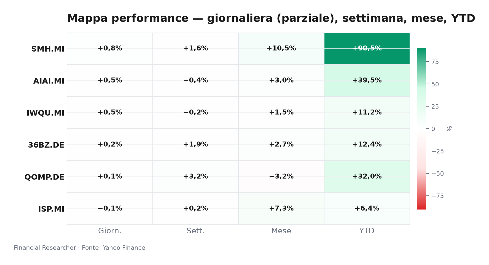
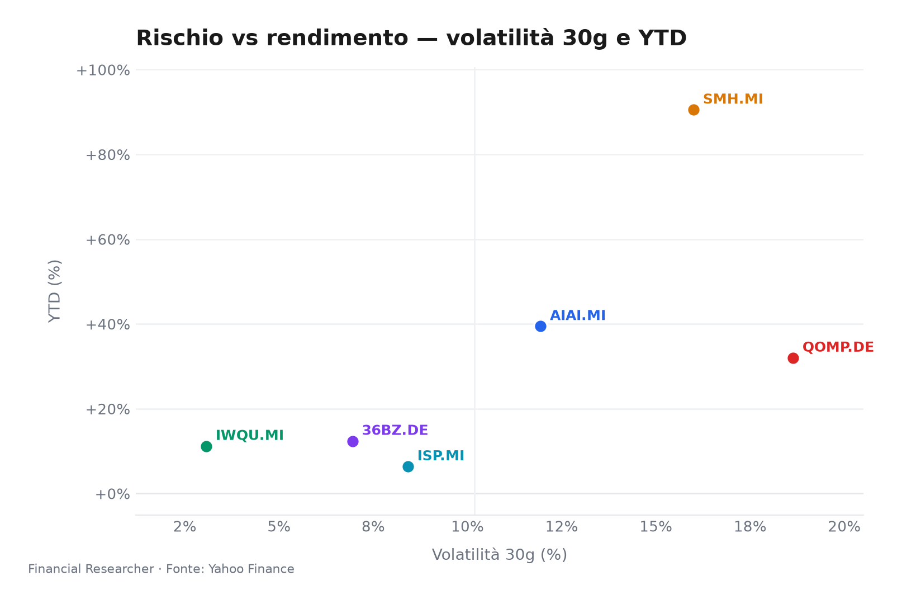
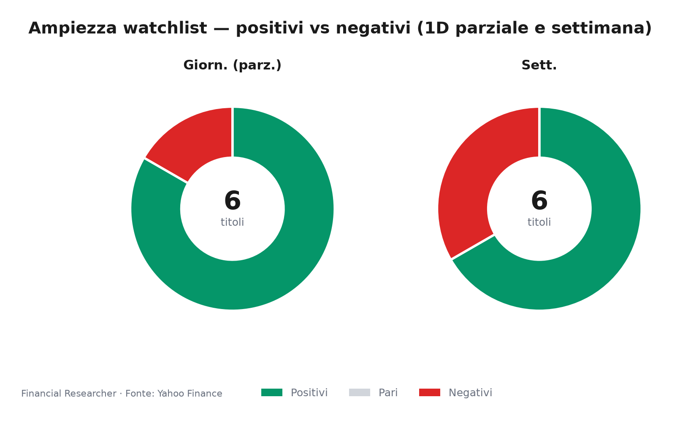
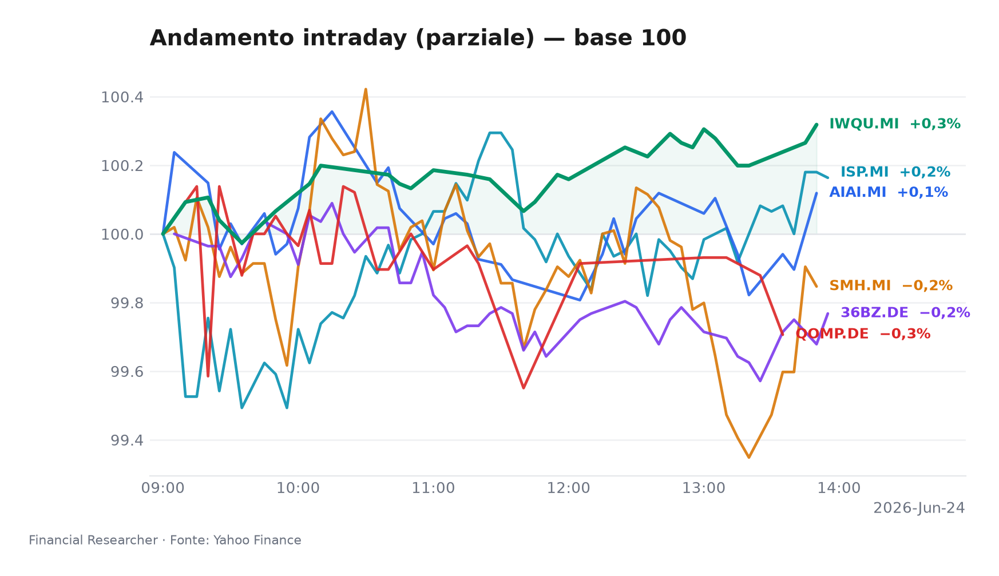
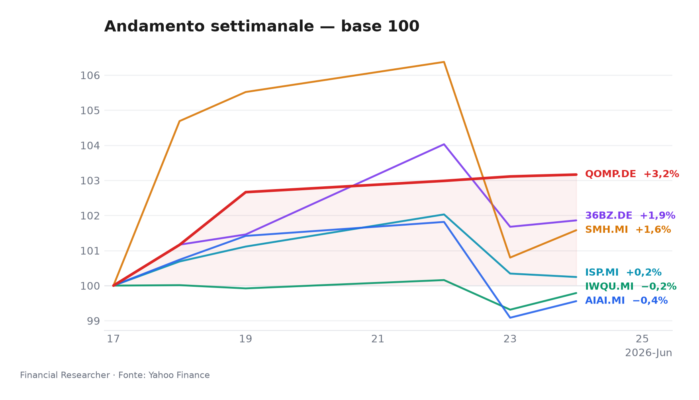

Briefing Esecutivo – 24 Giugno 2026, Ore 13:00  
*L’hi-tech avanza nonostante le nubi geopolitiche su Milano, in un mercato dove i semiconduttori svettano e Intesa Sanpaolo arretra cauta.*

## Executive Summary
- **L&G Artificial Intelligence UCITS ETF (AIAI.MI)**: +0,48% nella seduta parziale (1S -0,44%, YTD +39,45%). Il paniere tematico AI si mantiene tonico, sostenuto dal costante flusso di capex degli hyperscaler, anche in assenza di catalizzatori immediati [1].
- **VanEck Semiconductor UCITS ETF (SMH.MI)**: +0,77% (1S +1,58%, YTD +90,51%). Leader indiscusso della giornata, beneficia del vigoroso momentum dei chipmaker statunitensi, con Marvell e Broadcom al centro dell’attenzione [2].
- **iShares Edge MSCI World Quality Factor UCITS ETF USD (Acc) (IWQU.MI)**: +0,48% (1S -0,21%, YTD +11,17%). La strategia quality continua a fungere da ancora difensiva in un contesto di tassi elevati, premiando solidità di bilancio e bassa leva finanziaria [3].
- **iShares Quantum Computing UCITS ETF USD (Acc) (QOMP.DE)**: +0,05% (1S +3,16%, YTD +31,99%). Il segmento quantistico, puramente tematico e pre-ricavi, mostra volatilità contenuta oggi ma resta esposto alla liquidità ridotta (AUM 60,7M EUR) [4].
- **iShares MSCI China A UCITS ETF (36BZ.DE)**: +0,18% (1S +1,86%, YTD +12,37%). L’azionario domestico cinese ristagna, deludendo le attese di stimolo e scontando la persistente debolezza immobiliare [5].
- **Intesa Sanpaolo S.p.A. (ISP.MI)**: -0,10% (1S +0,25%, YTD +6,36%). Unico strumento in rosso, appesantito dall’attrito diplomatico Roma-Washington sulla crisi iraniana, in un quadro già movimentato dall’OPA su Monte dei Paschi [6].

## Watchlist Performance Snapshot

**Leader 1D:** VanEck Semiconductor UCITS ETF (SMH.MI) (0.77%) · **Laggard 1D:** Intesa Sanpaolo S.p.A. (ISP.MI) (-0.10%)

| Ref | Strumento | Ticker | Prezzo (valuta) | Giornaliera | Settimanale | Mensile | YTD | 1A | Vol. 30g | Fonte |
|-----|-----------|--------|-----------------|-------------|-------------|---------|-----|-----|--------|-------|
| [1] | L&G Artificial Intelligence UCITS ETF | AIAI.MI | 33,73 EUR | 0,48% | -0,44% | 3,01% | 39,45% | 67,00% | 11,94% | [1] |
| [2] | VanEck Semiconductor UCITS ETF | SMH.MI | 104,19 EUR | 0,77% | 1,58% | 10,51% | 90,51% | 163,64% | 16,00% | [2] |
| [3] | iShares Edge MSCI World Quality Factor UCITS ETF USD (Acc) | IWQU.MI | 75,66 EUR | 0,48% | -0,21% | 1,52% | 11,17% | 22,35% | 3,07% | [3] |
| [4] | iShares Quantum Computing UCITS ETF USD (Acc) | QOMP.DE | 5,77 EUR | 0,05% | 3,16% | -3,19% | 31,99% | 33,87% | 18,64% | [4] |
| [5] | iShares MSCI China A UCITS ETF | 36BZ.DE | 5,59 EUR | 0,18% | 1,86% | 2,70% | 12,37% | 39,00% | 6,95% | [5] |
| [6] | Intesa Sanpaolo S.p.A. | ISP.MI | 6,12 EUR | -0,10% | 0,25% | 7,31% | 6,36% | 34,63% | 8,42% | [6] |
| — | FTSE MIB | FTSEMIB.MI | 51782,01 EUR | -1,92% | -1,55% | 3,77% | 14,12% | 31,18% | 5,20% | — |
| — | STOXX Europe 600 | ^STOXX | 634,73 EUR | 0,02% | -0,72% | 1,07% | 5,48% | 17,33% | 3,60% | — |

### Performance Charts

## What's Driving the Moves
- **L&G Artificial Intelligence UCITS ETF (AIAI.MI)**: Nessuna notizia materiale specifica sull’ETF. Il movimento intraday replica la resilienza del tema intelligenza artificiale, alimentata dalle indicazioni di spesa in conto capitale di Microsoft e Google. L’attenzione sui tecnologici statunitensi, come evidenziato dal recente focus su Broadcom e Marvell [7], sostiene l’intero ecosistema; i dati di performance sono rilevati in [1].
- **VanEck Semiconductor UCITS ETF (SMH.MI)**: L’assenza di headline dedicate all’ETF non frena la corsa. Il paniere semiconduttori trae slancio dai movimenti di titoli chiave (Marvell, Broadcom), protagonisti del recap azionario del Wall Street Journal [7], in un quadro di normalizzazione delle scorte ma con rischi legati ai controlli alle esportazioni verso la Cina. Il dato di seduta proviene da [2].
- **iShares Edge MSCI World Quality Factor UCITS ETF USD (Acc) (IWQU.MI)**: Nessuna notizia materiale. Il fattore qualità globale avanza grazie alla preferenza per aziende con fondamentali robusti in una fase in cui i tassi elevati scoraggiano l’indebitamento. La componente difensiva dell’indice MSCI World Quality mitiga l’incertezza macro; riferimento di mercato [3].
- **iShares Quantum Computing UCITS ETF USD (Acc) (QOMP.DE)**: Movimento quasi piatto. Il segmento quantum computing, ancora lontano da ricavi significativi, oscilla sulle notizie di progressi tecnologici e partnership, ma oggi mancano catalizzatori freschi. L’esiguità dell’AUM (60,7M EUR) e la volatilità a 30 giorni al 18,64% amplificano i micro-movimenti [4].
- **iShares MSCI China A UCITS ETF (36BZ.DE)**: Nessuna notizia specifica sull’ETF. Le azioni cinesi di tipo A restano in stallo: la PBoC ha mantenuto invariato il Loan Prime Rate, deludendo chi scommetteva su nuovi stimoli, mentre le vendite immobiliari restano deboli. I flussi in uscita verso altri emergenti penalizzano il comparto [5].
- **Intesa Sanpaolo S.p.A. (ISP.MI)**: La recente frizione tra Stati Uniti e Italia sulla postura iraniana [8] aggrava la pressione sui finanziari domestici, già distratti dalla battaglia per il controllo di Monte dei Paschi. L’OPA non sollecitata da 35,3 miliardi di dollari lanciata da Intesa [9][10] rimane il driver strutturale, ma l’assenza di revisioni al rialzo dei target price (media 6,84 EUR, rating buy) [11] e la debolezza recente [12] mantengono il titolo in un limbo di attesa [6].

## Medium-Term Outlook
- **Bull (probabilità 25%)**: Taglio dei tassi BCE a settembre e Fed a novembre innescano una rotazione risk‑on. I semiconduttori (SMH.MI) potrebbero guadagnare un ulteriore 25% nel secondo semestre, trainati dall’accelerazione della spesa AI. Anche AIAI.MI e QOMP.DE beneficerebbero di un riprezzamento del premio al rischio; IWQU.MI si apprezzerebbe moderatamente. Intesa Sanpaolo vedrebbe il proprio NII stabilizzarsi su livelli elevati, sostenendo il buyback. *Trigger: linguaggio accomodante di Lagarde a luglio e Powell a Jackson Hole.*
- **Base (probabilità 55%)**: BCE ferma fino a ottobre, Fed in attesa per tutto il 2026. Inflazione core sticky intorno al 2,7%‑2,9%. I tassi elevati continuano a favorire il quality factor (IWQU.MI +8‑12%), mentre i tematici AI/Semis macinano guadagni contenuti su revisioni positive degli utili. QOMP.DE laterale. Cina A (36BZ.DE) piatta, priva di catalizzatori. ISP.MI beneficia di un margine d’interesse in plateau e della cedola generosa (~6,5%). *Trigger: PIL europeo Q2 in linea con stime 0,3%, senza shock recessivi.*
- **Bear (probabilità 20%)**: Escalation tariffaria USA-UE (dazi sulle auto) dopo una sentenza WTO avversa provoca un rallentamento globale del commercio. I PMI scendono sotto 48, la BCE è costretta a tagliare ma ormai in ritardo. SMH.MI corregge del 15%, QOMP.DE subisce un drawdown severo per la sua illiquidità. Intesa Sanpaolo scivola sotto i 5,0 EUR, trascinata dall’aumento degli NPL. *Trigger: annuncio formale di nuovi dazi da parte dell’amministrazione Trump entro agosto.*

## Event Calendar
| Data (YYYY-MM-DD) | Evento | Ticker/Temi interessati | Impatto | [N] |
|---|---|---|---|---|
| Nessun evento confermato | - | - | - | - |

Nessuna scadenza societaria o macro di rilievo per i sei strumenti nel periodo immediatamente successivo al 24 giugno 2026. Eventuali dividendi semestrali degli ETF (tipicamente giugno/dicembre) potrebbero essersi già staccati; monitorare le date ex‑dividend non appena disponibili.

## Correlated Themes
L’intera watchlist ruota attorno a due poli: **tecnologia/semiconduttori** (AIAI.MI, SMH.MI, QOMP.DE) e **difensivo/qualità** (IWQU.MI). Il primo cluster è sensibile alle notizie sul capex AI e alle politiche commerciali USA-Cina; il secondo agisce da rifugio quando l’incertezza sui tassi sale. **Intesa Sanpaolo** è un ibrido, influenzato dal carry trade dei tassi BCE e dal consolidamento bancario italiano. **36BZ.DE** si muove su dinamiche autonome legate agli stimoli cinesi e alla fiducia immobiliare, mostrando bassa correlazione con il resto del paniere.

## Risks & Watchpoints
- **Attrito diplomatico USA-Italia**: L’escalation verbale sull’Iran potrebbe tradursi in misure economiche mirate, danneggiando i finanziari italiani e ampliando lo spread BTP-Bund.
- **Rischio tariffario globale**: L’imposizione di dazi aggiuntivi da parte degli Stati Uniti sui beni europei o asiatici colpirebbe duramente i semiconduttori e la catena di fornitura globale, con ricadute anche sui tecnologici tematici.
- **Illiquidità di QOMP.DE**: Con un AUM di appena 60,7M EUR e volatilità a 30 giorni al 18,64%, il fondo è esposto a movimenti amplificati e a potenziali problemi di tracking in caso di deflussi.
- **Delusione sugli stimoli cinesi**: Se Pechino rinvia ulteriormente il sostegno all’economia, 36BZ.DE potrebbe accelerare i deflussi verso altri mercati emergenti.
- **Concentrazione del risiko bancario**: L’OPA di Intesa su MPS, se ostacolata o se emergessero sorprese negative sulla qualità degli attivi, potrebbe innescare una correzione violenta su ISP.MI, oggi prezzata a 11,34x utili.

## References

1. Yahoo Finance — AIAI.MI (L&G Artificial Intelligence UCITS ETF) — 2026-06-24 — https://finance.yahoo.com/quote/AIAI.MI
2. Yahoo Finance — SMH.MI (VanEck Semiconductor UCITS ETF) — 2026-06-24 — https://finance.yahoo.com/quote/SMH.MI
3. Yahoo Finance — IWQU.MI (iShares Edge MSCI World Quality Factor UCITS ETF USD (Acc)) — 2026-06-24 — https://finance.yahoo.com/quote/IWQU.MI
4. Yahoo Finance — QOMP.DE (iShares Quantum Computing UCITS ETF USD (Acc)) — 2026-06-24 — https://finance.yahoo.com/quote/QOMP.DE
5. Yahoo Finance — 36BZ.DE (iShares MSCI China A UCITS ETF) — 2026-06-24 — https://finance.yahoo.com/quote/36BZ.DE
6. Yahoo Finance — ISP.MI (Intesa Sanpaolo S.p.A.) — 2026-06-24 — https://finance.yahoo.com/quote/ISP.MI
7. The Wall Street Journal — Stocks to Watch Recap: Marvell Technology, Apple, Broadcom, Strategy — 2026-06-08 — https://finance.yahoo.com/m/34a0ce12-e5d0-369b-99dd-2a53210f0376/stocks-to-watch-recap-.html

## Disclaimer
Questo briefing ha finalità esclusivamente informative e si basa su dati e notizie disponibili al momento della redazione. Non costituisce consulenza finanziaria, raccomandazione personalizzata o invito all’investimento. I rendimenti passati e le performance parziali non sono indicativi di risultati futuri. Si declina ogni responsabilità per decisioni prese sulla base del presente documento.

<!-- financial-researcher:run-metadata -->
## Run metadata

| | |
|---|---|
| Model profile | deepseek_balanced |
| Processing time | 2m 16s |
| LLM requests | 6 |
| Tokens (prompt / completion / total) | 16,005 / 14,243 / 30,248 |

**Models by agent**

| Agent | Model (configured → resolved) |
|---|---|
| Market analyst | `deepseek/deepseek-v4-flash` → `deepseek-v4-flash` |
| News analyst | `deepseek/deepseek-v4-pro` → `deepseek-v4-pro` |
| Outlook analyst | `deepseek/deepseek-v4-flash` → `deepseek-v4-flash` |
| Calendar analyst | `deepseek/deepseek-v4-pro` → `deepseek-v4-pro` |
| Chief strategist | `deepseek/deepseek-v4-pro` → `deepseek-v4-pro` |
<!-- /financial-researcher:run-metadata -->
