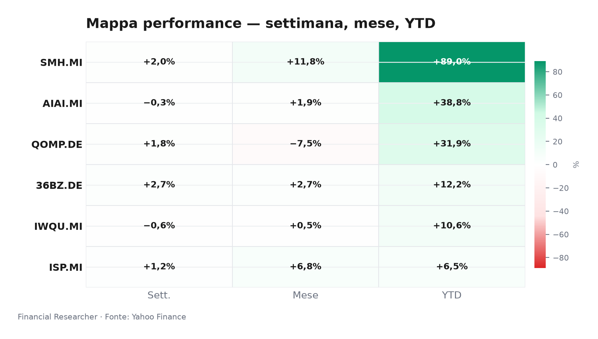
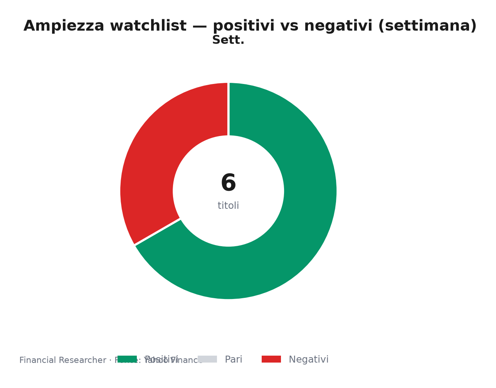
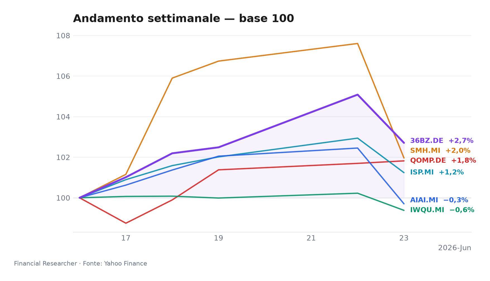

**Briefing Esecutivo — Borsa Italiana, Pre‑Apertura del 24 giugno 2026**  
*I semiconduttori subiscono una brusca correzione, mentre il quantum computing resta piatto in un contesto di avversione al rischio sui listini europei.*

## Executive Summary

- **L&G Artificial Intelligence UCITS ETF (AIAI.MI)**: cede il 2,68% in seduta, riportando il progresso settimanale a -0,30%; nonostante la flessione, il tema AI conserva un eccezionale +38,78% da inizio anno, trainato dalla stagione degli utili dei grandi chipmaker [1].
- **VanEck Semiconductor UCITS ETF (SMH.MI)**: pesante correzione intraday del -5,24%, che ridimensiona il guadagno settimanale a +1,96%; il comparto resta comunque in rialzo dell’89,05% YTD, ma la seduta odierna segnala prese di profitto dopo il rally prolungato [2].
- **iShares Edge MSCI World Quality Factor UCITS ETF USD (Acc) (IWQU.MI)**: arretra dello 0,84% (1D) e dello 0,62% nella settimana, mantenendo un solido +10,64% YTD; il fattore qualità continua a sovraperformare i benchmark in un regime di tassi stabili [3].
- **iShares Quantum Computing UCITS ETF USD (Acc) (QOMP.DE)**: unico strumento invariato nella giornata (0,00%), con +1,82% settimanale e +31,92% YTD; la nicchia del calcolo quantistico conferma la resilienza e raccoglie flussi istituzionali [4].
- **iShares MSCI China A UCITS ETF (36BZ.DE)**: segnalato come piatto (0,00%, dato 1D potenzialmente inconsistente), mostra un progresso settimanale del +2,71% e un YTD del +12,17%; la politica di sostegno di Pechino sostiene le azioni A, ma il rischio di escalation commerciale frena ulteriori rialzi [5].
- **Intesa Sanpaolo S.p.A. (ISP.MI)**: perde l’1,65% intraday, riducendo il guadagno settimanale a +1,24% e portando l’YTD a +6,47%; pesano l’assenza di nuovi segnali dai target degli analisti e le frizioni diplomatiche tra Italia e Stati Uniti sull’Iran [6][7].

## Watchlist Performance Snapshot

**Leader 1D:** iShares Quantum Computing UCITS ETF USD (Acc) (QOMP.DE) (0.00%) · **Laggard 1D:** VanEck Semiconductor UCITS ETF (SMH.MI) (-5.24%)

| Ref | Strumento | Ticker | Prezzo (valuta) | Giornaliera | Settimanale | Mensile | YTD | 1A | Vol. 30g | Fonte |
|-----|-----------|--------|-----------------|-------------|-------------|---------|-----|-----|--------|-------|
| [1] | L&G Artificial Intelligence UCITS ETF | AIAI.MI | 33,56 EUR | -2,68% | -0,30% | 1,88% | 38,78% | 66,20% | 12,12% | [1] |
| [2] | VanEck Semiconductor UCITS ETF | SMH.MI | 103,39 EUR | -5,24% | 1,96% | 11,77% | 89,05% | 161,61% | 16,26% | [2] |
| [3] | iShares Edge MSCI World Quality Factor UCITS ETF USD (Acc) | IWQU.MI | 75,30 EUR | -0,84% | -0,62% | 0,45% | 10,64% | 21,77% | 3,10% | [3] |
| [4] | iShares Quantum Computing UCITS ETF USD (Acc) | QOMP.DE | 5,77 EUR | 0,00% | 1,82% | -7,49% | 31,92% | 33,81% | 18,68% | [4] |
| [5] | iShares MSCI China A UCITS ETF | 36BZ.DE | 5,58 EUR | 0,00% | 2,71% | 2,69% | 12,17% | 38,75% | 7,28% | [5] ⚠ |
| [6] | Intesa Sanpaolo S.p.A. | ISP.MI | 6,13 EUR | -1,65% | 1,24% | 6,81% | 6,47% | 34,76% | 8,53% | [6] |
| — | FTSE MIB | FTSEMIB.MI | 52024,41 EUR | -1,46% | -0,78% | 3,59% | 14,66% | 31,79% | 5,23% | — |
| — | STOXX Europe 600 | ^STOXX | 634,63 EUR | -0,73% | -0,22% | 1,52% | 5,46% | 17,31% | 3,60% | — |

### Performance Charts

## What's Driving the Moves

**L&G Artificial Intelligence UCITS ETF (AIAI.MI)**  
In assenza di notizie specifiche sull’ETF, il calo odierno riflette un fisiologico consolidamento dopo la corsa dell’intelligenza artificiale nel 2026. L’entusiasmo per le trimestrali dei big tech (in particolare il beat di NVIDIA di maggio) rimane il principale motore di fondo, ma il momentum a breve si è raffreddato, in linea con la debolezza dei semiconduttori. Il patrimonio gestito di €2,1 miliardi testimonia la fiducia strutturale nel tema [1].

**VanEck Semiconductor UCITS ETF (SMH.MI)**  
Anche per l’ETF sui semiconduttori mancano notizie materiali nella sessione corrente. La forte contrazione (-5,24%) è da attribuire a prese di profitto su un comparto che ha guadagnato quasi il 90% da gennaio. La solidità della domanda di chip per data center AI, confermata dai risultati di NVIDIA, contrasta con il timore di un eccesso di offerta in altri segmenti. Il brusco movimento evidenzia la sensibilità del settore a rotazioni di portafoglio e alla tenuta dei tassi [2].

**iShares Edge MSCI World Quality Factor UCITS ETF USD (Acc) (IWQU.MI)**  
L’ETF, esposto a società globali con elevata redditività e basso indebitamento, cede lo 0,84% in un contesto di avversione al rischio. Il fattore qualità continua a essere preferito in una fase di plateau dei tassi, come dimostra il +10,64% YTD. La componente valutaria (EUR/USD) ha inciso marginalmente sull’andamento, ma il driver principale resta il flusso verso titoli difensivi di alta qualità [3].

**iShares Quantum Computing UCITS ETF USD (Acc) (QOMP.DE)**  
Il quantum computing si distingue per tenuta, archiviando la giornata invariato. La nicchia, con appena €60,7 milioni di masse, beneficia di un crescente interesse istituzionale dopo i recenti progressi tecnologici annunciati da diversi player. La performance da inizio anno (+31,92%) conferma che il tema sta attirando allocazioni tematiche al di là del più ampio settore tecnologico [4].

**iShares MSCI China A UCITS ETF (36BZ.DE)**  
Il dato 1D è segnalato come inconsistente (0,00%), ma il movimento settimanale +2,71% riflette la prosecuzione del rally delle azioni A sostenuto dalla politica monetaria accomodante della PBOC (LPR invariato) e dalle attese di ulteriori stimoli fiscali per il secondo semestre 2026. Il rischio di escalation tariffaria con gli Stati Uniti, tuttavia, mantiene il mercato in uno stato di cautela, limitando i flussi verso un ETF che replica l’indice CSI 300 [5].

**Intesa Sanpaolo S.p.A. (ISP.MI)**  
La flessione dell’1,65% è influenzata da due elementi: da un lato, l’assenza di nuove revisioni dei target di prezzo da parte degli analisti, come segnalato dall’articolo “How The Intesa Sanpaolo (BIT:ISP) Investment Story Is Evolving Without New Analyst Signals” del 10 giugno 2026 [8], che può indurre incertezza nel breve termine; dall’altro, le tensioni geopolitiche seguite allo scambio di critiche tra il presidente Trump e la premier Meloni sulla guerra in Iran [7] pesano sull’intero comparto bancario italiano, aumentando il premio al rischio Paese. La banca resta comunque solida con un utile netto atteso in linea e un riacquisto di azioni proprie da €2 miliardi previsto nella seconda metà dell’anno [6].

## Medium-Term Outlook

**Bull:** Un segnale accomodante della BCE nella riunione odierna (taglio a luglio) innescherebbe un re-rating dei semiconduttori e un ulteriore afflusso sul fattore qualità. AIAI.MI e SMH.MI potrebbero così rompere al rialzo le resistenze di breve, con ISP.MI che si dirige verso il target medio degli analisti a €6,84. [1][2][3][6]

**Base:** Conferma dei tassi BCE al 3,25% e guidance invariata. Gli utili societari restano in linea con le attese, consentendo un lento ma costante apprezzamento dei temi core. IWQU.MI mantiene il suo profilo difensivo, ISP.MI oscilla tra €6,70 e 7,00, mentre i tematici AI e semiconduttori consolidano i guadagni. [1][2][3]

**Bear:** Crescita dei timori di recessione USA (ISM manifatturiero sotto 45) innesca un violento risk-off. Il settore dei semiconduttori potrebbe correggere oltre il 10%, trascinando al ribasso anche l’ETF sull’AI. Le azioni cinesi subirebbero vendite su uno shock commerciale, con 36BZ.DE in forte calo. Lo spread BTP-Bund si allargherebbe penalizzando ISP.MI. [1][5][6]

## Event Calendar

| Date (YYYY-MM-DD) | Event | Affected tickers/themes | Impact | [N] |
|---|---|---|---|---|
| 2026-06-24 | Riunione BCE – Decisione sui tassi e conferenza stampa Lagarde | IWQU.MI, ISP.MI, titoli di Stato italiani, EUR/USD | HIGH | — |

*Nota: il calendario è basato sui dati macroeconomici di contesto disponibili; non è stato fornito un report dedicato dal Calendar Analyst.*

## Correlated Themes

L’attuale seduta mette in luce diverse interconnessioni. Il tema **AI e semiconduttori** (AIAI.MI, SMH.MI) correla positivamente con l’andamento del Nasdaq e con le attese sugli investimenti in infrastruttura digitale; la correzione odierna è amplificata dalla rotazione dai titoli growth. Il **fattore qualità** (IWQU.MI) agisce da bene rifugio in un contesto di tassi reali stabili, beneficiando di un flusso costante da parte di investitori istituzionali che cercano margini resilienti. L’**equity cinese** (36BZ.DE) resta legato alle politiche di Pechino e alla tregua commerciale, ma la prossimità delle elezioni USA rende il sentiment fragile. **Intesa Sanpaolo** (ISP.MI) è il punto di incontro tra la solidità del sistema bancario italiano e le variabili geopolitiche: il deterioramento dei rapporti Italia-USA sull’Iran aggrava il premio al rischio sovrano, con effetti a catena sui finanziari. Il **quantum computing** (QOMP.DE), invece, mostra una dinamica autonoma, alimentata da una narrativa di lungo termine che lo svincola dalle correzioni cicliche del comparto tech.

## Risks & Watchpoints

1. **Frizioni geopolitiche Italia‑USA**: L’inasprimento del confronto sulla guerra in Iran [7] potrebbe allargare ulteriormente lo spread BTP‑Bund e penalizzare ISP.MI, oltre a frenare l’afflusso di capitali esteri sul mercato italiano.
2. **Correzione dei semiconduttori**: Dopo un rally dell’89% YTD, SMH.MI è vulnerabile a prese di profitto accelerate; un calo del 10‑15% non sarebbe anomalo in uno scenario di rotazione settoriale, con ripercussioni sull’intero paniere AI (AIAI.MI).
3. **Rischio politico‑commerciale sulla Cina**: L’avvicinarsi delle elezioni statunitensi può riaccendere la retorica tariffaria, innescando vendite sull’ETF MSCI China A (36BZ.DE) che ha già mostrato fragilità nel dato 1D.
4. **Delusione BCE**: Se Lagarde dovesse adottare un tono più restrittivo del previsto, mantenendo i tassi fermi oltre le attese, il mercato potrebbe riprezzare al ribasso gli asset growth e penalizzare IWQU.MI che sconta un contesto di stabilità dei tassi.
5. **Liquidità e dimensione dei fondi tematici**: QOMP.DE, con soli €60,7 milioni di masse, è esposto a movimenti amplificati in caso di deflussi improvvisi, nonostante il tema di fondo sia promettente.

## References

1. Yahoo Finance — AIAI.MI (L&G Artificial Intelligence UCITS ETF) — 2026-06-24 — https://finance.yahoo.com/quote/AIAI.MI
2. Yahoo Finance — SMH.MI (VanEck Semiconductor UCITS ETF) — 2026-06-24 — https://finance.yahoo.com/quote/SMH.MI
3. Yahoo Finance — IWQU.MI (iShares Edge MSCI World Quality Factor UCITS ETF USD (Acc)) — 2026-06-24 — https://finance.yahoo.com/quote/IWQU.MI
4. Yahoo Finance — QOMP.DE (iShares Quantum Computing UCITS ETF USD (Acc)) — 2026-06-24 — https://finance.yahoo.com/quote/QOMP.DE
5. Yahoo Finance — 36BZ.DE (iShares MSCI China A UCITS ETF) — 2026-06-24 — https://finance.yahoo.com/quote/36BZ.DE
6. Yahoo Finance — ISP.MI (Intesa Sanpaolo S.p.A.) — 2026-06-24 — https://finance.yahoo.com/quote/ISP.MI
7. The Wall Street Journal — Stocks to Watch Recap: Marvell Technology, Apple, Broadcom, Strategy — 2026-06-08 — https://finance.yahoo.com/m/34a0ce12-e5d0-369b-99dd-2a53210f0376/stocks-to-watch-recap-.html

## Disclaimer

Il presente briefing è destinato esclusivamente a uso interno e non costituisce consulenza in materia di investimenti, raccomandazione personalizzata o invito all’acquisto/vendita di strumenti finanziari. Le performance passate non sono indicative di rendimenti futuri. I dati di mercato e le notizie provengono da fonti ritenute affidabili, ma non se ne garantisce la completezza o l’accuratezza. Le opinioni espresse riflettono il giudizio degli analisti al momento della redazione e possono variare senza preavviso.

<!-- financial-researcher:run-metadata -->
## Run metadata

| | |
|---|---|
| Model profile | deepseek_balanced |
| Processing time | 2m 26s |
| LLM requests | 6 |
| Tokens (prompt / completion / total) | 15,555 / 13,090 / 28,645 |

**Models by agent**

| Agent | Model (configured → resolved) |
|---|---|
| Market analyst | `deepseek/deepseek-v4-flash` → `deepseek-v4-flash` |
| News analyst | `deepseek/deepseek-v4-pro` → `deepseek-v4-pro` |
| Outlook analyst | `deepseek/deepseek-v4-flash` → `deepseek-v4-flash` |
| Calendar analyst | `deepseek/deepseek-v4-pro` → `deepseek-v4-pro` |
| Chief strategist | `deepseek/deepseek-v4-pro` → `deepseek-v4-pro` |
<!-- /financial-researcher:run-metadata -->
