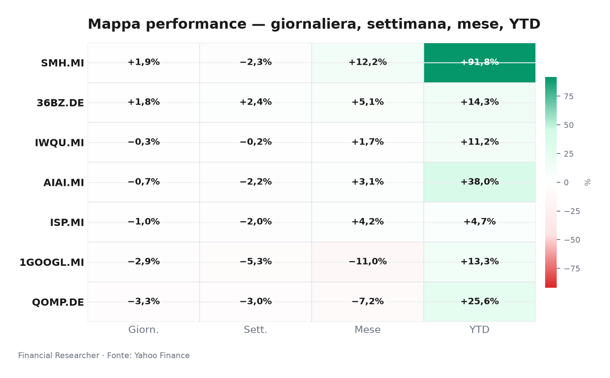
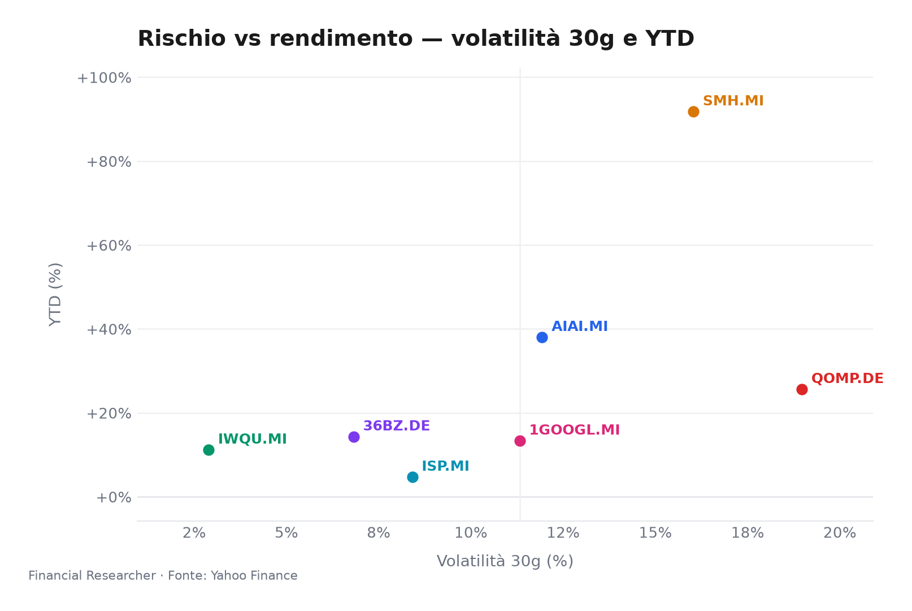
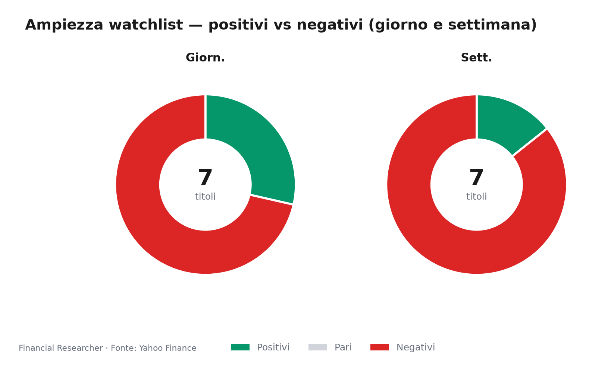
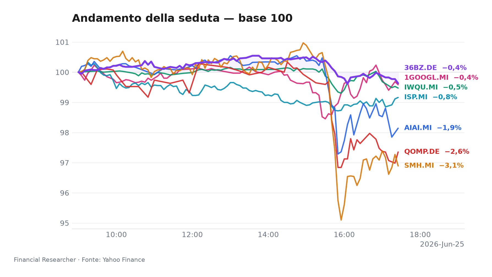
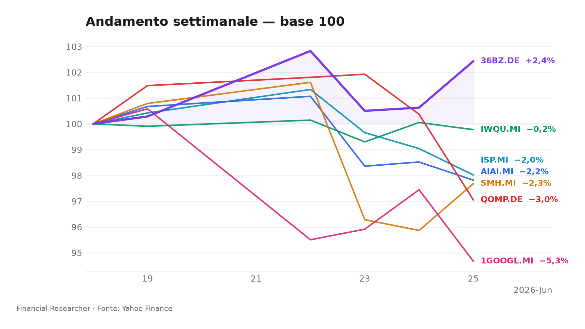
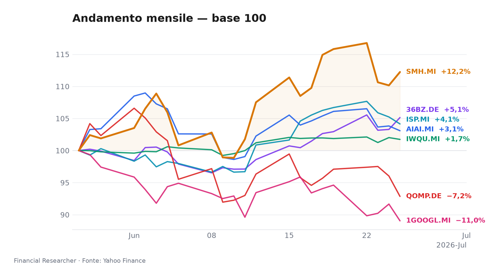
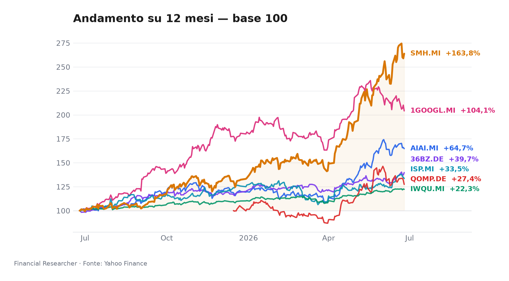

# Executive Watchlist Briefing — Milano, 25 giugno 2026

*Un venerdì che espone le faglie della leadership tech: Alphabet scivola, il quantum computing crolla, ma i semiconduttori restano in piedi e la Cina avanza silenziosa.*

## Executive Summary

- **VanEck Semiconductor UCITS ETF (SMH.MI)** ▲ +1.89%: unico strumento in deciso rialzo, spinto dalle stime rialziste di Micron che hanno compensato la debolezza delle mega-cap USA; resta il miglior performer da inizio anno con un +91.79% [2] [8].
- **iShares MSCI China A UCITS ETF (36BZ.DE)** ▲ +1.79%: le azioni cinesi di classe A mantengono slancio (+2.43% in settimana) e staccano lo STOXX 600 YTD, alimentate da aspettative di stimolo e consumi selettivi [5].
- **L&G Artificial Intelligence UCITS ETF (AIAI.MI)** ▼ -0.71%: l’ETF sull’intelligenza artificiale cede in linea con il tech europeo, senza catalizzatori proprietari; il YTD resta robusto a +38.02% [1].
- **iShares Edge MSCI World Quality Factor UCITS ETF USD (Acc) (IWQU.MI)** ▼ -0.28%: il fattore qualità resta pressoché piatto, con la volatilità più bassa del paniere (2.89% a 30gg), confermando il ruolo di ancora difensiva [3].
- **Intesa Sanpaolo S.p.A. (ISP.MI)** ▼ -1.03%: la banca arretra in scia a prese di beneficio e a un’analisi che interroga la valutazione dopo il recente indebolimento; il consensus Buy punta a €6.84 [6] [9].
- **Alphabet Inc. (1GOOGL.MI)** ▼ -2.85%: paga l’uscita di figure chiave dall’AI e prese di profitto; Jefferies difende il titolo, mentre Yardeni segnala rotazioni settoriali come causa dello scivolone di giugno [7] [10] [11].
- **iShares Quantum Computing UCITS ETF USD (Acc) (QOMP.DE)** ▼ -3.31%: fanalino di coda della giornata e del mese (-7.15%), con volatilità elevata (18.97%) e asset contenuti, in assenza di notizie dirompenti [4].

## Watchlist Performance Snapshot

**Leader 1D:** VanEck Semiconductor UCITS ETF (SMH.MI) (1.89%) · **Laggard 1D:** iShares Quantum Computing UCITS ETF USD (Acc) (QOMP.DE) (-3.31%)

| Ref | Strumento | Ticker | Prezzo (valuta) | Giornaliera | Settimanale | Mensile | YTD | 1A | Vol. 30g | Fonte |
|-----|-----------|--------|-----------------|-------------|-------------|---------|-----|-----|--------|-------|
| [1] | L&G Artificial Intelligence UCITS ETF | AIAI.MI | 33,38 EUR | -0,71% | -2,18% | 3,09% | 38,02% | 64,72% | 11,93% | [1] |
| [2] | VanEck Semiconductor UCITS ETF | SMH.MI | 104,89 EUR | 1,89% | -2,32% | 12,24% | 91,79% | 163,84% | 16,03% | [2] |
| [3] | iShares Edge MSCI World Quality Factor UCITS ETF USD (Acc) | IWQU.MI | 75,66 EUR | -0,28% | -0,22% | 1,73% | 11,17% | 22,27% | 2,89% | [3] |
| [4] | iShares Quantum Computing UCITS ETF USD (Acc) | QOMP.DE | 5,49 EUR | -3,31% | -2,95% | -7,15% | 25,61% | 27,40% | 18,97% | [4] |
| [5] | iShares MSCI China A UCITS ETF | 36BZ.DE | 5,68 EUR | 1,79% | 2,43% | 5,14% | 14,32% | 39,69% | 6,82% | [5] |
| [6] | Intesa Sanpaolo S.p.A. | ISP.MI | 6,03 EUR | -1,03% | -1,98% | 4,15% | 4,71% | 33,49% | 8,41% | [6] |
| [7] | Alphabet Inc. | 1GOOGL.MI | 300,05 EUR | -2,85% | -5,33% | -10,96% | 13,33% | 104,13% | 11,32% | [7] |
| — | FTSE MIB | FTSEMIB.MI | 51782,91 EUR | -0,46% | -1,72% | 4,45% | 14,12% | 31,70% | 5,14% | — |
| — | STOXX Europe 600 | ^STOXX | 640,21 EUR | 0,80% | 0,48% | 1,92% | 6,39% | 19,22% | 3,47% | — |

### Performance Charts

## What's Driving the Moves

- **L&G Artificial Intelligence UCITS ETF (AIAI.MI)** ha ceduto lo 0.71% in una giornata di prese di beneficio sul tech europeo. In assenza di notizie proprietarie, il movimento rispecchia il riposizionamento dopo il forte YTD (+38.02%) e l’attesa per i prossimi trimestrali delle big tech. [1]

- **VanEck Semiconductor UCITS ETF (SMH.MI)** ha ritrovato slancio (+1.89%) nonostante la settimana in calo (-2.32%). Le previsioni incoraggianti di Micron hanno offerto un appiglio ai semiconduttori, facendo da contrappeso al più ampio sell-off delle mega-cap USA innescato da realizzi e da timori di valutazione. [2] [8]

- **iShares Edge MSCI World Quality Factor UCITS ETF USD (Acc) (IWQU.MI)** ha mostrato la consueta resilienza (-0.28%), con la volatilità realizzata a 30 giorni più bassa dell’intero paniere (2.89%). In un contesto di rotazione verso i difensivi, l’ETF beneficia della preferenza per bilanci solidi e utili resilienti, riducendo il beta del portafoglio. [3]

- **iShares Quantum Computing UCITS ETF USD (Acc) (QOMP.DE)** ha subito una correzione marcata (-3.31%), ampliando le perdite mensili a -7.15%. La bassa capitalizzazione (AUM €60.66M) e l’assenza di catalizzatori dirompenti amplificano i movimenti in fasi di risk-off, rendendo lo strumento particolarmente vulnerabile alle rotazioni settoriali. [4]

- **iShares MSCI China A UCITS ETF (36BZ.DE)** ha guadagnato l’1.79%, sostenuto da aspettative di nuovi stimoli fiscali da Pechino e da un recupero selettivo dei consumi interni. La performance relativa rimane positiva (+14.32% YTD) rispetto ai mercati sviluppati, nonostante il persistente fardello del settore immobiliare. [5]

- **Intesa Sanpaolo S.p.A. (ISP.MI)** ha ceduto l’1.03%, sottoperformando il FTSE MIB (-0.46%). Un’analisi di Simply Wall St. del 11 giugno ha riacceso il dibattito sulla valutazione dopo la recente debolezza del titolo: con un P/E di 11.2x e un target medio di consenso a €6.84, il potenziale di rialzo è visibile ma condizionato al picco del margine di interesse e alla tenuta della qualità creditizia. [6] [9]

- **Alphabet Inc. (1GOOGL.MI)** ha perso il 2.85%, ampliando il calo settimanale a -5.33%. L’uscita di talenti dall’intelligenza artificiale ha alimentato dubbi sulla capacità di Google di competere con i rivali, ma Jefferies ha ribadito la fiducia nel “deep research bench” dell’azienda [11]. Contemporaneamente, Yardeni ha attribuito lo scivolone di giugno a rotazioni settoriali e prese di profitto dopo un rally che aveva portato il titolo a nuovi massimi [10]. Il quadro macro ha pesato: il Nasdaq ha chiuso in calo poiché il ribasso delle mega-cap ha sovrastato le buone notizie da Micron [8].

## Medium-Term Outlook

- **Bull (probabilità stimata 25%)**: La Fed taglia a settembre, seguita dalla BCE, innescando una ricompressone dei multipli per growth e qualità. AIAI e SMH potrebbero apprezzarsi del 10-15%; IWQU seguirebbe con un rialzo più moderato. Se Pechino annuncia stimoli fiscali concreti, 36BZ potrebbe guadagnare un ulteriore 12%. ISP terrebbe quota €6.5-7.0, GOOGL punterebbe a $200.  
  *Trigger: verbali Fed accomodanti; CPI USA sotto 2.5% a luglio; annuncio stimolo cinese entro il Q3.*

- **Base (probabilità 55%)**: Tassi invariati per tutto il H2 2026; crescita degli utili societari dell’8-10%. ISP consolida nel range €6.5-7.0, GOOGL oscilla intorno a $190-200, gli ETF quality e difensivi macinano rendimenti modesti ma positivi.  
  *Trigger: inflazione core stabile, utili societari in linea, nessuna sorpresa macro.*

- **Bear (probabilità 20%)**: Inflazione vischiosa costringe la Fed a mantenere un tono hawkish, comprimendo ulteriormente i multipli. Gli ETF tech (AIAI, SMH, QOMP) potrebbero correggere del -10%; ISP scenderebbe sotto €5.5, 36BZ cederebbe l’8% su timori di rallentamento cinese.  
  *Trigger: CPI sopra il 3%, fallimento dei negoziati commerciali, escalation geopolitica.*

## Event Calendar

I dati del calendario non sono al momento disponibili a causa di limitazioni nell’accesso alle fonti API. La tabella sarà reintegrata non appena i dati saranno recuperati. Gli eventi attesi includono: pubblicazione utili Q2 2026 di Alphabet, risultati semestrali di Intesa Sanpaolo, riunioni di politica monetaria BCE e Fed, dati CPI di Eurozona e USA. Si raccomanda di monitorare il calendario eventi aggiornato per le date esatte.

## Correlated Themes

- **Ciclo capex AI/semiconduttori/quantum**: la spesa in infrastrutture per l’intelligenza artificiale sostiene AIAI, SMH e QOMP, ma un’eventuale compressione dei multipli legata ai tassi penalizzerebbe in primis i segmenti più speculativi come il quantum.  
- **Rotazione qualità/difensivi**: IWQU beneficia dell’incertezza macro e della ricerca di bilanci solidi, fungendo da cuscinetto in portafoglio.  
- **Cina A-shares e stimoli**: la resilienza di 36BZ è legata a filo doppio alle aspettative di politica fiscale; un mancato annuncio di stimoli potrebbe innescare realizzi.  
- **Banche italiane e picco del margine d’interesse**: ISP è sostenuta da tassi elevati, ma il dibattito sul NII peak e sulla qualità del credito rappresenta un freno alle performance.  
- **Antitrust e regolamentazione tech**: Alphabet rimane esposta a rischi regolatori globali che potrebbero comprimerne la valutazione nonostante la solidità dei fondamentali.

## Risks & Watchpoints

- **Rischio tassi e inflazione**: un’inflazione core USA ostinatamente sopra il 2.7% manterrebbe la Fed in attesa, innescando ulteriore compressione dei multipli per i titoli growth e gli ETF tematici [1][2][4].
- **Escalation geopolitica o nuova ondata di dazi**: un deterioramento delle relazioni commerciali colpirebbe in particolare la Cina (36BZ) e le catene di fornitura dei semiconduttori, con ricadute anche su SMH e AIAI [5].
- **Rischio antitrust su Alphabet**: una sentenza sfavorevole in uno dei procedimenti in corso potrebbe limitare la capacità di monetizzare l’AI, mettendo sotto pressione il titolo e l’intero comparto tech [7][11].
- **Concentrazione degli asset nel quantum**: la bassa capitalizzazione e l’elevata volatilità di QOMP.DE lo rendono estremamente sensibile a deflussi improvvisi e a shock di mercato, amplificando le perdite in scenari avversi [4].
- **Rischio credito per Intesa Sanpaolo**: un rallentamento macro europeo potrebbe aumentare gli NPL, erodendo la redditività e mettendo in discussione il target di consenso di €6.84 [6][9].

## References

1. Yahoo Finance — AIAI.MI (L&G Artificial Intelligence UCITS ETF) — 2026-06-25 — https://finance.yahoo.com/quote/AIAI.MI
2. Yahoo Finance — SMH.MI (VanEck Semiconductor UCITS ETF) — 2026-06-25 — https://finance.yahoo.com/quote/SMH.MI
3. Yahoo Finance — IWQU.MI (iShares Edge MSCI World Quality Factor UCITS ETF USD (Acc)) — 2026-06-25 — https://finance.yahoo.com/quote/IWQU.MI
4. Yahoo Finance — QOMP.DE (iShares Quantum Computing UCITS ETF USD (Acc)) — 2026-06-25 — https://finance.yahoo.com/quote/QOMP.DE
5. Yahoo Finance — 36BZ.DE (iShares MSCI China A UCITS ETF) — 2026-06-25 — https://finance.yahoo.com/quote/36BZ.DE
6. Yahoo Finance — ISP.MI (Intesa Sanpaolo S.p.A.) — 2026-06-25 — https://finance.yahoo.com/quote/ISP.MI
7. Yahoo Finance — 1GOOGL.MI (Alphabet Inc.) — 2026-06-25 — https://finance.yahoo.com/quote/1GOOGL.MI
10. Investor's Business Daily — Yardeni: Here's What's Behind The June Swoon Of Google Stock — 2026-06-25 — https://finance.yahoo.com/m/318cac82-2862-341c-8437-75f884ab0bd5/yardeni-here-s-what-s-behind.html

## Disclaimer

Le informazioni contenute in questo briefing hanno scopo esclusivamente informativo e non costituiscono consulenza finanziaria, raccomandazione o sollecitazione all’acquisto o alla vendita di strumenti finanziari. I rendimenti passati non sono indicativi di quelli futuri. Le opinioni espresse riflettono il giudizio degli analisti alla data indicata e possono cambiare senza preavviso. Prima di assumere qualsiasi decisione di investimento, si raccomanda di consultare un consulente professionale.

<!-- financial-researcher:run-metadata -->
## Run metadata

| | |
|---|---|
| Model profile | deepseek_balanced |
| Processing time | 2m 38s |
| LLM requests | 8 |
| Tokens (prompt / completion / total) | 23,231 / 16,732 / 39,963 |

**Models by agent**

| Agent | Model (configured → resolved) |
|---|---|
| Market analyst | `deepseek/deepseek-v4-flash` → `deepseek-v4-flash` |
| News analyst | `deepseek/deepseek-v4-pro` → `deepseek-v4-pro` |
| Outlook analyst | `deepseek/deepseek-v4-flash` → `deepseek-v4-flash` |
| Calendar analyst | `deepseek/deepseek-v4-pro` → `deepseek-v4-pro` |
| Chief strategist | `deepseek/deepseek-v4-pro` → `deepseek-v4-pro` |
<!-- /financial-researcher:run-metadata -->
