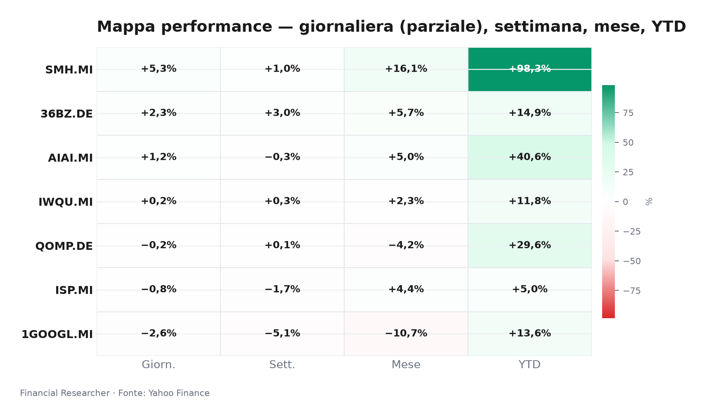
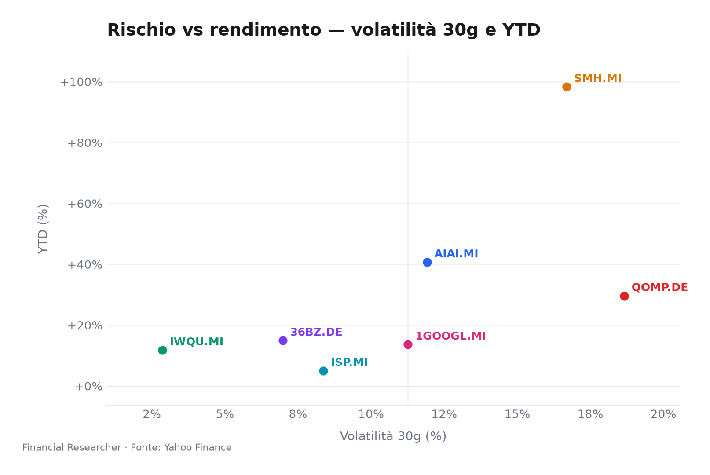
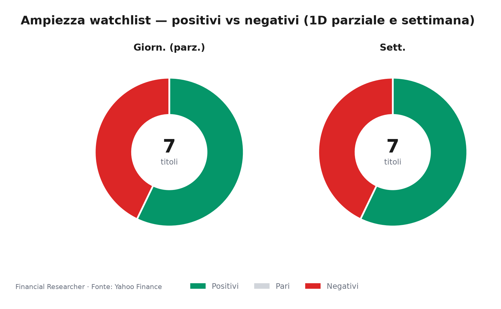
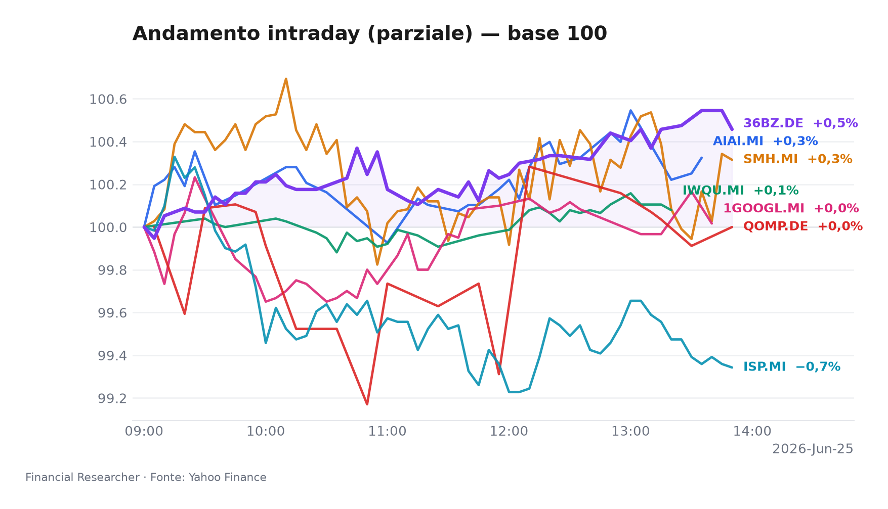
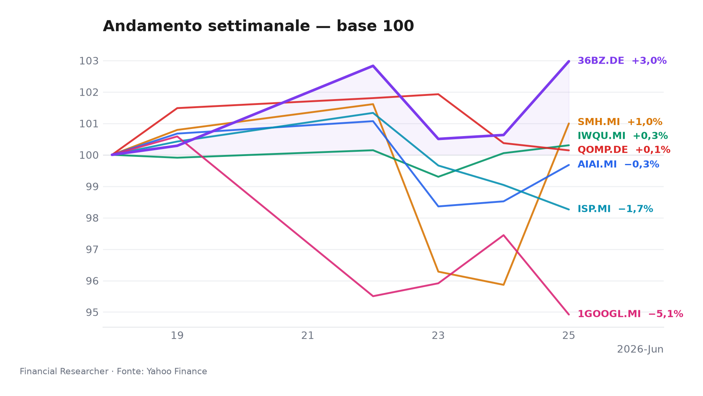

L’intelligenza artificiale accende i semiconduttori, mentre Alphabet incassa il contraccolpo del Dow.

## Executive Summary

- **VanEck Semiconductor UCITS ETF (SMH.MI)** ▲ +5.35% 1D: L’impennata dei chip riflette la forza del sottoindice semicon, alimentata dalla domanda strutturale legata all’AI, senza notizie materiali specifiche [2].
- **Alphabet Inc. (1GOOGL.MI)** ▼ -2.59% 1D: L’ingresso nel Dow Jones pesa più del previsto: un’analisi del Wall Street Journal svela un peso ridotto per il colosso tech [8].
- **iShares MSCI China A UCITS ETF (36BZ.DE)** ▲ +2.33% 1D: Le azioni “A” rimbalzano sulla scia del miglioramento del PMI Caixin e delle aspettative di stimoli [5].
- **L&G Artificial Intelligence UCITS ETF (AIAI.MI)** ▲ +1.17% 1D: Il tema AI continua a catalizzare flussi, sostenuto da una narrazione di crescita inarrestabile [1].
- **iShares Quantum Computing UCITS ETF USD (Acc) (QOMP.DE)** ► -0.23% 1D: Seduta laterale in attesa di nuovi segnali dal fronte della supremazia quantistica [4].
- **iShares Edge MSCI World Quality Factor UCITS ETF USD (Acc) (IWQU.MI)** ▲ +0.25% 1D: Il fattore qualità avanza con bassa volatilità, offrendo stabilità in un mercato poco direzionale [3].
- **Intesa Sanpaolo S.p.A. (ISP.MI)** ▼ -0.79% 1D: La debolezza recente ha attirato l’analisi di Simply Wall St., che rivaluta il titolo dopo il calo, con target medio di 6,84 EUR [9].

## Watchlist Performance Snapshot

**Leader 1D:** VanEck Semiconductor UCITS ETF (SMH.MI) (5.35%) · **Laggard 1D:** Alphabet Inc. (1GOOGL.MI) (-2.59%)

| Ref | Strumento | Ticker | Prezzo (valuta) | Giornaliera | Settimanale | Mensile | YTD | 1A | Vol. 30g | Fonte |
|-----|-----------|--------|-----------------|-------------|-------------|---------|-----|-----|--------|-------|
| [1] | L&G Artificial Intelligence UCITS ETF | AIAI.MI | 34,02 EUR | 1,17% | -0,32% | 5,05% | 40,65% | 67,85% | 11,91% | [1] |
| [2] | VanEck Semiconductor UCITS ETF | SMH.MI | 108,45 EUR | 5,35% | 1,00% | 16,05% | 98,30% | 172,80% | 16,69% | [2] |
| [3] | iShares Edge MSCI World Quality Factor UCITS ETF USD (Acc) | IWQU.MI | 76,06 EUR | 0,25% | 0,30% | 2,27% | 11,75% | 22,92% | 2,86% | [3] |
| [4] | iShares Quantum Computing UCITS ETF USD (Acc) | QOMP.DE | 5,67 EUR | -0,23% | 0,14% | -4,19% | 29,61% | 31,46% | 18,66% | [4] |
| [5] | iShares MSCI China A UCITS ETF | 36BZ.DE | 5,71 EUR | 2,33% | 2,97% | 5,70% | 14,92% | 40,43% | 6,98% | [5] |
| [6] | Intesa Sanpaolo S.p.A. | ISP.MI | 6,04 EUR | -0,79% | -1,74% | 4,40% | 4,97% | 33,82% | 8,37% | [6] |
| [7] | Alphabet Inc. | 1GOOGL.MI | 300,85 EUR | -2,59% | -5,08% | -10,72% | 13,63% | 104,67% | 11,26% | [7] |
| — | FTSE MIB | FTSEMIB.MI | 51761,54 EUR | -0,50% | -1,76% | 4,40% | 14,08% | 31,65% | 5,14% | — |
| — | STOXX Europe 600 | ^STOXX | 639,79 EUR | 0,73% | 0,42% | 1,85% | 6,32% | 19,15% | 3,45% | — |

### Performance Charts

## What’s Driving the Moves

**VanEck Semiconductor UCITS ETF (SMH.MI)** — Con un patrimonio di 8,3 miliardi di euro, l’ETF cattura l’eccezionale momentum del comparto chip. L’assenza di notizie societarie rilevanti non frena il rialzo, che trova fondamento nel rally dei titoli sottostanti, da Broadcom a Marvell, protagonisti di recenti upgrade e delle aspettative di una domanda AI in espansione [10]. I flussi verso i fondi tematici restano robusti, consolidando un anno già stellare per i semiconduttori (+98% YTD) [2].

**Alphabet Inc. (1GOOGL.MI)** — La caduta del 2.59% è direttamente collegata alla pubblicazione odierna del Wall Street Journal, che evidenzia come Google “peserà meno del suo peso” nel Dow Jones Industrial Average a causa del meccanismo di ponderazione per prezzo [8]. L’analisi arriva dopo che nelle ultime ore si era discusso della trasformazione del Dow in un indice sempre più simile al Nasdaq, creando aspettative poi ridimensionate. Il mercato sconta un effetto di ribilanciamento passivo e prese di profitto sul titolo, che resta comunque a +13.6% da inizio anno [7].

**iShares MSCI China A UCITS ETF (36BZ.DE)** — Il balzo del 2.33% segue il miglioramento del PMI manifatturiero Caixin di maggio, salito a 50.6 contro attese di 49.8, segnalando una timida espansione. L’attesa di nuovi stimoli fiscali e monetari da Pechino alimenta il posizionamento tattico sull’azionario domestico cinese. L’ETF, che replica l’indice MSCI China A, beneficia di un sentiment più costruttivo dopo mesi di incertezza [5].

**L&G Artificial Intelligence UCITS ETF (AIAI.MI)** — Il +1.17% è coerente con la forza del megatrend, che anche oggi domina le contrattazioni. Senza news specifiche, il fondo tematico da 2,1 miliardi di AUM segue la scia dei giganti tech, le cui valutazioni continuano a essere sostenute dalle stime di investimenti in infrastrutture AI. L’ETF, che ha già guadagnato oltre il 40% nel 2026, rimane esposto a correzioni, ma il momentum settoriale resta positivo [1].

**iShares Quantum Computing UCITS ETF USD (Acc) (QOMP.DE)** — Il lieve arretramento (-0,23%) in una giornata dominata dai chip evidenzia la natura bifronte del comparto tech. Il quantum computing, con appena 60,7 milioni di AUM, è ancora in fase di maturazione: gli investitori attendono sviluppi concreti prima di spingere ulteriormente le valutazioni. La lateralità odierna non altera il contesto rialzista di medio termine, ma indica una pausa di riflessione [4].

**iShares Edge MSCI World Quality Factor UCITS ETF USD (Acc) (IWQU.MI)** — L’ETF sul fattore qualità globale, con 5,36 miliardi di AUM e una volatilità implicita del 2.86%, avanza dello 0.25%, confermando la sua natura difensiva. In una seduta senza catalizzatori macro, gli investitori premiano società con elevata redditività e bilanci solidi, tipiche del fattore qualità. Il prodotto si muove in linea con gli indici azionari mondiali, rimanendo una componente stabile per i portafogli core [3].

**Intesa Sanpaolo S.p.A. (ISP.MI)** — L’azione cede lo 0.79% in una fase di riassestamento che ha spinto Simply Wall St. a pubblicare una valutazione aggiornata l’11 giugno, con un PE di 11,2 e un target medio di 6,84 EUR (consenso buy) [9]. Il mercato resta cauto in attesa della trimestrale del 4 agosto e dopo le notizie sulla mossa di Intesa per MPS, che ha sollevato interrogativi sulla concorrenza bancaria [11]. Il titolo sconta anche l’incertezza sull’andamento dei margini di interesse in uno scenario di tassi potenzialmente in calo [6].

## Medium-Term Outlook

**Bull (20% di probabilità)** — Scenario innescato da un taglio BCE di 25 pb il 23 luglio e da un CPI USA sotto il 3.0% il 14 luglio. I tematici tech (AIAI, SMH, QOMP) e la Cina (36BZ) accelerano di un ulteriore 5–10%, mentre Intesa beneficia di una curva dei tassi più favorevole. Il fattore qualità sovraperforma i mercati ma resta indietro rispetto ai segmenti growth.

**Base (55% di probabilità)** — Tassi invariati fino a settembre, utili in linea con le attese ribassate. Il fattore qualità (IWQU) si conferma il miglior rapporto rischio/rendimento; ISP mantiene l’appeal da dividendo e la trimestrale di agosto fornisce indicazioni cruciali. I semiconduttori consolidano i guadagni, mentre la Cina procede a strappi.

**Bear (25% di probabilità)** — La Fed, il 28–29 luglio, segnala nessun taglio fino al 2027 e il CPI riaccelera al 3.5%. Multipli in compressione: i semiconduttori potrebbero cedere il 10–15%, Alphabet e i tematici risentono della rotazione difensiva. Intesa, vulnerabile alla risalita dei tassi e alla stretta creditizia, subirebbe un doppio colpo da contrazione degli utili e allargamento degli spread.

## Event Calendar

| Date (YYYY-MM-DD) | Event | Affected tickers/themes | Impact | [N] |
|---|---|---|---|---|
| 2026-07-01 | Caixin Cina PMI manifatturiero (giugno) | 36BZ.DE, azionario Cina | MEDIUM | – |
| 2026-07-14 | US CPI (giugno) | SMH.MI, AIAI.MI, IWQU.MI, 1GOOGL.MI, tematici | HIGH | – |
| 2026-07-22 | Alphabet Q2 earnings | 1GOOGL.MI | HIGH | – |
| 2026-07-23 | BCE decisione tassi d’interesse | ISP.MI, IWQU.MI, obbligazionario | HIGH | – |
| 2026-07-28 | FOMC decisione tassi (inizio 2 giorni) | Tutti gli strumenti, cross-asset | HIGH | – |
| 2026-08-04 | Intesa Sanpaolo Q2 earnings | ISP.MI | HIGH | – |

## Correlated Themes

- **AI e semiconduttori**: la domanda di potenza di calcolo spinge in tandem AIAI, SMH e, indirettamente, QOMP.
- **Rotazione qualità/crescita**: IWQU rappresenta il porto sicuro quando la volatilità sale, inversamente correlato agli eccessi tech.
- **Stimoli cinesi e materie prime**: l’ETF China A (36BZ) è legato al ciclo macro e alle politiche di Pechino, con impatti anche sui settori energetici e industriali.
- **Ristrutturazione bancaria italiana**: ISP è al centro del risiko bancario domestico; l’operazione MPS ridefinisce il panorama competitivo e l’appeal per gli investitori.
- **Ribilanciamento degli indici Dow e Nasdaq**: l’ingresso di Alphabet modifica i flussi passivi e le correlazioni tra i due benchmark, influenzando 1GOOGL e i relativi ETF.

## Risks & Watchpoints

- **Escalation geopolitica e dazi tecnologici** — Nuove restrizioni all’export di semiconduttori o tensioni USA-Cina colpirebbero in modo asimmetrico SMH, AIAI e 36BZ.
- **Tassi più alti a lungo** — Segnali di una Fed restrittiva oltre il 2027 penalizzerebbero i multipli dei titoli growth (AIAI, SMH, QOMP) e metterebbero sotto pressione Intesa per l’effetto NII.
- **Delusione nel quantum computing** — La mancata concretizzazione di progressi commerciali nel settore quantistico raffredderebbe l’intero comparto tematico (QOMP) e, per osmosi, anche l’AI puro, innescando prese di beneficio violente.

## Disclaimer

Il presente briefing è redatto a scopo esclusivamente informativo e non costituisce consulenza finanziaria, raccomandazione di investimento o sollecitazione all’acquisto/vendita di strumenti finanziari. Le analisi qui contenute si basano su dati di mercato e notizie pubbliche disponibili alla data del 25 giugno 2026 e potrebbero essere soggette a cambiamenti senza preavviso. Le performance passate non sono indicative di risultati futuri. Si raccomanda di consultare un professionista qualificato prima di assumere decisioni di investimento. I dati sui singoli strumenti provengono da Yahoo Finance e da altri provider di informazioni finanziarie. Le opinioni espresse riflettono il punto di vista dell’autore in qualità di Chief Strategy Communications Advisor e non rappresentano necessariamente la posizione dell’istituto di appartenenza.

## References

1. Yahoo Finance — AIAI.MI (L&G Artificial Intelligence UCITS ETF) — 2026-06-25 — https://finance.yahoo.com/quote/AIAI.MI
2. Yahoo Finance — SMH.MI (VanEck Semiconductor UCITS ETF) — 2026-06-25 — https://finance.yahoo.com/quote/SMH.MI
3. Yahoo Finance — IWQU.MI (iShares Edge MSCI World Quality Factor UCITS ETF USD (Acc)) — 2026-06-25 — https://finance.yahoo.com/quote/IWQU.MI
4. Yahoo Finance — QOMP.DE (iShares Quantum Computing UCITS ETF USD (Acc)) — 2026-06-25 — https://finance.yahoo.com/quote/QOMP.DE
5. Yahoo Finance — 36BZ.DE (iShares MSCI China A UCITS ETF) — 2026-06-25 — https://finance.yahoo.com/quote/36BZ.DE
6. Yahoo Finance — ISP.MI (Intesa Sanpaolo S.p.A.) — 2026-06-25 — https://finance.yahoo.com/quote/ISP.MI
7. Yahoo Finance — 1GOOGL.MI (Alphabet Inc.) — 2026-06-25 — https://finance.yahoo.com/quote/1GOOGL.MI
8. The Wall Street Journal — Google Will Punch Below Its Weight in the Dow — 2026-06-25 — https://finance.yahoo.com/m/f24da1e2-aec3-3455-90e0-34057a2a33c9/google-will-punch-below-its.html
10. The Wall Street Journal — Stocks to Watch Recap: Marvell Technology, Apple, Broadcom, Strategy — 2026-06-08 — https://finance.yahoo.com/m/34a0ce12-e5d0-369b-99dd-2a53210f0376/stocks-to-watch-recap-.html

<!-- financial-researcher:run-metadata -->
## Run metadata

| | |
|---|---|
| Model profile | deepseek_balanced |
| Processing time | 4m 56s |
| LLM requests | 8 |
| Tokens (prompt / completion / total) | 28,869 / 24,421 / 53,290 |

**Models by agent**

| Agent | Model (configured → resolved) |
|---|---|
| Market analyst | `deepseek/deepseek-v4-flash` → `deepseek-v4-flash` |
| News analyst | `deepseek/deepseek-v4-pro` → `deepseek-v4-pro` |
| Outlook analyst | `deepseek/deepseek-v4-flash` → `deepseek-v4-flash` |
| Calendar analyst | `deepseek/deepseek-v4-pro` → `deepseek-v4-pro` |
| Chief strategist | `deepseek/deepseek-v4-pro` → `deepseek-v4-pro` |
<!-- /financial-researcher:run-metadata -->
