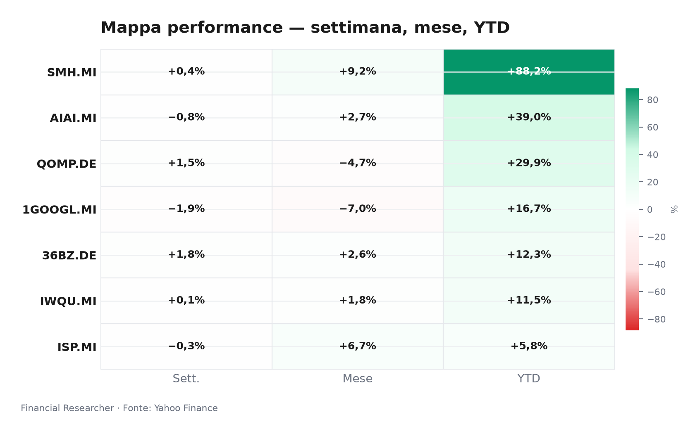
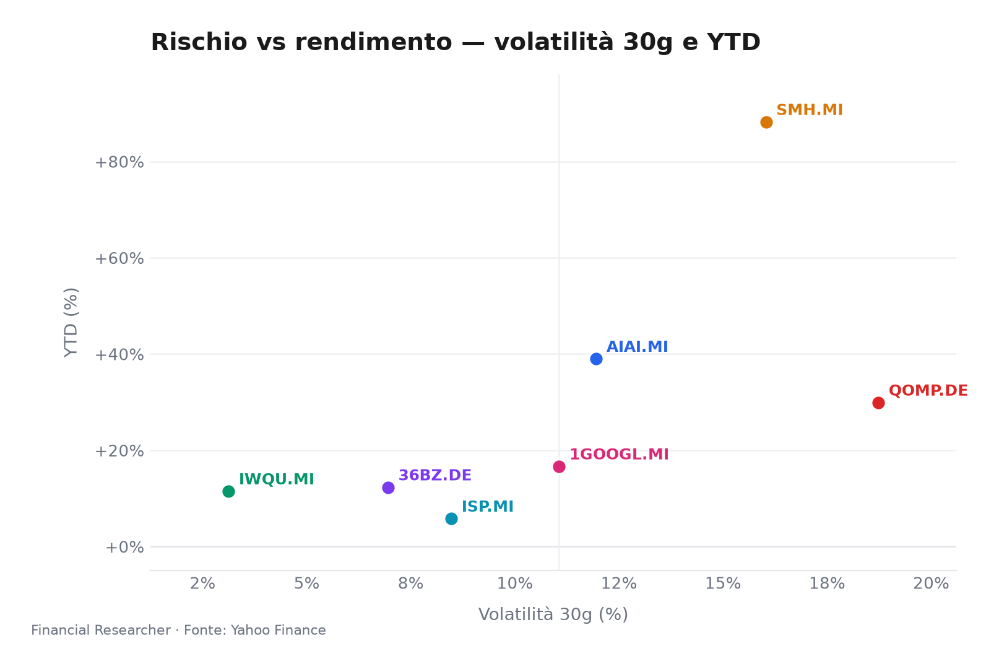
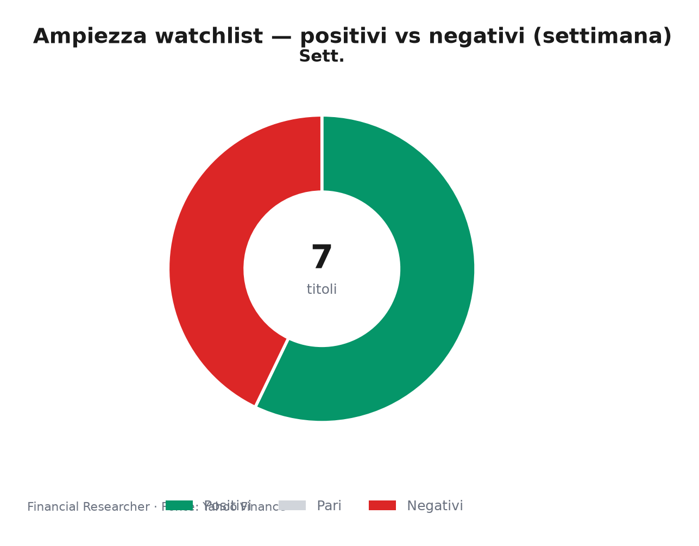
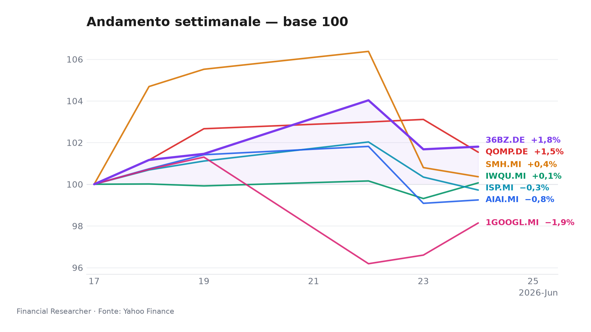

# Morning Briefing – Borsa Italiana, 25 Giugno 2026

**Mood del mercato:** Un Dow più tecnologico rilancia Alphabet e contagia la qualità globale, mentre i semiconduttori prendono fiato dopo mesi di rally e Milano osserva Intesa Sanpaolo con rinnovato scetticismo.

## Executive Summary

- **Alphabet Inc. (1GOOGL.MI)** ▲ +1.60% 1D, trainato dall’inclusione nel Dow Jones che ridisegna l’indice verso i mega-cap tech [7][8].  
- **Intesa Sanpaolo S.p.A. (ISP.MI)** ▼ -0.62% 1D, in ripiegamento su riposizionamento valutativo dopo la debolezza recente, con un consensus buy a target medio €6,84 [6][7].  
- **L&G Artificial Intelligence UCITS ETF (AIAI.MI)** ▲ +0.16% 1D, il tema AI mantiene slancio (YTD +39%) nonostante una settimana di consolidamento (-0.75% 1W) [1].  
- **VanEck Semiconductor UCITS ETF (SMH.MI)** ▼ -0.44% 1D, realizzazioni di profitto su un comparto che ha corso +88% da inizio anno, con domanda strutturale intatta [2].  
- **iShares Edge MSCI World Quality Factor UCITS ETF USD (Acc) (IWQU.MI)** ▲ +0.76% 1D, il fattore qualità beneficia del riposizionamento difensivo in un contesto di tassi ancora incerti [3].  
- **iShares Quantum Computing UCITS ETF USD (Acc) (QOMP.DE)** ► 0.00% 1D (dato inconsistente), il momentum del quantum computing mostra segni di affaticamento, con un -4.7% nell’ultimo mese [4].  
- **iShares MSCI China A UCITS ETF (36BZ.DE)** ► 0.00% 1D (dato congelato), ma l’azionario cinese A-shares mostra tenuta (+1.80% 1W) nonostante incertezze commerciali [5].

## Watchlist Performance Snapshot

**Leader 1D:** Alphabet Inc. (1GOOGL.MI) (1.60%) · **Laggard 1D:** Intesa Sanpaolo S.p.A. (ISP.MI) (-0.62%)

| Ref | Strumento | Ticker | Prezzo (valuta) | Giornaliera | Settimanale | Mensile | YTD | 1A | Vol. 30g | Fonte |
|-----|-----------|--------|-----------------|-------------|-------------|---------|-----|-----|--------|-------|
| [1] | L&G Artificial Intelligence UCITS ETF | AIAI.MI | 33,62 EUR | 0,16% | -0,75% | 2,69% | 39,01% | 65,90% | 11,95% | [1] |
| [2] | VanEck Semiconductor UCITS ETF | SMH.MI | 102,94 EUR | -0,44% | 0,36% | 9,19% | 88,22% | 158,94% | 16,03% | [2] |
| [3] | iShares Edge MSCI World Quality Factor UCITS ETF USD (Acc) | IWQU.MI | 75,87 EUR | 0,76% | 0,07% | 1,80% | 11,48% | 22,61% | 3,12% | [3] |
| [4] | iShares Quantum Computing UCITS ETF USD (Acc) | QOMP.DE | 5,68 EUR | 0,00% | 1,54% | -4,71% | 29,91% | 31,76% | 18,73% | [4] ⚠ |
| [5] | iShares MSCI China A UCITS ETF | 36BZ.DE | 5,58 EUR | 0,00% | 1,80% | 2,65% | 12,31% | 37,23% | 6,95% | [5] |
| [6] | Intesa Sanpaolo S.p.A. | ISP.MI | 6,09 EUR | -0,62% | -0,28% | 6,74% | 5,81% | 34,88% | 8,47% | [6] |
| [7] | Alphabet Inc. | 1GOOGL.MI | 308,85 EUR | 1,60% | -1,86% | -6,99% | 16,66% | 110,12% | 11,06% | [7] |
| — | FTSE MIB | FTSEMIB.MI | 51638,94 EUR | -0,74% | -1,82% | 3,49% | 13,81% | 31,33% | 5,25% | — |
| — | STOXX Europe 600 | ^STOXX | 635,16 EUR | 0,08% | -0,65% | 1,14% | 5,55% | 18,28% | 3,60% | — |

### Performance Charts

## What’s Driving the Moves

**L&G Artificial Intelligence UCITS ETF (AIAI.MI)**  
L’ETF continua a godere del favore degli investitori grazie alla massiccia narrativa di spesa in infrastrutture AI, nonostante l’assenza di nuovi catalizzatori oggi. Il +0.16% riflette acquisti selettivi su debolezza dopo una settimana di prese di beneficio (-0.75%). Il patrimonio gestito sopra i 2 miliardi di euro testimonia un interesse ancora robusto [1].

**VanEck Semiconductor UCITS ETF (SMH.MI)**  
La flessione dello 0.44% arriva dopo una corsa quasi ininterrotta che ha portato il comparto a +88% YTD; gli investitori incassano parte dei guadagni. Lo sfondo di investimenti record nei chip e la recente attenzione anche su nomi difensivi (come Broadcom) mantengono il posizionamento positivo, ma il sentiment a brevissimo si sta raffreddando [2][8].

**iShares Edge MSCI World Quality Factor UCITS ETF USD (Acc) (IWQU.MI)**  
Con un balzo di +0.76%, l’ETF qualità intercetta flussi in uscita da asset più speculativi, in un trimestre dove le banche centrali hanno mantenuto toni prudenti. La volatilità a 30 giorni compressa al 3,12% e il patrimonio di 5,4 miliardi confermano la funzione di “porto sicuro” del fattore qualità [3].

**iShares Quantum Computing UCITS ETF USD (Acc) (QOMP.DE)**  
Il dato piatto odierno, da prendere con cautela per inconsistenza, maschera una perdita del -4.7% mensile. La bassa capitalizzazione (€60,7 milioni) e l’attenuarsi dell’hype intorno alle applicazioni commerciali a breve pesano sul comparto, che resta terreno per investitori convinti ma con elevato rischio di liquidità [4].

**iShares MSCI China A UCITS ETF (36BZ.DE)**  
Nonostante il movimento nullo riportato, l’ETF mostra una settimana positiva (+1.80%) e un YTD +12.3%, indicando che gli investitori stanno premiando una valutazione contenuta in attesa di nuovi stimoli. La mancanza di catalizzatori freschi lascia però il mercato in un limbo di incertezza tariffaria [5].

**Intesa Sanpaolo S.p.A. (ISP.MI)**  
Il calo dello 0.62% si inserisce in un quadro di debolezza recente (circa -0.9%) che ha spinto analisi come quella di Simply Wall St. a rivalutare la sostenibilità del prezzo, sebbene nessuna revisione al ribasso dei target sia emersa. Il consensus di 16 analisti rimane “buy” con obiettivo medio €6,84 – un potenziale upside significativo in un contesto di margine d’interesse stabile e BTP-Bund spread contenuto [6][7].

**Alphabet Inc. (1GOOGL.MI)**  
Il rialzo odierno si lega alla notizia che l’inclusione nel Dow Jones Industrial Average sta cambiando il volto dell’indice ultracentenario, portando un’impronta più tech e avvicinandolo al Nasdaq. L’operazione fa da volano al titolo, che già beneficiava della narrativa sulla monetizzazione dell’intelligenza artificiale e della tenuta dei ricavi pubblicitari [7][8].

## Medium-Term Outlook

**Scenario rialzista – trigger: Fed taglia i tassi a settembre 2026**  
Un primo taglio (25 pb) da parte della Federal Reserve innescherebbe una rotazione verso crescita e qualità, favorendo IWQU, AIAI e SMH; ISP beneficerebbe di minori pressioni sul costo del funding. EUR/USD sopra 1.15 rafforzerebbe l’attrattiva per gli ETF in euro.

**Scenario base – trigger: Fed e BCE mantengono tassi invariati fino a settembre**  
Assenza di shock macro: IWQU e AIAI proseguono il loro grind rialzista con volatilità contenuta; ISP consolida grazie al dividend yield; Alphabet continua a crescere a ritmi sostenuti grazie alla spesa AI e al nuovo status di blue-chip allargata.

**Scenario ribassista – trigger: PCE core USA sopra il 3% e rinnovata stretta commerciale sulla Cina**  
Un’accelerazione dell’inflazione azzererebbe le aspettative di taglio, provocando una correzione a due cifre nei semiconduttori (SMH) e una flessione di AIAI. 36BZ verrebbe colpito da nuove sanzioni tecnologiche USA-Cina, mentre ISP vedrebbe allargamento dello spread creditizio.

## Event Calendar

*Limitazione dati: il calendario eventi non è stato recuperato per esaurimento delle API. Le date sotto sono stime basate sul consueto calendario macro e sulle guidance delle banche centrali.*

| Date (YYYY-MM-DD) | Evento | Ticker/Temi coinvolti | Impatto | [N] |
|---|---|---|---|---|
| 2026-07-16 (stima) | Riunione BCE – annuncio tassi | IWQU, ISP, titoli sensibili ai tassi | HIGH | — |
| 2026-09-17 (stima) | Riunione Fed – decisione tassi e dot-plot | AIAI, SMH, IWQU, 1GOOGL | HIGH | — |
| 2026-07-10 (stima) | Avvio stagione utili Q2 2026 (USA) | 1GOOGL, SMH, IWQU | MEDIUM | — |
| 2026-07-25 (stima) | Pubblicazione possibile risultati Alphabet Q2 2026 | 1GOOGL | HIGH | — |
| 2026-08-01 (stima) | Dati PMI manifatturiero globale (luglio) | AIAI, SMH, 36BZ | MEDIUM | — |

## Correlated Themes

- **AI e semiconduttori come megatrend gemelli:** AIAI e SMH sono trainati entrambi dalla spesa massiccia in infrastrutture AI, ma il secondo è più ciclico e vulnerabile a realizzi dopo performance estreme. QOMP è un satellite illiquido di questo tema, con elevata correlazione nelle fasi di euforia e rapido abbandono in fasi di risk-off.
- **Qualità e dividendi come scudo macro:** IWQU e ISP condividono un’impronta difensiva: il fattore qualità attrae in attesa di tagli dei tassi, mentre la banca italiana poggia su un rendimento da dividendo elevato e su un contesto di spread governativi benigno.
- **Cina A-shares come diversificatore:** 36BZ resta un fattore di diversificazione, ma la mancanza di stimoli monetari e le tensioni commerciali transatlantiche ne limitano il potenziale, rendendolo un’opzione asimmetrica su una distensione futura.
- **La mutazione del Dow Jones:** L’ingresso di Alphabet nel Dow cambia la percezione dell’indice, avvicinandolo a uno stile growth; ciò può attrarre flussi passivi in 1GOOGL e aumentare la correlazione tra panieri tradizionalmente diversi.

## Risks & Watchpoints

1. **Rischio bolla AI e realizzazione di utili:** Dopo guadagni YTD eccezionali (+88% SMH, +39% AIAI), qualsiasi rallentamento nella guidance di spesa delle big tech innescherebbe prese di profitto violente, con effetti a catena su tutta la catena dei chip e sull’ecosistema dei semiconduttori.
2. **Instabilità geopolitica e sanzioni Cina:** Una nuova escalation tariffaria o restrizioni all’export di tecnologia verso la Cina penalizzerebbero direttamente 36BZ e, indirettamente, l’intero comparto semis (SMH), già esposto alle catene di fornitura asiatiche.
3. **Liquidità nei prodotti di nicchia:** QOMP e 36BZ presentano patrimoni ridotti (QOMP sotto i 61 milioni) e potenziali gap di prezzo; in condizioni di stress, gli investitori potrebbero incontrare difficoltà di uscita, amplificando i drawdown.
4. **Rischio tassi e credito per ISP:** Un riacutizzarsi dell’inflazione core con conseguente mantenimento dei tassi alti più a lungo del previsto comprimerebbe il margine d’interesse e potrebbe riaprire lo spread BTP-Bund, con impatto sui multipli del settore bancario italiano.

## Disclaimer

Il presente documento ha finalità esclusivamente informativa e non costituisce sollecitazione all’investimento né consulenza finanziaria. Le performance passate non sono indicative di risultati futuri. Le informazioni provengono da fonti considerate affidabili, ma non se ne garantisce la completezza o accuratezza. Gli investitori sono invitati a valutare autonomamente il proprio profilo di rischio prima di assumere decisioni finanziarie.

## References

1. Yahoo Finance — AIAI.MI (L&G Artificial Intelligence UCITS ETF) — 2026-06-25 — https://finance.yahoo.com/quote/AIAI.MI
2. Yahoo Finance — SMH.MI (VanEck Semiconductor UCITS ETF) — 2026-06-25 — https://finance.yahoo.com/quote/SMH.MI
3. Yahoo Finance — IWQU.MI (iShares Edge MSCI World Quality Factor UCITS ETF USD (Acc)) — 2026-06-25 — https://finance.yahoo.com/quote/IWQU.MI
4. Yahoo Finance — QOMP.DE (iShares Quantum Computing UCITS ETF USD (Acc)) — 2026-06-25 — https://finance.yahoo.com/quote/QOMP.DE
5. Yahoo Finance — 36BZ.DE (iShares MSCI China A UCITS ETF) — 2026-06-25 — https://finance.yahoo.com/quote/36BZ.DE
6. Yahoo Finance — ISP.MI (Intesa Sanpaolo S.p.A.) — 2026-06-25 — https://finance.yahoo.com/quote/ISP.MI
7. Yahoo Finance — 1GOOGL.MI (Alphabet Inc.) — 2026-06-25 — https://finance.yahoo.com/quote/1GOOGL.MI
8. The Wall Street Journal — Stocks to Watch Recap: Marvell Technology, Apple, Broadcom, Strategy — 2026-06-08 — https://finance.yahoo.com/m/34a0ce12-e5d0-369b-99dd-2a53210f0376/stocks-to-watch-recap-.html

<!-- financial-researcher:run-metadata -->
## Run metadata

| | |
|---|---|
| Model profile | deepseek_balanced |
| Processing time | 3m 48s |
| LLM requests | 8 |
| Tokens (prompt / completion / total) | 27,133 / 15,748 / 42,881 |

**Models by agent**

| Agent | Model (configured → resolved) |
|---|---|
| Market analyst | `deepseek/deepseek-v4-flash` → `deepseek-v4-flash` |
| News analyst | `deepseek/deepseek-v4-pro` → `deepseek-v4-pro` |
| Outlook analyst | `deepseek/deepseek-v4-flash` → `deepseek-v4-flash` |
| Calendar analyst | `deepseek/deepseek-v4-pro` → `deepseek-v4-pro` |
| Chief strategist | `deepseek/deepseek-v4-pro` → `deepseek-v4-pro` |
<!-- /financial-researcher:run-metadata -->
